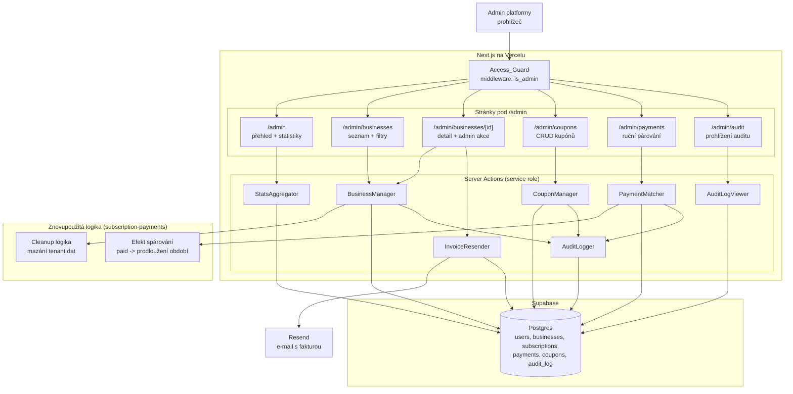
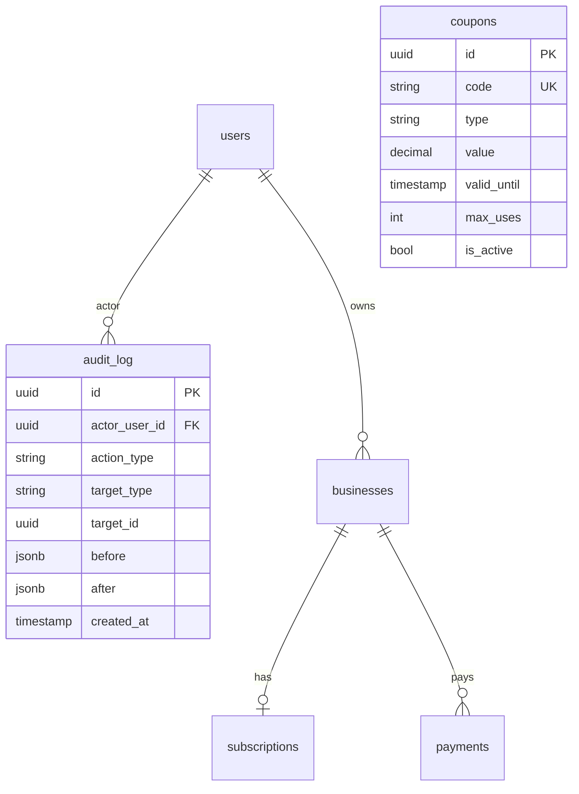
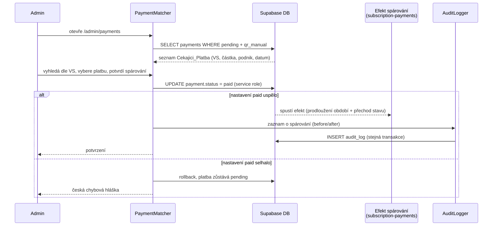
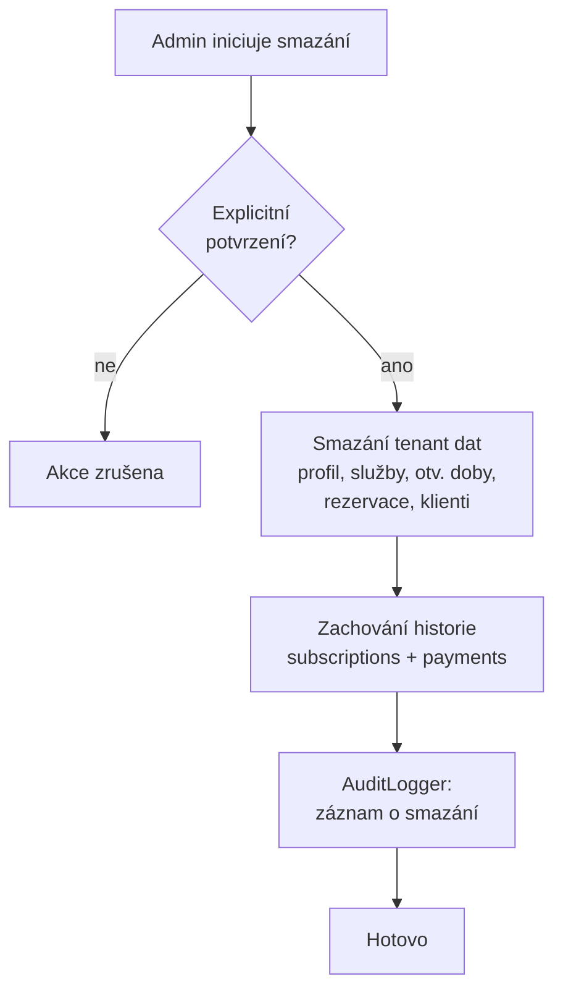

# Design Document — admin-dashboard

> Návrh feature **admin-dashboard** — administrátorský SaaS dashboard provozovatele platformy Horea, dostupný na cestách pod `/admin`.
>
> Tento dokument navazuje na `architecture/design.md` (sekce *Security*, *Data Models*, *Error Handling*, RLS admin override, admin role) a na `subscription-payments/design.md` (efekt spárování platby, entita kupónu, stavový automat předplatného). Drží se principu **Simplicity First** z `CLAUDE.md` — žádné spekulativní vrstvy, žádné BI nástroje, minimum kódu na vyřešení problému.
>
> Dokument obsahuje pouze **high-level design** — žádný kód, pseudokód, SQL DDL ani signatury funkcí. Vše je popsáno prózou a Mermaid diagramy.

## Overview

Tato feature pokrývá administrátorský dashboard provozovatele platformy — jediné místo, odkud **jediný admin** (`users.is_admin = true`) spravuje celý SaaS. Dashboard je dostupný na samostatné cestě `/admin`, chráněné middleware kontrolou role, a pokrývá: řízení přístupu, přehledové statistiky, správu uživatelů a podniků, ruční úpravy předplatného, vynucené mazání podniků (GDPR / zneužití), CRUD správu kupónů, ruční párování bankovních plateb a auditní stopu citlivých akcí.

Feature je **poslední** specifikací platformy a vědomě **znovupoužívá** logiku již definovanou jinde, místo aby ji duplikovala:

- **Stavový automat předplatného** je definován v `subscription-payments`. Admin jej **nepřepisuje na úrovni logiky**, ale má privilegovanou schopnost přímo nastavit `plan`, `status` a `current_period_end` (override) — to je vědomé obejití normálního automatu jako administrátorská pravomoc, vždy auditně zaznamenané.
- **Efekt spárování platby** (nastavení `payment.status = paid`, prodloužení období, přechod stavu) zůstává definován v `subscription-payments` (R5.5, R5.6, tamní Property 6). Tato feature poskytuje **pouze párovací UI a jeho spouštěč** — sama o sobě prodloužení nepočítá.
- **Mazání tenant dat** znovupoužívá cleanup logiku z `subscription-payments` (tamní Cleanup_Cron, Property 8). Tato feature ji pouze spouští **ručně a okamžitě** a zachovává historii `subscriptions`/`payments`.
- **Entita `coupons`** je zavedena v `architecture` a čtena při checkoutu v `subscription-payments`. Tato feature dodává její **CRUD správu** a rozšiřuje ji o příznak `is_active`.

Jediná **nová entita** zaváděná tímto dokumentem je tabulka `audit_log`. Statistiky jsou v MVP záměrně jednoduché — agregační SQL dotazy nad existujícími tabulkami, žádné materializované pohledy ani analytická platforma. Při cílovém rozsahu 200 podniků (viz `architecture`) jsou tyto dotazy triviální.

### Návaznost na požadavky

| Designový blok | Požadavky |
|---|---|
| Access_Guard a privilegovaný přístup | R1 |
| StatsAggregator (přehled a metriky) | R2 |
| BusinessManager — seznam a filtry | R3 |
| BusinessManager — detail | R4 |
| BusinessManager — override předplatného, free trial, comp, pozastavení | R5 |
| InvoiceResender | R11 |
| Vynucené mazání podniku | R6 |
| CouponManager (CRUD) | R7 |
| PaymentMatcher (spouštěč efektu z subscription-payments) | R8 |
| AuditLogger — zápis auditní stopy | R9 |
| AuditLogViewer — prohlížení auditní stopy | R10 |

## Architecture

### Komponentový diagram

### Vrstvení a tok přístupu

Architektura kopíruje monolitický vzor platformy z `architecture/design.md` — tenké route handlery / stránky nad doménovými komponentami, žádný stav v paměti procesu, vše stateful v Postgresu.

1. **Access_Guard (middleware).** Každý požadavek na cestu pod `/admin` projde nejprve middleware, který ověří autentizaci a roli `is_admin`. Bez splnění se obsah dashboardu nikdy nevykreslí (viz *Components and Interfaces*).
2. **Stránky pod `/admin`** jsou serverově renderované (SSR). Čtení tenant-scoped dat napříč podniky využívá **RLS admin override** (dle `architecture` ADR-5, R1/R17) — RLS policy povolí adminovi čtení řádků všech podniků.
3. **Server actions** provádějí veškeré zápisy napříč podniky v **serverovém kontextu se service role klíčem**, nikdy z klientského kódu. Service role obchází RLS, proto je vázán výhradně na server a chráněn předchozí kontrolou Access_Guard.
4. **AuditLogger** je volán každou server action, která provádí citlivou akci, ve stejné transakci jako samotná změna (viz *Audit logging strategy*).

### Routes

| Route | Typ | Účel | Přístup |
|---|---|---|---|
| `/admin` | stránka (SSR) | Přehled a klíčové provozní metriky (StatsAggregator) s volbou časového období. | Admin |
| `/admin/businesses` | stránka (SSR) | Seznam podniků s filtry (stav předplatného, datum registrace) a fulltext vyhledáváním. | Admin |
| `/admin/businesses/[id]` | stránka (SSR) | Detail podniku: profil, vlastník, předplatné, historie plateb, počet rezervací; admin akce (override, free trial, comp, pozastavení, vynucené smazání, opětovné odeslání faktury). | Admin |
| `/admin/coupons` | stránka (SSR) | Seznam a CRUD kupónů včetně počtu použití a deaktivace. | Admin |
| `/admin/payments` | stránka (SSR) | Seznam čekajících plateb (Cekajici_Platba), vyhledání podle VS a ruční spárování. | Admin |
| `/admin/audit` | stránka (SSR) | Prohlížení a filtrování auditní stopy (typ akce, časový rozsah, cílový objekt). | Admin |

Veškeré state-changing operace běží jako **server actions** vyvolané z těchto stránek; samotné stránky pouze čtou a vykreslují.

## Components and Interfaces

Tato sekce popisuje doménové komponenty z glosáře requirements — jejich odpovědnost a integrační body. Žádné signatury, pouze role a vstup/výstup.

### Access_Guard

**Odpovědnost:** Middleware chránící všechny cesty pod `/admin`; jediná vstupní brána do dashboardu.

- **Vstup:** HTTP požadavek na cestu pod `/admin`, session přihlášeného uživatele.
- **Výstup:** povolení průchodu (admin), redirect na přihlašovací stránku (neautentizovaný), nebo HTTP 403 bez obsahu dashboardu (autentizovaný ne-admin).
- **Spolupracuje s:** Supabase Auth (session/JWT), `users.is_admin`.
- **Klíčové pravidlo:** Rozhodnutí padá **před** vykreslením jakéhokoli obsahu Admin_Dashboard. Tři výsledky se vzájemně vylučují a pokrývají všechny případy: admin → povolit; neautentizovaný → redirect na login; ne-admin → 403. Žádná data dashboardu se neodešlou v žádné jiné než povolené větvi (R1.1, R1.2, R1.3).

### StatsAggregator

**Odpovědnost:** Výpočet přehledových metrik nad existujícími tabulkami pro zvolené časové období.

- **Vstup:** zvolené časové období (od–do).
- **Výstup:** počet nových registrací v období, počet `active` předplatných, hodnota Churn za období, rozpad počtu podniků podle `subscription.status` (`free`/`active`/`grace_period`/`expired`), součet `amount_czk` plateb `paid` v období.
- **Spolupracuje s:** DB (`users`, `subscriptions`, `payments`) — pouze čtení přes RLS admin override.
- **Klíčové pravidlo:** Metriky jsou jednoduché SQL agregáty (viz *Stats aggregation strategy*). Metriky závislé na čase (registrace, Churn, součet plateb) se přepočítají při každé změně období (R2.6).

### BusinessManager

**Odpovědnost:** Seznam, detail a administrátorské akce nad podniky.

- **Seznam (R3):** vrací podniky s názvem, slugem, stavem předplatného a tarifem; aplikuje filtry (stav, datum registrace) a fulltext (e-mail vlastníka, název, slug). Při prázdném výsledku vrací prázdný seznam s českou informační hláškou.
- **Detail (R4):** vrací profil podniku, údaje vlastníka, aktuální stav/tarif/`current_period_end`, historii plateb (částka, stav, metoda, VS, datum) a celkový počet rezervací.
- **Override předplatného (R5.1, R5.2):** přímo nastaví `subscription.plan`, `subscription.status` a `current_period_end` na zvolené hodnoty. **Vědomě obchází stavový automat** ze `subscription-payments` — jde o administrátorskou pravomoc, ne o běžný přechod.
- **Free trial (R5.3):** nastaví `status=active`, `business.is_published=true`, `current_period_end` = konec zkušebního období, **bez stržení platby**.
- **Comp účet (R5.4):** nastaví `status=active`, `business.is_published=true`, **bez stržení a bez založení recurring schedule** — trvale aktivní účet.
- **Pozastavení (R5.5):** nastaví `business.is_published=false`.
- **Vynucené smazání (R6):** po explicitním potvrzení smaže tenant data znovupoužitím cleanup logiky ze `subscription-payments`; zachová historii `subscriptions`/`payments`.
- **Spolupracuje s:** DB (service role zápis), AuditLogger (každá akce), znovupoužitá cleanup logika.
- **Klíčová pravidla:** Udělení free trial i comp účtu je **atomické** — jakákoli dílčí chyba vrátí celou změnu (R5.6, viz *Error Handling*). Každá citlivá akce je auditně zaznamenána (R5.7).

### CouponManager

**Odpovědnost:** CRUD správa kupónů (entita `coupons`).

- **Vstup:** atributy kupónu (`code`, `type` ∈ {`percent`, `fixed`, `free_trial_days`, `comp`}, `value`, `valid_until`, `max_uses`), volba operace (vytvořit / upravit / deaktivovat / smazat).
- **Výstup:** vytvořený / změněný / deaktivovaný / smazaný kupón; seznam kupónů s aktuálním počtem použití.
- **Spolupracuje s:** DB (service role zápis), AuditLogger.
- **Klíčová pravidla:**
  - **Unikátnost kódu** — vytvoření kupónu s již existujícím `code` je odmítnuto s českou hláškou (R7.2).
  - **Validace hodnoty `percent`** — kupón typu `percent` s `value` mimo rozsah 0–100 je odmítnut s českou hláškou (R7.3).
  - **Deaktivace** nastaví `is_active=false`, čímž jej checkout v `subscription-payments` přestane akceptovat (R7.6) — bez mazání záznamu, aby zůstala historie použití.
  - Každá operace je auditně zaznamenána (R7.8).

### PaymentMatcher

**Odpovědnost:** UI a spouštěč ručního spárování příchozí bankovní platby; **samotný efekt prodloužení patří do `subscription-payments`**.

- **Vstup:** seznam Cekajici_Platba (`pending`, `qr_manual`), vyhledávací VS, volba platby ke spárování.
- **Výstup:** seznam čekajících plateb (VS, částka, podnik, datum vytvoření); při spárování nastavení `payment.status=paid`, čímž se spustí efekt definovaný v `subscription-payments` (R5.5, R5.6 tamní specifikace) — prodloužení `current_period_end` a přechod stavu.
- **Spolupracuje s:** DB (service role), znovupoužitý efekt spárování ze `subscription-payments`, AuditLogger.
- **Klíčová pravidla:** Tato feature **nepočítá** prodloužení období ani přechod stavu — pouze nastaví `paid` a deleguje na existující efekt. Pokud nastavení `paid` selže, párování se neprovede, platba zůstane `pending` a zobrazí se česká chybová hláška (R8.4). Spárování je auditně zaznamenáno (R8.5).

### AuditLogger

**Odpovědnost:** Zápis Audit_Log_Zaznam o citlivých administrátorských akcích (nová entita `audit_log`).

- **Vstup:** identifikátor admina (actor), typ akce, typ a identifikátor cílového objektu, volitelně stav před a po akci (before/after).
- **Výstup:** přesně jeden append-only Audit_Log_Zaznam pro každou citlivou akci.
- **Spolupracuje s:** DB (`audit_log`), volající server actions (BusinessManager, CouponManager, PaymentMatcher).
- **Klíčová pravidla:** Zápis auditu probíhá **ve stejné transakci** jako citlivá akce (viz *Audit logging strategy*), takže úspěšná akce vždy vyprodukuje právě jeden záznam. Pokud se nepodaří zachytit before/after, záznam přesto vznikne bez těchto hodnot — auditní akce nesmí kvůli tomu selhat (R9.4).

### AuditLogViewer

**Odpovědnost:** Čtení a filtrování auditní stopy.

- **Vstup:** filtry (typ akce, časový rozsah, cílový objekt).
- **Výstup:** záznamy Audit_Log_Zaznam seřazené sestupně podle časového razítka, případně filtrované.
- **Spolupracuje s:** DB (`audit_log`, read-only).
- **Klíčové pravidlo:** Pouze čtení. Rozhraní **neumožňuje** úpravu ani mazání záznamů (R9.5, viz *Audit logging strategy*).

### InvoiceResender

**Odpovědnost:** Opětovné odeslání poslední faktury podniku na e-mail vlastníka.

- **Vstup:** identifikátor podniku.
- **Výstup:** odeslaný e-mail s nejnovější fakturou, nebo česká informační hláška, pokud podnik nemá žádnou vystavenou fakturu.
- **Spolupracuje s:** DB (`payments`), Resend.
- **Klíčové pravidlo:** Před odesláním ověří existenci alespoň jednoho `payment` se stavem `paid` a vyplněným `invoice_url`; teprve poté odešle nejnovější takovou fakturu (R11.1). Bez faktury akci neprovede a zobrazí hlášku (R11.2). Odeslání faktury **není** v Requirement 9 mezi citlivými akcemi — neukládá se do auditní stopy.

## Data Models

Tato sekce popisuje **logické** rozšíření datového modelu z `architecture/design.md` a `subscription-payments/design.md`. Konkrétní DDL, typy a indexy patří do `tasks.md`/implementace — zde je koncepční přehled.

### audit_log (NOVÁ entita)

Dedikovaná append-only tabulka auditní stopy citlivých administrátorských akcí. Koncepční atributy:

- **`id`** — identifikátor záznamu.
- **`actor_user_id`** — identifikátor administrátora, který akci provedl (FK na `users`).
- **`action_type`** — typ akce (např. override předplatného, udělení free trial, udělení comp, pozastavení podniku, vynucené smazání, vytvoření / úprava / deaktivace / smazání kupónu, spárování platby).
- **`target_type`** — typ cílového objektu (např. `subscription`, `business`, `coupon`, `payment`).
- **`target_id`** — identifikátor cílového objektu.
- **`before`** (jsonb, nullable) — stav cílového objektu před akcí; `null`, pokud akci nelze takto zachytit nebo se zachycení nezdaří.
- **`after`** (jsonb, nullable) — stav cílového objektu po akci; `null` za stejných podmínek.
- **`created_at`** — časové razítko vytvoření záznamu.

### coupons (rozšíření)

K atributům z `architecture` (`code` UK, `type`, `value`, `valid_until`, `max_uses`) a počtu použití přibývá:

- **`is_active`** (bool) — zda lze kupón uplatnit při checkoutu. Default `true`; deaktivace (R7.6) nastaví `false`. Checkout v `subscription-payments` musí tento příznak při aplikaci respektovat.

Unikátnost `code` je vynucena na úrovni DB (unique constraint), což je zdroj pravdy pro pravidlo R7.2 i pro Property 4.

### subscriptions / payments / businesses (čtení + admin zápis)

Tato feature **nezavádí** nové atributy do `subscriptions`, `payments` ani `businesses` — pracuje s modelem definovaným v `architecture` a `subscription-payments`:

- **`subscriptions`** — admin override přímo nastavuje `plan`, `status`, `current_period_end` (R5.1, R5.2); free trial/comp nastavují `status` (R5.3, R5.4).
- **`payments`** — čtení historie (R4.3), nastavení `status=paid` při spárování (R8.3), čtení `invoice_url` pro opětovné odeslání (R11.1). Historie je při vynuceném smazání **zachována** (R6.3).
- **`businesses`** — čtení profilu/vlastníka (R4.1), nastavení `is_published` (R5.3, R5.4, R5.5), smazání tenant dat při vynuceném smazání (R6.2).

### Datový kontext (ER výřez)

## Audit logging strategy

Auditní stopa je bezpečnostní a GDPR funkce — musí být **úplná** (každá citlivá akce zanechá stopu) a **nepopiratelná** (stopu nelze zpětně změnit). Návrh:

### Co se loguje

Logují se výhradně **citlivé akce** vyjmenované v R9.1: override / úprava předplatného, udělení Free_Trial, udělení Comp_Ucet, pozastavení podniku, vynucené smazání podniku, vytvoření / úprava / deaktivace / smazání kupónu a spárování platby. Čtecí operace (přehledy, seznamy, detail, prohlížení auditu) ani opětovné odeslání faktury se neaudítují.

### Zachycení before/after

- U akcí měnících stav existujícího objektu (override předplatného, deaktivace/úprava kupónu, spárování platby, pozastavení) se **před** zápisem načte aktuální stav cílového objektu do `before` a **po** aplikaci se zachytí výsledný stav do `after`.
- U akcí, které objekt vytvářejí (vytvoření kupónu), je `before` přirozeně `null`; u akcí, které objekt ruší (smazání kupónu, vynucené smazání tenant dat), nese `after` stav vyjadřující odstranění (případně `null`).
- **Best-effort zachycení (R9.4):** pokud se z technických důvodů nepodaří zachytit `before` nebo `after`, záznam se přesto vytvoří s těmito poli `null`. Selhání zachycení kontextu **nesmí** shodit celou administrátorskou akci.

### Atomicita zápisu auditu

Zápis Audit_Log_Zaznam probíhá ve **stejné DB transakci** jako samotná citlivá akce. Důsledek: buď uspěje akce i její auditní záznam, nebo se obojí vrátí zpět. Tím je zaručeno, že každá **úspěšná** citlivá akce odpovídá **právě jednomu** auditnímu záznamu — žádné akce bez stopy, žádné duplicitní stopy (Property 2).

### Append-only vynucení

Append-only charakter (R9.5) je vynucen **na úrovni databáze**, ne jen absencí UI:

- `audit_log` přijímá pouze operace `INSERT`. Operace `UPDATE` a `DELETE` jsou zakázány i pro service role — RLS policy / table grant nepovolí jiný zápis než vložení.
- Tím je nepopiratelnost stopy nezávislá na aplikační vrstvě: ani admin server action, ani přímý service-role zápis nemůže existující záznam změnit ani odstranit (Property 3).

## Stats aggregation strategy

Statistiky jsou v MVP záměrně minimalistické — žádné materializované pohledy, žádný cache layer, žádná analytická platforma. Při cílovém rozsahu **200 podniků** (viz `architecture`) jde o triviální dotazy nad malými tabulkami; výpočet při každém otevření přehledu je dostatečně rychlý a vždy aktuální.

| Metrika | Výpočet | Časová závislost |
|---|---|---|
| Nové registrace | počet `users` (resp. `businesses`) s `created_at` ve zvoleném období | ano |
| Aktivní předplatná | počet `subscriptions` se `status = active` | ne (aktuální stav) |
| Churn | počet předplatných, která ve zvoleném období přešla z `active`/`grace_period` do `expired`/`deleted_data` | ano |
| Rozpad podniků dle stavu | počet podniků seskupený podle `subscription.status` pro `free`/`active`/`grace_period`/`expired` | ne (aktuální stav) |
| Tržby (paid) | součet `amount_czk` plateb se `status = paid` ve zvoleném období | ano |

**Pravidla agregace:**

- **Tržby = součet `amount_czk` všech `paid` plateb v období** — žádná jiná množina (Property 5).
- **Rozpad dle stavu rozděluje (partition) všechny podniky** — každý podnik je započten právě jednou ve své stavové kategorii; součet kategorií `free`/`active`/`grace_period`/`expired` (+ `deleted_data`) odpovídá celkovému počtu podniků (Property 5).
- Metriky závislé na čase (registrace, Churn, tržby) se přepočítají při každé změně období (R2.6).

> **Pozn. k výkonu:** Materializované pohledy ani předpočítané agregace nejsou v MVP potřeba a v duchu *Simplicity First* se nezavádějí. Pokud rozsah platformy výrazně poroste, lze je doplnit bez zásahu do veřejného chování dashboardu.

## Manual payment matching

Ruční párování je tenká UI vrstva nad existujícím efektem ze `subscription-payments`. Tok:

Admin_Dashboard je tedy **spouštěč** — odpovědnost za prodloužení `current_period_end` a přechod stavu nese `subscription-payments` (tamní Property 6). Tím se logika neduplikuje.

## Force delete business

Vynucené smazání je ruční, okamžitá varianta cleanup logiky ze `subscription-payments`. Na rozdíl od automatického mazání (`Cleanup_Cron` po 90 dnech) je spuštěno adminem a vyžaduje explicitní potvrzení.

- Maže se **stejná množina tenant dat** jako v `subscription-payments` Cleanup (znovupoužití logiky, ne duplikace) — profil, služby, otvírací doby, rezervace, klienti.
- **Zachovává** se historie `subscriptions` a `payments` pro účetní účely (R6.3) — stejně jako u automatického mazání.
- Akce je auditně zaznamenána (R6.4).

## Admin subscription override

Override je **privilegovaná pravomoc**, která vědomě obchází normální stavový automat ze `subscription-payments`. Admin přímo nastaví `plan`, `status` a/nebo `current_period_end` na libovolné platné hodnoty (R5.1, R5.2). To je úmyslné: admin řeší výjimky a podporu, kde běžné přechody automatu nestačí.

- **Free trial (R5.3)** a **comp účet (R5.4)** jsou speciální, vyšší-úrovňové override operace s definovaným cílovým stavem (`active` + `is_published=true`, bez platby; comp navíc bez recurring schedule). Obě jsou **atomické** (R5.6).
- Každý override, free trial, comp i pozastavení je auditně zaznamenán s before/after (R5.7), takže privilegovaný zásah je vždy dohledatelný.

## Correctness Properties

*Property (vlastnost) je charakteristika nebo chování, které má platit napříč všemi validními běhy systému — v podstatě formální tvrzení o tom, co má systém dělat. Vlastnosti tvoří most mezi lidsky čitelnou specifikací a strojově ověřitelnými zárukami správnosti.*

Následující vlastnosti vznikly z prework analýzy akceptačních kritérií a po reflexi byly konsolidovány tak, aby každá poskytovala unikátní validační hodnotu. Jsou určeny pro property-based testování knihovnou **fast-check** (TypeScript). Kritéria klasifikovaná jako EXAMPLE / EDGE_CASE / INTEGRATION / SMOKE jsou pokryta v sekci *Testing Strategy*, ne zde. Efekt spárování platby (prodloužení období) **není** vlastností této feature — vlastní jej `subscription-payments` (tamní Property 6); zde se pouze spouští.

### Property 1: Řízení přístupu — ne-admin nikdy nedostane data dashboardu

*Pro libovolného* uživatele a libovolnou cestu pod `/admin` platí, že obsah Admin_Dashboard je vrácen právě tehdy, když je uživatel autentizovaný a má `is_admin = true`; v opačném případě Access_Guard buď přesměruje na přihlašovací stránku (neautentizovaný), nebo odepře přístup s HTTP 403 (autentizovaný ne-admin), a v žádném z těchto případů neodešle žádná data dashboardu.

**Validates: Requirements 1.1, 1.2, 1.3**

### Property 2: Úplnost auditní stopy

*Pro libovolnou* citlivou administrátorskou akci (override či úprava předplatného, udělení Free_Trial, udělení Comp_Ucet, pozastavení podniku, vynucené smazání podniku, vytvoření / úprava / deaktivace / smazání kupónu, spárování platby) platí, že její úspěšné provedení vytvoří v `audit_log` **přesně jeden** nový Audit_Log_Zaznam, který nese identifikátor administrátora (actor), typ akce, typ a identifikátor cílového objektu a časové razítko.

**Validates: Requirements 5.7, 6.4, 7.8, 8.5, 9.1, 9.2**

### Property 3: Auditní stopa je append-only

*Pro libovolnou* posloupnost administrátorských operací — včetně pokusů o úpravu nebo smazání auditních záznamů — platí, že žádný dříve vytvořený Audit_Log_Zaznam nelze změnit ani odstranit; jednou zapsané záznamy zůstávají beze změny.

**Validates: Requirements 9.5**

### Property 4: Validace kupónu

*Pro libovolnou* množinu kupónů a libovolný pokus o vytvoření kupónu platí, že žádné dva kupóny nesdílejí stejný `code` (vytvoření duplicitního kódu je odmítnuto) a každý uložený kupón typu `percent` má hodnotu `value` v rozsahu 0 až 100 včetně (vytvoření mimo rozsah je odmítnuto).

**Validates: Requirements 7.2, 7.3**

### Property 5: Správnost statistik

*Pro libovolný* dataset podniků a plateb a libovolné časové období platí, že (a) součet tržeb se rovná součtu `amount_czk` právě těch plateb, které mají `status = paid` a spadají do zvoleného období, a (b) rozpad počtu podniků podle stavu předplatného rozděluje (partition) všechny podniky — každý podnik je započten právě jednou a součet počtů přes všechny stavové kategorie se rovná celkovému počtu podniků.

**Validates: Requirements 2.4, 2.5**

### Property 6: Atomicita udělení Free_Trial a Comp_Ucet

*Pro libovolný* počáteční stav předplatného a libovolný bod selhání v posloupnosti dílčích změn při udělení Free_Trial nebo Comp_Ucet platí, že po selhání zůstává stav předplatného i podniku **shodný s původním** — žádná dílčí změna nepřetrvá (úplný rollback, all-or-nothing).

**Validates: Requirements 5.6**

### Property 7: Úplnost vynuceného smazání podniku

*Pro libovolný* dataset podniku platí, že po vynuceném smazání neexistují žádná tenant data podniku (profil, služby, otvírací doby, rezervace, klienti), zatímco kompletní historie v `subscriptions` a `payments` daného podniku zůstává beze změny zachována.

**Validates: Requirements 6.2, 6.3**

## Error Handling

Návrh přebírá obecné principy z `architecture/design.md` (sekce *Error Handling*) a doplňuje specifika administrátorské vrstvy. Všechny uživatelské hlášky jsou **v češtině**.

### Klasifikace chyb v admin vrstvě

| Situace | Reakce | Hláška / efekt |
|---|---|---|
| Neautentizovaný přístup na `/admin` | Redirect na login, žádný obsah dashboardu | Bez hlášky (přesměrování) |
| Autentizovaný ne-admin na `/admin` | HTTP 403, žádný obsah dashboardu | „Nemáte oprávnění k přístupu do administrace." |
| Duplicitní kód kupónu | Vytvoření zamítnuto, žádná změna | „Kupón s tímto kódem již existuje." |
| Percent kupón s `value` mimo 0–100 | Vytvoření zamítnuto, žádná změna | „Procentuální sleva musí být v rozsahu 0 až 100." |
| Selhání dílčí změny při Free_Trial / Comp_Ucet | **Úplný rollback** transakce, předplatné v původním stavu | „Akci se nepodařilo dokončit, žádná změna nebyla provedena." |
| Selhání nastavení `payment.status = paid` při párování | Párování neprovedeno, platba zůstává `pending` | „Platbu se nepodařilo spárovat, zkuste to prosím znovu." |
| Selhání zachycení before/after pro audit | Auditní záznam přesto vznikne (`before`/`after` = `null`); akce nepadne | Bez hlášky uživateli (best-effort kontext) |
| Opětovné odeslání faktury bez existující faktury | Akce neprovedena | „Podnik nemá žádnou vystavenou fakturu k odeslání." |
| Selhání odeslání faktury (Resend) | Best-effort retry, log, admin notifikace | „Fakturu se nepodařilo odeslat, zkuste to prosím znovu." |

### Zásady

- **Transakční hranice u vícekrokových akcí.** Udělení Free_Trial i Comp_Ucet (změna `subscriptions` + `businesses`) probíhá v jedné DB transakci — buď celé, nebo nic (R5.6, Property 6). Stejně tak spárování platby (`paid` + auditní záznam) a vynucené smazání (mazání tenant dat + auditní záznam).
- **Audit ve stejné transakci jako akce.** Každá citlivá akce a její auditní záznam stojí a padají společně — odtud „právě jeden záznam na úspěšnou akci" (Property 2).
- **Best-effort kontext auditu neblokuje akci.** Selhání zachycení before/after sníží detail záznamu, ale nezvrátí akci ani vznik záznamu (R9.4).
- **Append-only na úrovni DB.** Integrita auditní stopy nestojí jen na absenci UI — `UPDATE`/`DELETE` nad `audit_log` jsou zakázány i pro service role (R9.5, Property 3).
- **Žádný stack trace adminovi.** Admin vidí čitelnou českou hlášku; detail je pouze v logu (dle `architecture`).

## Testing Strategy

Strategie je v souladu s `architecture/design.md` a `subscription-payments/design.md` — přiměřená kapacitě jednoho vývojáře, s důrazem na to, co nejvíc bolí při selhání (řízení přístupu, integrita auditu, mazání dat). PBT je pro tuto feature **vhodné**, protože jádro tvoří čisté invarianty s velkým vstupním prostorem (řízení přístupu, úplnost a nepopiratelnost auditu, validace kupónu, statistické agregáty, atomicita, úplnost mazání). Renderování UI, jednoduché CRUD a filtrování naopak PBT nevyžadují — pokrývají je příkladové a integrační testy.

### Property-based testy (fast-check)

Každá ze 7 vlastností z sekce *Correctness Properties* je implementována **jediným** property-based testem knihovnou **fast-check**. Pravidla:

- **Knihovna se nepíše od nuly** — použije se `fast-check` z TypeScript ekosystému.
- **Minimálně 100 iterací** na každý property test.
- Každý test je **otagován** odkazem na vlastnost ve formátu:
  `Feature: admin-dashboard, Property {číslo}: {text vlastnosti}`
- Generátory pokrývají edge-cases z prework: profily uživatelů admin / ne-admin / neautentizovaný (Property 1), všechny typy citlivých akcí (Property 2), posloupnosti operací vč. pokusů o update/delete auditu (Property 3), hraniční hodnoty `value` 0/100 a duplicitní kódy (Property 4), prázdné i bohaté datasety a hranice období (Property 5), bod selhání v každém kroku sekvence (Property 6), prázdné i bohaté datasety podniku (Property 7).

Mapování property → test:

| Property | Co generátor varíruje | Co se ověřuje |
|---|---|---|
| 1 — řízení přístupu | profil uživatele, cesta pod /admin | data jen pro autentizovaného admina, jinak redirect/403 bez obsahu |
| 2 — úplnost auditu | typ citlivé akce | přesně 1 nový záznam s povinnými poli |
| 3 — append-only audit | posloupnost operací vč. update/delete | dřívější záznamy beze změny, nelze odstranit |
| 4 — validace kupónu | code, type, value | unikátní code, percent value 0–100 |
| 5 — správnost statistik | podniky, platby, období | tržby = suma paid v období; partition podniků dle stavu |
| 6 — atomicita trial/comp | počáteční stav, bod selhání | úplný rollback na původní stav |
| 7 — úplnost mazání | dataset podniku | žádná tenant data; historie subscriptions/payments zachována |

### Unit testy (příklady a edge-cases)

Pro kritéria klasifikovaná jako EXAMPLE / EDGE_CASE — konkrétní scénáře, ne univerzální vlastnosti:

- Přehled: počty registrací / Churn pro dataset uvnitř i vně období; rozlišení časově závislých vs. aktuálně-stavových metrik při změně období (R2.1, R2.2, R2.3, R2.6).
- Seznam podniků: obsah položky (název, slug, stav, tarif), filtry dle stavu a data, fulltext shoda, prázdný stav s českou hláškou (R3.1–R3.5).
- Detail podniku: profil + vlastník, stav/tarif/period_end, řádek historie plateb, počet rezervací (R4.1–R4.4).
- Override: cílové hodnoty `plan`/`status`/`current_period_end`; cílové hodnoty Free_Trial a Comp_Ucet (active + is_published, bez platby; comp bez schedule); pozastavení is_published=false (R5.1–R5.5).
- Kupóny: persistence atributů při vytvoření a úpravě, deaktivace, smazání, obsah seznamu s počtem použití (R7.1, R7.4–R7.7).
- Audit: before/after odpovídá změně u stavově-měnících akcí (R9.3); **edge-case** — selhání zachycení kontextu → záznam s `null` a akce nepadne (R9.4).
- Prohlížení auditu: sestupné řazení dle timestampu, filtry dle typu akce / rozsahu / targetu (R10.1–R10.4).
- Párování: obsah řádku čekající platby, vyhledání dle VS (R8.1, R8.2); **edge-case** — selhání nastavení `paid` ponechá `pending` s českou hláškou (R8.4).
- Opětovné odeslání faktury: ověření existence paid faktury a výběr nejnovější; absence faktury → hláška (R11.1, R11.2).
- Vynucené smazání: vyžádání explicitního potvrzení před akcí (R6.1).

> Pozn.: Unit testů držíme minimum — univerzální chování pokrývají property testy. Unit testy cílí jen na konkrétní příklady, hranice a integrační body.

### Integrační testy

Proti lokálnímu Supabase (Docker):

- **RLS admin override** — admin přečte řádky více podniků, ne-admin je nepřečte (R1.4). *(INTEGRATION z prework)*
- **Service role zápis** — cross-tenant zápisy běží server-side se service role, ne z klienta (R1.5). *(SMOKE z prework)*
- **Append-only audit na úrovni DB** — pokus o `UPDATE`/`DELETE` nad `audit_log` je odmítnut i se service role (Property 3 i na úrovni DB).
- **Spárování platby → efekt prodloužení** — nastavení `paid` vyvolá efekt definovaný v `subscription-payments`; korektnost prodloužení vlastní onen spec (R8.3). *(INTEGRATION z prework)*
- **Vynucené smazání** — proti reálné DB ověřit úplnost mazání tenant dat a zachování historie (Property 7 i na úrovni DB).

### End-to-end testy (Playwright)

Pouze **happy path** kritických flow:

- **CRUD kupónu** — vytvoření, úprava, deaktivace a smazání kupónu z `/admin/coupons`, vč. odmítnutí duplicitního kódu.
- **Ruční párování platby** — vyhledání čekající platby dle VS na `/admin/payments` a její spárování až po potvrzení obnovy předplatného.

### Co se NEtestuje automaticky

- Vizuální podoba a UX dashboardu (manuální review).
- Doručitelnost e-mailu s fakturou (Resend interní monitoring + manuální spot check).
