# Návrhový dokument — admin-system-tools

## Overview

Funkce **admin-system-tools** zavádí administrátorskou stránku „Správa systému / servisů" na cestě `/admin/system` v admin prostředí (`DashboardChrome variant="admin"`). Stránka soustředí provozní nástroje na jedno místo:

- **Health checks** klíčových služeb (Supabase, Resend, SMTP2GO, GoPay, Cloudflare R2, Google Drive/Sheets) s agregovaným stavem (R3–R5).
- **Inspekce provozní konfigurace** — úroveň logování a příznaky „nastaveno / nenastaveno" pro očekávané proměnné prostředí, bez vyzrazení hodnot (R6–R8).
- **Informativní sekce logů** s odkazem, kam logy v provozu hledat, a hranice „auditní stopa zůstává neměnná" (R8, R9).
- **Cílená revalidace cache** přes allowlist cest/tagů (R10, R15).
- **Monitoring cronů a ruční spuštění** s perzistencí běhů v nové tabulce `cron_runs` (R11, R12, R15).
- **Informace o nasazení (build/deploy)** z proměnných prostředí, bez tajemství, s „nedostupné" pro chybějící údaje (R16).
- **Stav e-mailové fronty (outbox)** — agregované počty, nejstarší čekající a počet připravených k retry, bez PII (R17).
- **Stav záloh (informativní)** — příznak „nakonfigurováno / nenakonfigurováno" z `GOOGLE_*` a dostupnost Google Drive z health checku; bez ruční zálohy, dokud job neexistuje (R18).
- **Retence běhů cronů (prune `cron_runs`)** jako jediná destruktivní „úklidová" akce nad záznamy, nikdy nad append-only `Audit_Log` (R19).
- **Čerstvost GoPay webhooku** odvozená (proxy) z poslední platebně řízené aktivity vůči hranici 48 h, bez tajemství a PII (R20).
- **Ruční opětovné spuštění health checků** na vyžádání s `checkedAt` a ARIA live oznámením (R21).
- **Odeslání testovacího e-mailu** výhradně na `HOREA_ADMIN_EMAIL`, s potvrzením a cooldownem (R22).
- **Agregované DB/Storage metriky** přes service-role `count`, bez PII; velikost úložiště jen pokud je levně zjistitelná (R23).
- **Plánovaný rozvrh cronů a detekce driftu** vůči `vercel.json` s příštím plánovaným časem (R24).

Návrh staví na třech principech, které vycházejí z requirements:

1. **Bezpečnost na prvním místě (R6, R15).** Žádná kontrola ani výpis nikdy nezveřejní `Secret_Value` (klíče, tokeny, hesla, connection stringy) ani `Personal_Data` (cílové adresy, jména, předměty, obsah e-mailů). Probe, config inspector, build inspector, outbox monitor, webhook monitor i metrics inspector vracejí pouze status, latenci, agregované počty, typ chyby a názvy konfiguračních klíčů. Sdílené tajemství `CRON_SECRET` a `HOREA_ADMIN_EMAIL` jako jediný cíl testovacího e-mailu se používají výhradně server-side.
2. **Defense in depth (R2).** `Access_Guard` middleware chrání vykreslení `/admin/*`, ale každá server action a route handler funkce **nezávisle znovu ověří** admin roli server-side přes existující `requireAdmin()` (`src/lib/admin/require-admin.ts`). To platí i pro všechny nové akce (`pruneCronRuns`, `recheckHealth`, `sendTestEmail`). Nespoléhá se jen na middleware.
3. **Čisté, testovatelné jádro (R3–R10, R16–R24).** Logika mapování stavu, agregace, sestavení config reportu, kontroly allowlistu, sestavení deploy infa, agregace outboxu, odvození stavu záloh, výpočtu prune cutoffu, čerstvosti webhooku, stavu cooldownu a výpočtu příštího běhu cronu / detekce driftu jsou **čisté funkce** v `src/lib/system/`, oddělené od I/O (síťové pingy, `process.env`, `revalidatePath`, DB čtení/zápis). Tím jsou přímo pokryté property-based testy, zatímco I/O vrstva se testuje příklady s mockovanými klienty.

Stránka vědomě rozlišuje **proveditelné** akce (HTTP/SDK pingy, `revalidatePath`/`revalidateTag`, čtení/zápis `cron_runs`, ruční volání cron endpointů) od **informativních** (aplikační logy jdou do `console` → Vercel logs; aplikace nemá perzistentní filesystem a logy nemaže).

### Mapování sekcí návrhu na requirements

| Sekce návrhu | Requirements |
|---|---|
| Routing & header wiring | R1, R2 |
| Health_Checker + Service_Probe | R3, R4, R5, R6 |
| Config_Inspector | R6, R7, R8 |
| Sekce logů & hranice auditu | R8, R9 |
| Cache_Revalidator | R10, R15 |
| Cron_Monitor + Cron_Trigger + recordCronRun + tabulka `cron_runs` | R11, R12, R15 |
| Build_Inspector | R16 |
| Outbox_Monitor | R17 |
| Backup_Status_Info | R18 |
| Cron_Run_Pruner | R19 |
| Webhook_Freshness_Monitor | R20 |
| Health_Recheck_Action | R21 |
| Test_Email_Action | R22 |
| Metrics_Inspector | R23 |
| Cron_Schedule_Inspector (rozvrh + drift) | R24 |
| Error Handling | R13, R17, R20, R23 |
| Accessibility | R14, R16, R20, R21 |
| Security / server-side execution | R6, R15, R19, R22 |

## Architecture

Stránka `/admin/system` je **server komponenta** (SSR) v admin segmentu. Při načtení spustí server-side `Health_Checker` a `Config_Inspector` a načte poslední běhy z `cron_runs` přes `Cron_Monitor`. Interaktivní akce (revalidace cache, ruční spuštění cronu) jsou **server actions** chráněné `requireAdmin()`. Klientské komponenty řeší jen potvrzovací UI, ARIA live regiony a zobrazení výsledku.

```mermaid
flowchart TB
    subgraph Client["Klient (admin prohlížeč)"]
        Header["DashboardHeader\nSettings_Icon → /admin/system"]
        Page["System_Tools_Page (UI)\npotvrzení, ARIA live region"]
    end

    subgraph Edge["Edge / Middleware"]
        Guard["Access_Guard\n/admin/* → 403 / redirect"]
    end

    subgraph Server["Server (Next.js, Vercel serverless)"]
        SC["/admin/system (Server Component)"]
        RA["requireAdmin() — re-check role"]
        subgraph Lib["src/lib/system (čisté funkce)"]
            MAP["mapProbeStatus()\naggregateStatus()"]
            CFG["buildConfigReport()"]
            ALLOW["isAllowedTarget()"]
            BLD["buildDeployInfo()"]
            OBX["summarizeOutbox()"]
            BKP["buildBackupStatus()"]
            CUT["computePruneCutoff()"]
            FRESH["computeWebhookFreshness()"]
            COOL["computeCooldownState()"]
            NEXT["computeNextRun()\ndetectScheduleDrift()"]
        end
        HC["Health_Checker\n(orchestrace, I/O)"]
        SP["Service_Probe × 6\n(read-only pingy)"]
        CI["Config_Inspector (I/O: process.env)"]
        CR["Cache_Revalidator (server action)"]
        CT["Cron_Trigger (server action)"]
        CM["Cron_Monitor (čtení cron_runs)"]
        REC["recordCronRun() helper"]
        BI["Build_Inspector (I/O: process.env)"]
        OM["Outbox_Monitor (čtení email_outbox)"]
        BS["Backup_Status_Info (I/O: env + health)"]
        CP["Cron_Run_Pruner (server action)"]
        WF["Webhook_Freshness_Monitor (čtení subscriptions/payments)"]
        HR["Health_Recheck_Action (server action)"]
        TE["Test_Email_Action (server action)"]
        MI["Metrics_Inspector (count čtení)"]
        CSI["Cron_Schedule_Inspector (vercel.json map)"]
    end

    subgraph External["Externí služby / DB"]
        SUPA["Supabase DB/Auth/Storage"]
        SVC["Resend / SMTP2GO / GoPay / R2 / Google"]
        CRONEP["/api/cron/{cleanup,billing,warnings,email-retry}"]
        DB[("cron_runs (Postgres, RLS)")]
        OBXDB[("email_outbox (Postgres)")]
        PAYDB[("subscriptions / payments (Postgres)")]
        SETDB[("system_settings (Postgres) — last test email")]
    end

    Header --> Guard --> SC
    Page -->|server action| Guard
    SC --> RA
    SC --> HC
    SC --> CI
    SC --> CM
    SC --> BI
    SC --> OM
    SC --> BS
    SC --> WF
    SC --> MI
    SC --> CSI
    HC --> SP
    SP -->|status/latency| MAP
    SP -.read-only.-> SUPA
    SP -.read-only.-> SVC
    HC --> MAP
    CI --> CFG
    BI --> BLD
    OM --> OBX
    OM -.read-only.-> OBXDB
    BS --> BKP
    WF --> FRESH
    WF -.read-only.-> PAYDB
    CSI --> NEXT
    MI -.count.-> SUPA
    CR --> ALLOW
    CR -->|revalidatePath/Tag| SC
    Page -->|potvrzeno| CT
    Page -->|potvrzeno| CP
    Page -->|potvrzeno| TE
    Page -->|na vyžádání| HR
    HR --> HC
    CP --> CUT
    CP -->|delete older-than| DB
    TE --> COOL
    TE -.read/write last-sent.-> SETDB
    TE -->|send only to HOREA_ADMIN_EMAIL| SVC
    CT -->|Bearer CRON_SECRET| CRONEP
    CRONEP --> REC --> DB
    CM --> DB
```



### Datový tok health checku (R3, R4)

1. Server komponenta zavolá `runHealthChecks()`.
2. `Health_Checker` spustí všech 6 `Service_Probe` **paralelně** přes `Promise.allSettled` (R4.1, R4.4 — jeden pád neshodí ostatní).
3. Každá probe je obalena `Probe_Timeout` 5 s pomocí `Promise.race` proti timeout promisi → při překročení `down` s důvodem `timeout` (R4.2).
4. Nad celým během je tvrdý strop 6 s; co do té doby nedoběhne, se vrátí jako `down` (R4.3).
5. Z výsledků (úspěch / chyba / timeout + latence) sestaví čistá funkce `mapProbeStatus()` per-probe `Service_Status` a `aggregateStatus()` `Aggregate_Status`.

### Datový tok ručního spuštění cronu (R12)

1. Admin v UI potvrdí spuštění konkrétního jobu (R12.2, R15.2).
2. Server action `triggerCron(job)` ověří `requireAdmin()` (R2.4), ověří, že `CRON_SECRET` je nastaveno (R12.4), a server-side zavolá příslušný cron endpoint s `Authorization: Bearer <CRON_SECRET>` (R12.1, R12.5).
3. Cron route při běhu (plánovaném i ručním) zavolá `recordCronRun()`, který zapíše `Cron_Run_Record` do `cron_runs` (R11.4).
4. Action vrátí výsledek běhu k zobrazení (R12.3).

## Components and Interfaces

### 1. Routing & header wiring (R1, R2)

**Nová stránka** `src/app/admin/system/page.tsx` — server komponenta, `export const dynamic = 'force-dynamic'`. Renderuje se v existujícím `AdminLayout` (`DashboardChrome variant="admin"`). Přístup chrání `Access_Guard` middleware (R2.1–R2.3). Stránka na začátku zavolá `requireAdmin()`; při neúspěchu vykreslí 403/odmítnutí (defense in depth, R2.4).

**Změna headeru.** `DashboardChrome` aktuálně předává `showSettings={variant === 'owner'}`. Upravíme tak, aby admin viděl ozubené kolo odkazující na `/admin/system`, a aby přístupný název odpovídal kontextu:

- `DashboardChrome`: pro admin předat `showSettings={true}`, `settingsHref="/admin/system"` a nový prop `settingsLabel="Správa systému"`. Owner zůstává `settingsHref="/dashboard/settings"` s labelem „Nastavení".
- `DashboardHeader`: přidat volitelný prop `settingsLabel?: string` (default „Nastavení") použitý jako `aria-label` odkazu ozubeného kola (R1.3, R14.4). Ikona účtu (`IconUser` → `accountHref`, pro admina `/admin/account`) zůstává **vizuálně i funkčně oddělená** (R1.4).
- Volitelně doplnit `/admin/system` do `TITLE_BY_PATH` v `DashboardChrome` s titulkem „Správa systému".

Žádná nová routovací ochrana se nezavádí — využije se existující middleware (R2.1–R2.3).

### 2. Health_Checker + Service_Probe (R3, R4, R5, R6)

Umístění: orchestrace a I/O v `src/lib/system/health.ts`; čisté mapování v `src/lib/system/status.ts`.

```typescript
// src/lib/system/status.ts — ČISTÉ funkce (bez I/O), přímo pokryté PBT

export type ServiceStatus = 'ok' | 'degraded' | 'down';
export type AggregateStatus = ServiceStatus;

/** Surový výsledek běhu jedné probe (před mapováním na status). */
export type ProbeOutcome =
  | { kind: 'success'; latencyMs: number }
  | { kind: 'error'; latencyMs: number }
  | { kind: 'timeout' };

export type StatusThresholds = {
  /** Měkká hranice latence v ms; nad ni je úspěch degradovaný. */
  degradedLatencyMs: number;
};

/**
 * Mapuje surový výsledek probe na Service_Status (R3.2, R3.3, R4.2):
 *  success & latency <= práh  → 'ok'
 *  success & latency >  práh  → 'degraded' (R5.3, volitelná měkká hranice)
 *  error | timeout            → 'down'
 */
export function mapProbeStatus(outcome: ProbeOutcome, thresholds: StatusThresholds): ServiceStatus;

/**
 * Agreguje per-service statusy s precedencí down > degraded > ok (R5.1–R5.3):
 *  jakýkoli 'down'      → 'down'
 *  jinak jakýkoli 'degraded' → 'degraded'
 *  jinak                → 'ok'
 * Prázdný vstup → 'ok' (žádná služba není v down/degraded).
 */
export function aggregateStatus(statuses: ServiceStatus[]): AggregateStatus;
```

```typescript
// src/lib/system/health.ts — orchestrace a I/O

export type ServiceName =
  | 'supabase'
  | 'resend'
  | 'smtp2go'
  | 'gopay'
  | 'r2'
  | 'google';

export type ServiceProbeResult = {
  service: ServiceName;
  /** Lidský název služby pro UI (R3.5). */
  label: string;
  status: ServiceStatus;
  /** Naměřená latence v ms; null u timeoutu/chyby bez měření (R3.4). */
  latencyMs: number | null;
  /** Bezpečný typ chyby BEZ Secret_Value, např. 'timeout' | 'http_5xx' | 'auth_error' (R6.4). */
  errorKind: string | null;
};

export type HealthReport = {
  aggregate: AggregateStatus;
  services: ServiceProbeResult[];
  /** Čas spuštění kontroly (ISO, UTC). */
  checkedAt: string;
};

/** Jedna probe vrací surový ProbeOutcome; NIKDY nesmí vyhodit secret v chybě. */
type ServiceProbe = () => Promise<ProbeOutcome & { errorKind?: string }>;

/** Obalí probe Probe_Timeout 5 s přes Promise.race → timeout = down (R4.2). */
function withTimeout(probe: ServiceProbe, timeoutMs: number): Promise<...>;

/** Spustí všechny probe paralelně (Promise.allSettled), tvrdý strop 6 s (R4.1, R4.3, R4.4). */
export async function runHealthChecks(): Promise<HealthReport>;
```

**Návrh jednotlivých probe — read-only, non-mutating, bez úniku tajemství (R6.1, R6.4).** Každá probe měří latenci, vrací jen `ProbeOutcome` + bezpečný `errorKind`; samotné klíče/tokeny se nikdy nepropagují do výsledku.

| Služba | Probe (levná, read-only) | Jak se vyhne side-effectům a úniku |
|---|---|---|
| **Supabase** | service-role klient: `select` na malou tabulku s `limit 1` (např. `head: true, count`); volitelně `auth.admin` lehký ping a `storage.listBuckets()` | Pouze čtení/HEAD, žádný zápis. Klíč zůstává v klientu, do výsledku jde jen status/latence. |
| **Resend** | autentizovaný `GET` na lehký endpoint (např. výpis domén) s `RESEND_API_KEY` | GET je idempotentní, nic nevytváří. Tělo odpovědi se nezaznamenává, jen HTTP status. |
| **SMTP2GO** | lehké ověření tokenu (autentizovaný `GET`/ping s `SMTP2GO_API_KEY`) | Neodesílá žádný e-mail. Vrací jen status/latenci. |
| **GoPay** | OAuth token check — vyžádání/ověření access tokenu přes `client_credentials` (žádná platba) | Nezakládá platbu. Token se nikam neukládá do výsledku ani nezaloguje. |
| **Cloudflare R2** | `HEAD`/`ListObjectsV2` s `MaxKeys: 1` na `R2_BUCKET` | Pouze list/HEAD, žádný upload/delete. Klíče zůstávají v S3 klientu. |
| **Google Drive/Sheets** | refresh OAuth tokenu (`GOOGLE_OAUTH_REFRESH_TOKEN`) nebo lehký `files.get` na backup folder metadata | Token refresh / metadata read, žádný zápis. Refresh token se nikdy nevrací. |

Probe běží výhradně server-side; klient nikdy nevidí konfiguraci ani odpovědi služeb. Při chybě probe vrací **kategorii** chyby (`errorKind`), ne původní zprávu, aby nemohlo dojít k úniku tajemství skrz error message (R6.4).

### 3. Config_Inspector (R6, R7, R8)

Umístění: čistá funkce `src/lib/system/config-report.ts`; tenký I/O wrapper čte `process.env`.

```typescript
// src/lib/system/config-report.ts — ČISTÁ funkce

export type EnvPresence = { key: string; isSet: boolean };

export type ConfigReport = {
  /** Aktuální úroveň logování (R7.1); 'nenastaveno' pokud chybí. */
  logLevel: string;
  /** Pro každý očekávaný klíč jen příznak set/unset — NIKDY hodnota (R7.2, R7.4, R6.2). */
  env: EnvPresence[];
  /** Informativní text o umístění logů (R7.3, R8.1, R8.3). */
  logLocationInfo: string;
};

/** Deklarovaný seznam očekávaných klíčů (bez hodnot). */
export const EXPECTED_ENV_KEYS: readonly string[] = [
  'NEXT_PUBLIC_SUPABASE_URL',
  'NEXT_PUBLIC_SUPABASE_ANON_KEY',
  'SUPABASE_SERVICE_ROLE_KEY',
  'RESEND_API_KEY',
  'SMTP2GO_API_KEY',
  'GOPAY_GOID',
  'GOPAY_CLIENT_ID',
  'GOPAY_CLIENT_SECRET',
  'GOPAY_API_BASE_URL',
  'GOPAY_WEBHOOK_SECRET',
  'CRON_SECRET',
  'R2_ACCOUNT_ID',
  'R2_ACCESS_KEY_ID',
  'R2_SECRET_ACCESS_KEY',
  'R2_BUCKET',
  'GOOGLE_OAUTH_CLIENT_ID',
  'GOOGLE_OAUTH_CLIENT_SECRET',
  'GOOGLE_OAUTH_REFRESH_TOKEN',
  'GOOGLE_DRIVE_BACKUP_FOLDER_ID',
];

/**
 * Sestaví ConfigReport z mapy proměnných (typicky process.env). Pro každý
 * očekávaný klíč vyhodnotí pouze přítomnost (truthy → isSet=true) a NIKDY
 * nezahrne hodnotu (R6.2, R6.3, R7.2, R7.4).
 */
export function buildConfigReport(
  env: Record<string, string | undefined>,
  expectedKeys: readonly string[],
): ConfigReport;
```

I/O wrapper (`getConfigReport()`) jen předá `process.env` a `EXPECTED_ENV_KEYS` do čisté funkce. `logLevel` se odvodí z `process.env.LOG_LEVEL` (default `info`). `logLocationInfo` je statický český text (viz sekce logů).

### 4. Sekce logů & hranice auditu (R8, R9)

Čistě **informativní**, žádná destruktivní akce:

- Zobrazí `Log_Location_Info`: aplikační logy jdou do výstupu konzole čteného Vercel logy / log drains (R8.1).
- Zobrazí aktuální `LOG_LEVEL` (R8.2).
- Uvede, že logy nejsou ukládány do perzistentního souborového úložiště a aplikace je nemaže (R8.3).
- Uvede, že `Audit_Log` je append-only a tato funkce auditní záznamy nemaže ani nemění (R9.1, R9.2), a vždy nabídne odkaz na `/admin/audit` (R9.3).

Stránka **neposkytuje** žádnou akci mazání/úpravy logů ani auditu (R9.2).

### 5. Cache_Revalidator (R10, R15)

Umístění: čistá allowlist logika `src/lib/system/cache-targets.ts`; server action `src/app/admin/system/actions.ts`.

```typescript
// src/lib/system/cache-targets.ts — ČISTÁ funkce

export type RevalidateTarget =
  | { kind: 'path'; value: string }
  | { kind: 'tag'; value: string };

/** Předem definovaný allowlist povolených cílů revalidace (R10.5). */
export const ALLOWED_PATHS: readonly string[] = [
  '/[slug]',        // veřejný profil podniku
  '/dashboard',
  '/admin',
];
export const ALLOWED_TAGS: readonly string[] = [
  // doplnit dle skutečně používaných cache tagů; prázdné = žádný tag povolen
];

/** True pouze pokud cíl patří do allowlistu (R10.5, R10.6). */
export function isAllowedTarget(target: RevalidateTarget): boolean;
```

```typescript
// server action
export async function revalidateTarget(
  target: RevalidateTarget,
): Promise<{ ok: true; target: RevalidateTarget } | { ok: false; message: string }>;
```

Tok (R10.1–R10.6, R15.1–R15.3): action ověří `requireAdmin()`; pokud `!isAllowedTarget(target)` → odmítne **bez** dotčení cache (R10.6). Jinak zavolá `revalidatePath(value)` nebo `revalidateTag(value)` (R10.1, R10.2). UI vyžaduje explicitní potvrzení před voláním (R10.3, R15.2) a zobrazí výsledek včetně názvu cíle (R10.4, R15.3).

### 6. Cron_Monitor + Cron_Trigger + recordCronRun + tabulka `cron_runs` (R11, R12, R15)

#### Tabulka `cron_runs` — migrace `0052_create_cron_runs.sql`

```sql
create table public.cron_runs (
  id uuid primary key default gen_random_uuid(),
  job text not null,                       -- 'cleanup' | 'billing' | 'warnings' | 'email-retry'
  started_at timestamptz not null,
  finished_at timestamptz,
  status text not null,                    -- 'ok' | 'error'
  trigger text not null default 'scheduled', -- 'scheduled' | 'manual'
  detail jsonb,                            -- metriky běhu (processed/failed…), BEZ Secret_Value
  created_at timestamptz not null default now()
);

create index cron_runs_job_started_idx on public.cron_runs (job, started_at desc);

alter table public.cron_runs enable row level security;

-- Čtení jen pro přihlášeného admina (R11), zápis pouze service role.
create policy cron_runs_admin_select on public.cron_runs
  for select to authenticated
  using (public.current_user_is_admin());

revoke all on public.cron_runs from public, anon, authenticated, service_role;
grant select on public.cron_runs to authenticated;        -- čte admin přes policy
grant insert, update, select on public.cron_runs to service_role; -- zápis běhů (start + finish)
```

`detail` ukládá jen číselné metriky (např. `processed`, `failed`) — žádný `Secret_Value` (R15.4).

#### `recordCronRun()` helper — `src/lib/cron/record-run.ts`

Cílem je **minimální změna** 4 existujících cron rout. Helper obalí běh a zapíše start + dokončení:

```typescript
import 'server-only';

export type CronJobName = 'cleanup' | 'billing' | 'warnings' | 'email-retry';

/**
 * Obalí tělo cron jobu: zapíše start (cron_runs), spustí handler, po doběhnutí
 * doplní finished_at + status + detail. Zápis běhu nesmí shodit samotný job
 * (best-effort, chyby se jen zalogují). Zápis jde přes service-role klienta.
 */
export async function recordCronRun<T extends { status: 'ok' | 'error'; detail?: Record<string, number> }>(
  job: CronJobName,
  trigger: 'scheduled' | 'manual',
  run: () => Promise<T>,
): Promise<T>;
```

Integrace do stávajících rout je drobná: v každé z `cleanup/billing/warnings/email-retry` route se po úspěšném `verifyCronAuthorization` obalí stávající `handle()` logika voláním `recordCronRun(job, trigger, ...)`. Trigger se odvodí z hlavičky/parametru (ruční spuštění z `Cron_Trigger` přidá rozlišovací příznak; jinak `scheduled`). Doménová logika rout se nemění.

#### `Cron_Monitor` — `src/lib/system/cron-monitor.ts`

```typescript
export type CronRunRecord = {
  id: string;
  job: CronJobName;
  startedAt: string;
  finishedAt: string | null;
  status: 'ok' | 'error';
  trigger: 'scheduled' | 'manual';
  detail: Record<string, number> | null;
};

export type CronJobStatus =
  | { job: CronJobName; lastRun: CronRunRecord }
  | { job: CronJobName; lastRun: null }; // 'bez zaznamenaného běhu' (R11.3)

/** Načte poslední běh pro každý ze 4 jobů (R11.1, R11.2). */
export async function getCronStatuses(): Promise<CronJobStatus[]>;
```

Pro každý job vrátí poslední `cron_runs` záznam (`order by started_at desc limit 1`). Když žádný neexistuje → `lastRun: null` → UI „bez zaznamenaného běhu" (R11.3). Zdroj dat (`cron_runs`) se v UI explicitně uvede (R11.2). Při nedostupnosti zdroje UI zobrazí „stav cronů je momentálně nedostupný" místo pádu stránky (R13.4).

#### `Cron_Trigger` — server action

```typescript
export async function triggerCron(
  job: CronJobName,
): Promise<{ ok: true; result: unknown } | { ok: false; message: string }>;
```

Tok (R12.1–R12.5, R15): ověří `requireAdmin()`; pokud `CRON_SECRET` není nastaveno → vrátí „cron tajemství není nastaveno" (R12.4); jinak server-side `fetch` na příslušný cron endpoint s `Authorization: Bearer <CRON_SECRET>` (R12.1) a příznakem ručního spuštění. `CRON_SECRET` se nikdy neodešle klientovi ani nezaloguje (R12.5, R15.4). UI vyžaduje potvrzení (R12.2, R15.2) a zobrazí výsledek (R12.3, R15.3).

### 7. Build_Inspector (R16)

Umístění: čistá funkce `src/lib/system/build-info.ts`; tenký I/O wrapper čte `process.env` a `process.version`.

```typescript
// src/lib/system/build-info.ts — ČISTÁ funkce (bez I/O)

export type DeployEnvironment = 'production' | 'preview' | 'development';

export type DeployInfo = {
  /** VERCEL_GIT_COMMIT_SHA nebo 'nedostupné' (R16.1, R16.6). */
  commitSha: string;
  /** VERCEL_GIT_COMMIT_REF nebo 'nedostupné' (R16.2, R16.6). */
  gitRef: string;
  /** Odvozeno z VERCEL_ENV; mimo množinu → 'nedostupné' (R16.3, R16.6). */
  environment: DeployEnvironment | 'nedostupné';
  /** Identifikátor nasazení (např. VERCEL_DEPLOYMENT_ID) nebo 'nedostupné' (R16.4, R16.6). */
  deployId: string;
  /** process.version (R16.5). */
  nodeVersion: string;
};

/** Placeholder pro nedostupné údaje — NIKDY se nepředstírá hodnota (R16.6). */
export const UNAVAILABLE = 'nedostupné';

/**
 * Sestaví DeployInfo POUZE z neutajených proměnných prostředí a verze Node.js.
 * Chybějící/prázdná proměnná → 'nedostupné' (R16.6). Z principu nečte žádný
 * klíč s tajemstvím, takže výstup nikdy neobsahuje Secret_Value (R16.7).
 * `environment` se mapuje jen na povolené hodnoty, jinak 'nedostupné' (R16.3).
 */
export function buildDeployInfo(
  env: Record<string, string | undefined>,
  nodeVersion: string,
): DeployInfo;
```

I/O wrapper `getDeployInfo()` jen předá `process.env` (čte výhradně `VERCEL_GIT_COMMIT_SHA`, `VERCEL_GIT_COMMIT_REF`, `VERCEL_ENV`, `VERCEL_DEPLOYMENT_ID`/`VERCEL_DEPLOY_ID`) a `process.version` do čisté funkce. Údaje typicky chybí v lokálním vývoji → UI zobrazí „nedostupné" (R16.6). `Deploy_Environment` se v UI zobrazuje **textovým labelem**, ne jen barvou (R16.8, R14.1).

### 8. Outbox_Monitor (R17)

Umístění: čistá agregace `src/lib/system/outbox-status.ts`; I/O wrapper čte tabulku `email_outbox` (existující, `src/lib/email/outbox.ts`, migrace 0041). Sloupce relevantní pro monitor: `status` (`pending` | `sent` | `dead`), `created_at`, `next_attempt_at`. **Žádný** sloupec s PII (`to_email`, `subject`, `html_body`, `text_body`) se nečte ani nevrací (R17.5).

```typescript
// src/lib/system/outbox-status.ts — ČISTÁ funkce (bez I/O, bez PII)

/** Neidentifikující řádek outboxu pro agregaci — jen stav a časy. */
export type OutboxRowMeta = {
  status: 'pending' | 'sent' | 'dead';
  createdAt: string;        // ISO
  nextAttemptAt: string | null; // ISO; null u sent/dead
};

export type OutboxStatus = {
  counts: { pending: number; sent: number; dead: number };
  /** created_at nejstaršího pending řádku, nebo null pokud žádný pending (R17.2, R17.4). */
  oldestPendingAt: string | null;
  /** Počet pending řádků s next_attempt_at <= now (připravené k retry) (R17.3). */
  readyToRetry: number;
};

/**
 * Agreguje metadata řádků outboxu k času `now`:
 *  - `counts` rozdělí řádky podle stavu (součet counts == počet vstupních řádků),
 *  - `oldestPendingAt` = nejmenší created_at mezi pending, jinak null (R17.2, R17.4),
 *  - `readyToRetry` = počet pending s nextAttemptAt <= now (R17.3).
 * Vstup ani výstup neobsahuje žádné PII (R17.5).
 */
export function summarizeOutbox(rows: OutboxRowMeta[], now: Date): OutboxStatus;
```

I/O wrapper `getOutboxStatus()` načte přes service-role klienta jen neutajené/ne-PII sloupce (`status, created_at, next_attempt_at`) a předá je `summarizeOutbox`. UI uvede souvislost s cronem `/api/cron/email-retry`, který frontu zpracovává (R17.6). Při nedostupnosti zdroje UI zobrazí „stav e-mailové fronty je momentálně nedostupný" místo pádu stránky (R17.7).

### 9. Backup_Status_Info (R18)

Umístění: čistá funkce `src/lib/system/backup-status.ts`; I/O wrapper čte `process.env` a přebírá Google `Service_Status` z `Health_Checker`.

```typescript
// src/lib/system/backup-status.ts — ČISTÁ funkce (bez I/O)

/** Očekávané GOOGLE_* klíče zálohování (dle src/lib/google/config.ts). */
export const GOOGLE_BACKUP_ENV_KEYS: readonly string[] = [
  'GOOGLE_OAUTH_CLIENT_ID',
  'GOOGLE_OAUTH_CLIENT_SECRET',
  'GOOGLE_OAUTH_REFRESH_TOKEN',
  'GOOGLE_DRIVE_BACKUP_FOLDER_ID',
];

export type BackupStatus = {
  /** True právě tehdy, když jsou VŠECHNY GOOGLE_BACKUP_ENV_KEYS nastavené (R18.1). */
  configured: boolean;
  /** Dostupnost Google Drive z Health_Checker (R18.2). */
  driveStatus: ServiceStatus;
  /** Informativní text: zálohovací job není implementován (R18.3, R18.4). */
  info: string;
};

/**
 * Odvodí stav záloh POUZE z přítomnosti GOOGLE_* klíčů (NIKDY z hodnot, R18.5)
 * a předaného Service_Status Google Drive. `configured` je pravdivé právě tehdy,
 * když jsou všechny očekávané klíče nastavené (truthy).
 */
export function buildBackupStatus(
  env: Record<string, string | undefined>,
  driveStatus: ServiceStatus,
): BackupStatus;
```

Sekce je **informativní**. UI uvede, že automatizovaná zálohovací úloha v aplikaci **není implementována** a nevyskytuje se mezi registrovanými crony, a proto se nezobrazuje čas poslední zálohy (R18.3). Stránka **neposkytuje** žádnou akci ručního spuštění zálohy, dokud job v kódu neexistuje (R18.4). Teprve až zálohovací úloha v kódu vznikne, doplní se čas posledního běhu a ruční spuštění stejným vzorem jako `Cron_Trigger` (server-side, s potvrzením, jen Admin_User) — **podmíněný budoucí požadavek** (R18.6), tímto návrhem nezaváděný.

### 10. Cron_Run_Pruner (R19)

Umístění: čistá funkce výpočtu cutoffu `src/lib/system/prune-cutoff.ts`; server action `pruneCronRuns` v `src/app/admin/system/actions.ts`.

```typescript
// src/lib/system/prune-cutoff.ts — ČISTÁ funkce

export const DEFAULT_CRON_RETENTION_DAYS = 90; // (R19.2)

/**
 * Spočítá ISO hranici retence: záznamy se `started_at` (resp. created_at)
 * STARŠÍ než cutoff se mažou. cutoff = now - days. Monotonie: větší `days`
 * → starší (≤) cutoff (maže se méně nebo stejně řádků).
 */
export function computePruneCutoff(now: Date, days: number): string;
```

```typescript
// server action
export async function pruneCronRuns(
  days?: number,
): Promise<{ ok: true; deleted: number } | { ok: false; message: string }>;
```

Tok (R19.1–R19.6, R15): action ověří `requireAdmin()` — Non_Admin_User → odmítnutí s 403 a **žádné** smazání (R19.6, R2.4). Bez zadaného počtu dní použije `DEFAULT_CRON_RETENTION_DAYS` (R19.2). UI vyžaduje explicitní potvrzení (R19.3, R15.2). Action přes service-role klienta provede `delete from cron_runs where started_at < computePruneCutoff(now, days)` a vrátí počet smazaných řádků (`select('id')` → délka) k zobrazení (R19.4). Maže **výhradně** v `cron_runs`; nikdy se nedotýká append-only `Audit_Log` (R19.5, hranice R9). Mazání `cron_runs` je provozní telemetrie, ne auditní stopa.

### 11. Webhook_Freshness_Monitor (R20)

Umístění: čistá funkce `src/lib/system/webhook-freshness.ts`; I/O wrapper čte `subscriptions.updated_at` a `payments.created_at`.

```typescript
// src/lib/system/webhook-freshness.ts — ČISTÁ funkce

export const WEBHOOK_FRESHNESS_THRESHOLD_HOURS = 48; // (R20.3)

export type WebhookFreshness =
  | {
      hasActivity: true;
      /** Čas poslední platebně řízené aktivity (ISO). */
      lastActivityAt: string;
      /** True pokud je věk > threshold (R20.3). */
      stale: boolean;
      /** Je to odvozená (proxy) hodnota, ne dedikovaný záznam přijetí (R20.2). */
      isProxy: boolean;
    }
  | { hasActivity: false }; // 'bez zaznamenané aktivity' (R20.4)

/**
 * Z času poslední platebně řízené aktivity (proxy: max(subscriptions.updated_at,
 * payments.created_at) nebo volitelný lehký záznam přijetí webhooku) odvodí
 * čerstvost vůči `now`. `stale` je pravdivé právě tehdy, když je věk aktivity
 * ostře větší než `thresholdHours`. Null vstup → { hasActivity: false } (R20.4).
 * `isProxy` označuje, zda jde o odvozenou hodnotu (R20.2): true pro proxy,
 * false pro dedikovaný záznam přijetí (R20.6).
 */
export function computeWebhookFreshness(
  lastActivityAt: string | null,
  now: Date,
  thresholdHours: number,
  isProxy: boolean,
): WebhookFreshness;
```

I/O wrapper `getWebhookFreshness()` zjistí proxy čas jako `max(nejnovější subscriptions.updated_at, nejnovější payments.created_at)` (R20.1) — tabulka `payments` **nemá** `updated_at`, jen `created_at`, proto se používá `created_at`; `subscriptions` má `updated_at`. UI u času **explicitně uvede, že jde o proxy** hodnotu, ne o dedikovaný záznam přijetí webhooku (R20.2). Při překročení 48 h se zobrazí upozornění **textovým labelem**, ne jen barvou (R20.3, R14.1). Bez jakékoli aktivity → „bez zaznamenané aktivity" (R20.4). Výstup nikdy nenese `Secret_Value` ani `Personal_Data` — jen časové razítko a příznaky (R20.5). Pokud v budoucnu vznikne lehký záznam přijetí webhooku v `/api/webhooks/gopay` route handleru, wrapper předá `isProxy=false` a zobrazí čas přijetí místo proxy (R20.6). Při nedostupnosti zdroje UI zobrazí „čerstvost webhooku je momentálně nedostupná" místo pádu stránky (R20.7).

### 12. Health_Recheck_Action (R21)

Umístění: server action `recheckHealth` v `src/app/admin/system/actions.ts`. Žádná nová čistá funkce — znovu použije `runHealthChecks()` (sekce 2) i jeho výstup `HealthReport` včetně `checkedAt`.

```typescript
// server action
export async function recheckHealth(): Promise<
  { ok: true; report: HealthReport } | { ok: false; message: string }
>;
```

Tok (R21.1–R21.4): action ověří `requireAdmin()` — Non_Admin_User → odmítnutí s 403 a **žádná** kontrola (R21.4, R2.4). Server-side znovu spustí `Health_Checker` a vrátí nový `HealthReport` (R21.1). Stránka **vždy** zobrazuje `Last_Check_Time` (`checkedAt`) u výsledku health checku — jak při prvotním SSR, tak po re-checku (R21.2). Stránka už health check spouští při načtení; tato akce přidává **on-demand** opětovné spuštění. Po doběhnutí klientská komponenta aktualizuje výsledek a `checkedAt` a oznámí změnu přes `aria-live="polite"` region (R21.3, R14.3).

### 13. Test_Email_Action (R22)

Umístění: čistá funkce `src/lib/system/email-cooldown.ts`; server action `sendTestEmail` v `src/app/admin/system/actions.ts`; odeslání přes existující e-mailového klienta (`sendEmail`, `src/lib/email/client.ts`).

```typescript
// src/lib/system/email-cooldown.ts — ČISTÁ funkce

export const TEST_EMAIL_COOLDOWN_SECONDS = 60; // (Test_Email_Cooldown, R22.4)

export type CooldownState =
  | { allowed: true }
  | { allowed: false; remainingSeconds: number };

/**
 * Vyhodnotí cooldown: odeslání je povoleno právě tehdy, když od posledního
 * úspěšného odeslání (`lastSentAt`) uplynulo alespoň `cooldownSeconds`.
 * Když je zakázáno, vrátí kladný počet zbývajících sekund (R22.4).
 * `lastSentAt = null` (nikdy neodesláno) → vždy povoleno.
 */
export function computeCooldownState(
  lastSentAt: string | null,
  now: Date,
  cooldownSeconds: number,
): CooldownState;
```

```typescript
// server action — NEPŘIJÍMÁ žádný cíl od klienta (R22.5)
export async function sendTestEmail(): Promise<
  { ok: true } | { ok: false; reason: 'no_admin_email' | 'cooldown' | 'send_failed'; message: string }
>;
```

**Kde žije stav cooldownu — serverless caveat.** V serverless prostředí (Vercel) je každá invokace potenciálně nový izolát; modulová proměnná s časem posledního odeslání **není spolehlivá** napříč instancemi a studenými starty. Proto se poslední čas úspěšného odeslání **perzistuje v DB**: malý řádek v tabulce `system_settings` (klíč/hodnota) — `key = 'test_email_last_sent_at'`, `value = <ISO timestamp>`. Tím je cooldown vynutitelný napříč instancemi i nasazeními. Čistě in-memory přístup zde záměrně **nepoužíváme** (dokumentovaný caveat: best-effort in-memory by cooldown na serverlessu fakticky obešel).

Tok (R22.1–R22.7, R15): action ověří `requireAdmin()` — Non_Admin_User → 403 a **žádné** odeslání (R22.7, R2.4). Pokud `HOREA_ADMIN_EMAIL` není nastaveno → „administrátorská adresa není nastavena", žádné odeslání (R22.3). Načte `test_email_last_sent_at` ze `system_settings`, vyhodnotí `computeCooldownState`; pokud zakázáno → vrátí zbývající dobu (R22.4). Jinak odešle testovací e-mail **výhradně** na `process.env.HOREA_ADMIN_EMAIL` (cíl se **nikdy** nebere od klienta — action nemá parametr cíle, R22.1, R22.5), při úspěchu zapíše nový `last_sent_at`. UI vyžaduje explicitní potvrzení (R22.2, R15.2) a zobrazí výsledek bez PII nad rámec `Admin_Email_Address` (R22.6).

#### Tabulka `system_settings` — migrace `0053_create_system_settings.sql`

```sql
create table if not exists public.system_settings (
  key text primary key,
  value text not null,
  updated_at timestamptz not null default now()
);

alter table public.system_settings enable row level security;

-- Čtení jen pro admina; zápis pouze service role (přes server action).
create policy system_settings_admin_select on public.system_settings
  for select to authenticated
  using (public.current_user_is_admin());

revoke all on public.system_settings from public, anon, authenticated, service_role;
grant select on public.system_settings to authenticated;
grant insert, update, select on public.system_settings to service_role;
```

Tabulka je obecné klíč/hodnota úložiště provozních nastavení; první uživatel je `test_email_last_sent_at`. Neukládá žádné `Secret_Value` ani `Personal_Data` — jen časové razítko.

### 14. Metrics_Inspector (R23)

Umístění: I/O wrapper `getDbMetrics()` / `getStorageMetrics()` v `src/lib/system/metrics.ts`. Jde převážně o agregační `count` dotazy přes service-role klienta — bez čisté transformační logiky vhodné pro PBT (viz Testing Strategy).

```typescript
// src/lib/system/metrics.ts — I/O (service-role count)

export type DbMetrics = {
  businesses: number;
  reservations: number;
  clients: number;
};

export type StorageMetrics =
  | { available: true; bytes: number }
  | { available: false }; // 'nedostupné' (R23.3)

export type OperationalMetrics = {
  db: DbMetrics | null;       // null → 'metriky databáze jsou momentálně nedostupné' (R23.5)
  storage: StorageMetrics;
};

/** Spočítá agregované počty přes `select('*', { count: 'exact', head: true })`. */
export async function getOperationalMetrics(): Promise<OperationalMetrics>;
```

`DB_Metrics` se zjišťuje přes `count` dotazy (`head: true`) na `businesses`, `reservations`, `clients` — vrací **pouze agregované počty**, nikdy žádná data řádků ani PII (R23.1, R23.4). `Storage_Metrics` se zobrazí jen tam, kde je velikost **levně zjistitelná**; jinak `{ available: false }` → UI „nedostupné" a **žádné** nákladné volání (R23.2, R23.3). Při selhání DB metrik → `db: null` → UI „metriky databáze jsou momentálně nedostupné" místo pádu stránky (R23.5).

### 15. Cron_Schedule_Inspector — rozvrh a drift (R24)

Umístění: čisté funkce `src/lib/system/cron-schedule.ts`; integruje se do sekce Cron_Monitor (sekce 6) v UI.

```typescript
// src/lib/system/cron-schedule.ts — ČISTÉ funkce

/** Deklarovaná mapa rozvrhů odpovídající vercel.json (R24.3). */
export const CRON_SCHEDULE_MAP: Readonly<Record<CronJobName, string>> = {
  billing: '0 3 * * *',
  warnings: '30 3 * * *',
  cleanup: '0 4 * * *',
  'email-retry': '*/15 * * * *',
};

/**
 * Spočítá příští plánovaný běh z cron výrazu vůči `now` (UTC) (R24.2).
 * Minimalistický parser pokrývající VÝHRADNĚ vzory používané v této aplikaci:
 *   - 'M H * * *'      (denní v daný čas, např. '0 3 * * *', '30 3 * * *', '0 4 * * *')
 *   - '*/N * * * *'    (každých N minut, např. '*/15 * * * *')
 * Pro nepodporovaný výraz vyhodí chybu (drift se detekuje porovnáním řetězců,
 * ne výpočtem). Vědomě NEzavádíme cron parsovací závislost — rozsah výrazů je
 * malý a stabilní; minimální čistý helper je dostatečný a plně testovatelný.
 */
export function computeNextRun(cronExpr: string, now: Date): Date;

export type ScheduleDrift = {
  /** Joby v vercel.json, které funkce nemonitoruje. */
  missing: CronJobName[];
  /** Joby monitorované funkcí, které nejsou v vercel.json. */
  extra: CronJobName[];
  /** Joby v obou, ale s neodpovídajícím rozvrhem. */
  mismatched: { job: CronJobName; configured: string; monitored: string }[];
};

/**
 * Detekuje drift mezi rozvrhy z vercel.json (`configured`) a monitorovanou mapou
 * (`monitored`): `missing` = v configured \ monitored, `extra` = monitored \
 * configured, `mismatched` = průnik s různým výrazem (R24.4). Prázdné všechny tři
 * → žádný drift.
 */
export function detectScheduleDrift(
  configured: Record<string, string>,
  monitored: Record<string, string>,
): ScheduleDrift;
```

**Rozhodnutí o cron parseru.** Místo přidání závislosti (např. `cron-parser`) volíme **minimální čistý helper** `computeNextRun`, který zvládá jen čtyři reálně používané vzory (`0 3 * * *`, `30 3 * * *`, `0 4 * * *`, `*/15 * * * *`). Důvody: rozsah výrazů je malý a stabilní (řízený `vercel.json`), helper je triviálně čistý a property-testovatelný a nezavádí novou závislost (v souladu s principem „žádná spekulativní flexibilita"). Pokud by v budoucnu přibyly složitější výrazy, je to bod pro přidání knihovny.

Cron_Schedule_Inspector vedle posledního běhu (Cron_Monitor, sekce 6) zobrazí pro každý job očekávaný rozvrh z `CRON_SCHEDULE_MAP` (R24.1) a příští plánovaný čas z `computeNextRun` (R24.2). `detectScheduleDrift` porovná `CRON_SCHEDULE_MAP` s množinou rozvrhů odvozenou z `vercel.json`; nesoulad se zobrazí **textovým labelem** chybějících/přebývajících/neodpovídajících úloh (R24.4, R14.1).

### 16. Stránka & UI (R13, R14)

`System_Tools_Page` skládá sekce: agregovaný stav + health tabulka (s tlačítkem „Zkontrolovat znovu" a `checkedAt`), informace o nasazení, stav e-mailové fronty, stav záloh, čerstvost GoPay webhooku, provozní metriky, konfigurace, logy & audit, revalidace cache, cron monitor (poslední běh + rozvrh + příští běh + drift) s retencí `cron_runs`, a odeslání testovacího e-mailu. Interaktivní části (revalidace, ruční cron, prune cron_runs, re-check health, test e-mail) jsou malé klientské komponenty s potvrzením (u destruktivních/nákladných akcí) a `aria-live="polite"` regionem pro oznámení výsledků (R14.3, R21.3). Stavy se zobrazují **textovým labelem**, ne jen barvou (R14.1, R16.8, R20.3, R24.4). Všechny prvky ovladatelné klávesnicí (R14.2). Reuse existujících komponent `Card`, `Notice`, `Button`.

## Data Models

```typescript
// Service_Status / Aggregate_Status
type ServiceStatus = 'ok' | 'degraded' | 'down';
type AggregateStatus = ServiceStatus;

// ServiceProbeResult — jeden řádek health tabulky (R3.4, R3.5, R6.4)
type ServiceProbeResult = {
  service: ServiceName;       // 'supabase' | 'resend' | 'smtp2go' | 'gopay' | 'r2' | 'google'
  label: string;
  status: ServiceStatus;
  latencyMs: number | null;
  errorKind: string | null;   // bezpečná kategorie, BEZ Secret_Value
};

// HealthReport — celý výsledek health checku (R5.4)
type HealthReport = {
  aggregate: AggregateStatus;
  services: ServiceProbeResult[];
  checkedAt: string;          // ISO UTC
};

// ConfigReport — provozní konfigurace bez hodnot (R6.2, R7)
type ConfigReport = {
  logLevel: string;
  env: { key: string; isSet: boolean }[];
  logLocationInfo: string;
};

// CronRunRecord — řádek tabulky cron_runs (R11, R12)
type CronRunRecord = {
  id: string;
  job: 'cleanup' | 'billing' | 'warnings' | 'email-retry';
  startedAt: string;
  finishedAt: string | null;
  status: 'ok' | 'error';
  trigger: 'scheduled' | 'manual';
  detail: Record<string, number> | null;
};

// DeployInfo — informace o nasazení bez tajemství (R16)
type DeployInfo = {
  commitSha: string;        // nebo 'nedostupné'
  gitRef: string;           // nebo 'nedostupné'
  environment: 'production' | 'preview' | 'development' | 'nedostupné';
  deployId: string;         // nebo 'nedostupné'
  nodeVersion: string;      // process.version
};

// OutboxStatus — agregovaný stav e-mailové fronty bez PII (R17)
type OutboxStatus = {
  counts: { pending: number; sent: number; dead: number };
  oldestPendingAt: string | null;  // ISO; null pokud žádný pending
  readyToRetry: number;            // pending s next_attempt_at <= now
};

// BackupStatus — informativní stav záloh bez hodnot (R18)
type BackupStatus = {
  configured: boolean;             // true iff všechny GOOGLE_* nastavené
  driveStatus: ServiceStatus;      // z Health_Checker
  info: string;                    // job není implementován
};

// WebhookFreshness — odvozená (proxy) čerstvost webhooku bez PII (R20)
type WebhookFreshness =
  | { hasActivity: true; lastActivityAt: string; stale: boolean; isProxy: boolean }
  | { hasActivity: false };

// CooldownState — stav cooldownu testovacího e-mailu (R22)
type CooldownState =
  | { allowed: true }
  | { allowed: false; remainingSeconds: number };

// OperationalMetrics — agregované DB/Storage metriky bez PII (R23)
type OperationalMetrics = {
  db: { businesses: number; reservations: number; clients: number } | null;
  storage: { available: true; bytes: number } | { available: false };
};

// ScheduleDrift — nesoulad rozvrhů cronů vůči vercel.json (R24)
type ScheduleDrift = {
  missing: string[];               // v vercel.json, nemonitorované
  extra: string[];                 // monitorované, ne v vercel.json
  mismatched: { job: string; configured: string; monitored: string }[];
};
```

## Correctness Properties

*Vlastnost (property) je charakteristika nebo chování, které má platit napříč všemi validními běhy systému — v podstatě formální tvrzení o tom, co má systém dělat. Vlastnosti tvoří most mezi lidsky čitelnou specifikací a strojově ověřitelnými zárukami správnosti.*

Testování vlastností (property-based testing) je zde vhodné, protože jádro funkce tvoří **čisté funkce** (`mapProbeStatus`, `aggregateStatus`, `buildConfigReport`, `isAllowedTarget`, redakce v `redact`, a nově `buildDeployInfo`, `summarizeOutbox`, `buildBackupStatus`, `computePruneCutoff`, `computeWebhookFreshness`, `computeCooldownState`, `computeNextRun`, `detectScheduleDrift`) s jasným vztahem vstup → výstup a velkým vstupním prostorem (latence, množiny stavů, env mapy, cíle revalidace, libovolné log kontexty, řádky outboxu, časová razítka, cron výrazy, mapy rozvrhů). I/O vrstva (síťové probe, `revalidatePath`, `fetch`, čtení/zápis do `cron_runs`/`email_outbox`/`subscriptions`/`payments`/`system_settings`, odeslání e-mailu, `count` metriky) se property-testovat nemá — pokrývají ji příkladové a integrační testy s mocky (viz Testing Strategy).

**Reflexe vlastností (odstranění redundance).** Per-criterion analýza navrhla pro některé requirementy více dílčích vlastností; byly sloučeny do jedné komplexní vlastnosti tam, kde jedna implikuje druhou: agregace outboxu (počty + nejstarší pending + ready-to-retry + absence PII) → **jedna** Property 8; čerstvost webhooku (proxy příznak + stale predikát + „bez aktivity" + absence tajemství/PII) → **jedna** Property 11; build info (mapování + placeholder pro chybějící + absence tajemství) → **jedna** Property 7. UI/přístupnostní kritéria (textové labely, ARIA live), autorizace (403), I/O chybové fallbacky a count metriky nejsou čisté vlastnosti a pokrývají je příkladové/integrační testy.

### Property 1: Mapování výsledku probe na Service_Status

*Pro libovolný* výsledek probe (`ProbeOutcome`) a libovolnou měkkou hranici latence platí: úspěch s latencí ≤ hranice se mapuje na `ok`, úspěch s latencí > hranice na `degraded`, a chyba i timeout vždy na `down` (s `errorKind = 'timeout'` pro timeout).

**Validates: Requirements 3.2, 3.3, 4.2, 5.3**

### Property 2: Precedence agregovaného stavu (down > degraded > ok)

*Pro libovolné* pole `Service_Status` platí: pokud obsahuje aspoň jeden `down`, `aggregateStatus` vrací `down`; jinak pokud obsahuje aspoň jeden `degraded`, vrací `degraded`; jinak (včetně prázdného pole) vrací `ok`.

**Validates: Requirements 5.1, 5.2, 5.3**

### Property 3: Výsledek health checku nikdy neobsahuje tajnou hodnotu

*Pro libovolný* výsledek probe — včetně chybových stavů, jejichž zdrojová zpráva obsahuje tajné vzory (klíče, tokeny, hesla, connection stringy) — serializovaný `ServiceProbeResult` neobsahuje žádnou tajnou hodnotu; nese pouze `service`, `label`, `status`, `latencyMs` a kategorizovaný `errorKind`.

**Validates: Requirements 6.1, 6.4**

### Property 4: Config report nikdy neobsahuje hodnoty a věrně reflektuje přítomnost

*Pro libovolnou* mapu proměnných prostředí (i s tajnými hodnotami) a deklarovaný seznam očekávaných klíčů platí: výstup `buildConfigReport` neobsahuje žádnou hodnotu proměnné; pro každý očekávaný klíč obsahuje právě jeden záznam `{ key, isSet }`, kde `isSet` je pravdivé právě tehdy, když je daná proměnná v mapě nastavená (truthy); a `logLevel` odpovídá hodnotě `LOG_LEVEL` z mapy, případně výchozí hodnotě, pokud chybí.

**Validates: Requirements 6.2, 6.3, 7.1, 7.2, 7.4**

### Property 5: Vynucení allowlistu cílů revalidace

*Pro libovolný* cíl revalidace (`path` nebo `tag`) platí: `isAllowedTarget` vrátí `true` právě tehdy, když cíl patří do předem definovaného allowlistu povolených cest/tagů; pro jakýkoli cíl mimo allowlist vrátí `false` (a revalidace se tedy neprovede).

**Validates: Requirements 10.5, 10.6**

### Property 6: Redakce nikdy neemituje tajnou hodnotu

*Pro libovolný* log kontext obsahující citlivé klíče (např. `CRON_SECRET`, tokeny, hesla) platí: výstup redakce nikdy neobsahuje původní tajnou hodnotu — citlivé klíče jsou nahrazeny `[REDACTED]`.

**Validates: Requirements 12.5, 15.4**

### Property 7: Informace o nasazení — placeholder pro chybějící a bez tajemství

*Pro libovolnou* mapu proměnných prostředí (včetně tajných hodnot) a libovolný řetězec verze Node.js platí: `buildDeployInfo` zobrazí každý chybějící nebo prázdný údaj o nasazení jako `'nedostupné'` (nikdy náhradní/smyšlenou hodnotu), `environment` namapuje jen na `production` | `preview` | `development`, jinak `'nedostupné'`, `nodeVersion` se rovná předanému řetězci, a serializovaný výstup neobsahuje žádnou hodnotu tajného klíče (nese jen neutajené údaje o nasazení).

**Validates: Requirements 16.1, 16.2, 16.3, 16.4, 16.5, 16.6, 16.7**

### Property 8: Agregace stavu e-mailové fronty

*Pro libovolné* pole metadat řádků outboxu (`status`, `createdAt`, `nextAttemptAt`) a libovolný čas `now` platí: `summarizeOutbox` rozdělí řádky do `counts` tak, že `pending + sent + dead` se rovná počtu vstupních řádků; `oldestPendingAt` je nejmenší `createdAt` mezi řádky ve stavu `pending`, a `null` právě tehdy, když žádný `pending` řádek neexistuje; `readyToRetry` je počet `pending` řádků s `nextAttemptAt <= now`; a výstup obsahuje pouze čísla a časová razítka, nikdy žádné `Personal_Data`.

**Validates: Requirements 17.1, 17.2, 17.3, 17.4, 17.5**

### Property 9: Stav záloh — nakonfigurováno právě tehdy, když jsou všechny GOOGLE_* klíče přítomné

*Pro libovolnou* mapu proměnných prostředí (včetně tajných hodnot a libovolné podmnožiny `GOOGLE_*` klíčů) a libovolný `Service_Status` Google Drive platí: `buildBackupStatus` vrátí `configured = true` právě tehdy, když jsou nastavené (truthy) všechny očekávané `GOOGLE_*` klíče; `driveStatus` se rovná předanému stavu; a výstup neobsahuje žádnou hodnotu proměnné prostředí.

**Validates: Requirements 18.1, 18.5**

### Property 10: Hranice retence běhů cronů je monotónní a týká se jen starších záznamů

*Pro libovolný* čas `now` a libovolný počet dní `days` platí: `computePruneCutoff(now, days)` se rovná `now - days`; pro `days1 <= days2` platí `cutoff(days2) <= cutoff(days1)` (delší retence → starší nebo stejná hranice, tj. maže se méně nebo stejně); a záznam je kandidátem na smazání právě tehdy, když je jeho čas ostře starší než cutoff (záznamy v rozsahu retence se nikdy nemažou).

**Validates: Requirements 19.1, 19.2**

### Property 11: Čerstvost GoPay webhooku

*Pro libovolné* časové razítko poslední platebně řízené aktivity (nebo `null`), libovolný čas `now`, libovolnou kladnou hranici v hodinách a libovolný příznak `isProxy` platí: pokud je razítko `null`, výsledek je `{ hasActivity: false }` bez jakéhokoli času; jinak `stale` je pravdivé právě tehdy, když je věk aktivity (`now - lastActivityAt`) ostře větší než hranice, `isProxy` odpovídá předanému příznaku (proxy vs. dedikovaný záznam přijetí), a výstup obsahuje pouze časové razítko a příznaky — žádnou `Secret_Value` ani `Personal_Data`.

**Validates: Requirements 20.2, 20.3, 20.4, 20.5, 20.6**

### Property 12: Cooldown testovacího e-mailu

*Pro libovolný* čas posledního úspěšného odeslání (nebo `null`), libovolný čas `now` a libovolnou kladnou délku cooldownu v sekundách platí: `computeCooldownState` vrátí `allowed = true` právě tehdy, když je `lastSentAt` `null` nebo uplynulý čas (`now - lastSentAt`) je alespoň cooldown; když je odeslání zakázáno, `remainingSeconds` je kladné a rovná se zbývající době do konce cooldownu.

**Validates: Requirements 22.4**

### Property 13: Výpočet příštího běhu cronu pro podporované výrazy

*Pro libovolný* podporovaný cron výraz (denní `M H * * *` nebo intervalový `*/N * * * *`) a libovolný čas `now` platí: `computeNextRun` vrátí nejbližší čas ostře po `now`, který odpovídá výrazu — pro denní výraz je to nejbližší budoucí výskyt dané hodiny a minuty (v UTC), pro intervalový výraz nejbližší budoucí násobek `N` minut; žádný čas mezi `now` a výsledkem výrazu nevyhovuje.

**Validates: Requirements 24.2**

### Property 14: Detekce driftu rozvrhu cronů

*Pro libovolnou* dvojici map rozvrhů (konfigurované z `vercel.json` a monitorované) platí: `detectScheduleDrift` vrátí v `missing` právě klíče přítomné v konfigurovaných a chybějící v monitorovaných, v `extra` právě klíče přítomné v monitorovaných a chybějící v konfigurovaných, a v `mismatched` právě klíče přítomné v obou s různým cron výrazem; všechny tři kolekce jsou prázdné právě tehdy, když jsou obě mapy identické.

**Validates: Requirements 24.4**

## Error Handling

- **Health check jako celek (R13.1).** `runHealthChecks` je obalen tak, že selhání orchestrace nezhroutí stránku; UI zobrazí českou chybovou hlášku a tlačítko „Zkusit znovu". Jednotlivé probe selhávají izolovaně přes `Promise.allSettled` (R4.4) — pád jedné se promítne jen jako `down` u dané služby.
- **Probe timeout (R4.2, R4.3).** `withTimeout` (Promise.race) ukončí čekání po 5 s → `down` / `timeout`. Tvrdý strop 6 s nad celým během zajistí návrat i při zaseknuté probe.
- **Revalidace cache (R13.2).** Cíl mimo allowlist → action vrátí `{ ok: false }` bez dotčení cache (R10.6). Selhání `revalidatePath/Tag` se zachytí, vrátí česká hláška a zbytek stránky zůstává funkční.
- **Ruční cron (R13.3, R12.4).** Chybějící `CRON_SECRET` → „cron tajemství není nastaveno", žádný `fetch`. Chyba volání/nenulový status → česká hláška s výsledkem; stránka funkční.
- **Cron monitor (R13.4).** Nedostupný zdroj `cron_runs` → „stav cronů je momentálně nedostupný" místo pádu stránky. Job bez záznamu → „bez zaznamenaného běhu" (R11.3).
- **`recordCronRun` (R11.4).** Zápis běhu je best-effort: selhání zápisu do `cron_runs` se jen zaloguje a nesmí shodit samotný cron job.
- **Outbox monitor (R17.7).** Nedostupný zdroj `email_outbox` → „stav e-mailové fronty je momentálně nedostupný" místo pádu stránky. Žádný `pending` → „žádný čekající e-mail" bez času.
- **Prune `cron_runs` (R19).** Non_Admin_User → 403 a žádné smazání. Selhání mazání → česká hláška; zbytek stránky funkční. Maže výhradně `cron_runs`, nikdy `audit_log`.
- **Webhook freshness (R20.7).** Nedostupný zdroj `subscriptions`/`payments` → „čerstvost webhooku je momentálně nedostupná" místo pádu stránky. Bez aktivity → „bez zaznamenané aktivity".
- **Health re-check (R21.4).** Non_Admin_User → 403 a žádná kontrola. Selhání orchestrace → česká hláška, stránka funkční; `checkedAt` se zobrazuje vždy.
- **Test e-mail (R22).** Non_Admin_User → 403, žádné odeslání. Chybějící `HOREA_ADMIN_EMAIL` → „administrátorská adresa není nastavena". Aktivní cooldown → zbývající doba do dalšího pokusu (R22.4). Selhání odeslání → česká hláška bez PII; `last_sent_at` se zapíše jen při úspěchu.
- **DB/Storage metriky (R23.5).** Selhání DB `count` → „metriky databáze jsou momentálně nedostupné" místo pádu stránky. Velikost úložiště nedostupná/nákladná → „nedostupné" bez nákladného volání (R23.3).
- **Logování (R6, R15.4).** Veškeré logování jde přes `serverLog`/`log` s automatickou redakcí citlivých klíčů; chybové hlášky probe i akcí nesou jen kategorii, ne původní zprávu, a nikdy žádné PII.

## Testing Strategy

PBT je vhodný pro čisté jádro (mapování, agregace, config report, allowlist, redakce). I/O vrstva (probe, revalidace, fetch, DB zápis, middleware, UI/ARIA) se testuje příkladově a integračně s mocky.

### Property-based testy (fast-check, ≥ 100 iterací)

Knihovna **fast-check** (již v projektu, viz `src/__tests__/pbt-smoke.test.ts`). Každý property test běží min. 100 iterací (`fc.assert(fc.property(...), { numRuns: 100 })`) a nese tag-komentář ve formátu `Feature: admin-system-tools, Property {N}: {text}`. Každá vlastnost je pokryta **jedním** property testem.

- **Vlastnost 1** (`src/lib/system/__tests__/status.pbt.test.ts`): generuje `ProbeOutcome` (success/error/timeout) a prahy latence; ověřuje mapování `mapProbeStatus`.
- **Vlastnost 2** (tamtéž): generuje pole `ServiceStatus`; ověřuje precedenci `aggregateStatus`.
- **Vlastnost 3** (`src/lib/system/__tests__/health-redaction.pbt.test.ts`): generuje chybové outcomes se „secret-like" řetězci; ověřuje, že `JSON.stringify(ServiceProbeResult)` neobsahuje žádný tajný token.
- **Vlastnost 4** (`src/lib/system/__tests__/config-report.pbt.test.ts`): generuje env mapy (klíče × tajné hodnoty); ověřuje absenci hodnot, korespondenci `isSet` a `logLevel`.
- **Vlastnost 5** (`src/lib/system/__tests__/cache-targets.pbt.test.ts`): generuje cíle (allowlist i mimo); ověřuje `isAllowedTarget`.
- **Vlastnost 6** (`src/lib/__tests__/log-redaction.pbt.test.ts` nebo rozšíření existujícího): generuje log kontexty s citlivými klíči (vč. `CRON_SECRET`); ověřuje, že výstup `redact` neobsahuje tajnou hodnotu.
- **Vlastnost 7** (`src/lib/system/__tests__/build-info.pbt.test.ts`): generuje env mapy (s/bez `VERCEL_*`, neplatné `VERCEL_ENV`, tajné klíče) a verzi Node; ověřuje placeholder „nedostupné", mapování `environment` a absenci tajemství v `buildDeployInfo`.
- **Vlastnost 8** (`src/lib/system/__tests__/outbox-status.pbt.test.ts`): generuje pole `OutboxRowMeta` (náhodné stavy, `created_at`, `next_attempt_at`) a `now`; ověřuje partici počtů, `oldestPendingAt`, `readyToRetry` a absenci PII v `summarizeOutbox`.
- **Vlastnost 9** (`src/lib/system/__tests__/backup-status.pbt.test.ts`): generuje env mapy s náhodnou podmnožinou `GOOGLE_*` a tajnými hodnotami; ověřuje `configured` iff všechny klíče přítomné a absenci hodnot v `buildBackupStatus`.
- **Vlastnost 10** (`src/lib/system/__tests__/prune-cutoff.pbt.test.ts`): generuje `now` a `days`; ověřuje `cutoff = now - days`, monotonii a predikát „older-than" v `computePruneCutoff`.
- **Vlastnost 11** (`src/lib/system/__tests__/webhook-freshness.pbt.test.ts`): generuje `lastActivityAt` (vč. `null`), `now`, hranici a `isProxy`; ověřuje `stale` iff věk > hranice, větev „bez aktivity" a absenci tajemství/PII v `computeWebhookFreshness`.
- **Vlastnost 12** (`src/lib/system/__tests__/email-cooldown.pbt.test.ts`): generuje `lastSentAt` (vč. `null`), `now` a délku cooldownu; ověřuje `allowed` iff uplynulý čas ≥ cooldown a korektní `remainingSeconds` v `computeCooldownState`.
- **Vlastnost 13** (`src/lib/system/__tests__/cron-schedule.pbt.test.ts`): generuje `now` a podporované cron výrazy; ověřuje, že `computeNextRun` vrací nejbližší budoucí vyhovující čas.
- **Vlastnost 14** (tamtéž): generuje dvojice map rozvrhů; ověřuje set-logiku `detectScheduleDrift` (`missing`/`extra`/`mismatched` a žádný drift iff mapy shodné).

### Příkladové a integrační testy (Vitest + mocky)

- **Header/routing (R1.1–1.4, R14.4):** render `DashboardHeader` v admin režimu — settings odkaz na `/admin/system`, `aria-label="Správa systému"`, oddělená ikona účtu.
- **Server-side admin re-check (R2.4, R15.1, R19.6, R21.4, R22.7):** mock neadmin session → `revalidateTarget`/`triggerCron`/`pruneCronRuns`/`recheckHealth`/`sendTestEmail` vrací `ok:false`/403 a **nevolá** žádný side-effect; ověřit `server-only` import.
- **Health orchestrace (R3.1, R3.4, R4.1, R4.3, R4.4):** mock probe s řízenými delays/výsledky; ověřit pokrytí všech 6 služeb, paralelismus (čas ≪ součet), tvrdý strop 6 s (fake timers), izolaci selhání.
- **Config/logy (R7.3, R8.1–8.3):** render sekcí — `LOG_LEVEL`, Log_Location_Info, text o neperzistenci.
- **Audit hranice (R9.1–9.3):** ověřit text append-only, odkaz na `/admin/audit`, absenci destruktivní akce.
- **Cache revalidace (R10.1–10.4):** mock `revalidatePath`/`revalidateTag`; povolený cíl → volání; UI potvrzení a zobrazení výsledku.
- **Cron monitor & trigger (R11.1–11.4, R12.1–12.4):** mock `cron_runs` čtení/zápis a `fetch`; poslední běh per job, „bez zaznamenaného běhu", `recordCronRun` zapíše start+finish, `triggerCron` volá s `Bearer`, chybějící `CRON_SECRET` → odmítnutí.
- **Error stavy (R13.1–13.4, R17.7, R20.7, R23.5):** mock throw v health/akce/monitor/outbox/webhook/metrics → české hlášky a zachování funkčnosti zbytku.
- **Build info (R16.8):** render — textový label `Deploy_Environment`, „nedostupné" pro chybějící údaje.
- **Outbox (R17.6, R17.7):** mock `email_outbox` čtení (jen `status,created_at,next_attempt_at`) → souvislost s `/api/cron/email-retry`, fallback při nedostupnosti.
- **Zálohy (R18.2–18.4):** render — dostupnost Google z health, text „job není implementován", absence akce ruční zálohy.
- **Prune cron_runs (R19.1, R19.3–R19.5):** mock `cron_runs` delete → potvrzení, počet smazaných, žádný dotaz na `audit_log`.
- **Webhook freshness (R20.1, R20.2):** mock `subscriptions`/`payments` čtení → proxy čas (max), explicitní označení „proxy".
- **Health re-check (R21.1–R21.3):** akce vrací nový `HealthReport` s `checkedAt`; klient aktualizuje `aria-live` region.
- **Test e-mail (R22.1–R22.6):** mock `sendEmail` a `system_settings` → odeslání **jen** na `HOREA_ADMIN_EMAIL`, potvrzení, chybějící env → odmítnutí, cooldown čte/zapisuje `last_sent_at`, výsledek bez PII.
- **Metriky (R23.1–R23.4):** mock service-role `count` → počty podniky/rezervace/klienti, storage „nedostupné" bez nákladného volání, žádná data řádků.
- **Rozvrh cronů (R24.1, R24.3):** render očekávaných výrazů; test rovnosti `CRON_SCHEDULE_MAP` s rozvrhy v `vercel.json`.
- **Přístupnost (R14.1–14.3, R16.8, R20.3, R21.3, R24.4):** textové labely stavů (ne jen barva), fokus/aktivace klávesnicí, `aria-live` region aktualizovaný po akci.

### Migrace `cron_runs` a `system_settings`

Migrace `0052_create_cron_runs.sql` a `0053_create_system_settings.sql` se ověří `pnpm dlx supabase db push` proti dev DB a kontrolou RLS (admin select, service-role insert/update). Doménová logika rout zůstává pokrytá existujícími cron testy; přidá se test, že obalení `recordCronRun` nemění návratovou hodnotu rout. `system_settings` ukládá jen `test_email_last_sent_at` (časové razítko, žádné tajemství/PII).

### Příkazy

- `pnpm test:run` — unit/PBT/integrační testy
- `pnpm lint`
- `pnpm build` — při změnách App Routeru/route handlerů
