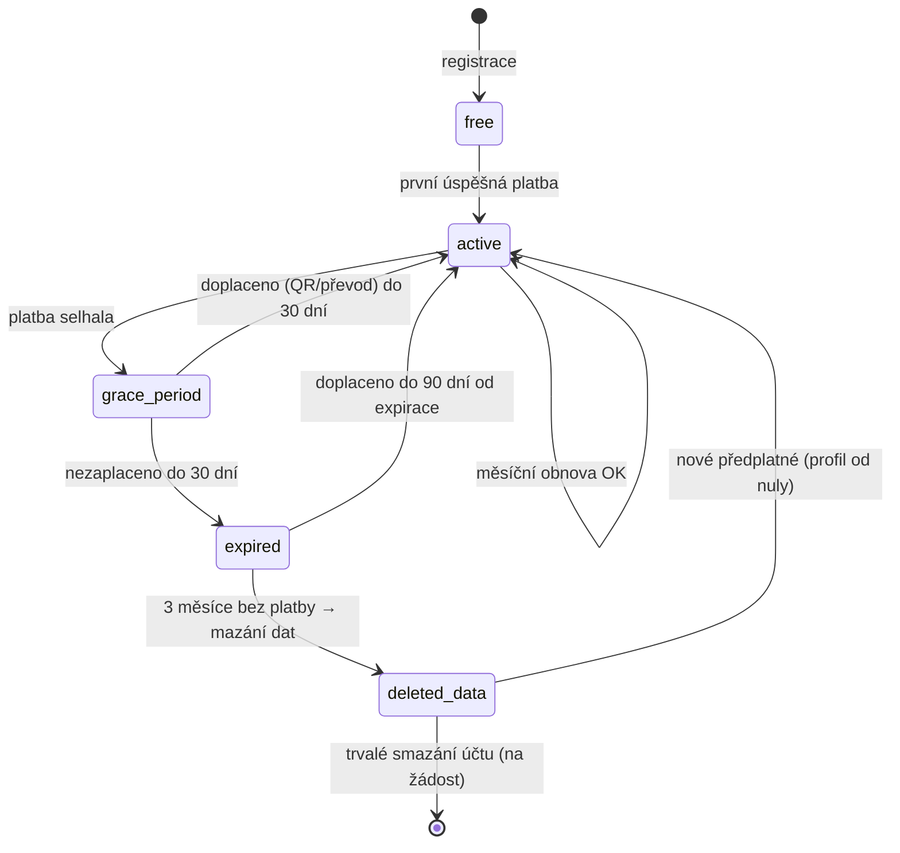
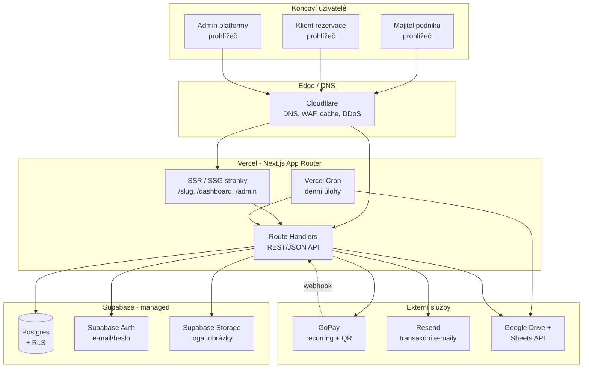
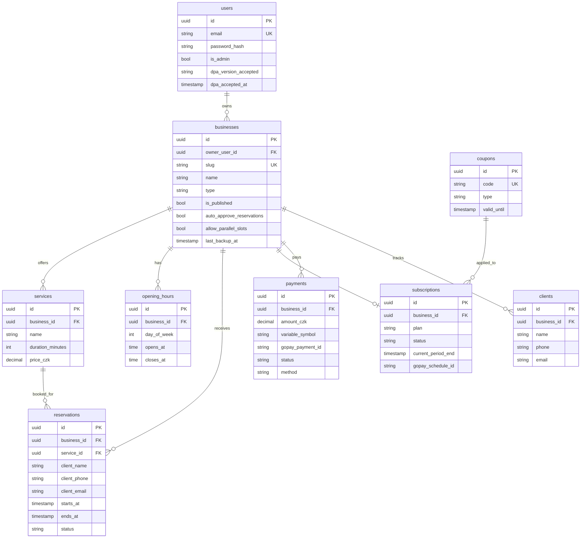
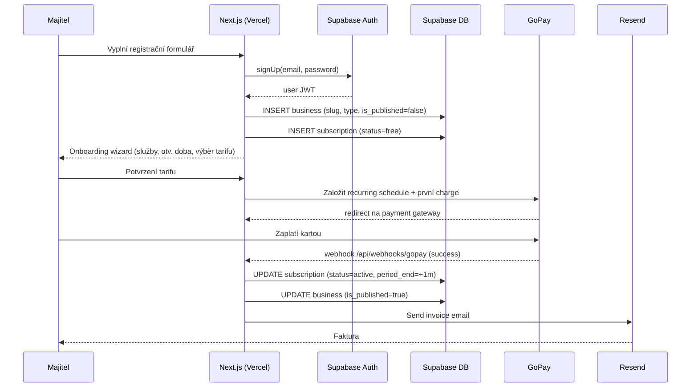
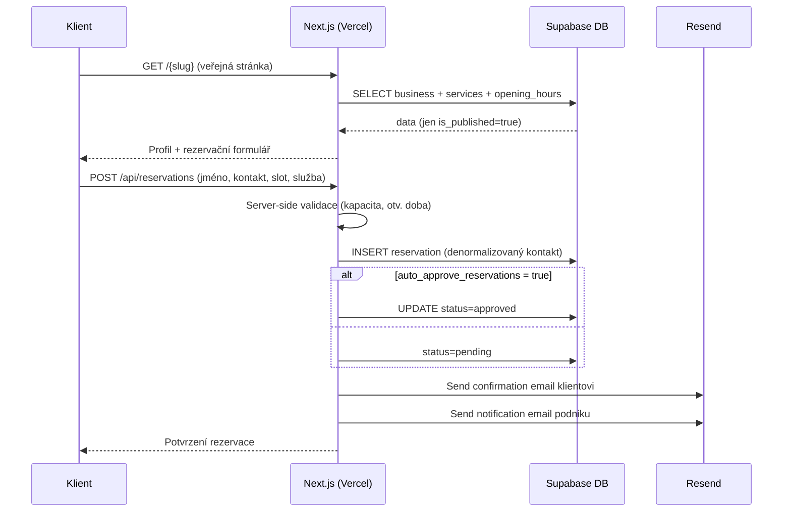
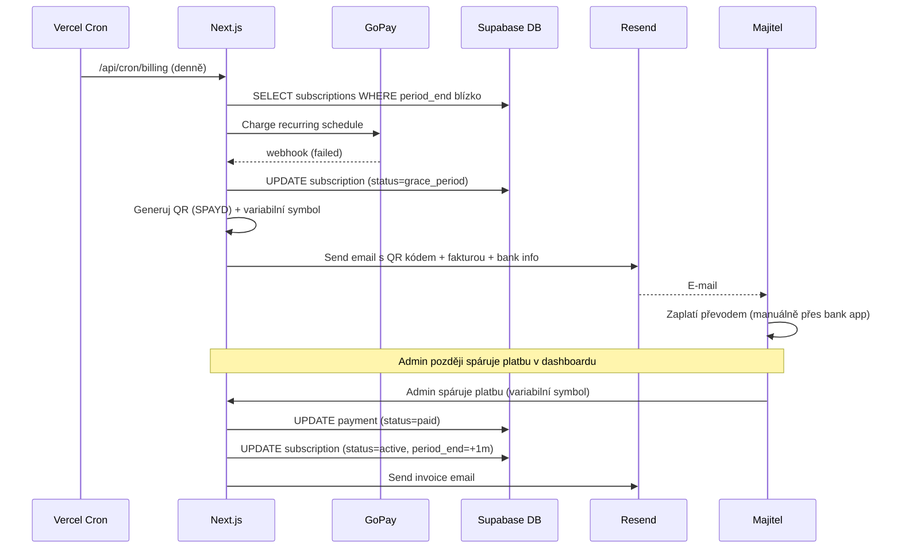
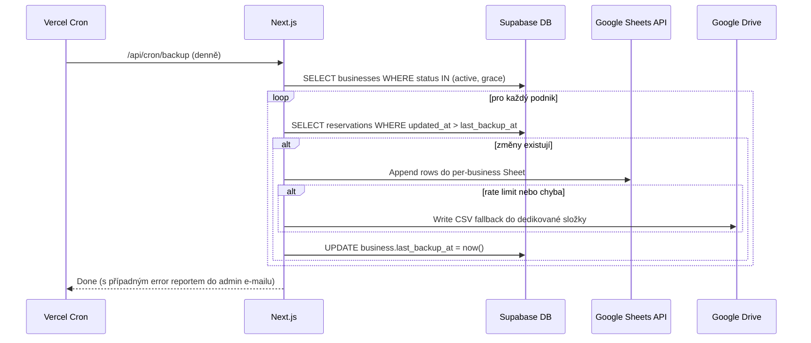
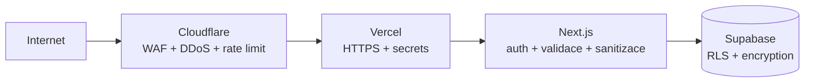

# Architektura platformy Horea

> **Master dokument** popisující vysokoúrovňovou architekturu SaaS rezervačního systému `www.horea.cz`. Detailní implementace jednotlivých částí jsou předmětem navazujících feature specifikací (viz sekce *Plánovaná struktura specifikací*).
>
> Tento dokument obsahuje pouze **high-level design** — žádný kód, pseudokód, SQL DDL ani signatury funkcí. Vše je popsáno prózou a Mermaid diagramy (komponentové, ER, sekvenční).

---

## Overview

### Přehled

**Horea** je rezervační SaaS pro malé české podniky ve službách — kadeřnictví, nehtová studia, masážní salóny, bistra, spa, beauty a další obdobné provozovny. Cílem je nabídnout majiteli podniku jednoduchou cestu, jak si během několika minut vytvořit veřejný profil s online rezervačním formulářem, a klientovi bezbariérovou cestu, jak si bez registrace zarezervovat termín.

Produkt je primárně **webová aplikace** dostupná na doméně `www.horea.cz`. Mobilní nativní aplikace (Android, iOS) jsou plánovány do budoucna a nejsou v rozsahu MVP — architektura je však navržena tak, aby je v budoucnu nezablokovala (REST/JSON API, autentizace přes tokeny, všechna doménová logika v API vrstvě).

**Cílový trh:** Česká republika, čeština jako jediný jazyk MVP. Vícejazyčnost je v roadmapě v2/v3.

**Cílové parametry MVP (scale target):**

| Metrika | Hodnota |
|---|---|
| Počet aktivních podniků | 200 |
| Průměrný počet rezervací / podnik / měsíc | 200 |
| Celkový objem rezervací / měsíc | ~40 000 |
| Veřejných stránek (SEO indexovatelných) | 200 |
| Operátor platformy | 1 osoba (vibe-coder, basic JS, AI-assisted) |

Architektura je vědomě navržena tak, aby tento provoz zvládla na **bezplatných tarifech** Vercelu a Supabase, s minimálními provozními náklady a bez nutnosti správy serverů.

---

### Cíle a omezení

#### Hlavní cíle

- **Time-to-value pro podnikatele:** registrace → veřejný profil → první rezervace v řádu minut.
- **Nulový závazek pro klienta:** rezervace bez registrace, bez instalace, bez hesla.
- **Provozovatelná jedním člověkem:** maximum managed služeb, minimum vlastní infrastruktury.
- **Náklady blízko nuly do prvního paying zákazníka:** MVP musí běžet na free tier kombinaci Vercel + Supabase.
- **Otevřená cesta k růstu:** v okamžiku, kdy free tier přestane stačit, musí být možné přejít na placený tarif nebo na vlastní VPS bez přepisu produktu.

#### Omezení

- **Solo developer s omezenými zkušenostmi.** Architektonické volby preferují jednoduchost a srozumitelnost před výkonem nebo elegancí. Žádné mikroservisy, žádné event-sourcing, žádné CQRS. Monolitická Next.js aplikace.
- **Žádné spekulativní vrstvy.** V duchu pravidla *„Simplicity First“*: pokud něco nepotřebujeme dnes, nestavíme to.
- **Managed služby preferovány před self-hosted.** Supabase místo vlastního Postgresu, Resend místo vlastního SMTP, Vercel místo vlastního Node serveru.
- **Český trh, české právo, GDPR.** Lokalizace, fakturace, platební metody i ochrana dat respektují české prostředí.
- **Žádná detailní fakturace klientů podniků.** Platby v MVP jsou pouze předplatné podniků platformě, nikoli platby koncových klientů za rezervace.

#### Co NENÍ v rozsahu MVP

- Nativní mobilní aplikace (architektura je však nesmí blokovat).
- Vícejazyčný dashboard ani vícejazyčné veřejné stránky.
- Synchronizace s externími kalendáři (Google, iCal, Outlook).
- Embedovatelný widget na vlastní web podniku.
- Týmy / více uživatelů na jeden podnik / role a oprávnění.
- Veřejné API pro třetí strany.
- Platby koncových klientů za rezervace (zálohy, depozity).
- Automatická anonymizace dat (pouze manuální mazání).

---

## Roles

### Role v systému

Systém pracuje se čtyřmi typy aktérů. **Pouze tři z nich jsou registrovaní uživatelé** v tabulce `users`; klient rezervace registrovaný uživatel není.

| Role | Registrovaný | Popis |
|---|---|---|
| **Admin** | Ano | Vlastník platformy. Má plný přístup k SaaS dashboardu, vidí a spravuje všechny uživatele, předplatná, kupóny a statistiky. |
| **Aktivní uživatel** | Ano | Majitel podniku s platným placeným předplatným. Má přístup ke všem funkcím dle svého tarifu, jeho veřejný profil je publikovaný. |
| **Free uživatel** | Ano | Registrovaný majitel podniku bez platného předplatného (nezaplatil, vypršelo, nikdy nezaplatil). Všechny funkce v dashboardu jsou uzamčené, na veřejné URL podniku se zobrazuje hláška *„Tento podnik zatím nepublikoval svůj profil.“* |
| **Klient rezervace** | **Ne** | Koncový zákazník, který si rezervuje termín. Vyplní jméno a kontakt přímo v rezervačním formuláři. Žádný účet, žádné heslo, žádná historie napříč podniky. |

**Důsledek pro architekturu:** autentizace (Supabase Auth) řeší pouze tři typy účtů. Rezervace klientů jsou ukládány jako samostatné záznamy s denormalizovanými kontaktními údaji — neexistuje cizí klíč na `users` ze strany klienta rezervace.

---

## Business Model

### Tarify

Platforma nabízí tři placené tarify s měsíčním předplatným:

| Tarif | Cena (měsíčně) | Cílová skupina |
|---|---|---|
| **Start** | 199 Kč | Jednoosobní provoz, základní rezervace |
| **Pokročilý** | 299 Kč | Provoz s premium funkcemi (TBD) |
| **Max** | 599 Kč | Větší provoz s premium funkcemi (TBD) |

> **Otevřený bod:** Konkrétní rozdělení premium funkcí mezi tarify Pokročilý a Max je v MVP **TBD**. Pro účely architektury se předpokládá, že rozdíly mezi tarify budou řešeny formou *feature flags* navázaných na sloupec `subscriptions.plan`. Konkrétní seznam premium funkcí bude doplněn samostatnou specifikací před spuštěním placeného režimu (viz sekce *Otevřené body*).

### Účtování

- **Měsíční opakované strhávání** přes GoPay (recurring payments).
- **Pozor:** pro recurring platby vyžaduje GoPay schválení merchant účtu — toto je provozní předpoklad, který musí být vyřešen před spuštěním placeného režimu.
- **Při neúspěšném strhnutí** systém pošle e-mail s **QR kódem a fakturou** pro manuální zaplacení převodem. Párování ručních plateb probíhá přes **variabilní symbol**.
- **Žádné roční tarify, slevy ani zvýhodnění** v MVP.
- **Kupónový systém** spravuje admin (sleva, free trial, comp účet) — viz sekce *Admin dashboard*.

### Lifecycle předplatného

Stav předplatného uživatele se řídí konečným automatem:

**Klíčové pravidlo mazání dat:** Po 3 měsících bez platby (stav `expired` → `deleted_data`) systém **smaže veškerá data podniku** — profil, služby, otvírací doby, rezervace, klienty, zálohy. **Zachová pouze e-mail a heslo** v tabulce `users`. Účet existuje dál, uživatel se může přihlásit, ale začíná od nuly. Toto je vědomá volba — chrání platformu před nekonečným uchováváním dat neaktivních účtů a zároveň drží přihlašovací identitu pro případný návrat.

---

## Architecture

### Vysokoúrovňová architektura

### Vysvětlení vrstev

- **Cloudflare** je první linie — DNS, ochrana proti DDoS, WAF pravidla, cache statického obsahu (loga, fotky, JS bundle veřejných stránek). Stojí před Vercelem, takže ten dostává jen filtrovaný provoz.
- **Vercel** hostí celou Next.js aplikaci (App Router). Veřejné stránky podniků jsou renderovány serverově se statickou cache (ISR) — díky tomu zvládne free tier i 200 stránek a běžný organický provoz. API endpointy jsou implementovány jako Route Handlers ve stejném projektu (monolit).
- **Supabase** poskytuje databázi (Postgres), autentizaci (e-mail/heslo, magic linky později) a úložiště souborů. Multi-tenancy je řešena na úrovni databáze přes **Row Level Security** podle `business_id`.
- **Externí služby** komunikují přes API:
  - **GoPay** — výchozí platební brána, odesílá webhooky o stavu plateb.
  - **Resend** — odesílání transakčních e-mailů (notifikace rezervací, fakturace).
  - **Google Drive + Sheets API** — záloha dat (denní CSV + per-business Sheet).

---

## Components and Interfaces

Tato sekce popisuje hlavní komponenty platformy a jejich vzájemné integrační body. Cílem je zachytit, **kdo s kým komunikuje, jakým směrem a jakým protokolem** — bez detailních endpoint specifikací (ty patří do navazujících feature spec dokumentů).

### Komponenty a jejich role

| Komponenta | Role | Integrační vstupy / výstupy |
|---|---|---|
| **Cloudflare** | Edge / DNS / WAF / DDoS / cache | Vstup: HTTPS provoz od koncových uživatelů. Výstup: forward na Vercel origin přes HTTPS. |
| **Next.js app na Vercelu** | Webová aplikace (SSR + SSG + API) | Vstup: HTTP požadavky z Cloudflare, webhooky od GoPay, cron triggery z Vercel Cron. Výstup: volání Supabase, Resend, GoPay API, Google Drive/Sheets API. |
| **Supabase Postgres + Auth + Storage** | Datová vrstva, autentizace, úložiště souborů | Vstup: dotazy z Next.js API (anon JWT pro klientské operace, server-side klíč pouze v server kontextu). Výstup: data, JWT tokeny, signed URLs pro Storage. |
| **GoPay** | Platební brána | Vstup: požadavky z Next.js API (založení recurring platby, charge, QR generation). Výstup: webhook na Next.js endpoint `/api/webhooks/gopay` s podepsaným payloadem o stavu platby. |
| **Resend** | Transakční e-maily | Vstup: HTTP API volání z Next.js (send email s šablonou). Výstup: doručené e-maily; v případě selhání error response, který Next.js loguje. |
| **Google Drive + Sheets API** | Záloha + per-business export | Vstup: API volání z Next.js Cron (denní backup) a z dashboardu (on-demand export), autentizace přes OAuth refresh token osobního Google účtu provozovatele. Výstup: zápis do per-business Google Sheet a/nebo CSV souboru ve fallback Drive složce. |
| **Vercel Cron** | Plánovač denních úloh | Trigger: cron expression. Volá: interní Next.js endpointy (`/api/cron/billing`, `/api/cron/backup`, `/api/cron/cleanup`). |

### Integrační body (high-level)

- **Klient → Cloudflare → Vercel:** veškerá HTTP komunikace prochází Cloudflare (TLS terminace + WAF). Vercel přijímá pouze filtrovaný provoz.
- **Vercel ↔ Supabase:** synchronní volání přes Supabase JS SDK. RLS izoluje data na úrovni `business_id`. Server-side service role klíč se používá pouze v cron jobech a admin operacích, nikdy v klientském kontextu.
- **Vercel ↔ GoPay:**
  - **Outbound:** založení recurring schedule, manuální charge, generování QR.
  - **Inbound:** webhook na `/api/webhooks/gopay` (POST, podepsaný HMAC). Webhook handler je idempotentní — opakovaný webhook se stejným payment ID nevyvolá duplicitní stavovou změnu.
- **Vercel ↔ Resend:** synchronní HTTP volání pro odeslání e-mailu. Selhání odeslání nesmí blokovat hlavní transakci (rezervace, platba) — e-mail je v případě potřeby zařazen do retry fronty (v MVP jednoduchý DB záznam `pending_emails` + retry v cronu).
- **Vercel Cron → Vercel API → Google Drive/Sheets:** denní cron volá interní endpoint, ten sekvenčně zpracuje aktivní + grace podniky, pro každý zapíše inkrementální data do per-business Sheet v osobním Google Drive provozovatele. Autentizace běží přes OAuth refresh token; service account se nepoužívá, protože osobní Google Drive nemá Shared Drives. Při rate-limitu nebo chybě fallback na zápis CSV do dedikované Drive složky a pokračuje v dalším podniku.
- **Vercel Cron → Vercel API (billing):** denní cron prochází podniky s blížícím se koncem cyklu, zakládá GoPay charge nebo posílá QR e-mail při selhání auto-charge.
- **Vercel Cron → Vercel API (cleanup):** denní cron identifikuje podniky ve stavu `expired` po 3 měsících a iniciuje mazání tenant dat.

### Smluvní pravidla mezi komponentami

- **Idempotence webhooků.** Každý webhook handler musí být schopen bezpečně zpracovat opakované doručení (GoPay garantuje at-least-once).
- **Žádný stav v paměti procesu.** Vercel funkce jsou efemérní, cokoli stateful patří do Postgresu.
- **Synchronní externí volání mají timeout.** Žádné volání nesmí blokovat request déle než ~10 s; pokud externí služba neodpoví, request se ukončí s chybou a uživatel dostane srozumitelnou hlášku.
- **Externí služby jsou „best effort" mimo platební vrstvu.** Selhání Resend nebo Google nesmí poškodit core flow (rezervaci, dashboard). Selhání GoPay znamená, že se prodloužení předplatného nezdařilo — to je business událost, která vede k `grace_period`, nikoli k pádu systému.

---

## Tech Stack

| Vrstva | Volba | Stručné zdůvodnění |
|---|---|---|
| Frontend + backend | **Next.js (App Router) + TypeScript** | Jeden framework pro UI i API, server-side rendering pro SEO veřejných stránek, TypeScript pro typovou bezpečnost při AI-assisted vývoji. |
| Hosting | **Vercel (free tier)** | Nulová správa, nativní Next.js podpora, zdarma do MVP scale. |
| Databáze + Auth + Storage | **Supabase (free tier)** | Managed Postgres, hotová autentizace, RLS pro multi-tenancy, S3-kompatibilní úložiště. Vše v jednom. |
| Edge / DNS | **Cloudflare (free)** | Ochrana, cache, jistota, že free tier Vercelu nebudeme zbytečně vyčerpávat. |
| E-mail | **Resend (free tier)** | Jednoduché API, čisté doručitelnosti, free tier pokryje MVP objem. |
| Platby | **GoPay** | Český trh, místní platební metody (karty + bankovní převod + QR), recurring. |
| Záloha | **Google Drive + Sheets API** | Provozovatel chce mít data po ruce v Sheets pro ad-hoc analýzy. Drive zdarma do 15 GB. |

### Klíčová architektonická rozhodnutí

**ADR-1: Vercel + Supabase místo vlastní VPS pro MVP.** Solo developer bez DevOps zkušeností, free tier pokryje cílový rozsah, čas šetřený na infrastruktuře jde do produktu. Riziko vendor lock-in je akceptováno; kompenzuje ho otevřená migrační cesta (ADR-2).

**ADR-2: Migrační cesta na VPS (Coolify + Hetzner) je předem promyšlena.** Next.js běží jako standardní Node aplikace, Postgres je standardní Postgres, Storage je S3-kompatibilní. V okamžiku, kdy free tier přestane stačit nebo kdy bude potřeba větší kontrola, lze celé prostředí přesunout na vlastní VPS bez přepisu kódu. Detail viz sekce *Migrace na VPS*.

**ADR-3: GoPay místo Stripe.** Český trh očekává místní platební metody a QR platby (Banking Q, Spořitelna, ČSOB QR). GoPay je domácí, podporuje recurring, má české zákaznické rozhraní pro fakturaci. Stripe by byl jednodušší integraci, ale za cenu horší konverze u méně technicky zdatných zákazníků.

**ADR-4: Google Sheets jako záloha — vědomé rozhodnutí navzdory rate-limitům.** Provozovatel chce mít data po ruce v Sheets pro ad-hoc reporty bez nutnosti psát admin UI. Backup používá OAuth refresh token osobního Google účtu provozovatele, ne service account, protože MVP běží na osobním Google Drive bez Shared Drives. Riziko (Sheets API rate limit, spolehlivost) je řešeno na úrovni implementace (batch zápisy, fallback na CSV soubory v Drive). Detail v sekci *Zálohování a export*.

**ADR-5: Multi-tenancy přes RLS v jedné databázi.** Místo per-tenant schématu nebo per-tenant databáze je každý podnik odlišen sloupcem `business_id` ve všech relevantních tabulkách a izolován přes Postgres Row Level Security. Důvod: jednoduchost, snazší zálohy, snazší migrace, dostatečná izolace pro 200 podniků. Schema-per-tenant by znamenalo stovky schémat a komplikovanější deployment.

**ADR-6: Monolit (Next.js fullstack) místo mikroservis.** Solo developer, jeden produkt, žádné výkonové důvody pro rozdělení. Mikroservisy = více deploy pipelin, více monitoringu, více failure modes. V duchu *„Simplicity First“*.

**ADR-7: Klient rezervace bez účtu.** Snížení tření při bookingu je důležitější než jednotná identita klienta napříč podniky. Klient prostě vyplní jméno + kontakt. Pokud bude později požadováno *„moje rezervace“* napříč podniky, lze to dořešit ve v3 jako opt-in přes telefon/e-mail.

---

## Data Models

Tato sekce popisuje **logický datový model** platformy na úrovni hlavních entit a jejich vztahů. Konkrétní DDL (typy sloupců, indexy, constrainty), migrace a RLS policies jsou předmětem feature spec dokumentů — zde je pouze koncepční přehled.

### Hlavní entity

- **users** — registrovaní uživatelé (admin + majitelé podniků). Klient rezervace zde **není**. Klíčové atributy: e-mail, password hash, `is_admin`, akceptovaná verze DPA + timestamp.
- **businesses** — profil podniku. Patří jednomu uživateli (1:1 v MVP, s otevřenou cestou na N:1 ve v3). Klíčové atributy: `slug` (unikátní), název, typ podniku (kadeřník, nehtové studio, bistro, masážní salón, spa, beauty, ostatní), popis, logo, kontakty, `is_published`, `auto_approve_reservations`, `allow_parallel_slots`, `last_backup_at`.
- **services** — služby nabízené konkrétním podnikem. Patří `business_id`. Klíčové atributy: název, trvání (minuty), cena, popis. Trvání slotu je **per služba**, ne globální.
- **opening_hours** — otevírací doba podniku po dnech v týdnu (případně výjimky / volné dny). Patří `business_id`.
- **reservations** — rezervace klienta. Patří `business_id` a odkazuje na `service_id`. **Kontaktní údaje klienta jsou denormalizované přímo v záznamu rezervace** (jméno, telefon, e-mail) — žádný cizí klíč na `users`. Klíčové atributy: časový slot (start/end v UTC), status (`pending` / `approved` / `rejected` / `cancelled`), poznámka.
- **clients** *(volitelný agregát per business)* — odvozená evidence klientů jednoho podniku z jejich rezervací. Identifikace per `business_id` na základě kontaktního údaje. **Žádné cross-tenant sdílení.** Přesná upsert logika je předmětem specu `reservation-management`.
- **subscriptions** — předplatné podniku. Patří `business_id`. Klíčové atributy: `plan` (`start` / `pokrocily` / `max`), `status` (`free` / `active` / `grace_period` / `expired` / `deleted_data`), `current_period_start`, `current_period_end`, GoPay recurring schedule ID.
- **payments** — historie platebních pokusů (úspěšných i neúspěšných) pro účetní auditovatelnost. Patří `business_id`. Klíčové atributy: částka, měna (`CZK`), variabilní symbol, GoPay payment ID, stav (`pending` / `paid` / `failed`), způsob (`auto_charge` / `qr_manual` / `admin_manual`), faktura URL.
- **coupons** — slevové / komp / trial kupóny spravované adminem. Klíčové atributy: kód, typ slevy (procento / fixní částka / free trial dnů / comp účet), platnost, počet použití.

### ER diagram

### Multi-tenancy přes RLS

Každá tenant-scoped tabulka má sloupec `business_id`. Postgres Row Level Security policy povoluje řádek pouze tehdy, pokud `business_id` odpovídá podniku přihlášeného uživatele (přes JWT claim) — případně pokud je uživatel admin. Veřejné stránky podniků čtou data anonymním klíčem s policy omezenou na `is_published = true`. Zápis rezervací anonymním klientem probíhá přes server-side endpoint, který validuje business logiku a teprve pak data zapíše s explicitním `business_id`.

---

## Key User Flows

Tato sekce ilustruje hlavní toky platformy sekvenčními diagramy. Cílem je vidět, **jak komponenty komunikují v běžných scénářích** — ne popisovat všechny edge cases (ty patří do feature spec dokumentů).

### Tok 1: Registrace podnikatele a první platba

### Tok 2: Klient vytváří rezervaci (bez registrace)

### Tok 3: Auto-charge selhal → grace period → manuální platba

### Tok 4: Denní backup do Google Sheets

---

## Reservation Logic

Tato sekce popisuje **doménová pravidla rezervací** — jak se počítají sloty, jak se chová kapacita, jak figurují různé typy podniků. Konkrétní algoritmy a implementace patří do specu `services-and-availability` a `reservation-management`.

### Typy podniků

Platforma rozlišuje typy podniků (`business.type`): **kadeřník, nehtové studio, bistro, masážní salón, spa, beauty, ostatní**. Typ podniku slouží primárně k:

- **Kategorizaci** (filtr v případném budoucím katalogu, ikona v UI).
- **Defaultním šablonám** služeb a otvíracích dob při onboardingu (pohodlí, ne tvrdá vazba).
- **Drobným UI nuancím** (název služby vs. položka menu u bistra).

Doménová logika rezervací (sloty, kapacita, schvalování) je **napříč typy stejná** — parametrizuje se ne typem, ale konkrétními nastaveními podniku (`auto_approve_reservations`, `allow_parallel_slots`) a per-služba parametry (trvání).

### Per-služba trvání

Každá služba má vlastní `duration_minutes`. Slot rezervace je odvozen z trvání zvolené služby — **nikoli z globálního rastru podniku**. Kadeřník tak může mít zároveň službu „střih 30 min" i „barvení 120 min" a slot se přizpůsobí.

### Otvírací doba

`opening_hours` definuje otevřené intervaly podniku po dnech v týdnu. Rezervační endpoint validuje, že požadovaný slot **leží celý uvnitř otevíracího intervalu**. Speciální dny (svátky, dovolená) jsou v MVP řešeny jednoduše — buď ručním zákazem rezervací na konkrétní den, nebo úpravou otvírací doby. Kalendářové výjimky jako samostatná entita jsou v rámci v2.

### Kapacita slotu

Podnik má přepínač `allow_parallel_slots` (bool):

- **`false` (default)** — jeden slot = jedna rezervace. Konflikt = odmítnutí. Vhodné pro jednoosobní provoz (jeden kadeřník, jedno křeslo).
- **`true`** — paralelní rezervace ve stejném slotu jsou povoleny. **MVP nemá numerickou kapacitu** (např. „4 křesla"). Pokud podnikatel zapne paralelu, je na něm, jak si rezervace zvládne. Numerická kapacita je v open questions a může přijít ve v2.

### Schvalování

`auto_approve_reservations` (bool):

- **`false` (default)** — nově vzniklá rezervace má `status=pending`. Podnikatel ji v dashboardu schválí/odmítne. Klient obdrží e-mail až po rozhodnutí.
- **`true`** — rezervace je rovnou `approved`, klient dostává okamžité potvrzení.

### Detekce konfliktu

Při validaci nového slotu platforma kontroluje **překryv s existujícími nezamítnutými rezervacemi** stejného podniku (`status IN (pending, approved)`). Při `allow_parallel_slots=false` jakýkoli překryv vede k odmítnutí. Race condition při souběžných rezervacích je řešena na úrovni DB (transakce + advisory lock per business, případně unique constraint na slot — detail v `reservation-management`).

---

## Payments

Platby v MVP pokrývají **výhradně předplatné podniků platformě**. Žádné platby koncových klientů za rezervace.

### GoPay recurring + QR fallback

- **Primární kanál:** GoPay recurring schedule založený při prvním úspěšném checkoutu. GoPay automaticky strhává každý měsíc.
- **Fallback při selhání auto-charge:** Platforma vygeneruje **QR platbu (SPAYD)** s předem alokovaným **variabilním symbolem** a odešle e-mail s QR kódem, fakturou a bankovními údaji. Uživatel zaplatí převodem ručně.
- **Manuální párování:** V MVP **bez integrace bankovního API**. Admin po obdržení platby na účet dohledá variabilní symbol v dashboardu a klikne *„spárovat"*. Platforma označí `payment.status = paid` a posune `subscription.current_period_end`.

### Webhooky

GoPay posílá webhooky na `/api/webhooks/gopay` po každé změně stavu platby. Endpoint:

- **Ověřuje HMAC podpis** webhooku (anti-spoofing).
- **Je idempotentní** — opakovaný webhook se stejným payment ID nezpůsobí duplicitní stavovou změnu (kontrola přes `payments.gopay_payment_id`).
- **Mapuje GoPay stavy** na interní `payment.status` a podle nich aktualizuje `subscription.status`.

### Variabilní symbol

Každý platební pokus má vlastní variabilní symbol generovaný platformou (např. odvozený z `payment.id` převedeného na číselnou formu). Pravidlo unikátnosti: variabilní symbol se nesmí v dohledné historii opakovat, aby manuální párování bylo jednoznačné.

### Stavový automat předplatného

Stavy `subscription.status`:

| Stav | Význam | Přechody |
|---|---|---|
| `free` | Registrovaný uživatel bez platby. Profil neviditelný. | → `active` (první úspěšná platba) |
| `active` | Platné předplatné. Profil publikovaný. | → `grace_period` (auto-charge fail) |
| `grace_period` | Platba selhala, čekáme manuální platbu. Profil **zatím** publikovaný. | → `active` (zaplaceno do 30 dní) → `expired` (nezaplaceno) |
| `expired` | Vypršelo. Profil schovaný, dashboard uzamčený. Data zatím existují. | → `active` (doplaceno do 90 dní od expirace) → `deleted_data` (3 měsíce bez platby) |
| `deleted_data` | Tenant data smazána. Účet (`users` + historie plateb) zachován. | → `active` (nové předplatné, profil od nuly) |

> **Poznámka:** Přesné timeouty (30 dní grace, 90 dní reactivation, 3 měsíce do mazání) a warning notifikace jsou předmětem specu `subscription-payments`. Hodnoty zde jsou pracovní předpoklad odvozený z `Roles` a `Business Model`.

### Faktury

Po každé úspěšné platbě platforma vygeneruje fakturu (PDF nebo HTML→PDF) a odešle ji e-mailem přes Resend. Faktury se ukládají do Supabase Storage pro pozdější dohledání. Číselná řada faktur je sekvenční napříč platformou (jeden plátce = provozovatel platformy).

---

## Backup and Export

### Per-business Google Sheet

Každý aktivní + grace podnik má **vlastní Google Sheet** v osobním Drive provozovatele. Denní cron job (`/api/cron/backup`) prochází podniky a do příslušného Sheetu **inkrementálně připisuje** rezervace změněné od `business.last_backup_at`. Po úspěšném zápisu se `last_backup_at` aktualizuje.

Přístup do Google Drive a Sheets běží přes OAuth client + refresh token provozovatele (`GOOGLE_OAUTH_CLIENT_ID`, `GOOGLE_OAUTH_CLIENT_SECRET`, `GOOGLE_OAUTH_REFRESH_TOKEN`). Backup složka musí být vytvořená přes tento OAuth client, aby scope `drive.file` měl k cílové složce přístup; ručně vytvořená Drive složka může z API vracet 404. Service account se pro MVP nepoužívá; osobní Google Drive nejde spolehlivě sdílet se service accountem a nemá Shared Drives.

Sheet slouží primárně provozovateli platformy pro ad-hoc analýzy a jako **čitelná záloha** v případě výpadku Supabase. Podnikatelé do něj přístup **nemají** (je v Drive provozovatele) — pro ně slouží on-demand export.

### On-demand CSV export

Z dashboardu podnik si **kdykoli** stáhne CSV se všemi svými rezervacemi (případně filtr podle data / statusu). Tento export jde přímo z DB do response — nezávisí na denním backupu, neaktualizuje `last_backup_at`.

### Mitigace rate-limitů Google API

Google Sheets API má kvóty (čtení/zápisy za minutu, za den). Strategie:

- **Batch zápisy** (více řádků v jednom append requestu).
- **Throttle mezi podniky** (krátká prodleva, exponenciální backoff při 429).
- **Per-podnik fallback na CSV soubor v Drive složce** pokud zápis do Sheetu opakovaně selže — data se neztratí, jen skončí v jiném formátu.
- **Continue-on-error** — selhání u jednoho podniku nesmí zastavit zpracování ostatních.
- **Notifikace adminovi** při souhrnu denního běhu (kolik podniků OK, kolik fallback, kolik fail).

### Žádné automatické obnovení

Restore ze Sheets není automatizovaný proces. Pokud dojde k mimořádné situaci (datová ztráta v Supabase), provozovatel obnoví ručně z dostupných záloh (Supabase point-in-time recovery jako primární, Sheets/CSV jako sekundární kontrola).

---

## GDPR

### Role v rámci GDPR

- **Podnik (majitel)** — **správce** osobních údajů svých klientů (jméno, telefon, e-mail v rezervacích). Rozhoduje, proč a jak se data zpracovávají v rámci jeho podnikání.
- **Horea (provozovatel platformy)** — **zpracovatel** osobních údajů klientů jménem podniku. Provozuje technickou infrastrukturu, ale o účelu zpracování nerozhoduje.

### DPA (Data Processing Agreement)

Při registraci je podnikatel povinen **akceptovat DPA**. Verze a timestamp akceptace se ukládají do `users` (atributy `dpa_version_accepted`, `dpa_accepted_at`). Při změně DPA musí uživatel akceptaci obnovit (re-accept flow při příštím přihlášení).

DPA obsahuje:

- Účel a rozsah zpracování.
- Seznam **subzpracovatelů**: Supabase, Vercel, Resend, GoPay, Cloudflare, Google.
- Bezpečnostní opatření (šifrování, RLS, MFA pro adminy provozovatele).
- Postup při bezpečnostním incidentu.
- Pravidla pro mazání dat při ukončení smlouvy.

### Manuální mazání

Platforma podporuje **výhradně manuální mazání** dat — buď podnikatelem ze svého dashboardu (smazání rezervace, smazání klienta), nebo provozovatelem na žádost subjektu údajů (právo na výmaz dle GDPR čl. 17). **Žádná automatická anonymizace** v MVP.

Výjimka: po 3 měsících ve stavu `expired` platforma **automaticky maže tenant data** podniku (nikoli žádost subjektu, ale ukončení vztahu nezaplacením). E-mail uživatele a historie plateb zůstávají z účetních důvodů.

### Region a šifrování

- **Region:** Supabase běží v EU (`eu-central` nebo `eu-west`).
- **At rest:** Šifrování zajišťuje Supabase (Postgres + Storage).
- **In transit:** TLS 1.2+ na všech hranicích (Cloudflare → Vercel → Supabase).
- **Hesla:** Supabase Auth (bcrypt / argon2 — podle Supabase defaultu).

### Práva subjektů údajů

Klient (subjekt údajů) uplatňuje práva u **podniku** (správce), nikoli u platformy. Platforma podnikateli poskytne technické prostředky:

- **Přístup / kopie:** Export rezervací z dashboardu.
- **Oprava:** Editace rezervace v dashboardu.
- **Výmaz:** Smazání rezervace / klienta v dashboardu.

V případě, že podnikatel sám není schopen práva uplatnit (např. ztratil přístup), provozovatel platformy zasáhne na základě podpory.

---

## Security

### Vrstvená ochrana

### Hlavní opatření

- **Cloudflare před Vercelem.** DNS, TLS, WAF s OWASP pravidly, DDoS protection, edge rate limit pro nejvíce zneužívané endpointy (rezervace, login).
- **HTTPS všude.** Žádné HTTP fallbacky, HSTS hlavička, secure cookies.
- **Supabase Auth.** E-mail + heslo, session v HTTP-only secure cookies, rate limit na login a password reset.
- **Service role key** se používá **pouze server-side** (cron joby, admin operace), **nikdy v klientském bundlu**. Klient používá anon key + uživatelský JWT.
- **Row Level Security** na všech tenant-scoped tabulkách.
- **Server-side validace** všech vstupů (typ + business logika). Klientská validace je pouze UX, není bezpečnostní vrstva.
- **HTML sanitizace** uživatelských vstupů zobrazovaných ostatním (popis podniku, poznámka k rezervaci).
- **HMAC ověření webhooků** od GoPay (a budoucích integrací).
- **Rate limit per IP** na rezervační endpoint (anti-spam) a auth endpointy (anti-brute-force).
- **Secrets v env variables** (Vercel + Supabase). Žádné secrets v repu.
- **Závislost na DDoS ochraně Cloudflare** — provozovatel sám nemá kapacitu řešit aplikační DDoS.

### Hrozby a mitigace (přehled)

| Hrozba | Mitigace |
|---|---|
| SQL injection | Parametrizované dotazy přes Supabase SDK. RLS jako druhá vrstva. |
| XSS | React auto-escape + sanitizace HTML poli. CSP hlavičky. |
| CSRF | Same-site cookies, ověření Origin/Referer u state-changing endpointů. |
| Credential stuffing / brute-force | Rate limit, captcha při opakovaných selháních (v2). |
| Cross-tenant leak | RLS policies + server-side guard kontrolující `business_id`. |
| Webhook spoofing | HMAC ověření, idempotence. |
| Únik service role key | Klíč nikdy ve frontendu, audit env proměnných. |
| DDoS | Cloudflare. |
| Phishing platby | Faktury z ověřené domény (SPF/DKIM/DMARC), QR generovaná platformou. |

---

## Migration to VPS

Architektura je **vědomě stavěna tak, aby šla v budoucnu přesunout** z Vercel + Supabase na vlastní VPS bez přepisu produktu. Cílový migrační scénář: **Coolify na Hetzneru**.

### Co zůstává beze změny

- **Next.js aplikace** — běží jako standardní Node.js proces, podporuje `next build` + `next start` nebo standalone build (Docker image).
- **Postgres** — Supabase je standardní Postgres + extensions, lze přesunout `pg_dump` / `pg_restore` na self-hosted Postgres (s rozšířeními pro RLS, které jsou součástí core Postgres).
- **Doménová business logika** — žádná závislost na proprietárních Vercel/Supabase API mimo SDK.
- **Cloudflare** — zůstává před aplikací beze změny.
- **GoPay, Resend** — externí služby, nezávislé na hostingu.

### Co se mění

- **Hosting Next.js** — Vercel → Coolify (Docker container na Hetzner VPS).
- **Auth** — Supabase Auth → buď self-hosted Supabase (Coolify má one-click), nebo migrace na alternativu (Auth.js / Clerk / vlastní implementace nad Postgres). Preferovaná cesta: **self-hosted Supabase** v Coolify, aby se zachovalo SDK a RLS bez přepisu kódu.
- **Storage** — Supabase Storage (S3-kompatibilní) → self-hosted Supabase Storage nebo přímý S3-kompatibilní provider (Backblaze B2, MinIO). SDK abstrakce zachová API.
- **Cron** — Vercel Cron → systémový `cron` na VPS volající stejné HTTP endpointy.
- **TLS** — Vercel automatic → Caddy/Traefik (součást Coolify) s Let's Encrypt.
- **Environment variables** — Vercel UI → Coolify env management.
- **Logging** — Vercel dashboard → Loki/Grafana nebo jednoduchý log file + rotace.

### Kritéria pro spuštění migrace

Migrace **není naplánována** jako součást MVP. Spustí se, jakmile platí jedna z podmínek:

- Free tier Vercelu nebo Supabase přestane stačit (function invocations, DB connections, storage, bandwidth).
- Náklady na placené tarify Vercel + Supabase převýší přijatelný strop.
- Provozní/regulatorní důvod požaduje plnou kontrolu nad infrastrukturou.

### Co je třeba dodržovat **už teď**, aby migrace nebyla zablokována

- **Žádný stav v paměti** Vercel funkcí (vše do Postgresu / Storage).
- **Žádné Vercel-specific API** mimo Cron a Image Optimization (oboje má standardní náhrady).
- **Standardní Next.js build** podporující `output: standalone` (Docker-deployable).
- **Secrets pouze přes env variables** (žádný cloud-vendor secret manager).
- **Externí služby přes oficiální SDK** (Supabase JS SDK, ne přímé volání proprietárních endpointů).

---

## Error Handling

Tato sekce popisuje **obecné principy práce s chybami** napříč platformou. Konkrétní chybové stavy jednotlivých feature jsou v jejich spec dokumentech.

### Klasifikace chyb

| Třída | Příklad | Reakce |
|---|---|---|
| **Validační chyba uživatelského vstupu** | Prázdné jméno, neplatný telefon, slot mimo otv. dobu | HTTP 400, čitelná hláška v češtině, formulář zachová vyplněné údaje |
| **Autorizační chyba** | Pokus o přístup k cizím datům, neplatný JWT | HTTP 401/403, redirect na login nebo generický „Nemáte oprávnění" |
| **Konflikt business pravidel** | Slot obsazený, slug už zabraný | HTTP 409, hláška s návrhem dalšího kroku (jiný slot, jiný slug) |
| **Externí služba selhala** | Resend down, GoPay timeout, Google API rate limit | Retry s backoffem; pokud trvale selže, log + admin notifikace; **core flow (rezervace, dashboard) nesmí padnout** |
| **Interní neočekávaná chyba** | Bug v kódu, DB connection lost | HTTP 500, generická chybová stránka, plný log s request ID, admin notifikace |

### Zásady

- **Best-effort kanály neblokují core.** Selhání e-mailu (Resend), backupu (Google) nebo zálohy nesmí způsobit selhání rezervace nebo platby. E-maily se v případě potřeby řadí do retry fronty (jednoduchý DB záznam `pending_emails`).
- **Idempotence webhooků.** GoPay (a budoucí webhooky) garantují at-least-once doručení. Handlery jsou navrženy tak, aby opakované zpracování nezpůsobilo duplicitu.
- **Transakce na hranici business operace.** Vytvoření rezervace = jedna DB transakce. Aktivace předplatného po platbě = jedna transakce. Žádné polovičaté stavy mezi tabulkami.
- **Žádný stack trace klientovi.** Klient vidí čitelnou hlášku s request ID. Stack trace je pouze v logu.
- **Timeouty na externí volání.** Žádné synchronní externí volání nesmí běžet déle než ~10 s. Po překročení request končí s chybou „Externí služba neodpovídá, zkuste to prosím znovu".
- **Admin notifikace pro blokující chyby.** Selhání cron jobu, opakované selhání platebního webhooku, vyčerpání kvóty externí služby → e-mail provozovateli.

---

## Testing Strategy

Strategie testování v MVP je **přiměřená kapacitě jednoho vývojáře**. Cíl: pokrýt to, co bolí nejvíc, když to selže — ne dosáhnout 100 % code coverage.

### Vrstvy testů

- **Unit testy** pro doménovou logiku — slot validace, detekce konfliktu rezervace, stavový automat předplatného, generování variabilního symbolu, parsování webhooku. Tyto funkce jsou izolované od I/O, snadno testovatelné, a chyba zde má velký dopad.
- **Integrační testy** pro klíčové API endpointy — vytvoření rezervace, registrace, GoPay webhook handler, RLS policies. Spouštěny proti **lokálnímu Supabase** (Docker) nebo testovací instanci.
- **End-to-end testy** pro **happy paths** kritických flow — registrace + první platba, vytvoření rezervace klientem, schválení rezervace v dashboardu. Nástroj: Playwright. Žádné pokrytí všech edge cases — pouze hlavní cesty.
- **Manuální testování** pro UI/UX a integrace s externími službami (GoPay sandbox, Google API).

### Property-based testy

Pro **kritickou doménovou logiku** jsou vhodné property-based testy (knihovna podle volby — `fast-check` v TypeScript ekosystému):

- Generování variabilního symbolu — invariant unikátnosti.
- Detekce konfliktu slotu — symetričnost (A koliduje s B ⇔ B koliduje s A), reflexivita.
- Stavový automat předplatného — dosažitelnost stavů z legitimních posloupností událostí, žádné neočekávané přechody.

> Property-based testy nejsou povinné v každém specu — používají se tam, kde mají smysl. Detail v jednotlivých feature spec dokumentech.

### CI

- **Vercel preview deploy** pro každý PR — manuální vizuální kontrola.
- **GitHub Actions** spouští unit + integrační testy při PR a před mergem do main.
- **Žádné performance / load testy** v MVP — scale je dostatečně malý, regresi pozná uživatel.

### Co se NEtestuje automaticky

- Vizuální regression (manual review).
- Doručitelnost e-mailů (Resend interní monitoring + manuální spot check).
- GoPay produkční flow (sandbox v testech, produkční pouze manuální ověření po deployi).

---

## Roadmap

### MVP

Cílem MVP je **uvést platformu do provozu pro prvních ~50 podniků** s minimální funkčností nutnou k provozu rezervačního systému:

- Registrace + onboarding podnikatele.
- Veřejná stránka podniku na `/{slug}` s rezervačním formulářem.
- Manuální / auto schvalování rezervací.
- Dashboard rezervací pro podnikatele.
- E-mailové notifikace (Resend).
- Předplatné (GoPay recurring + QR fallback).
- Admin dashboard (uživatelé, předplatná, kupóny, manuální párování plateb).
- Denní backup do Google Sheets.
- GDPR / DPA / manuální mazání.

### v2

Funkce, které **rozšiřují** MVP, ale nejsou nutné pro první spuštění:

- **Synchronizace s externími kalendáři** — Google Calendar (read + write), iCal feed.
- **Vícejazyčnost** — UI a veřejné stránky v EN, UK, RU, DE, ES, IT, TR, VI.
- **Statistiky** pro podnikatele — vytíženost slotů, konverze, top služby.
- **E-mailové šablony** — podnikatel si může přizpůsobit text potvrzovacího e-mailu.
- **Numerická kapacita slotu** — místo bool přepínače `allow_parallel_slots` umožnit zadat počet souběžných rezervací.

### v3

Funkce **mimo MVP scope**, vyžadující významnou architektonickou práci:

- **Týmy a více uživatelů na jeden podnik** — role (admin / zaměstnanec / recepce), oprávnění, audit log.
- **Embedovatelný widget** na vlastní web podniku (iframe + JS API).
- **Veřejné API pro třetí strany** — REST / OAuth, webhooks ven.
- **Custom design** veřejných stránek — barvy, fonty, vlastní doména s CNAME.
- **Automatický překlad** veřejných stránek do dalších jazyků (LLM-assisted).

### Mobilní aplikace

**Mimo scope všech plánovaných verzí**, ale **architektura nesmí migraci blokovat**. Když přijde čas, mobilní klient (Android, iOS, případně React Native / Flutter) konzumuje stejné JSON API jako web, autentizuje se přes JWT z Supabase Auth, a používá stejnou doménovou logiku.

Z toho vyplývají dnešní omezení:

- Doménová logika v API vrstvě, ne v React komponentách.
- Datový model dostupný v JSON formátu přes server-side endpoints.
- Autentizace tokeny (JWT), ne pouze cookies.

---

## Open Questions

Body, které nejsou v rámci tohoto architektonického dokumentu uzavřeny a budou vyřešeny v navazujících feature spec dokumentech nebo provozním rozhodnutím:

1. **Rozdělení premium funkcí** mezi tarify Pokročilý a Max — TBD před spuštěním placeného režimu.
2. **GoPay merchant approval pro recurring** — provozní předpoklad, nutno vyřešit před launch.
3. **Přesné timeouty stavového automatu** (grace period, expired, mazání dat) — řeší spec `subscription-payments`.
4. **Numerická kapacita slotu** — v MVP pouze bool přepínač; číselná kapacita ve v2.
5. **Match logika upsertu klienta** (telefon vs. e-mail vs. oboje) — řeší spec `reservation-management`.
6. **Speciální dny / svátky** jako samostatná entita — v MVP řešeno ad-hoc úpravou otv. doby; v2 zvážit dedikovanou tabulku.
7. **Error tracking služba** (Sentry vs. nic) — TBD; rozhodnutí oddělené od core logiky, snadno měnitelné.
8. **Captcha** na rezervační endpoint a login — v MVP rate limit; v2 zvážit captcha při opakovaných selháních.
9. **Audit log pro admin akce** — formát a retention TBD ve specu `admin-dashboard`.
10. **Číselná řada faktur** — sekvenční napříč platformou; přesný formát čísla TBD ve specu `subscription-payments`.
11. **Re-accept DPA flow** při změně verze — UX detail TBD ve specu `auth-onboarding`.

---

## Planned Spec Structure

Tento architektonický dokument je **master**. Jednotlivé funkční oblasti jsou rozpracovány v navazujících specifikacích — každá má vlastní `requirements.md`, `design.md` a `tasks.md`. Plánovaná struktura:

| Spec | Rozsah |
|---|---|
| **auth-onboarding** | Registrace, přihlášení, password reset, akceptace DPA, onboarding wizard (slug, typ podniku, první služby, otv. doba). |
| **public-business-page** | Veřejná stránka `/{slug}`, SEO, ISR, rezervační formulář, server-side validace, e-mailové notifikace klienta. |
| **reservation-management** | Dashboard rezervací podnikatele — seznam, filtr, schválení/odmítnutí, editace, mazání, export, upsert klienta. |
| **services-and-availability** | Správa služeb (CRUD, trvání, cena), správa otvírací doby, slot výpočet, detekce konfliktu, kapacita. |
| **subscription-payments** | GoPay integrace (recurring + webhook), QR fallback, variabilní symbol, stavový automat předplatného, fakturace, e-mailové notifikace platby. |
| **admin-dashboard** | Admin UI — seznam uživatelů, override předplatného, kupóny, manuální párování plateb, statistiky, audit log. |

> **Pořadí implementace** není pevně dáno tímto dokumentem — je věcí roadmapy. Logická závislost: `auth-onboarding` → `services-and-availability` + `public-business-page` → `reservation-management` → `subscription-payments` → `admin-dashboard`.
