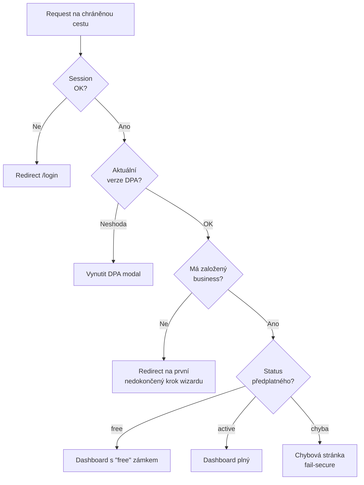
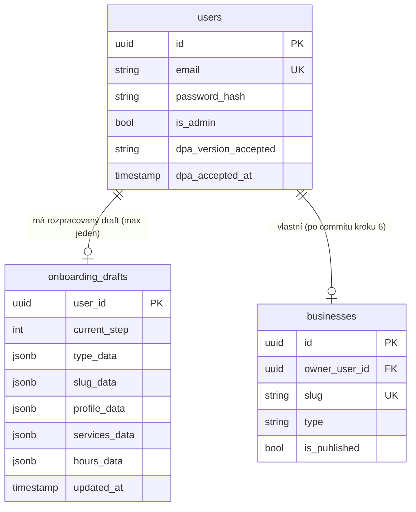
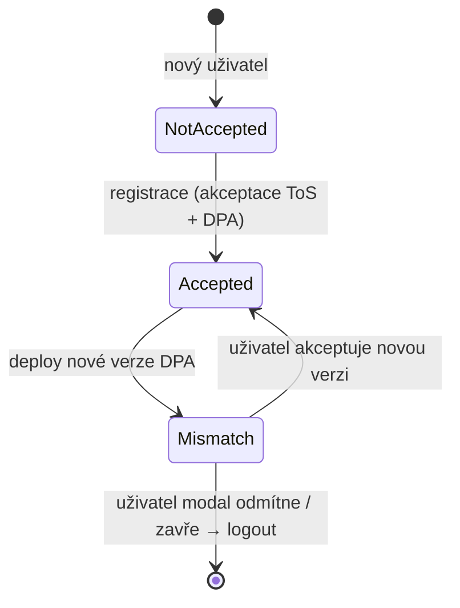

# Design: Auth & Onboarding

> Feature spec navazující na master `architecture/design.md`. Pokrývá autentizační vrstvu (registrace, přihlášení, ověření emailu, reset hesla, DPA verzování, odhlášení) a šestikrokový onboarding wizard, jehož výstupem je profil podniku ve stavu `free` (nepublikovaný).
>
> **High-level only** — žádný kód, SQL DDL ani signatury funkcí. Vše prózou a Mermaid diagramy.
>
> **Princip** dle `CLAUDE.md`: simplicity first. Stavíme pouze to, co je dnes potřeba; spekulativní vrstvy odmítáme.

---

## Overview

### Co tato feature řeší

Tato specifikace popisuje **první kontakt podnikatele s platformou** — od kliknutí na *„Registrovat se"* na landing page po dokončený, ale ještě nepublikovaný profil podniku. Cílem je dovést podnikatele do stavu, v němž má:

- Ověřený emailový účet v Supabase Auth.
- Akceptovanou aktuální verzi DPA (s timestampem).
- Záznam v `businesses` s vlastním slugem a typem podniku, `is_published = false`.
- Alespoň jednu službu a otevírací dobu pro alespoň jeden den.
- Předplatné ve stavu `free`, které blokuje publikaci dokud neproběhne první platba (tu řeší `subscription-payments`).

Spec **nepokrývá** placení předplatného, veřejnou stránku, správu rezervací ani dashboard po onboardingu (kromě nutného re-akceptace DPA a Free_User_Guard, které mají platformový dosah).

### Návaznost na architekturu

Dokument se opírá o `architecture/design.md`:

- **Tech stack** (`Tech Stack`): Next.js App Router + TypeScript na Vercelu, Supabase Auth + Postgres + RLS, Cloudflare před aplikací, Resend pro transakční emaily.
- **Multi-tenancy** (ADR-5): RLS dle `business_id`. V tomto specu RLS ještě **neaplikujeme** na úrovni tenant izolace, protože podnik vznikne až v kroku 6 onboardingu — autentizační vrstva pracuje s `users` (RLS dle `auth.uid()`).
- **Bezpečnost** (`Security`): HTTPS všude, HTTP-only secure cookies, edge rate limit na Cloudflare, server-side validace všech vstupů, rate limit na auth endpointy.
- **Lokalizace** (`R18`): vše v češtině — UI, validační hlášky, e-maily.
- **GDPR** (`GDPR`): DPA verzování přes `users.dpa_version_accepted` + `users.dpa_accepted_at`.

### Klíčová designová rozhodnutí

1. **Onboarding wizard má server-side persistenci rozpracovaného stavu.** Místo session storage / cookies / localStorage ukládáme rozpracovaná data do dedikované tabulky `onboarding_drafts` (jeden záznam na uživatele). Důvod: `R14` vyžaduje, že podnikatel se vrátí na první nedokončený krok s předvyplněnými daty po opětovném přihlášení — i z jiného zařízení. Klientská persistence by tento požadavek splnila pouze nespolehlivě.
2. **DPA verze je code constant, ne DB záznam.** `CURRENT_DPA_VERSION` (např. `"2025-01-15"`) je hodnota v kódu. DB ukládá pouze, kterou verzi konkrétní uživatel akceptoval. Přechod na novou verzi = změna konstanty + deploy. Žádné UI pro správu verzí v MVP. Plně v duchu *„Simplicity First"*.
3. **Reserved slugs jsou code constant array.** Statický seznam (`admin`, `api`, `login`, `register`, `dashboard`, `app`, `www`, `mail`, …) je zdrojový kód, ne DB. Přidání rezervovaného jména = code change. V MVP je to jednodušší, předvídatelnější a rychlejší než DB lookup.
4. **Atomický commit v kroku 6.** Vytvoření `businesses` + `services` + `opening_hours` + `subscriptions` (status `free`) probíhá v jediné DB transakci. Jakékoli selhání = rollback všeho. Žádné polovičaté stavy.
5. **Slug uniqueness garantovaná DB constraintem.** Live validace v kroku 2 je UX vrstva. Skutečnou unikátnost rozhoduje až `UNIQUE` constraint v DB při commitu kroku 6 — bezpečné proti race condition mezi dvěma souběžnými onboardingy stejného slugu.
6. **DPA re-akceptace je middleware kontrola.** Každý request autentizovaného podnikatele projde middlewarem, který porovná uloženou verzi s aktuální. Při neshodě se vynutí blokující modální dialog. Odmítnutí = odhlášení.

---

## Architecture

### Vrstvy a routing

Feature žije uvnitř monolitické Next.js App Router aplikace běžící na Vercelu. Žádné samostatné mikroservisy.

```mermaid
flowchart TB
    subgraph Client["Prohlížeč podnikatele"]
        UI[Auth UI + Wizard UI<br/>React Server + Client Components]
    end

    subgraph Edge["Cloudflare"]
        WAF[WAF + edge rate limit<br/>/api/auth/*, /api/onboarding/*]
    end

    subgraph App["Next.js App na Vercelu"]
        Routes[App Router routes<br/>register, login, onboarding/[step], …]
        MW[Middleware<br/>Session_Manager + DPA_Manager + Free_User_Guard]
        Actions[Server Actions + Route Handlers<br/>Auth_Service, Slug_Validator, draft persistence]
    end

    subgraph SB["Supabase"]
        SAuth[Supabase Auth<br/>email + password]
        PG[(Postgres<br/>users, onboarding_drafts,<br/>businesses, services, opening_hours, subscriptions)]
    end

    subgraph Ext["Externí"]
        Resend[Resend<br/>verifikační email,<br/>reset hesla]
    end

    UI --> WAF
    WAF --> Routes
    Routes --> MW
    MW --> Actions
    Actions --> SAuth
    Actions --> PG
    SAuth --> Resend
    Actions --> Resend
```

### Routy (App Router)

| Cesta | Typ | Účel | Veřejná? |
|---|---|---|---|
| `/register` | Page | Registrační formulář (email, heslo, ToS, DPA) | Ano |
| `/login` | Page | Přihlašovací formulář (email, heslo, remember-me) | Ano |
| `/verify-email` | Page | Stránka „Ověřte si email" + handler verifikačního tokenu | Ano |
| `/forgot-password` | Page | Formulář pro zaslání odkazu na reset | Ano |
| `/reset-password` | Page | Formulář pro nastavení nového hesla (s tokenem v URL) | Ano |
| `/onboarding/[step]` | Page | Šestikrokový wizard, `step` ∈ `1..6` | Autentizovaný + neonboardovaný |
| `/logout` | Server Action / handler | Zneplatnění relace, redirect na landing page | Autentizovaný |

Všechny tyto cesty jsou **bez sidebaru / dashboard chrome** — minimální layout zaměřený na jednu úlohu.

### Middleware vrstva

Next.js middleware běží před každým renderem chráněné cesty. Skládá se ze tří odpovědností v pořadí:

1. **Session_Manager** — rozparsuje session cookie, načte `auth.uid()`. Pokud chybí a cesta je chráněná → redirect na `/login`.
2. **DPA_Manager** — pro autentizovaného uživatele porovná `users.dpa_version_accepted` s `CURRENT_DPA_VERSION`. Při neshodě vynutí blokující modální dialog (UI vrstva ho zobrazí; middleware nastaví hlavičku/flag v request kontextu).
3. **Free_User_Guard** — rozhoduje, kam autentizovaného uživatele pustit:
   - Bez založeného `businesses` → onboarding wizard (na první nedokončený krok dle `onboarding_drafts.current_step`).
   - S `businesses` ve stavu `free` → dashboard se zámkem (jediná dostupná akce: *„Vyberte si plán"*).
   - Selhání vyhodnocení (DB nedostupná, neočekávaný stav) → **fail-secure**: chybová stránka místo dashboardu (`R13.3`).



### Bezpečnostní hranice

- **Cloudflare edge rate limit** na `/api/auth/*` a `/api/onboarding/slug-check` (R3.6, R5.7). Konkrétní limity TBD v provozu, doporučení: ~10 req/min/IP na login, ~5 req/min/email na forgot-password, ~30 req/min/IP na slug-check.
- **HTTPS-only**, HSTS, secure + HTTP-only cookies pro session.
- **CSRF**: Same-site cookies (`Lax` pro session) + ověření `Origin` hlavičky u state-changing endpointů (registrace, login, server actions wizardu, logout). Server actions Next.js mají vestavěnou ochranu pomocí action ID.
- **Heslo strength** vynucuje Auth_Service **server-side** (R1.3). Klientská validace je pouze UX, ne bezpečnostní vrstva (architecture/design.md `Security`).
- **Neutrální chybová hláška** na `/forgot-password` (R5.2) — žádné prozrazení existence účtu.
- **Generická hláška „Nesprávný email nebo heslo"** na `/login` (R3.2) — žádné prozrazení, který údaj je špatně.

---

## Components and Interfaces

Tato feature pracuje s šesti komponentami. Každá má jasně vymezenou odpovědnost a kominukuje s ostatními přes definovaná rozhraní.

### Auth_Service

**Odpovědnost:** Tenký wrapper nad Supabase Auth pro registraci, přihlášení, ověření emailu, reset hesla a odhlášení. Centralizuje serverovou validaci hesla, formátování českých chybových hlášek a integraci s Resend (přes Supabase Auth).

**Vstupy:**

- Registrační data (email, heslo, ToS souhlas, DPA souhlas).
- Přihlašovací data (email, heslo, remember-me).
- Verifikační token (z URL emailu).
- Email pro reset hesla.
- Reset token + nové heslo.
- Logout request.

**Výstupy:**

- Vytvořený / přihlášený uživatel + session cookie.
- Validační chyby v češtině.
- Vyvolané emaily (přes Supabase → Resend).

**Závislosti:** Supabase Auth SDK (server-side), DPA_Manager (zápis verze při registraci), Session_Manager (vytvoření / zrušení relace).

**Pravidla:**

- Veškerá hesla validuje serverově (R1.3, R5.6).
- Při registraci ověří souhlas s ToS i DPA před voláním Supabase Auth (R1.5).
- Při forgot-password vrací stejnou hlášku bez ohledu na existenci účtu (R5.2).
- Po reset-password zneplatní **všechny** existující relace daného účtu (R5.5).

### Slug_Validator

**Odpovědnost:** Validace slugu ve dvou rovinách — **live validace** během psaní v kroku 2 (UX) a **finální validace** při commitu kroku 6 (bezpečnost). Implementováno jako server action volaná s debounce z UI; finální validace je součást transakce v `Onboarding_Wizard` commitu.

**Algoritmus** (podrobně v sekci *Slug normalization*):

1. **Normalizace** vstupu (lowercase, NFD strip diakritiky).
2. **Formátová validace** regexem `^[a-z0-9-]{3,50}$`.
3. **Hraniční pravidla**: žádný leading/trailing hyphen, žádné zdvojené hyphens.
4. **Reserved list check** proti `RESERVED_SLUGS`.
5. **Uniqueness check** v DB (`businesses.slug`).

**Vstup:** raw řetězec ze vstupního pole (uživatel může psát s diakritikou, velkými písmeny apod. — normalizujeme).

**Výstup:**

- `OK` + normalizovaný slug + náhled URL.
- `INVALID_FORMAT` + důvod (znaková sada, délka, hyphens) + česká hláška (R8.3, R8.4).
- `RESERVED` + česká hláška (R8.5).
- `TAKEN` + česká hláška (R8.6).

**Závislosti:** `RESERVED_SLUGS` constant, Supabase DB (read-only `businesses.slug`).

**Pravidla:**

- **Race condition na uniqueness je řešena DB constraintem**, ne aplikační logikou. Live check je pouze UX; pokud mezi krokem 2 a krokem 6 někdo jiný slug obsadí, transakce v kroku 6 selže na unique violation a uživatel se vrátí na krok 2 s českou hláškou (R12.5).

### DPA_Manager

**Odpovědnost:** Verzování a vynucování akceptace Data Processing Agreement.

**Operace:**

- **Při registraci**: zapíše `users.dpa_version_accepted = CURRENT_DPA_VERSION` a `users.dpa_accepted_at = now()` (R1.6).
- **V middlewaru**: porovná uloženou verzi s `CURRENT_DPA_VERSION`. Při neshodě nastaví v request kontextu flag, který UI vrstva převede na blokující modální dialog (R6.1, R6.2).
- **Při akceptaci nové verze**: idempotentní upsert — pokud uživatel již akceptoval aktuální verzi, je to no-op (žádný redundantní zápis). Při skutečné změně verze aktualizuje obě pole (R6.4).
- **Při dismiss** modalu: odhlášení uživatele přes Session_Manager + redirect na landing page (R6.5).

**Závislosti:** Supabase DB (`users` tabulka), Session_Manager (logout flow).

**Pravidla:**

- `CURRENT_DPA_VERSION` je **code constant** (např. `"2025-01-15"`). Žádné DB úložiště verzí.
- Modální dialog blokuje veškerou interakci s pozadím (R6.3) — řešeno na úrovni UI komponenty (overlay + focus trap), ne backendu.
- Re-akceptace stejné verze (uživatel klikne *„Akceptuji"* podruhé) je idempotentní a sémanticky no-op.

### Onboarding_Wizard

**Odpovědnost:** Šestikrokový průvodce od výběru typu podniku po atomický commit. Spravuje rozpracovaný stav v `onboarding_drafts`, validuje data každého kroku a v kroku 6 provede transakční commit.

**Kroky:**

1. **Výběr typu podniku** (R7) — radio výběr ze sedmi hodnot.
2. **Slug** (R8) — pole s live validací přes Slug_Validator.
3. **Profil** (R9) — název, popis, telefon, kontaktní email, adresa (volit.).
4. **První služba** (R10) — alespoň jedna služba s názvem, trváním, cenou.
5. **Otevírací doba** (R11) — per-day formulář s možností „zavřeno".
6. **Souhrn + commit** (R12) — readonly přehled + tlačítko *„Vytvořit podnik"*.

**Persistence:**

- Po každém potvrzeném kroku **upsertuje** příslušný JSON sloupec v `onboarding_drafts` (`type_data`, `slug_data`, `profile_data`, `services_data`, `hours_data`) a aktualizuje `current_step`.
- Z kroku 6 lze navigovat zpět na libovolný předchozí krok pro úpravu (R12.2). Úprava přepíše příslušný JSON sloupec.
- Při commitu kroku 6 se v jedné DB transakci:
  1. Provede finální validace všech polí (last-line defense).
  2. INSERT do `businesses` (s `is_published = false`).
  3. INSERT do `services` (jeden řádek per služba z draftu).
  4. INSERT do `opening_hours` (jeden řádek per neuzavřený den).
  5. INSERT do `subscriptions` (status `free`).
  6. DELETE z `onboarding_drafts` (cleanup po úspěchu).
- Při selhání kterékoli operace se transakce **kompletně rollbackuje** (R12.4) a draft zůstává nedotčen pro retry.

**Pravidla:**

- Návrat k rozpracovanému onboardingu (R14) řeší middleware (Free_User_Guard) ve spolupráci s `onboarding_drafts.current_step`.
- Validace každého kroku je **server-side** (Server Action). Klientská validace je pouze pro okamžitou UX zpětnou vazbu.

### Free_User_Guard

**Odpovědnost:** Rozhodovat, kam směrovat autentizovaného uživatele na základě stavu `businesses` a `subscriptions`.

**Stavový rozhodovací strom:**

| Podmínka | Cílová cesta |
|---|---|
| Autentizovaný + bez `businesses` + bez nedokončeného `onboarding_drafts` | `/onboarding/1` |
| Autentizovaný + bez `businesses` + s `onboarding_drafts.current_step = N` | `/onboarding/N` (R14.1) |
| Autentizovaný + s `businesses` + `subscriptions.status = free` | Dashboard se zámkem (R13.1, R13.2) |
| Autentizovaný + s `businesses` + `subscriptions.status = active` | Plný dashboard |
| Autentizovaný + uživatel přistupuje na `/onboarding/*`, ale již má založený podnik | Redirect na dashboard (R13.4) |
| Vyhodnocení selhalo (DB chyba, inkonzistence) | Chybová stránka, dashboard nedostupný (R13.3) |

**Pravidla:**

- **Fail-secure** (R13.3): při jakékoli chybě raději blokovat než pustit. Lepší zobrazit chybovou stránku než dovolit nedopovědný přístup.
- Komponenta běží jako součást middleware vrstvy, takže rozhodnutí je centralizované a konzistentní napříč všemi cestami.

### Session_Manager

**Odpovědnost:** Životní cyklus přihlašovací relace — vytvoření, prodloužení (remember-me), zneplatnění.

**Operace:**

- **Vytvoření relace** po úspěšném přihlášení nebo verifikaci emailu — set HTTP-only secure cookie s session tokenem ze Supabase Auth.
- **Remember-me** (R3.3) — prodloužená doba expirace dle Supabase Auth konfigurace pro long-lived session.
- **Zneplatnění** při logout (R4.1) — odvolání Supabase session + smazání cookie.
- **Zneplatnění všech relací účtu** po reset hesla (R5.5) — voláno Auth_Service po úspěšném resetu.
- **Force logout** při dismiss DPA modalu (R6.5) — voláno DPA_Manager.

**Závislosti:** Supabase Auth SDK, cookie store.

---

## Data Models

Tato feature přidává **jednu novou tabulku** (`onboarding_drafts`) a **dva sloupce** do existující tabulky `users`. Ostatní tabulky (`businesses`, `services`, `opening_hours`, `subscriptions`) jsou definovány v `architecture/design.md` a tato feature pouze vytváří první záznamy v nich během kroku 6.

### Logický model (této feature)



### onboarding_drafts

**Účel:** Server-side persistence rozpracovaného wizardu — jeden draft na uživatele.

**Klíč:** `user_id` jako primary key (1:1 s `users`). Při dokončení onboardingu se řádek **smaže** v rámci commit transakce.

**Sloupce (logicky):**

| Sloupec | Význam |
|---|---|
| `user_id` | Vlastník draftu, FK na `users.id`, zároveň PK. |
| `current_step` | Číslo posledního dokončeného kroku (0–5). Po commitu kroku 6 se řádek mažete, takže hodnota 6 v praxi neexistuje. |
| `type_data` | JSON s vybraným typem podniku (krok 1). |
| `slug_data` | JSON se zvoleným slugem (krok 2). Slug se sem ukládá **už normalizovaný**. |
| `profile_data` | JSON s profilovými údaji (krok 3): název, popis, telefon, email, adresa. |
| `services_data` | JSON pole se seznamem služeb (krok 4): název, trvání, cena. |
| `hours_data` | JSON s otevírací dobou per den (krok 5): otevřeno/zavřeno + čas otevření/zavření. |
| `updated_at` | Časový razítko poslední změny. Pomocné pro budoucí cleanup (out of MVP scope). |

**Důsledky:**

- **Jeden draft na uživatele** je vědomé omezení. Pokud chce uživatel zahodit a začít znovu, smaže draft přes UI (resp. přepíše krokem 1).
- **Cleanup po úspěchu** je součást transakce v kroku 6 — žádný osamocený draft po dokončeném onboardingu.
- **RLS**: čtení / zápis povolen pouze vlastníkovi (`user_id = auth.uid()`).

### users (rozšíření)

Tato feature používá existující sloupce `dpa_version_accepted` (string) a `dpa_accepted_at` (timestamp) zmíněné v `architecture/design.md`. Žádné další změny `users` schéma v této feature nejsou.

### DPA_VERSION (code constant)

`CURRENT_DPA_VERSION` je **konstanta v aplikačním kódu** (např. `"2025-01-15"` jako datum vydání verze). Není v DB. Změna verze = změna kódu + deploy. Po deployi middleware automaticky vynutí re-akceptaci u všech existujících uživatelů, jejichž `users.dpa_version_accepted` neodpovídá.

### RESERVED_SLUGS (code constant)

Statické pole řetězců v aplikačním kódu, např.:

`["admin", "api", "login", "register", "logout", "dashboard", "app", "www", "mail", "verify-email", "forgot-password", "reset-password", "onboarding", "settings", "billing", "support", "help"]`

Konkrétní finální seznam je předmětem implementace; klíčové je, že je **udržován v kódu**, ne v DB. Porovnání proti seznamu probíhá **po normalizaci** vstupního slugu.

### Vznik dat v kroku 6 (existující tabulky)

Atomická transakce kroku 6 vytvoří první záznamy v těchto existujících tabulkách (definovaných v `architecture/design.md`):

- **`businesses`**: `owner_user_id`, `slug` (z `onboarding_drafts.slug_data`), `type` (z `type_data`), `name` + `description` + kontakty (z `profile_data`), `is_published = false`.
- **`services`**: jeden řádek per služba z `services_data`, vázáno na nově vzniklý `business_id`.
- **`opening_hours`**: jeden řádek per neuzavřený den z `hours_data`, vázáno na nový `business_id`.
- **`subscriptions`**: jeden řádek se statusem `free`, vázáno na nový `business_id`.

---

## Sequence Diagrams

Klíčové toky této feature jako sekvenční diagramy. Zachycují interakce mezi prohlížečem, Next.js (middleware + actions), Supabase a Resend.

### Tok A: Registrace → ověření emailu → vstup do onboardingu

```mermaid
sequenceDiagram
    participant U as Podnikatel
    participant W as Next.js
    participant SA as Supabase Auth
    participant DB as Postgres
    participant R as Resend

    U->>W: POST /register (email, heslo, ToS, DPA)
    W->>W: Server-side validace (email, heslo, souhlasy)
    alt validace selže
        W-->>U: 400 + česká hláška, formulář zachová data
    else validace OK
        W->>SA: signUp(email, heslo)
        SA->>R: Odešli verifikační email (CZ varianta)
        R-->>U: Email s odkazem
        SA-->>W: user (neověřený) + session
        W->>DB: UPDATE users SET dpa_version_accepted, dpa_accepted_at
        W-->>U: Redirect /verify-email (info stránka)
    end

    U->>W: GET /verify-email?token=...
    W->>SA: verifyOtp(token)
    alt token neplatný / expirovaný
        SA-->>W: error
        W-->>U: Česká hláška + tlačítko &quot;Zaslat znovu&quot;
    else token OK
        SA-->>W: user (ověřený) + session
        W->>DB: SELECT onboarding_drafts WHERE user_id
        alt draft neexistuje
            W-->>U: Redirect /onboarding/1
        else draft existuje
            W-->>U: Redirect /onboarding/[current_step+1]
        end
    end
```

### Tok B: Live validace slugu (krok 2 wizardu)

```mermaid
sequenceDiagram
    participant U as Podnikatel (UI)
    participant W as Next.js (Server Action)
    participant DB as Postgres

    Note over U: Uživatel píše do pole slugu
    U->>U: Debounce 300 ms
    U->>W: validateSlug(raw)
    W->>W: Normalize (lowercase, NFD strip diacritics)
    alt format check selže (regex / length / hyphens)
        W-->>U: INVALID_FORMAT + důvod (CZ)
    else reserved list match
        W-->>U: RESERVED + CZ hláška
    else format OK
        W->>DB: SELECT 1 FROM businesses WHERE slug = $1 LIMIT 1
        alt řádek existuje
            DB-->>W: row
            W-->>U: TAKEN + CZ hláška
        else volné
            DB-->>W: empty
            W-->>U: OK + náhled URL
        end
    end
    Note over U,W: Live check je pouze UX; finální rozhodnutí dělá DB constraint v kroku 6.
```

### Tok C: Krok 6 — atomický commit

```mermaid
sequenceDiagram
    participant U as Podnikatel
    participant W as Next.js (Server Action)
    participant DB as Postgres

    U->>W: POST /onboarding/6/commit
    W->>DB: SELECT onboarding_drafts WHERE user_id
    DB-->>W: draft (typ, slug, profil, služby, hodiny)
    W->>W: Finální server-side validace všech polí
    alt validace selže
        W-->>U: Redirect na dotčený krok + CZ hláška
    else validace OK
        W->>DB: BEGIN TRANSACTION
        W->>DB: INSERT businesses (...) -- s UNIQUE slug constraint
        alt unique violation na slug
            DB-->>W: error
            W->>DB: ROLLBACK
            W-->>U: Redirect /onboarding/2 + CZ hláška &quot;Slug je obsazený&quot; (R12.5)
        else INSERT OK
            W->>DB: INSERT services (...)
            W->>DB: INSERT opening_hours (...)
            W->>DB: INSERT subscriptions (status=free)
            W->>DB: DELETE onboarding_drafts WHERE user_id
            alt kterákoli operace selže
                DB-->>W: error
                W->>DB: ROLLBACK
                W-->>U: CZ hláška + tlačítko &quot;Zkusit znovu&quot; (R12.4)
            else vše OK
                W->>DB: COMMIT
                W-->>U: Redirect /dashboard (stav free)
            end
        end
    end
```

### Tok D: Forgot password

```mermaid
sequenceDiagram
    participant U as Podnikatel
    participant W as Next.js
    participant SA as Supabase Auth
    participant R as Resend

    U->>W: POST /forgot-password (email)
    W->>W: Server-side rate limit check (per IP, per email)
    alt rate limit překročen
        W-->>U: 429 + generická CZ hláška
    else OK
        W->>SA: resetPasswordForEmail(email)
        Note over SA: Supabase neprozradí, zda účet existuje
        alt účet existuje
            SA->>R: Odešli reset email (CZ varianta)
            R-->>U: Email s odkazem
        else účet neexistuje
            Note over SA: Žádný email nevzniká, ale W to nepozná
        end
        SA-->>W: OK (vždy)
        W-->>U: &quot;Pokud existuje účet s tímto emailem, byl odeslán odkaz...&quot; (R5.2)
    end

    U->>W: GET /reset-password?token=...
    W->>SA: verifyOtp(token, type=recovery)
    alt token neplatný
        W-->>U: CZ hláška + odkaz na /forgot-password
    else token OK
        W-->>U: Formulář pro nové heslo
        U->>W: POST nové heslo
        W->>W: Server-side password strength validace
        W->>SA: updateUser(password)
        SA-->>W: OK
        W->>SA: signOutAllSessions(user) (R5.5)
        W-->>U: Redirect /login + info &quot;Heslo změněno, přihlaste se&quot;
    end
```

---

## Slug Normalization

Slug je URL-bezpečný identifikátor v cestě `https://www.horea.cz/{slug}`. Normalizace má **dvě role**: ergonomie (uživatel může zadat „Salón Růženka" a dostat `salon-ruzenka`) a bezpečnost (předvídatelný kanonický tvar).

### Algoritmus

1. **Odstranit whitespace** na začátku a konci.
2. **Lowercase**.
3. **Strip diakritiky** přes Unicode normalizaci NFD a odfiltrování combining marks (kategorie `Mn`). „Růženka" → „ruzenka".
4. **Volitelně mapovat mezery na hyphens** (UX gesto — pokud uživatel zadá „salon ruzenka", dostane `salon-ruzenka`). Toto je předmět implementačního detailu; algoritmicky postačuje **odmítnout** mezery jako neplatné.
5. **Formátový regex**: výsledek musí matchovat `^[a-z0-9-]{3,50}$`.
6. **Hraniční pravidla**:
   - Žádný leading hyphen (`-foo`).
   - Žádný trailing hyphen (`foo-`).
   - Žádné zdvojené hyphens (`foo--bar`).
7. **Reserved list**: porovnat **přesnou rovnost** (po normalizaci) proti `RESERVED_SLUGS`. Bez částečných shod, bez prefixových shod.
8. **Uniqueness**: SELECT v `businesses.slug`. Live check pro UX, finální rozhodnutí dělá DB constraint.

### Totalita

Funkce normalizace **nikdy nesmí spadnout** na neočekávaném vstupu. Pro libovolný řetězec (včetně prázdného, samých emoji, kontrolních znaků, extrémně dlouhého) musí vrátit **buď** validní normalizovaný slug, **nebo** explicitní rejekci s důvodem. Žádné výjimky neopouští komponentu.

### Idempotence

Normalizace musí být **idempotentní**: `normalize(normalize(x)) === normalize(x)` pro všechna `x`. To znamená, že po prvním průchodu už nezbývá co normalizovat — výsledek je v kanonickém tvaru.

### Reserved list — case-insensitive match

Reserved slug detekce pracuje **po normalizaci**, takže je inherentně case-insensitive (vstup je již lowercase). Důsledek: `Admin`, `ADMIN`, `admin`, `aDmIn` všechny normalizují na `admin` a všechny jsou odmítnuty.

### Race condition

Mezi krokem 2 (live validace) a krokem 6 (commit) může jiný uživatel slug obsadit. Naše obrana je **dvouvrstvá**:

1. **DB UNIQUE constraint** na `businesses.slug` — autoritativní zdroj pravdy.
2. **Aplikační detekce unique violation** v transakci kroku 6 → uživatel se vrátí na krok 2 s českou hláškou (R12.5), ostatní data draftu zůstávají zachována.

Žádné aplikační locky, žádné advisory locky — DB constraint stačí.

---

## DPA Versioning

### Princip

`CURRENT_DPA_VERSION` je code constant. Při každém deployi může být změněna. `users.dpa_version_accepted` ukládá, kterou verzi konkrétní uživatel potvrdil. Middleware tyto dvě hodnoty porovnává při každém requestu autentizovaného uživatele.

### Lifecycle



### Pravidla

- **Akceptace při registraci** je povinná (`R1.5`, `R1.6`). Bez ní účet nevznikne.
- **Mismatch v middlewaru** vyvolá blokující modální dialog (`R6.2`). Žádná jiná interakce s aplikací není možná, dokud uživatel nerozhodne.
- **Akceptace nové verze** je idempotentní — pokud uživatel akceptuje již uloženou verzi (např. dvojklik), žádný redundantní zápis se neprovede.
- **Dismiss / opuštění modalu** = `Session_Manager.logout()` + redirect na landing page (`R6.5`). Uživatel může později zkusit znovu.

### Co se NEsleduje v MVP

- Historie všech akceptací (jen poslední). Pro audit by stačilo logování v aplikační vrstvě, ale to není v rozsahu této feature.
- Diff mezi verzemi v UI (zobrazujeme plný text aktuální verze).
- Vícejazyčné verze DPA (čeština only dle `R18`).

---

## Security

Vrstvy bezpečnosti pro tuto feature, doplňující obecná opatření z `architecture/design.md`.

### Cloudflare edge rate limit

`R3.6`, `R5.7` — rate limit aplikujeme **na Cloudflare**, ne v aplikaci. Důvod: chceme blokovat zneužívající provoz **před** příchodem na Vercel (free tier function invocations). Cílové cesty:

- `/api/auth/login` — limit per IP a per email.
- `/api/auth/forgot-password` — limit per IP a per email.
- `/api/auth/register` — limit per IP (anti-spam registrace).
- `/api/onboarding/slug-check` — limit per IP (anti-enumeration slugů).

Konkrétní hodnoty TBD v provozu; doporučená výchozí: 10 req/min/IP na auth, 30 req/min/IP na slug-check.

### Heslo: server-side strength

Validace hesla (`R1.3`, `R5.6`) probíhá **vždy serverově**. Klientská validace v UI je pouze pro okamžitou zpětnou vazbu, ale není bezpečnostní vrstva. Server odmítne slabé heslo i v případě, že klientská validace selže nebo je obejita.

### Generická chybová hláška na forgot-password

`R5.2` — odpověď je vždy stejná, bez ohledu na existenci účtu. Žádný side-channel přes timing attack: i pro neexistující email procházíme stejnou code path (Supabase Auth zajišťuje konstantní timing).

### Generická chybová hláška na login

`R3.2` — „Nesprávný email nebo heslo" bez prozrazení, který údaj je špatně. Brání enumeraci existujících účtů.

### Cookies

- **Session cookie**: HTTP-only, Secure, SameSite=Lax.
- **Žádné citlivé údaje v cookies** (kromě session tokenu, který je opaque).

### CSRF

- Same-site Lax cookies pro session.
- **Origin / Referer ověření** u state-changing endpointů (registrace, login, server actions wizardu, logout).
- Server actions Next.js jsou chráněny vestavěným tokenovým mechanismem (action ID).

### Webhooky a service role key

Tato feature **nepřijímá žádné webhooky** a **nepoužívá service role key** v klientském kontextu. Service role key se zde nepoužívá vůbec — všechny operace běží pod uživatelovým JWT.

### Onboarding draft RLS

`onboarding_drafts` má RLS policy povolující čtení/zápis pouze vlastníkovi (`user_id = auth.uid()`). Žádný uživatel nevidí cizí draft.

---

## Error Handling

### Klasifikace chyb pro tuto feature

| Třída | Příklad | Reakce |
|---|---|---|
| **Validační** (uživatelský vstup) | Slabé heslo, neplatný email, prázdné povinné pole, neplatný slug | HTTP 400, česká hláška, formulář zachová vyplněné údaje |
| **Auth chyba** | Nesprávné heslo, neověřený email, expirovaný token | HTTP 401 / 200 s hláškou, generická CZ formulace bez prozrazení detailů |
| **Konflikt** | Email už registrován, slug obsazený (race v kroku 6) | HTTP 409, CZ hláška, návod na další krok (jiný email / jiný slug) |
| **Rate limit** | Příliš mnoho pokusů o login / forgot-password | HTTP 429, generická CZ hláška „Zkuste to prosím za chvíli" |
| **Transakční selhání** (krok 6) | DB error uprostřed commit transakce | Rollback + CZ hláška + retry tlačítko (R12.4) |
| **Externí selhání** (Resend) | Verifikační email se nepodařilo odeslat | Account vznikne; UI nabídne *„Zaslat ověřovací email znovu"* (R2.3) |
| **Free_User_Guard selhání** | DB nedostupná, neočekávaný stav předplatného | Fail-secure: chybová stránka, dashboard nedostupný (R13.3) |

### Klíčová pravidla

- **Transakční rollback** v kroku 6 (R12.4) je **kompletní** — pokud cokoli selže, žádný z dotčených záznamů (`businesses`, `services`, `opening_hours`, `subscriptions`) nezůstane vytvořen. Draft v `onboarding_drafts` zůstává zachován.
- **Retry UX**: po transakčním selhání UI zobrazí tlačítko *„Zkusit znovu"*, které pošle commit znovu se stejným draftem. Žádné automatické retry.
- **Fail-secure** Free_User_Guard (R13.3): při jakékoli pochybnosti raději blokovat než pustit do dashboardu.
- **Resend selhání** neblokuje vznik účtu — uživatel může požádat o opětovné zaslání verifikačního emailu (R2.3).
- **Žádný stack trace klientovi** — pouze CZ hláška + (volitelně) request ID pro support.

---

## Testing Strategy

V duchu architektury (`architecture/design.md` → `Testing Strategy`) testujeme **vrstevně** a přiměřeně kapacitě jednoho vývojáře.

### Unit + property-based testy

**Slug normalization a validace** je hlavní cíl property-based testů (`fast-check`):

- Totalita (každý vstup vede k validnímu výsledku nebo explicitní rejekci).
- Idempotence (`normalize(normalize(x)) === normalize(x)`).
- Reserved list detekce (case-insensitive po normalizaci).
- Formátová regex pravidla (žádný leading/trailing/double hyphen, znaková sada, délka).

Doplňkově unit testy pro **konkrétní příklady a edge cases**: prázdný řetězec, samé hyphens, samá diakritika, řetězec délky 51, samé velkými písmeny, atd. Property tests pokryjí distribuci, unit tests pokryjí konkrétní záludnosti.

### Integrační testy

Spouštěny proti lokálnímu Supabase (Docker) nebo testovací instanci:

- **Onboarding atomic commit** (krok 6): ověření, že po úspěchu existují všechny čtyři skupiny záznamů (`businesses` + `services` + `opening_hours` + `subscriptions`) a draft je smazán; po simulovaném selhání **žádný** z těchto záznamů neexistuje (kompletní rollback).
- **Slug uniqueness race**: dva paralelní commity stejného slugu — jeden uspěje, druhý dostane unique violation a uživatel je vrácen na krok 2.
- **DPA re-akceptace flow**: změna `CURRENT_DPA_VERSION` → middleware vynutí modal → akceptace aktualizuje `users.dpa_version_accepted`.
- **RLS na `onboarding_drafts`**: uživatel A nesmí číst draft uživatele B.

### E2E happy path

Playwright pokryje **jednu hlavní cestu**:

Registrace → ověření emailu → onboarding kroky 1–6 → příchod na dashboard ve stavu `free`.

Žádné pokrytí všech edge cases v E2E — od toho jsou unit / integrační testy.

### Manuální testy

- Český překlad všech UI textů, validačních hlášek i emailů.
- Vizuální kontrola DPA modálního dialogu (focus trap, neproniknutelnost).
- Doručitelnost emailů přes Resend (verifikace, reset).

---

## Correctness Properties

*A property is a characteristic or behavior that should hold true across all valid executions of a system — essentially, a formal statement about what the system should do. Properties serve as the bridge between human-readable specifications and machine-verifiable correctness guarantees.*

V této feature jsou property-based testy přiměřené pouze pro **slug normalizaci** (čistá funkce s velkým vstupním prostorem) a pro **invarianty atomického commitu** (mockované DB rozhraní). DPA verzování a session management jsou méně vhodné — chování buď nezávisí významně na vstupu (DPA porovnání verzí), nebo je primárně testováno integračně proti reálné DB.

### Property 1: Totalita slug normalizace

*For any* řetězec na vstupu (včetně prázdného, jen whitespace, samé diakritiky, samé emoji, samé kontrolní znaky, dlouhého výrazně přes 50 znaků), funkce normalizace SHALL vrátit **buď** strukturu označující validní normalizovaný slug, **nebo** strukturu označující explicitní rejekci s důvodem — nikdy nesmí vyhodit výjimku ani spadnout.

**Validates: Requirements 8.3, 8.4**

### Property 2: Idempotence slug normalizace

*For any* vstupní řetězec `x`, který normalizace označí jako validní s výsledkem `y`, platí `normalize(y) === y`. Tedy: `normalize(normalize(x)) === normalize(x)` — výsledek je v kanonickém tvaru a opakovaná aplikace nic nemění.

**Validates: Requirements 8.3**

### Property 3: Reserved slug detekce je case-insensitive

*For any* řetězec ze seznamu `RESERVED_SLUGS` a *for any* permutaci jeho velikosti písmen / přidání diakritiky, normalizace tento vstup označí jako `RESERVED` (ne jako `OK`, ne jako `INVALID_FORMAT`).

**Validates: Requirements 8.5**

### Property 4: Atomicita commitu kroku 6

*For any* validní draft v `onboarding_drafts` a *for any* simulované selhání kterékoli z operací transakce kroku 6 (INSERT do `businesses`, `services`, `opening_hours`, `subscriptions`, DELETE draftu), platí: po skončení transakce v DB **buď existují všechny** odpovídající skupiny záznamů a draft je smazán, **nebo neexistuje žádný** z nich a draft zůstává nedotčen. Žádný polovičatý stav.

**Validates: Requirements 12.3, 12.4**

### Property 5: Idempotence akceptace DPA

*For any* uživatel, který již má `users.dpa_version_accepted = CURRENT_DPA_VERSION`, opakované volání akceptace aktuální verze SHALL být sémanticky no-op — výsledný stav uživatele je shodný se stavem před voláním (žádná změna `dpa_version_accepted`, žádný posun `dpa_accepted_at` zpět ani vpřed nad rámec původního).

**Validates: Requirements 6.4**

---
