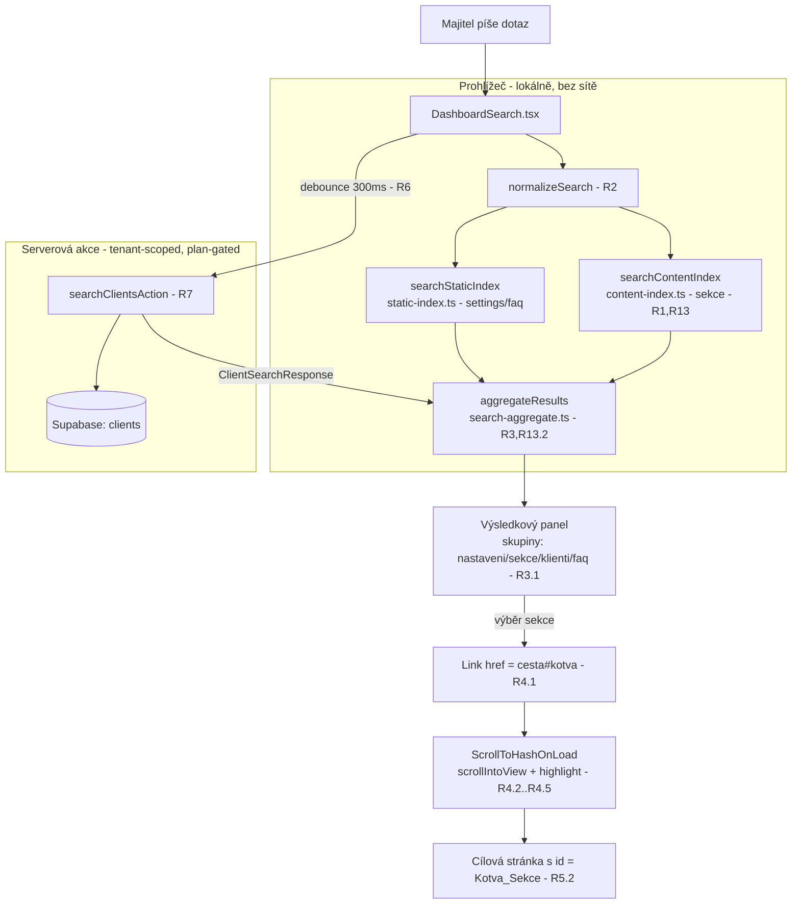

# Návrh: Fulltextové vyhledávání v dashboardu (dashboard-fulltext-search)

## Overview

Tento návrh popisuje **rozšíření (refine) stávajícího vyhledávání** v hlavičce dashboardu majitele,
nikoli jeho přepis. Staví na současné architektuře (rozbalovací pole + výsledkový panel se
seskupenými výsledky, statický index Nastavení/FAQ, dynamické vyhledávání klientů přes serverovou
akci) a doplňuje tři nové schopnosti:

1. **Index obsahu (Index_Obsahu)** — deklarativní registr sekcí stránek dashboardu majitele
   (nadpis + popis + cesta + kotva), který se prohledává **lokálně v prohlížeči** a doplňuje novou
   skupinu výsledků `sekce`. (R1, R5, R13)
2. **Navigace a odscrollování na sekci (Kotva_Sekce)** — výběr výsledku ze skupiny `sekce` naviguje
   na `cesta#kotva` a po vykreslení cílové stránky sekci odscrolluje do viewportu, nastaví fokus a
   přechodné vizuální zvýraznění. (R4, R5)
3. **Klávesová navigace + přístupnost (a11y)** — procházení plochého seznamu viditelných výsledků
   šipkami se zvýrazněním a potvrzením klávesou Enter. (R11)

Stávající chování zůstává zachováno: porovnávání bez ohledu na diakritiku a velikost písmen (R2),
seskupené výsledky a skrývání prázdných skupin (R3), debounce a race-handling klientů (R6),
gating dle tarifu / tenant izolace / `locked` / `unauthorized` (R7), minimální délka dotazu (R8),
zpožděný stav „Nic nenalezeno" (R9), otevírání/zavírání panelu (R10) a viditelnost jen pro roli
owner (R12).

### Klíčová designová rozhodnutí (mapování na požadavky)

| Rozhodnutí | Volba | Požadavky |
|---|---|---|
| Jak udržovat index obsahu | Deklarativní TS registr (jediný zdroj pravdy), prohledávaný lokálně | R1, R5, R13.1 |
| Jak zajistit kotvy | Surgical přidání `id` na existující nadpisy/sekce + sdílená konvence | R5 |
| Jak odscrollovat po navigaci | Klientský efekt `ScrollToHashOnLoad` (App Router nezaručuje auto-scroll po client navigaci) | R4 |
| Jak agregovat výsledky | Čisté funkce v `src/lib/search/` (index search + aggregation), UI jen vykresluje | R3, R13.2 |
| Klávesová navigace | Plochý index viditelných výsledků + `aria-activedescendant` | R11 |

## Architecture

### Zdrojová architektura (zachována a rozšířena)

Vyhledávání zůstává **agregátorem nad více zdroji**. Přidává se třetí lokální zdroj
(Index_Obsahu → skupina `sekce`) vedle stávajícího statického indexu a klientského zdroje.



### Tok dat (data-flow)

1. Uživatel píše → `query` (debounce se týká jen klientského zdroje, R6.1).
2. Při `trimmed.length >= SEARCH_MIN_QUERY_LENGTH` (R8) se synchronně a lokálně spočítají
   `staticResults` a `sectionResults` (R13.1).
3. Paralelně běží debounced `searchClientsAction` (R6), jejíž odpověď řídí stav `clients`
   (výsledky / `locked` / `unauthorized` / `error`, R7).
4. `aggregateResults` sloučí zdroje do seskupené struktury v pořadí `nastavení → sekce → klienti →
   faq`, ořízne `sekce` na max 6 (R13.2) a vynechá prázdné skupiny (R3.2).
5. UI vykreslí panel a udržuje **plochý index** viditelných výsledků pro klávesovou navigaci (R11).
6. Výběr výsledku `sekce` naviguje na `cesta#kotva`; `ScrollToHashOnLoad` po vykreslení cílové
   stránky odscrolluje a zvýrazní sekci (R4).

### Rozhodnutí: deklarativní registr vs. build-time extrakce

**Zvoleno: deklarativní TypeScript registr** (`src/lib/search/content-index.ts`) jako jediný zdroj
pravdy, klíčovaný cestou stránky; každá sekce má stabilní `anchor`, `title` a volitelný
`description`.

- **Pro:** žádná build-time infrastruktura; čitelné a snadno reviewovatelné; testovatelné jako čistá
  data; konzistence s vykreslenými `id` se dá ověřit testem (kotvy registru ⊆ skutečná `id`);
  prohledávání je triviálně lokální (R13.1).
- **Proti:** registr a stránky se musí udržovat synchronně ručně. Toto riziko zmírňujeme
  (a) sdílenou konvencí kotev a (b) testem párujícím registr proti renderovaným `id` (R5).

**Zvážená alternativa: build-time extrakce** nadpisů ze zdroje stránek (např. AST/regex přes
`page.tsx`). Zamítnuto: stránky jsou složené z mnoha klientských/serverových komponent a formulářů
(viz `settings/page.tsx`, kde sekce vykreslují `ProfileInfoForm` apod.), takže spolehlivá extrakce
nadpisů by vyžadovala křehkou heuristiku napříč komponentami. Pro tento codebase je deklarativní
registr pragmatičtější a předvídatelnější.

### Rozhodnutí: proč klientský scroll efekt

App Router po **klientské** navigaci nezaručuje automatické odscrollování na `#hash` (na rozdíl od
úvodního načtení dokumentu prohlížečem). Proto je potřeba malý klientský efekt
`ScrollToHashOnLoad`, který po vykreslení cílové stránky najde element dle `location.hash`, zavolá
`scrollIntoView`, nastaví fokus (pro čtečky) a přidá přechodnou třídu zvýraznění. Efekt respektuje
`prefers-reduced-motion` (vypne plynulý scroll) a chybějící kotvu řeší tiše (R4.5).

## Components and Interfaces

### 1) `src/lib/search/content-index.ts` (NOVÝ — Index_Obsahu)

Deklarativní registr sekcí + čistá vyhledávací funkce.

```typescript
import type { SearchResult } from './types';
import { normalizeSearch } from './static-index';

/** Jedna sekce stránky dashboardu — Záznam_Sekce (R1, R5). */
export type SectionRecord = {
  /** Stabilní anchor id, jednoznačné v rámci jedné stránky (R5.1). */
  anchor: string;
  /** Text nadpisu sekce (povinný). */
  title: string;
  /** Text popisu sekce (volitelný, R1.3). */
  description?: string;
};

/** Registr klíčovaný cestou cílové stránky dashboardu majitele (R1.1). */
export type ContentIndex = Record<string, SectionRecord[]>;

export const CONTENT_INDEX: ContentIndex = {
  '/dashboard/settings': [
    { anchor: 'profil-podniku', title: 'Profil podniku', description: 'Název, popis, kontakt a adresa' },
    { anchor: 'obrazky-profilu', title: 'Obrázky profilu', description: 'Logo a fotky podniku' },
    { anchor: 'socialni-site', title: 'Sociální sítě', description: 'Odkazy na profily' },
    { anchor: 'nastaveni-rezervaci', title: 'Nastavení rezervací' },
  ],
  // … services, reservations, clients, opening-hours, subscription,
  //   plans, analytics, employees, faq, account
};

/**
 * Prohledá Index_Obsahu lokálně (R13.1). Porovnává normalizovaný dotaz proti
 * normalizovanému nadpisu a popisu (R1.2, R1.3, R2.1). Vrací výsledky skupiny `sekce`
 * s href ve tvaru `cesta#anchor` (R4.1). Limit aplikuje až agregace (R13.2).
 */
export function searchContentIndex(query: string): SearchResult[];
```

### 2) `src/lib/search/search-aggregate.ts` (NOVÝ — agregace a seskupení)

Čistá funkce, kterou UI použije místo vlastní seskupovací logiky. Centralizuje pořadí skupin,
ořezání a skrývání prázdných skupin (testovatelné bez Reactu).

```typescript
import type { SearchGroup, SearchResult } from './types';

/** Stav skupiny klienti odvozený z odpovědi serveru (R7). */
export type ClientsState =
  | { kind: 'results'; results: SearchResult[] }
  | { kind: 'locked' }
  | { kind: 'unauthorized' }
  | { kind: 'error' }
  | { kind: 'idle' };

export type AggregateInput = {
  settings: SearchResult[];
  sections: SearchResult[];
  clients: ClientsState;
  faq: SearchResult[];
};

/** Jedna skupina k vykreslení; `locked` nese info o uzamčení místo výsledků (R3.2, R7.2). */
export type RenderGroup = {
  group: SearchGroup;
  results: SearchResult[];
  locked: boolean;
};

/** Maximální počet výsledků skupiny `sekce` (R13.2). */
export const SECTION_RESULT_LIMIT = 6;

/**
 * Sloučí zdroje do seřazených skupin v pořadí nastavení → sekce → klienti → faq (R3.1),
 * ořízne `sekce` na SECTION_RESULT_LIMIT (R13.2) a vynechá skupiny bez výsledků i bez
 * informace o uzamčení (R3.2). Skupina `klienti` ve stavu `locked` zůstává viditelná.
 */
export function aggregateResults(input: AggregateInput): RenderGroup[];

/** Plochý seznam výběrově dostupných výsledků (pořadí dle skupin) pro klávesovou navigaci (R11). */
export function flattenResults(groups: RenderGroup[]): SearchResult[];
```

### 3) `src/components/dashboard/ScrollToHashOnLoad.tsx` (NOVÝ — odscrollování na sekci)

Malá klientská komponenta montovaná v dashboard shellu (`DashboardChrome`), aby běžela na všech
stránkách majitele.

```typescript
'use client';
/**
 * Po vykreslení / změně cesty: pokud je v URL `#hash`, najde element s tímto id,
 * odscrolluje ho do viewportu (R4.2), nastaví fokus a přechodné zvýraznění (R4.4).
 * - Respektuje `prefers-reduced-motion` (behavior 'auto' místo 'smooth').
 * - Pokud kotva neexistuje, neudělá nic a nezobrazí chybu (R4.5).
 * - Reaguje na změnu `usePathname()`/hash, takže funguje i pro in-page výběr bez reloadu (R4.3).
 */
export function ScrollToHashOnLoad(): null;
```

Mechanismus zvýraznění: přidání třídy `data-search-target` / utility (přechodný outline v
`--color-action-violet`, zhasne po ~1,5 s) + `el.setAttribute('tabindex','-1')` a `el.focus()` pro
orientaci čtečky. Highlight i fokus jsou bezpečné a neměnné pro layout.

### 4) Konvence kotev sekcí (Kotva_Sekce) — surgical

Bez nové těžké komponenty. Konvence: **na existující nadpis/obal sekce přidat `id` rovné `anchor`
z registru** (R5.2). Volitelný tenký helper pro čitelnost:

```typescript
// src/components/dashboard/Section.tsx (volitelné, jen scroll-margin pro pevnou hlavičku)
export function Section({ id, children, className }: {
  id: string; children: React.ReactNode; className?: string;
}) {
  // scroll-mt kvůli sticky headeru výšky 64px, aby nadpis nebyl schovaný pod topbarem
  return <section id={id} className={`scroll-mt-20 ${className ?? ''}`}>{children}</section>;
}
```

Na stránkách se použije buď `<Section id="profil-podniku">…</Section>`, nebo přímo
`id="profil-podniku"` na stávajícím `Card as="section"` / nadpisu. Změny jsou aditivní (jen `id`).

### 5) `src/components/dashboard/DashboardSearch.tsx` (UPRAVENÝ)

Zachovává stávající strukturu (rozbalovací pole, click-outside/Escape, ARIA combobox/listbox,
debounce klientů). Změny:

- Přidat lokální zdroj `sections = searchContentIndex(trimmed)` (R1, R13.1).
- Nahradit ad-hoc seskupení voláním `aggregateResults(...)` a iterací přes `RenderGroup[]` (R3).
- Přidat **klávesovou navigaci** (R11): stav `activeIndex` nad `flattenResults(groups)`:
  - `ArrowDown`/`ArrowUp` posouvají `activeIndex` (s wrap-around), nastavují `aria-activedescendant`.
  - `Enter` aktivuje zvýrazněný výsledek (stejná navigace jako klik); když není nic zvýrazněno
    (`activeIndex === -1`), Enter nic neudělá (R11.3, R11.4, R11.5).
  - Každá `<li>` má `role="option"`, stabilní `id`, `aria-selected={index === activeIndex}`.
- Výběr výsledku zavře panel (R10.4) a u `sekce` naviguje na `href = cesta#anchor` (R4.1); pro
  in-page cíl scroll zařídí `ScrollToHashOnLoad` (R4.3).

### 6) Wiring

- `DashboardChrome.tsx`: přidat `<ScrollToHashOnLoad />` (jen owner shell), aby scroll fungoval po
  navigaci na cílové stránky.
- `DashboardHeader.tsx` / `showSearch={variant === 'owner'}`: beze změny — drží viditelnost dle role
  (R12). Žádná cesta nevykresluje `DashboardSearch` pro admina.

## Data Models

### Rozšíření `src/lib/search/types.ts`

```typescript
// Přidat skupinu `sekce` (R3.1).
export type SearchGroup = 'settings' | 'sections' | 'clients' | 'faq';

// SearchResult zůstává beze změny tvaru:
export type SearchResult = {
  id: string;
  group: SearchGroup;
  title: string;
  subtitle?: string;
  href: string; // pro `sections` má tvar `cesta#anchor`
};

// Štítky skupin — doplnit `sections` (R3.1). Pořadí zobrazení řídí agregace, ne tento objekt.
export const SEARCH_GROUP_LABELS: Record<SearchGroup, string> = {
  settings: 'Nastavení',
  sections: 'Sekce',
  clients: 'Klienti',
  faq: 'Nápověda',
};
```

`ClientSearchResponse` a `SEARCH_MIN_QUERY_LENGTH` zůstávají beze změny.

### Záznam_Sekce (`SectionRecord`) a `ContentIndex`

Viz `content-index.ts` výše. Invarianty dat:

- `anchor` je neprázdný a **jednoznačný v rámci jedné cesty** (R5.1).
- `title` je neprázdný; `description` je volitelný (R1.1, R1.3).
- href výsledku skupiny `sections` = `${path}#${anchor}` (R4.1).

### Mapování skupina ↔ zdroj

| Skupina | Zdroj | Lokální? |
|---|---|---|
| `settings` | `searchStaticIndex` (static-index.ts) | ano |
| `sections` | `searchContentIndex` (content-index.ts) | ano (R13.1) |
| `clients` | `searchClientsAction` (server) | ne (R6, R7) |
| `faq` | `searchStaticIndex` (static-index.ts) | ano |

## Correctness Properties

*Vlastnost (property) je charakteristika nebo chování, které musí platit napříč všemi platnými
běhy systému — formální tvrzení o tom, co má systém dělat. Vlastnosti tvoří most mezi
lidsky čitelnou specifikací a strojově ověřitelnými zárukami správnosti.*

Vlastnosti cílí na **čisté funkce** v `src/lib/search/` (`normalizeSearch`, `safeNormalize`,
`searchContentIndex`, `aggregateResults`, gate a navigační helpery). Časování, DOM scroll, ARIA
renderování a serverový gating/izolace jsou ověřeny integračními / příkladovými testy (viz Testing
Strategy), protože nevariují smysluplně se vstupem nebo testují externí prostředí.

Po reflexi byly sloučeny redundantní vlastnosti: indexace + diakritika do jedné matching property;
výstup normalizace + idempotence do jedné; obě strany gatingu délky dotazu do jedné; ekvivalence
aktivace klávesou s prázdným stavem do jedné.

### Property 1: Normalizace je bez diakritiky, malými písmeny a idempotentní

*Pro libovolný* řetězec `s` platí, že `normalizeSearch(s)` neobsahuje žádný velký znak ani žádné
kombinační diakritické znaménko (U+0300–U+036F) a zároveň `normalizeSearch(normalizeSearch(s)) ===
normalizeSearch(s)`.

**Validates: Requirements 2.2, 2.3**

### Property 2: Bezpečná normalizace má fallback na nenormalizovaný text

*Pro libovolný* řetězec `s` platí, že `safeNormalize(s)` nikdy nevyhodí výjimku; pokud podkladová
normalizace selže (vyhodí), vrátí nezměněný vstup `s`, jinak vrátí normalizovaný tvar.

**Validates: Requirements 2.4**

### Property 3: Vyhledávání v Index_Obsahu je necitlivé na diakritiku a velikost písmen

*Pro libovolný* registr sekcí a libovolnou sekci v něm: je-li dotaz odvozen z nadpisu nebo popisu
té sekce a libovolně pozměněn ve velikosti písmen či diakritice, pak `searchContentIndex(dotaz)`
obsahuje výsledek odpovídající dané sekci. Sekce bez popisu se matchuje pouze přes nadpis.

**Validates: Requirements 1.2, 1.3, 2.1**

### Property 4: Agregace zachovává pořadí skupin a skrývá prázdné skupiny

*Pro libovolnou* kombinaci vstupních výsledků a stavu klientů vrací `aggregateResults` skupiny vždy
v pořadí `settings → sections → clients → faq`; skupina bez výsledků a bez stavu `locked` se ve
výstupu neobjeví, zatímco skupina `clients` ve stavu `locked` ve výstupu zůstane.

**Validates: Requirements 1.4, 3.1, 3.2**

### Property 5: Skupina `sekce` je omezena na nejvýše 6 výsledků

*Pro libovolný* počet shod ve zdroji sekcí vrací `aggregateResults` ve skupině `sections` nejvýše
`SECTION_RESULT_LIMIT` (6) výsledků.

**Validates: Requirements 13.2**

### Property 6: Výsledek sekce odkazuje na cestu doplněnou o kotvu

*Pro libovolnou* cestu a libovolný `SectionRecord` v registru platí, že odpovídající výsledek
skupiny `sections` má `href` přesně ve tvaru `${cesta}#${anchor}`.

**Validates: Requirements 4.1**

### Property 7: Kotvy jsou jednoznačné v rámci jedné stránky

*Pro libovolnou* cestu v Index_Obsahu jsou hodnoty `anchor` všech jejích `SectionRecord` navzájem
různé (žádné duplicity v rámci jedné cesty).

**Validates: Requirements 5.1**

### Property 8: Vyhledávání se spouští právě od minimální délky dotazu

*Pro libovolný* dotaz `q` platí, že `shouldSearch(q)` je `true` právě tehdy, když má `q` po
ořezání bílých znaků délku alespoň `SEARCH_MIN_QUERY_LENGTH`; je-li `false`, lokální zdroje vracejí
prázdný výsledek a klientský zdroj se nedotazuje.

**Validates: Requirements 8.1, 8.2**

### Property 9: Klávesová navigace zůstává v rozsahu viditelných výsledků

*Pro libovolný* neprázdný plochý seznam viditelných výsledků délky `n` a libovolnou posloupnost
stisků `ArrowDown`/`ArrowUp` zůstává aktivní index vždy v rozsahu `[0, n-1]` a každý krok posune
zvýraznění právě o jednu pozici (s přetočením na opačný konec).

**Validates: Requirements 11.1**

### Property 10: Aktivace klávesou Enter je ekvivalentní kliknutí

*Pro libovolný* plochý seznam viditelných výsledků a libovolný aktivní index platí: je-li index
platný (`0 <= index < n`), vrátí `resolveActivation(seznam, index)` přesně tentýž výsledek (a tedy
stejný cíl navigace) jako kliknutí na něj; je-li index `-1` (nic zvýrazněno), vrátí `null` a žádná
navigace neproběhne.

**Validates: Requirements 11.3, 11.4, 11.5**

## Error Handling

| Situace | Chování | Požadavek |
|---|---|---|
| Normalizace vyhodí / není dostupná | `safeNormalize` zachytí a porovnává s raw textem; vyhledávání nespadne | R2.4 |
| Klientský zdroj vrátí `error` | Skupina `clients` se nezobrazí (žádné výsledky, není `locked`); zbytek panelu funguje | R3.2, R7 |
| Klientský zdroj vrátí `locked` | Skupina `clients` zobrazí hlášku o vyšším tarifu místo výsledků | R7.1, R7.2 |
| Klientský zdroj vrátí `unauthorized` | Skupina `clients` se nezobrazí; ostatní zdroje (lokální) fungují dál | R7.5 |
| Zastaralá odpověď klientů (race) | `cancelled` flag výsledek zahodí, pokud dotaz už neodpovídá | R6.2 |
| Kotva na cílové stránce neexistuje | `ScrollToHashOnLoad` neprovede scroll, nevyhodí chybu, stránka se zobrazí | R4.5 |
| Žádný zdroj nevrátí výsledek (a není `locked`) | Hláška „Nic nenalezeno." se zpožděním 300 ms (anti-flicker) | R9.1 |
| Dotaz pod minimální délkou | Panel skrytý, žádné dotazy na zdroje | R8.1 |
| Enter bez zvýrazněného výsledku | Žádná navigace | R11.4 |

Zásady: lokální vyhledávání (settings/sections/faq) je nezávislé na klientském zdroji — selhání
serverové akce nesmí shodit ani zablokovat lokální výsledky. Serverová akce nikdy nevyhazuje ven;
chyby mapuje na `ClientSearchResponse` (`error`/`locked`/`unauthorized`).

## Testing Strategy

### Dvojí přístup

- **Property-based testy** (čistá logika v `src/lib/search/`): univerzální vlastnosti P1–P10.
- **Příkladové / integrační testy**: UI interakce, časování (debounce, anti-flicker), DOM scroll,
  ARIA, serverový gating/izolace a konzistence registru s vykreslenými `id`.

PBT je vhodné, protože jádro feature jsou čisté funkce (normalizace, matching, agregace, gate,
navigační helpery) s velkým vstupním prostorem. PBT **není** vhodné pro časování, DOM/scroll, ARIA
render a serverovou akci závislou na Supabase — ty pokrývají integrační a příkladové testy.

### Knihovna a konfigurace PBT

- Použít **fast-check** (sladěno se stávajícím `pbt-smoke.test.ts`), nevytvářet vlastní PBT od nuly.
- Každý property test běží **minimálně 100 iterací** (`{ numRuns: 100 }`).
- Každý property test je otagován komentářem odkazujícím na vlastnost z tohoto dokumentu, formát:
  `// Feature: dashboard-fulltext-search, Property {číslo}: {text vlastnosti}`.
- Každá vlastnost P1–P10 je implementována **jediným** property testem.

### Generátory

- Řetězce vč. diakritiky a Unicode (pro P1–P3): `fc.string()` rozšířené o sadu českých znaků
  (á, č, ř, š, ž, ě, …) a varianty velikosti písmen.
- `SectionRecord` / registr (P3, P5, P6, P7): generátor sekcí s/bez `description`, unikátními
  i kolidujícími anchory pro ověření detekce duplicit.
- `AggregateInput` (P4, P5): náhodné kombinace skupin a stavů klientů (`results`/`locked`/
  `unauthorized`/`error`/`idle`).
- Plochý seznam + posloupnost kláves (P9, P10): `fc.array(...)` + `fc.array(fc.constantFrom('up','down'))`.

### Příkladové a integrační testy (ne-PBT)

- **Normalizace existujícího chování**: parita s `normalizeSearch` v `static-index.ts`.
- **DashboardSearch (render/interakce)**: rozbalení + fokus (R10.1), klik mimo (R10.2),
  Escape (R10.3), výběr zavře panel (R10.4), ARIA role/stavy (R11.2), zobrazení nadpis/popis
  a fallback na popis (R3.3, R3.4), locked hláška (R7.2), klientské výsledky ve skupině (R6.3).
- **Časování (fake timers)**: debounce 300 ms a race (R6.1, R6.2), anti-flicker „Nic nenalezeno"
  300 ms (R9.1).
- **ScrollToHashOnLoad (JSDOM)**: scrollIntoView na správný element po navigaci (R4.2), in-page
  bez reloadu (R4.3), fokus/zvýraznění (R4.4), chybějící kotva bez chyby (R4.5),
  respekt `prefers-reduced-motion`.
- **Konzistence registru ↔ render (integrace)**: pro reprezentativní stránky ověřit, že pro každý
  `anchor` v `CONTENT_INDEX[cesta]` existuje element s tímto `id` (R1.1, R5.2, R5.3).
- **Serverová akce `searchClientsAction`**: `locked` bez funkce (R7.1), tenant izolace (R7.3),
  limit ≤ 6 (R7.4), `unauthorized` bez usera (R7.5).
- **Viditelnost dle role**: owner → search přítomen (R12.1); admin/`showSearch=false` → nepřítomen
  (R12.2, R12.3).

### Příkazy

- `pnpm test:run` (unit + property + integrace), `pnpm lint`.
- `pnpm build` pro změny v App Router / shell wiringu.
- Případně `pnpm test:e2e` pro reálné odscrollování po navigaci (R4.2).
