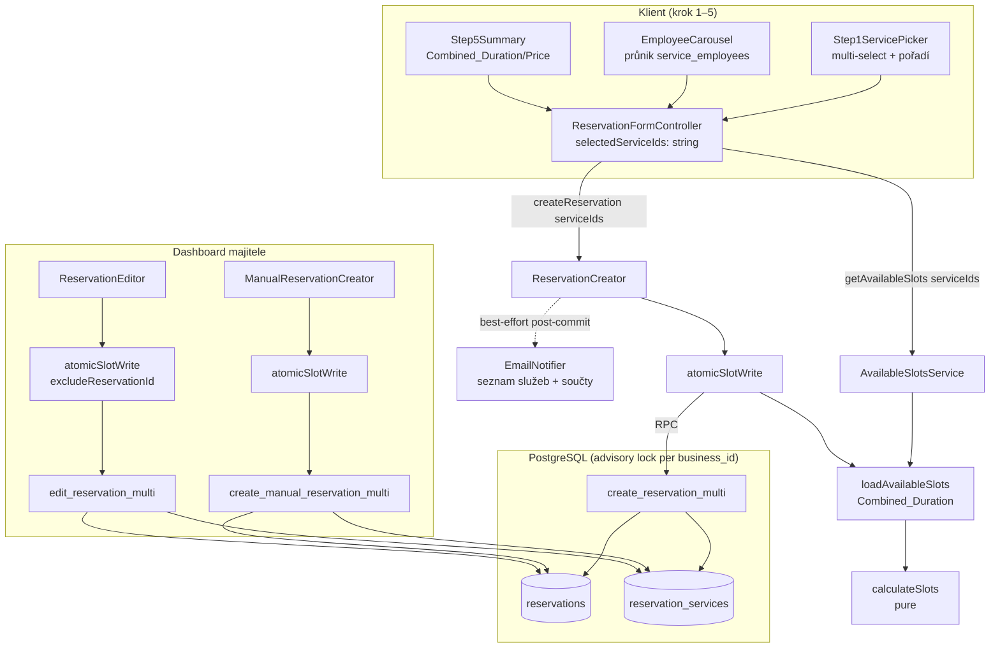

# Design Document

## Overview

Tato feature rozšiřuje rezervaci z **jedné služby** na **uspořádanou množinu služeb** v jednom souvislém časovém bloku jedné návštěvy (scénář A). Klíčová invarianta: po zavedení je každá rezervace `Multi_Service_Reservation`, přičemž existující jednoslužbová rezervace je její mezní případ s množinou velikosti 1.

Návrh vychází ze skutečného kódu projektu Horea a zachovává jeho ověřené vzory:

- **Atomicita přes plpgsql SECURITY DEFINER RPC pod `pg_advisory_xact_lock(hashtext(business_id))`** (migrace `0015`, `0021`). Skutečný zámek a overlap re-check žijí v DB, ne v TypeScriptu — Supabase JS klient neumí držet jednu transakci přes víc volání (viz komentář v `src/lib/reservations/atomicSlotWrite.ts`).
- **Sdílený orchestrátor `atomicSlotWrite`** mezi `ReservationCreator`, `ManualReservationCreator` a `ReservationEditor`: pre-lock grid re-check přes `loadAvailableSlots` (`Slot_Calculator`) → delegovaný atomický DB zápis.
- **Čistá funkce `calculateSlots`** (`src/lib/slots/calculator.ts`) zůstává beze změny algoritmu; mění se pouze vstupní `service.durationMinutes`, kterou nově plníme hodnotou `Combined_Duration`.
- **Best-effort post-commit e-maily a upsert klienta** (selhání nesmí rollbacknout rezervaci, R16.4, R16.5).
- **Multi-tenancy / RLS na `business_id`** (architektura R1), čeština / Kč / Europe/Prague v UI a UTC v DB (R17).

Hlavní změny:

1. Nová join tabulka `reservation_services` jako zdroj pravdy o množině služeb rezervace, se snapshotem délky a ceny a s pořadím (`position`). Migrace `0049` s backfillem z `reservations.service_id`.
2. Nové atomické RPC `create_reservation_multi`, `create_manual_reservation_multi`, `edit_reservation_multi` (přijímají `p_service_ids uuid[]`), které autoritativně počítají `Combined_Duration` v SQL pod zámkem.
3. Rozšíření server vrstvy (`ReservationCreator`, `ManualReservationCreator`, `ReservationEditor`, `loadAvailableSlots`, `AvailableSlotsService`) o množinu služeb a kombinovanou délku.
4. Klient: krok 1 multi-select se zachováním pořadí, průběžný `Combined_Duration` / `Combined_Price`, průnik zaměstnanců, krok 5 souhrn.
5. Zobrazení: veřejný souhrn, detail v dashboardu, transakční e-maily, CSV export.

### Klíčová návrhová rozhodnutí

- **`reservation_services` je zdroj pravdy; `reservations.service_id` zůstává jako denormalizovaný „primary" (první služba).** Nedeprecujeme ho v této feature. Důvod: minimalizace rizika ve sdílené produkční DB — existující dotazy, FK, `ON DELETE CASCADE` a single-service kód dál fungují beze změny. `service_id` = `position = 0` služba. Skutečné deprecation (drop sloupce) je samostatná pozdější migrace, až bude veškerý čtecí kód migrovaný na `reservation_services`.
- **`Combined_Duration` počítá autoritativně SQL pod zámkem** ze `services` (ne TS-předaná hodnota). Tím se vyhneme divergenci, kdyby se délka služby změnila mezi pre-lock fetchem a zápisem. TS si počítá jen *provizorní* kombinovanou délku pro pre-lock grid check.
- **Nové RPC s novými názvy místo změny signatury stávajících** (`create_reservation` apod.). Lekce z migrací `0019`/`0020`/`0021`: přetížení / změna signatury sdílené funkce vede k PostgREST nejednoznačnosti kandidátů (PGRST203) a rozbití veřejné cesty. Stávající single-service funkce ponecháme nedotčené.
- **Snapshot délky a ceny** v `reservation_services` zajišťuje, že `Combined_Duration` / `Combined_Price` historických rezervací zůstanou stabilní i po pozdější změně ceníku služby (R7.5).

## Architecture

### Vrstvy a tok dat



### Atomický zápis (kritická sekce)

Zachováváme dvoufázový vzor z `atomicSlotWrite`:

1. **Pre-lock grid re-check** (TS): `loadAvailableSlots` s `Combined_Duration` ověří, že vybraný čas je v aktuálním `Available_Slot_List`. Pokud ne → `409` + aktualizovaný list, RPC se vůbec nevolá.
2. **Atomický DB zápis** (plpgsql, jedna transakce):
   - `pg_advisory_xact_lock(hashtext(business_id))` — serializace per podnik,
   - ověření publikovanosti (jen veřejná cesta),
   - validace počtu služeb v rozsahu `[MIN, MAX]` = `[1, 10]`,
   - ověření, že **všechny** `service_id` patří podniku,
   - autoritativní výpočet `Combined_Duration = SUM(services.duration_minutes)` a `ends_at = starts_at + Combined_Duration`,
   - overlap re-check `tstzrange(starts_at, ends_at) && tstzrange(r.starts_at, r.ends_at)` proti aktivním rezervacím (u editu s vyloučením sebe sama),
   - insert řádku `reservations` + všech řádků `reservation_services` (se snapshotem a `position`).

Funkce vrací rozlišovací příznaky (`conflict`, `not_published`, `invalid`) místo výjimek — shodně se stávajícími funkcemi, kvůli snadnému mapování na HTTP kódy v TS.

### Konstanta limitů

`MIN_SERVICES_PER_RESERVATION = 1`, `MAX_SERVICES_PER_RESERVATION = 10` definujeme v jednom sdíleném modulu `src/lib/reservation/limits.ts` a používáme z klienta (krok 1), serveru (validace) i v komentáři SQL. Jediný zdroj pravdy zabrání rozjetí limitu mezi vrstvami.

## Components and Interfaces

### Datová / DB vrstva

**Migrace `0049_reservation_services.sql`** (detail v Data Models):
- vytvoří tabulku `reservation_services`,
- backfill z existujících `reservations`,
- RLS politiky,
- nové RPC `create_reservation_multi`, `create_manual_reservation_multi`, `edit_reservation_multi`.

### `loadAvailableSlots` (úprava)

`src/server/slots/loadAvailableSlots.ts` — rozšíření vstupu o množinu služeb a výpočet kombinované délky:

```ts
export type LoadAvailableSlotsParams = {
  businessId: string;
  /** Uspořádaná množina služeb; délka = součet jejich duration_minutes. */
  serviceIds: string[];
  dateISO: string;
  excludeReservationId?: string;
  requirePublished?: boolean;
};
```

- Načte `duration_minutes` pro **všechny** `serviceIds` jedním dotazem (`.in('id', serviceIds).eq('business_id', businessId)`).
- Pokud kterákoli služba chybí / nepatří podniku → vrátí `[]` (R6.4 i defenzivní R7.1).
- Pokud `serviceIds` je prázdné → vrátí `[]` (R6.4).
- `Combined_Duration = Σ duration_minutes` se předá do `calculateSlots` jako `service.durationMinutes`. Algoritmus `calculateSlots` zůstává beze změny.

### `atomicSlotWrite` (úprava)

`src/lib/reservations/atomicSlotWrite.ts` — `serviceId: string` → `serviceIds: string[]`; předává se do `loadAvailableSlots`. Logika orchestrace beze změny.

### `ReservationCreator` (úprava)

`src/server/ReservationCreator.ts`:
- `CreateReservationInput.serviceId: string` → `serviceIds: string[]`.
- Po validaci kontaktu: ověří `1 ≤ serviceIds.length ≤ 10` (R5.2, R5.3) s českými hláškami „Vyberte alespoň jednu službu" / „Najednou lze vybrat nejvýše 10 služeb".
- Načte vybrané služby (pro provizorní `Combined_Duration` do pre-lock checku a pro e-maily) a ověří, že všechny patří podniku.
- Volá `create_reservation_multi` přes `atomicSlotWrite` s `serviceIds` a `p_starts_at` (ends_at počítá SQL).
- E-maily: `dispatchEmails` dostane **seznam služeb** v uloženém pořadí + `Combined_Duration` + `Combined_Price` (rozšíření payloadu `EmailNotifier`).

### `ManualReservationCreator` (úprava)

`src/server/ManualReservationCreator.ts`: stejné rozšíření na `serviceIds`, stejné rozsahové omezení (R5.4), volá `create_manual_reservation_multi` (status vždy `approved`, bez e-mailu klientovi).

### `ReservationEditor` (úprava)

`src/server/ReservationEditor.ts`:
- `EditReservationInput.serviceId: string` → `serviceIds: string[]`.
- Stejné rozsahové omezení (R9.6).
- Volá `edit_reservation_multi` přes `atomicSlotWrite` s `excludeReservationId` (vyloučení sebe sama, R9.5).
- `Combined_Duration` / `Combined_Price` / `ends_at` přepočítá SQL z nového `Reservation_Service_Set`.
- `Reservation_Modified_Email` po commitu se seznamem služeb a součty.

### Klient — `ReservationFormController`

`src/components/reservation/ReservationFormController.tsx`:
- `selectedServiceId: string | null` → `selectedServiceIds: string[]` (pořadí = pořadí výběru).
- `Combined_Duration` / `Combined_Price` jako `useMemo` nad vybranými službami; přepočet při každé změně (R2.3, R3.2).
- Fetch slotů klíčovaný `serviceIds.join(',')|date`.
- Výběr zaměstnance: `serviceEmployees` se vyhodnotí jako **průnik** přes vybrané služby; při změně výběru, kdy vybraný zaměstnanec už neumí všechny služby, se výběr zruší (R8.3).
- Přechod z kroku 1 dál povolen jen při `length ≥ 1` (R1.5).

### Klient — `Step1ServicePicker`

`src/components/reservation/Step1ServicePicker.tsx`:
- `selectedServiceId` → `selectedServiceIds: string[]`, `onToggle(serviceId)`.
- Toggle: nevybraná služba → přidat na konec (R1.2); vybraná → odebrat (R1.3).
- Limit: při pokusu přidat 11. službu zobrazí hlášku „Najednou lze vybrat nejvýše 10 služeb" a přidání odmítne (R1.6).
- Vizuální pořadové číslo u vybraných služeb (UX pořadí).
- Průběžný souhrn `Combined_Duration` / `Combined_Price` pod seznamem (cena 0 Kč se nezobrazuje, R3.3, R1.4).

### Zobrazovací vrstva

- **`Step5Summary`** a veřejný souhrn: seznam služeb v pořadí (název + délka), `Combined_Duration`, `Combined_Price` (skryté při 0 Kč), jeden časový blok v Europe/Prague (R12).
- **Detail rezervace v dashboardu**: načítá `reservation_services(position, service_id, duration_minutes_snapshot, price_czk_snapshot, services(name))` seřazené dle `position`; zobrazí seznam, součty, blok a `Assigned_Employee` (R13).
- **`EmailNotifier` / šablony**: payload rozšířen o `services: { name, durationMinutes }[]`, `combinedDurationMinutes`, `combinedPriceCzk` (R16).
- **`CsvExporter`** (`src/server/CsvExporter.ts`): select rozšířen o `reservation_services(position, price_czk_snapshot, duration_minutes_snapshot, services(name))`; sloupec `service_name` = názvy spojené ` + ` v pořadí `position`; nové sloupce `combined_duration_minutes`, `combined_price_czk`. Filtr služby zahrne rezervaci, pokud kterákoli služba v `Reservation_Service_Set` odpovídá filtru (R14.3).

## Data Models

### Tabulka `reservation_services`

```sql
create table public.reservation_services (
  reservation_id uuid not null
    references public.reservations (id) on delete cascade,
  service_id uuid not null
    references public.services (id) on delete cascade,
  position int not null,
  duration_minutes_snapshot int not null check (duration_minutes_snapshot > 0),
  price_czk_snapshot numeric(10, 2) not null check (price_czk_snapshot >= 0),
  primary key (reservation_id, position),
  unique (reservation_id, service_id),
  check (position >= 0)
);

create index reservation_services_reservation_id_idx
  on public.reservation_services (reservation_id);
create index reservation_services_service_id_idx
  on public.reservation_services (service_id);
```

- **PK `(reservation_id, position)`** vynucuje jedinečné pořadí v rámci rezervace.
- **`unique (reservation_id, service_id)`** brání dvojímu výskytu téže služby (konzistentní s toggle sémantikou kroku 1).
- **`on delete cascade` na `reservation_id`** → hard delete rezervace odstraní i řádky množiny (R10.3).
- **`on delete cascade` na `service_id`** zachovává stávající chování (hard delete služby kaskáduje na navázané rezervace přes `reservations.service_id`); snapshot délky/ceny zůstává jen v případech, kdy služba existuje. Pozn.: názvy služeb pro zobrazení/CSV se čtou joinem na `services`, shodně se stávajícím `CsvExporter`.
- **Snapshoty** `duration_minutes_snapshot` a `price_czk_snapshot` jsou autoritativní pro `Combined_Duration` / `Combined_Price` historické rezervace (R7.5, R11.3).

### Vztah k `reservations`

- `reservations.service_id` zůstává `NOT NULL` a ukazuje na službu s `position = 0` (denormalizovaný „primary"). Žádný drop v této migraci.
- `Combined_Duration(reservation) = Σ reservation_services.duration_minutes_snapshot`.
- `Combined_Price(reservation) = Σ reservation_services.price_czk_snapshot`.
- `reservations.ends_at = reservations.starts_at + Combined_Duration`.

### RLS politiky

```sql
alter table public.reservation_services enable row level security;

-- Majitel čte řádky přes navázanou rezervaci svého podniku (mirror tenant_isolation).
create policy reservation_services_owner_read on public.reservation_services
  for select using (
    exists (
      select 1 from public.reservations r
      join public.businesses b on b.id = r.business_id
      where r.id = reservation_services.reservation_id
        and b.owner_user_id = auth.uid()
    )
  );
```

Zápis (`insert`/`update`/`delete`) probíhá výhradně přes SECURITY DEFINER RPC volané service-role klientem (žádná zapisovací politika pro anon/authenticated, shodně s `reservations` a `service_employees`).

### Backfill (součást migrace `0049`)

```sql
insert into public.reservation_services
  (reservation_id, service_id, position, duration_minutes_snapshot, price_czk_snapshot)
select r.id, r.service_id, 0, s.duration_minutes, s.price_czk
from public.reservations r
join public.services s on s.id = r.service_id
on conflict do nothing;
```

Idempotentní (`on conflict do nothing`) — bezpečné při opakovaném běhu na sdílené DB.

### Nové RPC (signatury)

```sql
-- Veřejná cesta: status dle auto_approve.
create function public.create_reservation_multi(
  p_business_id uuid,
  p_service_ids uuid[],   -- uspořádané, pořadí = position
  p_starts_at timestamptz,
  p_client_name text,
  p_client_phone text,
  p_client_email text,
  p_note text
) returns table (
  reservation_id uuid,
  status public.reservation_status,
  conflict boolean,
  not_published boolean,
  invalid boolean         -- počet mimo [1,10] nebo služba nepatří podniku
);

-- Ruční (majitel): status vždy 'approved'.
create function public.create_manual_reservation_multi(
  p_business_id uuid, p_service_ids uuid[], p_starts_at timestamptz,
  p_client_name text, p_client_phone text, p_client_email text, p_note text
) returns table (reservation_id uuid, conflict boolean, not_published boolean, invalid boolean);

-- Editace: přepočet a náhrada celé množiny, vyloučení sebe sama.
create function public.edit_reservation_multi(
  p_reservation_id uuid, p_business_id uuid, p_service_ids uuid[], p_starts_at timestamptz
) returns table (updated boolean, conflict boolean, invalid boolean);
```

Vnitřní logika (společný vzor):

1. `pg_advisory_xact_lock(hashtext(p_business_id::text))`.
2. (veřejná/manual) `is_business_published` → jinak `not_published`.
3. `array_length(p_service_ids, 1)` musí být v `[1, 10]` a bez duplicit → jinak `invalid`.
4. Všechny `p_service_ids` musí patřit podniku (`count(*) = array_length` po joinu na `services` s `business_id`) → jinak `invalid` (R7.1, R9.4, R15.2).
5. `Combined_Duration := (select sum(duration_minutes) from services where id = any(p_service_ids))`; `v_ends_at := p_starts_at + (Combined_Duration || ' minutes')::interval`.
6. (pokud `allow_parallel_slots = false`) overlap re-check `tstzrange(p_starts_at, v_ends_at) && tstzrange(r.starts_at, r.ends_at)` proti aktivním rezervacím (`status in ('pending','approved')`); edit navíc `r.id != p_reservation_id` → jinak `conflict`.
7. (edit) `delete from reservation_services where reservation_id = p_reservation_id`.
8. `insert into reservations (...)` resp. `update` s `service_id = p_service_ids[1]`, `starts_at`, `ends_at = v_ends_at`, `status`.
9. `insert into reservation_services` přes `unnest(p_service_ids) with ordinality as u(service_id, ord)` join `services` → `position = ord - 1`, snapshoty z aktuálních `services`.

Pořadí výběru se do SQL přenáší pořadím prvků v `p_service_ids` a materializuje přes `with ordinality` (R4.1, R4.2). Funkce mají `revoke all ... from public; grant execute ... to service_role` shodně se stávajícími.

## Correctness Properties

*Vlastnost (property) je charakteristika nebo chování, které musí platit napříč všemi validními běhy systému — formální tvrzení o tom, co má software dělat. Vlastnosti tvoří most mezi lidsky čitelnou specifikací a strojově ověřitelnými zárukami korektnosti.*

Vlastnosti vznikly z prework analýzy akceptačních kritérií a po reflexi byly konsolidovány tak, aby každá nesla jedinečnou ověřovací hodnotu. Sumační, pořadové a rozsahové vlastnosti pokrývají i zpětnou kompatibilitu jednoslužbových rezervací (mezní případ `n = 1`), protože generátory zahrnují velikost množiny od 1.

### Property 1: Combined_Duration je součet délek

*Pro libovolnou* neprázdnou uspořádanou množinu služeb je `Combined_Duration` rovna součtu `duration_minutes` všech jejích služeb (včetně mezního případu jediné služby).

**Validates: Requirements 2.1, 2.3, 9.2, 11.3, 15.3**

### Property 2: Combined_Price je součet cen

*Pro libovolnou* neprázdnou uspořádanou množinu služeb je `Combined_Price` rovna součtu `price_czk` všech jejích služeb (včetně mezního případu jediné služby).

**Validates: Requirements 3.1, 3.2, 9.2, 11.3, 15.3**

### Property 3: ends_at = starts_at + Combined_Duration

*Pro libovolný* počáteční čas `starts_at` a neprázdnou množinu služeb platí, že zapsané `ends_at` se rovná `starts_at` plus `Combined_Duration` v minutách.

**Validates: Requirements 2.2, 9.2, 15.2**

### Property 4: Zachování pořadí služeb (round-trip)

*Pro libovolnou* uspořádanou množinu služeb platí, že po zápisu rezervace a následném načtení `Reservation_Service_Set` seřazeného dle `position` je pořadí služeb shodné s pořadím výběru a pozice tvoří souvislou řadu `0..n-1`.

**Validates: Requirements 1.2, 4.1, 4.2, 4.3, 12.1, 13.1, 15.1**

### Property 5: Korektnost toggle výběru služeb

*Pro libovolnou* posloupnost toggle akcí nad seznamem služeb platí: `Selected_Service_List` neobsahuje duplicity, výběr dosud nevybrané služby ji přidá na konec a opětovný výběr téže služby ji odebere (dvojí toggle téže služby je identita).

**Validates: Requirements 1.1, 1.2, 1.3**

### Property 6: Přijetí závisí jen na rozsahu počtu služeb

*Pro libovolný* počet `n` validních služeb téhož podniku je rezervace (na veřejné, ruční i editační cestě) z hlediska rozsahu přijata právě tehdy, když `MIN_SERVICES_PER_RESERVATION ≤ n ≤ MAX_SERVICES_PER_RESERVATION` (tj. `1 ≤ n ≤ 10`); jinak je odmítnuta validační chybou.

**Validates: Requirements 1.5, 1.6, 5.1, 5.2, 5.3, 5.4, 9.6**

### Property 7: Cizí služba způsobí odmítnutí

*Pro libovolnou* množinu služeb platí, že pokud obsahuje alespoň jednu službu, která nepatří danému podniku (nebo neexistuje), je celá operace odmítnuta jako neplatná a nevznikne žádná rezervace ani řádek `Reservation_Service_Set`.

**Validates: Requirements 7.1, 9.4**

### Property 8: Atomicita a vyloučení překryvu při vytvoření

*Pro libovolnou* sadu existujících aktivních rezervací (`status` v `{pending, approved}`) a kandidátní blok `[starts_at, starts_at + Combined_Duration)` při `allow_parallel_slots = false` platí: jestliže vytvoření uspěje, blok se nepřekrývá s žádnou aktivní rezervací a vloží se přesně `|Reservation_Service_Set|` řádků; jestliže blok koliduje, operace je odmítnuta a nevznikne žádný částečný zápis (rezervace ani žádný řádek množiny).

**Validates: Requirements 6.3, 7.2, 7.3, 15.2, 15.5**

### Property 9: Atomicita editace s vyloučením sebe sama

*Pro libovolnou* upravovanou rezervaci a libovolnou sadu ostatních aktivních rezervací platí: overlap re-check vylučuje původní interval upravované rezervace (překryv se sebou samou není konflikt), úspěšná editace nezpůsobí překryv s žádnou *jinou* aktivní rezervací a po editaci `Reservation_Service_Set` obsahuje přesně novou množinu služeb bez zbytků po předchozí množině.

**Validates: Requirements 9.3, 9.5**

### Property 10: Stabilita snapshotu délky a ceny

*Pro libovolnou* množinu služeb platí, že `duration_minutes_snapshot` a `price_czk_snapshot` uložené v `Reservation_Service_Set` se rovnají hodnotám služby v okamžiku zápisu a nezmění se pozdější úpravou ceníku služby.

**Validates: Requirements 7.5**

### Property 11: Nabídka zaměstnanců je průnik přes vybrané služby

*Pro libovolné* mapování služba → zaměstnanci a libovolný výběr služeb je množina nabídnutých `Assigned_Employee` rovna průniku zaměstnanců přes všechny vybrané služby, přičemž služba bez řádku v `Service_Employees` se chová jako „umí ji všichni zaměstnanci"; je-li dříve vybraný zaměstnanec mimo tento průnik, jeho výběr se zruší.

**Validates: Requirements 8.2, 8.3**

### Property 12: Hard delete kaskáduje na množinu služeb

*Pro libovolnou* rezervaci platí, že po jejím hard delete neexistují žádné navázané řádky `Reservation_Service_Set`.

**Validates: Requirements 10.3**

### Property 13: CSV spojuje názvy služeb oddělovačem " + "

*Pro libovolnou* uspořádanou množinu služeb je hodnota pole názvu služeb v CSV řádku rovna názvům služeb spojeným řetězcem `" + "` (mezera-plus-mezera) v pořadí dle `position`.

**Validates: Requirements 14.1**

### Property 14: CSV filtr služby je test neprázdného průniku

*Pro libovolnou* rezervaci a libovolný filtr služeb je rezervace zahrnuta do exportu právě tehdy, když je její `business_id` rovno podniku majitele a zároveň průnik jejího `Reservation_Service_Set` s vyfiltrovanými službami je neprázdný (resp. filtr služeb není aktivní).

**Validates: Requirements 14.2, 14.3, 14.4**

### Property 15: Transakční e-mail obsahuje všechny služby a součty

*Pro libovolnou* rezervaci obsahuje vyrenderovaný `Reservation_Confirmation_Email` i `Reservation_Notification_Email` názvy všech služeb v uloženém pořadí, `Combined_Duration` a `Combined_Price`.

**Validates: Requirements 16.1, 16.2**

### Property 16: Backfill jednoslužbové rezervace

*Pro libovolnou* existující jednoslužbovou rezervaci vytvoří backfill přesně jeden řádek `Reservation_Service_Set` s `position = 0`, jehož `service_id` odpovídá původnímu `reservations.service_id`.

**Validates: Requirements 11.1**

## Error Handling

Chybové stavy se mapují konzistentně se stávajícím kódem (rozlišovací příznaky z RPC → HTTP-like kódy v server actions, nikoli výjimky):

| Stav | Zdroj | Kód | Hláška (čeština) |
|------|-------|-----|------------------|
| Prázdný / příliš velký výběr | TS validace + RPC `invalid` | 400 | „Vyberte alespoň jednu službu" / „Najednou lze vybrat nejvýše 10 služeb" |
| Neplatná kontaktní pole | `reservationContactSchema` | 400 | hláška ze schématu |
| Podnik nepublikovaný / nenalezen | RPC `not_published` | 404 | „Tento podnik aktuálně nepřijímá rezervace." |
| Některá služba nepatří podniku | RPC `invalid` | 404 / 409 | „Vybraná služba již není dostupná." (create) / „Tento termín není dostupný" (edit) |
| Slot obsazen (pre-lock i pod zámkem) | grid re-check / RPC `conflict` | 409 | „Tento termín byl právě obsazen, vyberte prosím jiný" + aktualizovaný `Available_Slot_List` |
| Chybí service-role klíč | `createAdminClient` | 500 | „Rezervaci se nepodařilo odeslat, zkuste to prosím znovu." |
| Selhání e-mailu / logu | post-commit | — | best-effort: zaloguje se (bez PII), rezervace zůstává zachována (R16.4, R16.5) |

Zásady:

- **Žádný částečný zápis.** Insert `reservations` + `reservation_services` i náhrada množiny při editu běží v jediné transakci RPC pod advisory lockem; konflikt nebo neplatnost vede k rollbacku celé transakce (R7.3, R9.4).
- **Konflikt vrací čerstvý `Available_Slot_List`** spočtený s `Combined_Duration`, aby klient mohl rovnou nabídnout jiný čas.
- **Best-effort post-commit operace** (e-maily, upsert klienta) nikdy nehází a nemohou rollbacknout již vytvořenou rezervaci; jejich selhání se jen zaloguje bez PII (R16.4, R16.5, architektura R13/R18).
- **Defenzivní prázdné výstupy:** `loadAvailableSlots` vrací `[]` pro prázdnou nebo nevalidní množinu služeb (R6.4) místo vyhazování.

## Testing Strategy

Projekt používá **Vitest** + **fast-check** (`@fast-check/vitest`, `fast-check` v `package.json`) pro unit a property testy a **Playwright** pro e2e. Tato feature je vhodná pro property-based testing: jádro tvoří čisté funkce a invarianty (sumace délky/ceny, pořadí, rozsah, množinové operace, atomicita interval-overlapu).

### Property-based testy

- **Knihovna:** `fast-check` (nepsat generátory/runner od nuly).
- **Iterace:** minimálně **100** běhů na každou vlastnost (`{ numRuns: 100 }` nebo více).
- **Tagování:** každý property test ponese komentář ve formátu
  `// Feature: multi-service-reservations, Property {N}: {text vlastnosti}`.
- **Implementace:** každá vlastnost = právě jeden property test.
- **Umístění:** čisté vlastnosti v `src/lib/**/__tests__/*.property.test.ts` (vzor stávajícího `src/lib/slots/__tests__/calculator.property.test.ts`); vlastnosti vyžadující DB v `tests/properties/`.

Mapování vlastností na testovací strategii:

| Vlastnost | Úroveň | Poznámka |
|-----------|--------|----------|
| P1, P2 (sumace) | čistá funkce | `combinedDuration` / `combinedPrice` helper nad seznamem služeb |
| P3 (ends_at) | čistá funkce + integrace | výpočet v TS i ověření v RPC |
| P4 (pořadí round-trip) | integrace (DB) | zápis přes RPC → načtení `reservation_services` |
| P5 (toggle reducer) | čistá funkce | extrahovaný reducer výběru z controlleru |
| P6 (rozsah) | čistá funkce | sdílená validace `validateServiceCount` |
| P7 (cizí služba) | integrace (DB) | RPC vrací `invalid` |
| P8 (atomicita create) | integrace (DB) | souběžné/sekvenční inserty proti generovaným rezervacím |
| P9 (atomicita edit + self-exclusion) | integrace (DB) | edit s vyloučením sebe sama |
| P10 (snapshot) | integrace (DB) | změna ceníku po zápisu nemění snapshot |
| P11 (průnik zaměstnanců) | čistá funkce | `employeesForSelection(mapping, selection)` |
| P12 (cascade delete) | integrace (DB) | FK `on delete cascade` |
| P13 (CSV join) | čistá funkce | `joinServiceNames` |
| P14 (CSV filtr) | čistá funkce / integrace | predikát zahrnutí; doplňuje stávající `tests/integration/csv-scope.test.ts` |
| P15 (obsah e-mailu) | čistá funkce | render šablony nad generovaným seznamem služeb |
| P16 (backfill) | integrace (DB) | ověření po spuštění migrace `0049` |

### Unit testy (příklady a edge-case)

Doplňkové k property testům, zaměřené na konkrétní příklady a hraniční stavy:

- 0 Kč cena se v souhrnu/kroku 1 nezobrazuje; cena > 0 ano (R1.4, R3.3, R12.3).
- Prázdný seznam služeb → hláška „Tento podnik zatím nemá žádné rezervovatelné služby" (R1.7).
- `serviceIds = []` → `loadAvailableSlots` vrací `[]` (R6.4).
- `n = 0` a `n = 11` → konkrétní české hlášky (R5.2, R5.3); `n = 1`, `n = 10` hraniční přijetí.
- `auto_approve` true/false → `approved`/`pending` (R7.6); ruční rezervace vždy `approved` bez e-mailu klientovi (R15.4).
- UTC ukládání `starts_at`/`ends_at`, zobrazení v Europe/Prague (R7.4, R12.4, R13.3, R16.3, R17.3).
- Best-effort: mock selhání e-mailu i logu → rezervace zůstává zachována (R16.4, R16.5).

### E2E testy (Playwright)

Rozšíření stávajících scénářů (`e2e/reservation-happy-path.spec.ts`, `e2e/edit-flow.spec.ts`, `e2e/manual-creation.spec.ts`):

- Výběr více služeb v kroku 1 → průběžné součty → potvrzení → vytvořená kombinovaná rezervace s blokem rovným součtu délek.
- Editace množiny služeb v dashboardu s přepočtem a revalidací slotu.
- Ruční vytvoření kombinované rezervace majitelem.
- Zobrazení detailu kombinované rezervace a CSV export se spojenými názvy a součty.

### Verifikace

Dle `AGENTS.md`: pro doménovou/TS logiku `pnpm test:run` a `pnpm lint`; pro route/layout změny navíc `pnpm build` (když proveditelné); pro viditelné toky `pnpm test:e2e` nebo cílený Playwright test. Migrace `0049` se na sdílenou produkční DB nasazuje konzervativně (viz níže).

## Migrační a rollback strategie (sdílená produkční DB)

Migrace `0049_reservation_services.sql` je **aditivní** a navržená tak, aby běžela bez výpadku a byla bezpečně vratná:

1. **Aditivní DDL:** vytvoření tabulky `reservation_services`, indexů, RLS politik a nových RPC. Nemění se schéma `reservations` (sloupec `service_id` zůstává) ani stávající funkce `create_reservation` / `edit_reservation` / `create_manual_reservation` → starý i nový kód koexistují.
2. **Backfill `on conflict do nothing`** je idempotentní — opakovaný běh nic nerozbije a lze ho spustit i znovu po nasazení.
3. **Dry-run před push:** ověřit migraci proti stínové/lokální DB (`pnpm dlx supabase db diff` / lokální `supabase db reset`) a zkontrolovat plán; teprve poté `pnpm dlx supabase db push` na sdílenou DB. Spouštět mimo špičku.
4. **Pořadí nasazení:** nejdřív migrace (tabulka + RPC + backfill), až poté aplikační kód, který nové RPC volá. Díky aditivnosti běžící starý kód migraci přežije.
5. **Ověření po migraci:** počet řádků `reservation_services` = počet existujících rezervací s validním `service_id`; namátkově `Combined_Duration`/`Combined_Price` = původní jednoslužbové hodnoty (Property 16).

**Rollback:**

- **Aplikační vrstva:** revert na předchozí build (nové RPC zůstanou nevyužité, neškodí).
- **DB:** kompenzační migrace `drop function ... create_reservation_multi / create_manual_reservation_multi / edit_reservation_multi` a `drop table public.reservation_services`. Protože `reservations.service_id` zůstal zdrojem pravdy pro single-service cestu, drop tabulky neztratí data jednoslužbových rezervací. Skutečně kombinované rezervace (více než jedna služba) vzniklé po nasazení by ztratily služby `position > 0` — proto se před dropem doporučuje export `reservation_services` (pojistka). Drop sloupce `reservations.service_id` se v této feature **neprovádí**, čímž zůstává rollback levný a nízkorizikový.
