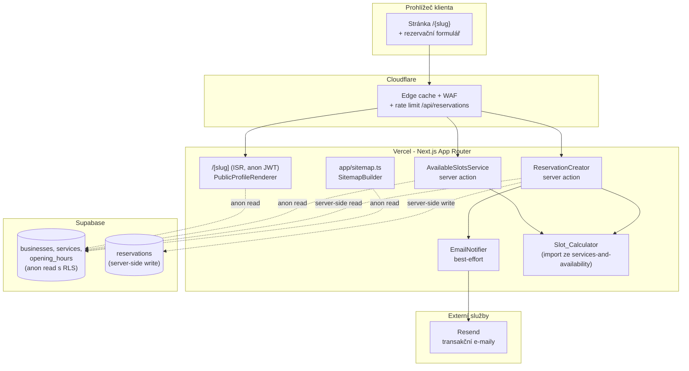
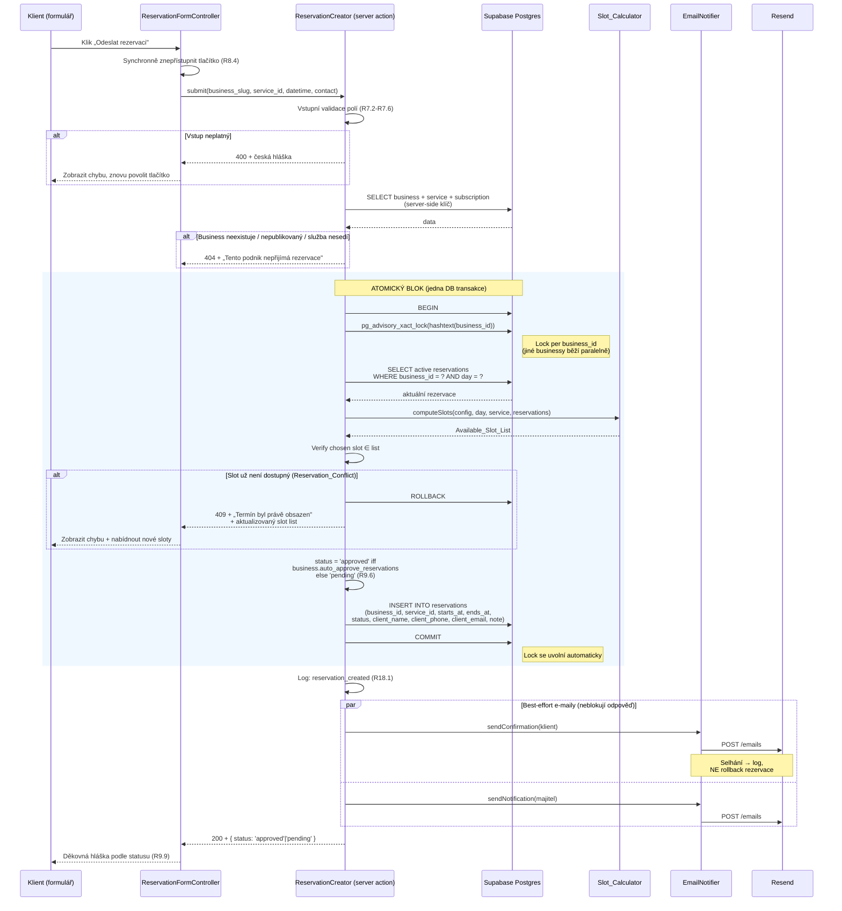

# Design: Veřejná stránka podniku

> Tento dokument navazuje na master architekturu v [`../architecture/design.md`](../architecture/design.md), na sdílený `Slot_Calculator` ze specu [`../services-and-availability/design.md`](../services-and-availability/design.md) a na požadavky v [`./requirements.md`](./requirements.md). Sdílenou infrastrukturu (Next.js App Router, Vercel, Supabase + RLS, Cloudflare, ISR, multi-tenancy přes `business_id`, principy error handlingu, vrstvy testování, GDPR) zde **neopisujeme** — pouze odkazujeme. Detail je v ADR-1 až ADR-7 a v sekcích *Reservation Logic*, *Security*, *Error Handling*, *Testing Strategy* master dokumentu.

---

## Overview

Feature `public-business-page` pokrývá **veřejnou stránku podniku** dostupnou na URL `https://www.mojerezervace.cz/{slug}` — tedy první (a často jediný) kontakt klienta s platformou. Zahrnuje vykreslení profilu (logo, název, popis, kontakty, otevírací doba, služby), pětikrokový rezervační formulář, server-side vytvoření rezervace s plnou revalidací invariantů a odeslání dvou potvrzovacích e-mailů (klientovi a majiteli). Doplňkově řeší SEO (meta tagy, Open Graph, JSON-LD, sitemap.xml) a tři stavy stránky (publikováno / nepublikováno / 404).

**Co je sdíleno z jiných specifikací (a tato feature to neopakuje):**

- **`Slot_Calculator`** ze specu `services-and-availability` — čistá funkce, jediný zdroj pravdy o dostupnosti slotů. Tato feature ji volá ve dvou kontextech (krok 2 formuláře a finální re-check při vytváření rezervace), ale **nenahrazuje** ji vlastní logikou.
- **ISR cache veřejné stránky** — invaliduje ji `Public_Page_Revalidator` ze specu `services-and-availability` při změně dat podniku. Tato feature pouze konzumuje výsledek (ISR rendering) a definuje fallback TTL.
- **Multi-tenancy přes RLS** podle `business_id` (ADR-5).
- **Cloudflare edge rate limit** na `/api/reservations` (architektura `tasks.md` úkol 5.4) — jediný anti-abuse mechanismus této feature v MVP.
- **Email infrastruktura přes Resend** (R13 architektury).
- **Slug normalizace** ze specu `auth-onboarding` — slugy jsou v DB uloženy **už v normalizovaném tvaru** (lowercase ASCII bez diakritiky, viz `normalizeSlug` v auth-onboarding/design.md). Tato feature na to staví routovací rozhodnutí.

**Co tato feature naopak přidává:**

- App Router routu `/[slug]` (ISR, public, anon Supabase klíč).
- Server actions pro načtení slotů (`AvailableSlotsService`) a vytvoření rezervace (`ReservationCreator`) — server actions, ne REST routy, kvůli vestavěné CSRF ochraně Next.js.
- Pětikrokový rezervační formulář jako jeden client component (`ReservationFormController`) s lokálním stavem.
- Atomické vytvoření rezervace s **Postgres advisory lock klíčovaným `business_id`** — chrání před race condition mezi dvěma souběžnými klienty na stejný slot.
- Best-effort dispatch dvou transakčních e-mailů (`EmailNotifier`).
- SEO vrstvu (`SeoMetadata` přes `generateMetadata` + JSON-LD inline) a `app/sitemap.ts` se seznamem publikovaných podniků.

Feature **nepokrývá**: dashboard rezervací, editaci služeb / otevírací doby, autentizaci, stavový automat předplatného, custom design / theming.

---

## Architecture

### Umístění feature v platformě

Feature žije plně uvnitř monolitické Next.js aplikace na Vercelu (ADR-6). Žádný nový externí systém, žádný nový cron, žádný nový webhook. Pouze dvě nové App Router skupiny: **veřejná routa `/[slug]`** (ISR, anon klíč) a **dvě server actions** pro slot lookup a vytvoření rezervace. Sdílený utility modul `Slot_Calculator` se importuje z balíčku patřícího specu `services-and-availability`.



### Routy

| Cesta | Typ | Účel |
|---|---|---|
| `/[slug]` | Server component, ISR | Veřejná stránka podniku. Tři stavy: publikovaný profil / nepublikováno / 404. |
| `/sitemap.xml` | Dynamická routa (`app/sitemap.ts`) | Seznam URL všech `Published_Business`. |
| `/robots.txt` | Statická + odkaz na sitemap | Standardní soubor — detail je triviální, řeší se jako součást implementace, ne v designu. |

**Server actions** (žijí v souborech vázaných na komponenty `/[slug]`, ne jako samostatné REST routy):

| Action | Volá | Účel |
|---|---|---|
| `AvailableSlotsService` (GET-like) | `ReservationFormController` v kroku 2 | Pro `(slug, date, service_id)` vrátí `Available_Slot_List`. |
| `ReservationCreator` (POST-like) | `ReservationFormController` v kroku 5 | Validuje vše znovu, drží advisory lock per `business_id`, atomicky vloží rezervaci a spustí dispatch e-mailů. |

**Proč server actions, ne REST routy:** Next.js App Router server actions mají vestavěnou CSRF ochranu (origin check, action ID jako proof) a fungují přes stejný HTTP transport jako route handlers. Pro tuto feature, kde formulář žije ve stejné Next.js aplikaci, nejsou route handlers nutné.

> **Poznámka k cestě v Cloudflare rate limit pravidle:** Architektura `tasks.md` úkol 5.4 hovoří o `/api/reservations`. Server action volaná z `/[slug]` se na úrovni HTTP jeví jako POST na cestu odpovídající té server action (Next.js generuje URL formátu `/{slug}` s hlavičkou `Next-Action`). Konkrétní path-pattern v Cloudflare WAF pravidle bude upraven tak, aby cílil na server action endpoint(y) místo (nebo vedle) `/api/reservations`. Tato úprava je provozní detail, ne změna designu — anti-abuse vrstva zůstává Cloudflare edge rate limit (jak vyžaduje R16).

### Klíče Supabase a kontexty

- **`/[slug]` rendering, `AvailableSlotsService`, `app/sitemap.ts`** — používají **anon Supabase JWT** (R15.3). RLS policy povoluje čtení `businesses`, `services`, `opening_hours`, `subscriptions.status` filtrovaně přes `is_published = true AND subscription.status IN ('active', 'grace_period')` pro veřejnou viditelnost. Pro 404/nepublikovaný profil potřebujeme zjistit existenci businessu i bez publikování — to řeší vlastní policy „read minimum: id, slug, is_published, owner_user_id" pro detekci stavu (publikováno / nepublikováno / 404).
- **`ReservationCreator`** — používá **server-side klíč** (service role v server kontextu, ne v klientském bundlu — R10.7, R15.4). Důvod: vícekrokové operace (re-validace, advisory lock, INSERT) musí běžet pod identitou, která má právo zapisovat do `reservations` a držet zámek per `business_id`. Klíč je dostupný **pouze v server kontextu** server action a NIKDY se neodesílá klientovi. Pokud server kontext není dostupný, `ReservationCreator` operaci kompletně **zablokuje** s českou hláškou (R15.5) — žádný fallback na anon klíč pro zápis.
- **`EmailNotifier`** — server-side, používá Resend API klíč ze server-side env.

### Závislosti na sdílené infrastruktuře

- **ISR cache** — viz sekce *ISR strategie* níže. Cache invalidaci provádí `Public_Page_Revalidator` ze specu `services-and-availability`.
- **Cloudflare edge rate limit** — jediný anti-abuse mechanismus rezervačního endpointu. Tato feature žádný další aplikační rate limit nezavádí (R16.2).
- **HTML sanitizace** uživatelských textových polí — sdílená utility (předpokládá se DOMPurify nebo ekvivalent). Aplikuje se v `PublicProfileRenderer` před vložením `business.description` a `service.description` do HTML (R1.7).

---

## Components and Interfaces

### PublicProfileRenderer

Server component vykreslující veřejnou stránku `/[slug]`. Zodpovídá za rozhodnutí o stavu stránky a vykreslení odpovídajícího HTML.

**Odpovědnosti:**

- Načte hodnotu `slug` z URL parametru a převede ji na lowercase (viz *404 vs nepublikovaný profil — pravidla rozhodování* níže).
- Načte `business` + `subscription` + `services` + `opening_hours` jedním až dvěma anon dotazy do Supabase.
- Rozhodne o stavu stránky:
  - **Publikovaný profil** → vykreslí logo (nebo zástupný vizuál), název, typ, popis, kontakty (jen vyplněná pole), otevírací dobu pro 7 dní, seznam služeb a vloží `ReservationFormController`.
  - **Nepublikovaný profil** → vykreslí pouze název podniku + českou hlášku „Tento podnik zatím nepublikoval svůj profil" + `<meta name="robots" content="noindex">`. HTTP 200.
  - **404** → vrátí `notFound()` (Next.js helper) → 404 stránka s českou hláškou + `noindex`.
- Před vložením `business.description` a `service.description` do HTML aplikuje HTML sanitizaci (R1.7).
- Volá `SeoMetadata.generateMetadata` (per Next.js konvence — `generateMetadata` je separátní export ze stejného route souboru) a inlinuje JSON-LD jen pro publikovaný profil.

**Klíčové vlastnosti:** Žádný stav, žádné I/O mimo počáteční DB read. Vše ostatní je klientská logika v `ReservationFormController` nebo server action.

### ReservationFormController

Client component držící stav pětikrokového formuláře. Plně klientský — žádná business logika, jen UX vrstva nad dvěma server actions.

**Stav (lokální, React state):**

- Aktuální krok (1–5).
- Vybraná služba, vybrané datum, vybraný čas, kontaktní údaje, poznámka.
- Available slot list pro aktuálně zvolené datum a službu (v paměti).
- Stav odesílání (idle / pending / error / success).

**Odpovědnosti:**

- Renderuje příslušný krok podle aktuálního stavu.
- V kroku 2 po výběru data volá `AvailableSlotsService` server action.
- V kroku 5 po kliknutí „Odeslat rezervaci" **synchronně znepřístupní tlačítko ještě před zahájením requestu** (R8.4) — proti duplicitnímu odeslání.
- Volá `ReservationCreator` server action a podle výsledku zobrazí buď děkovnou hlášku (R9.9), nebo chybu s českým textem.
- Klientská validace (R7.2 až R7.6) je pouze UX vrstva — server validuje znovu (R7.7).
- Při návratu na předchozí krok zachovává hodnoty ostatních kroků (R8.2).

**Co komponenta NEDĚLÁ:**

- Nevypočítává sloty sama — vždy volá `AvailableSlotsService`.
- Neukládá nic do localStorage / cookies — stav žije v paměti komponenty.
- Nedělá žádný přímý DB call.

### AvailableSlotsService

Server action volaná z kroku 2 formuláře. Tenký orchestrátor nad `Slot_Calculator`.

**Odpovědnosti:**

- Načte `business`, `service`, `opening_hours[day_of_week]` přes anon klíč.
- Načte aktivní rezervace (`status IN ('pending', 'approved')`) pro daný `business_id` a daný den jako seznam intervalů.
- Zavolá `Slot_Calculator(config, day, service, reservations)` (čistá funkce — viz services-and-availability).
- Vrátí seznam počátečních časů v lokálním čase Europe/Prague.

**Důvod, proč tenký orchestrátor:** veškerá doménová logika je v `Slot_Calculator`. Tato server action je pouze I/O most mezi DB a čistou funkcí. Jediná zodpovědnost navíc: defenzivně ověřit, že `service` patří k `business` (R9.2) a že business je `Published_Business` (R9.1) — pokud ne, vrátí prázdný seznam (klient v kroku 2 už profil nemůže legitimně vidět).

### ReservationCreator

Server action volaná z kroku 5 formuláře. **Kritický komponent této feature** — odpovídá za atomicitu vytvoření rezervace.

**Odpovědnosti:**

1. **Vstupní validace** všech polí (R7.2 až R7.6 znovu serverově) — formát jména, telefonu, e-mailu, délky polí.
2. **Kontextová validace:**
   - Server kontext dostupný (server-side klíč) — jinak R15.5 zablokovat.
   - `business` existuje a je `Published_Business` (R9.1).
   - `service` patří k tomuto businessu a stále existuje (R9.2).
3. **Atomický blok** v jediné DB transakci:
   - **Acquire Postgres advisory lock** klíčovaný `business_id` (`pg_advisory_xact_lock(hashtext(business_id))`) — drží se po dobu celé transakce a uvolní se na commit/rollback automaticky.
   - **Re-fetch** aktivních rezervací pro daný den a daný `business_id`.
   - **Recompute** `Available_Slot_List` přes `Slot_Calculator` (re-check podle R9.3).
   - **Verify**, že vybraný čas je v `Available_Slot_List`. Pokud ne → rollback + 409 + aktualizovaný slot list (R9.4).
   - **Insert** nový řádek do `reservations` s `status = 'approved'` právě když `business.auto_approve_reservations = true` v okamžiku zápisu, jinak `status = 'pending'` (R9.6). `starts_at` a `ends_at` v UTC (R17.4).
   - **Commit** transakce → automaticky uvolní lock.
4. **Post-commit best-effort dispatch:**
   - Zavolá `EmailNotifier.sendConfirmation(...)` (klientovi).
   - Zavolá `EmailNotifier.sendNotification(...)` (majiteli).
   - Selhání e-mailů **není rollback** rezervace (R10.3, R11.3, R14.2 architektury).
5. **Logování** úspěchu / odmítnutí (R18.1 až R18.3) bez citlivých údajů (R18.4).
6. Vrátí klientovi výsledek: úspěch s `status` rezervace nebo chybu s českou hláškou + HTTP 400/404/409 (R9.8).

**Důvod advisory locku per `business_id`:** Postgres unique constraint na slot není v MVP zaveden (numerická kapacita / paralela by ho komplikovala — R16 architektury). Advisory lock je **lehký zámek** držený jen po dobu transakce, klíčovaný hashí `business_id` — souběžné rezervace pro **stejný** business se serializují, souběžné rezervace pro **různé** businessy běží paralelně. To je správný kompromis: konflikty na slot existují jen v rámci jednoho businessu.

### EmailNotifier

Best-effort dispatcher dvou transakčních e-mailů. Nikdy neblokuje hlavní transakci.

**Odpovědnosti:**

- `sendConfirmation` — Reservation_Confirmation_Email klientovi (R10).
- `sendNotification` — Reservation_Notification_Email majiteli podniku (R11).
- Po úspěšném odeslání nic dalšího nedělá.
- Při selhání **chybu zaloguje** a operaci ukončí — nedělá rollback rezervace (R10.3, R11.3).
- Volá Resend SDK přes server-side API klíč (R13 architektury).
- E-mailové šablony viz sekce *E-mailové šablony* níže.

**Pozn.:** `EmailNotifier` v MVP **nezavádí retry frontu**. Master *Error Handling* zmiňuje `pending_emails` tabulku jako možnost — tato feature ji **nepoužívá**, protože selhání transakčního e-mailu z rezervace je v MVP přijatelné jako jednoduchý log + admin notifikace (provozovatel může e-mail klientovi v případě potřeby resendnout ručně). Retry fronta je vědomě odložena do v2.

### SeoMetadata

Implementuje Next.js `generateMetadata` export pro routu `/[slug]`. Plus inline JSON-LD `<script type="application/ld+json">` pro publikovaný profil.

**Odpovědnosti:**

- Pro **publikovaný profil** vrátí `<title>` ve tvaru „{název podniku} — rezervace online" (R12.1), `<meta name="description">` (prvních 155 znaků popisu), Open Graph tagy (`og:title`, `og:description`, `og:url`, `og:type=website`, volitelně `og:image`), kanonickou URL.
- Inline JSON-LD typu `LocalBusiness` (schema.org) s `name`, `url`, volitelnými `image`, `address`, `telephone`, `email` a `openingHoursSpecification` odvozenou z `opening_hours` (R12.3).
- Pro **nepublikovaný profil** a **404** vrátí jen `<meta name="robots" content="noindex">` a žádné JSON-LD (R12.4, R2.3, R3.3).

### SitemapBuilder

Implementuje `app/sitemap.ts` (Next.js dynamic sitemap konvence).

**Odpovědnosti:**

- Načte přes anon klíč všechny `Published_Business` (`is_published = true AND subscription.status IN ('active', 'grace_period')`).
- Pro každý záznam vyplní `loc = https://www.mojerezervace.cz/{slug}` a `lastmod = business.updated_at` v ISO 8601.
- **Vyloučí** `Unpublished_Business` a všechny systémové cesty (`/admin`, `/dashboard`, `/api`, `/login` atd. — ty jsou implicitně vyloučeny tím, že se sitemap generuje **jen z `businesses` tabulky**, neobsahuje všechny aplikační routy).
- Sitemap je revalidována Next.js cache stejným mechanismem jako `/[slug]` (ISR) — viz *ISR strategie* níže.

---

## Tok vytvoření rezervace

Sekvenční diagram detailně popisuje krok 5 formuláře — okamžik, kdy klient klikne „Odeslat rezervaci". Klíčový bod je **advisory lock**, který izoluje souběžné pokusy o stejný slot stejného businessu.



**Klíčové vlastnosti toku:**

- **Vstupní validace před lockem.** Neplatný vstup nikdy nezíská lock — chrání proti DoS přes opakované invalidní requesty držící lock.
- **Re-check pod lockem.** I když klient v kroku 2 viděl slot jako dostupný, pod lockem se vše počítá znovu z aktuálního stavu DB — mezi krokem 2 a krokem 5 mohl jiný klient slot obsadit.
- **Lock je transakční.** `pg_advisory_xact_lock` se uvolní automaticky při commit nebo rollback. Žádný explicit unlock, žádné riziko zaseklého locku při výjimce.
- **Lock klíčovaný `business_id`.** Souběžné rezervace pro různé businessy se neblokují — granularita je správná.
- **Best-effort e-maily mimo transakci.** E-maily se odesílají **až po commitu**. Selhání e-mailu nemůže způsobit rollback rezervace, protože transakce už skončila (R10.3, R11.3).

---

## 404 vs nepublikovaný profil

Stavy stránky se rozhodují deterministicky podle čtyř pravidel:

```mermaid
flowchart TD
    Start([URL /{slug}])
    Lower[slug_norm = slug.toLowerCase]
    Reserved{slug_norm ∈ RESERVED_SLUGS?}
    Lookup{Existuje business<br/>WHERE slug = slug_norm?}
    Pub{is_published = true<br/>AND subscription.status<br/>IN active, grace_period?}

    R404[HTTP 404<br/>+ noindex<br/>„Stránka nebyla nalezena"]
    Unpub[HTTP 200<br/>+ noindex<br/>jen název + hláška<br/>„Tento podnik zatím<br/>nepublikoval svůj profil"]
    Profile[HTTP 200<br/>plný profil<br/>+ JSON-LD + OG tagy]

    Start --> Lower
    Lower --> Reserved
    Reserved -- ano --> R404
    Reserved -- ne --> Lookup
    Lookup -- ne --> R404
    Lookup -- ano --> Pub
    Pub -- ne --> Unpub
    Pub -- ano --> Profile
```

### Pravidla rozhodování

1. **Slug normalizace na vstupu.** URL parametr je převeden na lowercase před DB lookupem. Slugy v DB jsou už normalizované (lowercase ASCII bez diakritiky — viz `auth-onboarding/design.md` *Slug Normalization*), takže jednoduchý `toLowerCase()` URL slugu stačí pro správné porovnání. **Důsledek:** `/Kavarna`, `/KAVARNA` i `/kavarna` se mapují na stejný business. Pokud business pro `kavarna` neexistuje, všechny tři dají stejný výsledek (404). Tím se vyhneme duplicitnímu obsahu (Google + canonical URL) a zlepšíme UX při kopírování URL ze sdílení.

2. **Reserved slug → 404.** Kontrola proti `RESERVED_SLUGS` (z auth-onboarding) musí proběhnout **před** DB lookupem. To zaručí, že kolize se systémovými cestami (např. `/admin`) se nikdy nemaskuje za business profil, i kdyby se v DB omylem ocitl řádek se slugem `admin` (R3.2).

3. **Business neexistuje → 404.** Žádný řádek v `businesses` se slugem rovným `slug_norm` znamená 404 s českou hláškou „Stránka nebyla nalezena" + `noindex` (R3.1, R3.3).

4. **Business existuje, ale není `Published_Business` → 200 nepublikováno.** Status 200 (ne 404) — z pohledu URL stránka existuje, jen nemá obsah k zobrazení. Vykreslí se **jen název podniku** + hláška + `noindex`. Žádný popis, žádné kontakty, žádná otevírací doba, žádný formulář (R2.1, R2.2, R2.3).

### Proč 200 místo 404 pro nepublikovaný profil

- Klient mohl URL získat z e-mailu / vizitky / SMS — 404 by působilo, jako by stránka nikdy neexistovala. Hláška „Tento podnik zatím nepublikoval svůj profil" vysvětluje situaci.
- Když podnik zaplatí předplatné a publikuje, URL **zůstává stejné** — žádné přesměrování, žádné porušené odkazy.
- `noindex` zabrání, aby se hláška indexovala — vyhledávač uvidí stránku až po publikování.

### Canonical URL

Aby se zabránilo duplicitnímu indexování při různém casingu URL, `SeoMetadata` vždy nastaví `<link rel="canonical">` na lowercase tvar (`https://www.mojerezervace.cz/{slug_norm}`). Open Graph `og:url` používá stejnou canonical hodnotu.

---

## ISR strategie

Veřejná stránka `/[slug]` je generována s **Incremental Static Regeneration**. Cache strategie kombinuje dva mechanismy:

1. **On-demand revalidation.** Po každé úspěšné CRUD operaci v `services-and-availability` (`Services_Manager`, `OpeningHours_Manager`, `Settings_Manager`) je zavolán `Public_Page_Revalidator.revalidatePath('/' + slug)`. Při dalším requestu Next.js přerendruje stránku s aktuálními daty. **Tato cesta je primární** — pokrývá ~99 % změn.

2. **Default revalidate timeout (60 s) jako fallback.** Routa `/[slug]` má v `export const revalidate = 60`. Důvod: pokud `Public_Page_Revalidator` z jakéhokoli důvodu selže (Next.js bug, deploy race, cache poisoning), data se nejpozději po 60 s sama obnoví. Hodnota 60 s je kompromis — krátká, aby zastaralá data nepřetrvávala dlouho, dostatečně dlouhá, aby ISR neselhával na free tier limity Vercelu při běžném provozu.

### Cache invalidace pro rezervace

**Nově vytvořená rezervace neinvaliduje veřejnou stránku.** `/[slug]` zobrazuje statická data podniku (logo, popis, služby, otevírací doba) — ne seznam rezervací. Available slot list se počítá **dynamicky** v `AvailableSlotsService` (server action volaná z formuláře), která **není ISR-cachovaná** — vždy čte aktuální stav. Tím je zaručeno, že čerstvě vytvořená rezervace je okamžitě reflektována v dostupných slotech bez potřeby revalidace stránky.

### Sitemap revalidation

`app/sitemap.ts` má vlastní `revalidate = 3600` (1 hodina). Sitemap se mění zřídka (přidání nového publikovaného podniku, odebrání) a vyhledávače ji indexují po hodinách až dnech — agresivnější TTL by jen plýtvalo Vercel function invocations.

---

## E-mailové šablony

Obě e-mailové šablony jsou v češtině, odesílané přes Resend ze sender domény platformy (např. `noreply@mojerezervace.cz`; konkrétní adresa je provozní detail mimo design). SPF/DKIM/DMARC pro tuto doménu zařizuje provozovatel platformy.

### Reservation_Confirmation_Email (klientovi, R10)

**Subject:** „Vaše rezervace — {název podniku}"

**Tělo (Markdown / HTML):**

- Pozdrav „Dobrý den, {jméno klienta},"
- Shrnutí: „rezervovali jste si v podniku **{název podniku}** službu **{název služby}** ({trvání} min, {cena} Kč) na **{datum}** v **{počáteční čas}** (čas Europe/Prague)."
- Stav rezervace:
  - **Pokud `pending`:** „Rezervace čeká na schválení podnikem. O výsledku Vás budeme informovat e-mailem."
  - **Pokud `approved`:** „Rezervace je potvrzena. Těšíme se na Vás."
- Patička: kontakt na podnik (telefon, e-mail — pokud jsou na profilu vyplněné), odkaz na veřejný profil podniku, generický disclaimer „E-mail byl odeslán automaticky platformou mojerezervace.cz na vyžádání podniku."

**Proměnné:** `client_name`, `business_name`, `service_name`, `service_duration_minutes`, `service_price_czk`, `reservation_date`, `reservation_time`, `status`, `business_phone?`, `business_email?`, `business_url`.

### Reservation_Notification_Email (majiteli, R11)

**Subject:** „Nová rezervace — {název služby}, {datum} {čas}"

**Tělo:**

- Pozdrav „Dobrý den,"
- Shrnutí: „nová rezervace na službu **{název služby}** ({trvání} min, {cena} Kč) na **{datum}** v **{počáteční čas}**."
- Stav: `pending` nebo `approved` (podle `auto_approve_reservations`).
- Kontaktní údaje klienta: jméno, telefon, e-mail.
- Poznámka klienta (pokud je vyplněna).
- Odkaz na dashboard rezervací (cesta v MVP řešená samostatným specem `reservation-management` — pro tuto šablonu je odkaz na `/dashboard/reservations`).
- Patička: „E-mail byl odeslán automaticky platformou mojerezervace.cz."

**Proměnné:** `business_name`, `service_name`, `service_duration_minutes`, `service_price_czk`, `reservation_date`, `reservation_time`, `status`, `client_name`, `client_phone`, `client_email`, `client_note?`, `dashboard_url`.

### Generování šablon

Šablony se renderují server-side v `EmailNotifier`. V MVP volíme jednoduchý přístup — šablony jako TSX/JSX komponenty (Resend podporuje `react-email`) nebo prosté template literals. Konkrétní knihovna je implementační detail; klíčové je, že šablony žijí **v kódu**, ne v DB (analogie s `RESERVED_SLUGS` constantou — změna textu = code change + deploy).

---

## Bezpečnost

Master *Security* sekce pokrývá obecná opatření (Cloudflare WAF, HTTPS, RLS, server-side validace, HMAC webhooky). Tato sekce popisuje **specifika této feature**:

### Server-side validace re-checkuje vše

Klientská validace v `ReservationFormController` (R7.2 až R7.6) je **pouze UX vrstva**. Server v `ReservationCreator` re-validuje **každý vstup znovu** (R7.7), nezávisle na tom, co klient odeslal. Pokud útočník obejde frontend (např. přímým voláním server action s neplatnými daty), server vstup odmítne s 400.

### Žádná business logika v klientovi

`ReservationFormController` nezná pravidla pro výpočet slotů, autoschvalování, advisory lock ani validaci publikovanosti. Všechna doménová pravidla žijí na serveru (`AvailableSlotsService`, `ReservationCreator`, `Slot_Calculator`). Klient je v této feature **prezentační vrstva**.

### CSRF přes Next.js server actions

Server actions v Next.js mají vestavěnou CSRF ochranu — origin check + action ID jako proof-of-form. Cookies jsou `SameSite=Lax` (Next.js default), což blokuje cross-site POST z jiné domény. Žádný custom CSRF token v této feature není potřeba.

### HTML sanitizace uživatelských textů

`business.description` a `service.description` jsou sanitizovány v `PublicProfileRenderer` před vložením do HTML (R1.7). React auto-escape řeší většinu případů (`{value}` v JSX je escapováno), ale pokud se kdekoli vykresluje raw HTML (např. pro Markdown popis služby ve v2), sanitizace je explicitní.

### Service role key NIKDY v klientském bundlu

`ReservationCreator` běží **pouze v server kontextu** (Next.js server action). Service role key je v `process.env.SUPABASE_SERVICE_ROLE_KEY`, který Next.js nikdy nezahrne do klientského bundlu (proměnné bez prefixu `NEXT_PUBLIC_`). R10.7 architektury + R15.4 této feature.

### Cloudflare jako jediný anti-abuse

Žádný aplikační rate limit per business / per phone / per e-mail (R16.2). Cloudflare edge rate limit (~10 req/IP/min na rezervační endpoint) je v MVP dostačující — frekvence rezervací jednoho legitimního klienta je o řády nižší. Pokud se v praxi objeví spam, řešení je v Cloudflare WAF, ne v aplikační vrstvě.

### Logy bez citlivých údajů

`ReservationCreator` loguje pouze `business_id`, `service_id`, `reservation_id` a typ události (R18.1 až R18.4). **Telefon, e-mail a poznámka klienta v logu nikdy nejsou.** Tato pravidla platí i pro `EmailNotifier` — selhání e-mailu loguje pouze `reservation_id` a Resend error code, ne adresu příjemce.

---

## Data Models

Feature **nepřidává žádnou novou tabulku**. Pracuje s existujícími tabulkami z master *Data Models*:

| Tabulka | Použití v této feature |
|---|---|
| `businesses` | **Read** (anon klíč pro veřejnou stránku, server-side klíč pro `ReservationCreator`). Sloupce: `id`, `slug`, `name`, `type`, `description`, `logo_url`, `phone`, `email`, `address`, `is_published`, `auto_approve_reservations`, `allow_parallel_slots`, `owner_user_id`, `updated_at`. |
| `subscriptions` | **Read.** Sloupec `status` pro rozhodnutí `Published_Business`. |
| `services` | **Read.** Sloupce: `id`, `business_id`, `name`, `duration_minutes`, `price_czk`, `description`, `created_at`. |
| `opening_hours` | **Read.** Sloupce: `day_of_week`, `opens_at`, `closes_at` (případně `is_closed`). |
| `reservations` | **Read** (`Slot_Calculator` čte aktivní rezervace) + **Write** (`ReservationCreator` insert). Sloupce zapisované: `business_id`, `service_id`, `starts_at` (UTC), `ends_at` (UTC), `status`, `client_name`, `client_phone`, `client_email`, `note`. |
| `users` | **Read.** Pouze přes join `businesses.owner_user_id → users.email` v `ReservationCreator` pro získání e-mailu majitele pro `Reservation_Notification_Email`. |

### Denormalizované kontaktní údaje klienta

`reservations` obsahuje sloupce `client_name`, `client_phone`, `client_email`, `note` přímo v řádku rezervace — žádný cizí klíč na `users` (R19 architektury, ADR-7). Důvod: klient je **anonymní** (nemá účet) a jeho kontaktní údaje patří k **dané rezervaci**, ne k identitě napříč podniky. Pokud podnik chce evidenci klientů per business (entita `clients`), upsert logika je předmětem specu `reservation-management` — tato feature pouze zapíše rezervaci s denormalizovanými údaji.

### RLS policies pro tuto feature

Master *Security* + ADR-5 stanovují obecný princip RLS přes `business_id`. Konkrétní policy potřebné pro tuto feature (mimo již existující):

- **Anon read na `businesses`, `services`, `opening_hours`** filtrované přes `is_published = true` AND join na `subscriptions.status IN ('active', 'grace_period')`. Plus rozšířená policy „read minimum" na `businesses` (jen `id`, `slug`, `is_published`) pro detekci nepublikovaného profilu při rendering rozhodnutí.
- **Anon read na `subscriptions`** omezený na sloupec `status` přes view, ne přímý read tabulky (subscriptions obsahují citlivé GoPay ID).
- **Anon NIKDY nesmí číst `reservations`** — slot list pro veřejnou stránku počítá `AvailableSlotsService` (anon → uvidí jen „kolik slotů je volných", konkrétní rezervace v response nikdy nejsou).
- **Insert na `reservations` je možný pouze pod server-side klíčem** — RLS policy pro anon je „deny insert".

> Konkrétní DDL policies a migrace patří do tasks.md, ne do tohoto designu.

---

## Correctness Properties

*Property je vlastnost nebo chování, které musí platit pro všechna validní spuštění systému — formální tvrzení o tom, co má systém dělat. Property slouží jako most mezi člověkem čitelnou specifikací a strojově ověřitelnými zárukami správnosti.*

Tato sekce formuluje vlastnosti, které musí platit pro **libovolné validní vstupy** napříč klíčovými komponentami této feature. Většina property se vztahuje na `ReservationCreator`, `SitemapBuilder` a routing rozhodnutí v `/[slug]`. Implementovány budou property-based testy s `fast-check` (TypeScript ekosystém — viz master *Testing Strategy* a soulad se specem `services-and-availability`). Komponenty čistě prezentační (rendering profilu, kroky 1, 2, 4, 5 formuláře, SEO šablony) se ověřují příkladovými / snapshot testy — viz sekce *Testing Strategy* níže.

> **Poznámka k duplikaci s `services-and-availability`:** Logika výpočtu slotů je formalizována jako property ve specu `services-and-availability` (Property 1–7 nad `Slot_Calculator`). Tato feature ji **neopakuje** — jen ji konzumuje. Property níže pokrývají atomicitu, validační totalitu a routing rozhodnutí, které jsou specifické pro veřejnou stránku.

### Reflexe a konsolidace property

Při tvorbě property jsme provedli reflexi a sloučili následující:

- **R9.1, R9.2, R9.3, R9.4, R9.5, R9.7** byly sjednoceny do **Property 2 (Reservation creation atomicity)**. Jednotlivá pravidla popisují různé aspekty stejného atomického bloku — testovat je odděleně by znamenalo testovat tři způsoby tutéž vlastnost. Property 2 pokrývá celý invariant: rezervace existuje v DB **právě tehdy**, když všechny pre-podmínky byly splněny pod lockem.
- **R10.3 a R11.3** byly sjednoceny do **Property 4 (Email best-effort)**. Selhání kteréhokoli z dvou e-mailů nesmí způsobit rollback rezervace — jeden test napříč oběma kanály.
- **R7.2 až R7.7** byly sjednoceny do **Property 5 (Server-side validation totality)**. R7.7 je meta-pravidlo, že server validuje vše, co klient validuje — sjednocením vznikne jeden test pokrývající všechny vstupy.
- **R13.2 a R13.3** byly sjednoceny do **Property 7 (Sitemap correctness)**. „Obsahuje publikované" a „neobsahuje nepublikované / systémové" jsou dvě strany stejné iff property.
- **R3.1 case dimension** byla povýšena na samostatnou **Property 1 (Slug case-insensitivity)** — pokrývá routing rozhodnutí napříč libovolnou casing variantou.
- **HTML sanitizace (R1.7)** je vlastností sdílené sanitization utility (mimo tuto feature) a property patří do specifikace té utility. V této feature stačí example test, že sanitizace je volaná před vložením do HTML.

### Property 1: Slug case-insensitivity

*For any* řetězec `s` a libovolnou permutaci jeho velikosti písmen `s'` (např. `kavarna`, `Kavarna`, `KAVARNA`, `KaVaRnA`), HTTP request na `/{s}` a HTTP request na `/{s'}` vrátí **identický stav stránky** — buď oba vrátí stejný publikovaný profil (s identickou canonical URL), nebo oba vrátí stejný nepublikovaný stav, nebo oba vrátí 404.

Důsledek: žádné case rozhodnutí v URL nemůže způsobit, že by jedna varianta našla business a jiná ne. Kanonickou URL používanou v `og:url` a `<link rel="canonical">` je vždy lowercase tvar.

**Validates: Requirements 3.1, 3.2** (a doplňující rozhodnutí o case-insensitivity)

### Property 2: Reservation creation atomicity

*For any* validní vstup formuláře (pro některý existující publikovaný business a jeho službu) a *for any* race scenario simulující, že mezi okamžikem výběru slotu klientem a okamžikem zápisu se stav rezervací změní:

- Pokud vybraný slot byl dostupný **v okamžiku verifikace pod advisory lockem** (`Slot_Calculator` ho vrátil v `Available_Slot_List`), `ReservationCreator` zapíše právě jednu rezervaci s odpovídajícími atributy.
- Pokud vybraný slot **nebyl** dostupný v okamžiku verifikace pod advisory lockem (Reservation_Conflict — jiný klient ho mezitím obsadil), `ReservationCreator` **nezapíše žádnou rezervaci** a vrátí 409 s českou hláškou + aktuální `Available_Slot_List`.

Klíčové: nikdy nenastane stav, kdy by se zapsala rezervace na slot, který nebyl pod lockem dostupný. Žádné „polovičaté" stavy. Žádný race vedoucí k dvěma rezervacím na stejný slot stejného businessu při `allow_parallel_slots = false`.

**Validates: Requirements 9.1, 9.2, 9.3, 9.4, 9.5, 9.7**

### Property 3: Status assignment

*For any* business config s libovolnou hodnotou `auto_approve_reservations` (true/false) a *for any* jinak validní vstup vedoucí k úspěšnému vytvoření rezervace, výsledný `reservations.status` se rovná `'approved'` **právě tehdy**, když `business.auto_approve_reservations` byl `true` v okamžiku zápisu — jinak je `'pending'`.

```
status = 'approved' iff business.auto_approve_reservations = true
```

Iff vazba musí platit oběma směry: `true` config nesmí vést k `pending` statusu, `false` config nesmí vést k `approved` statusu. Hodnota se čte v okamžiku zápisu (uvnitř transakce), ne v okamžiku načtení formuláře — to chrání proti race condition při souběžném přepnutí toggle v dashboardu.

**Validates: Requirements 9.6**

### Property 4: Email best-effort

*For any* úspěšně vytvořenou rezervaci a *for any* kombinaci selhání dvou transakčních e-mailů (oba selžou, jen confirmation selže, jen notification selže, oba projdou), záznam rezervace v `reservations` tabulce **existuje** ve stavu po commitu — žádné selhání e-mailu nezpůsobí rollback ani jiné odstranění rezervace.

Důsledek: e-mailový kanál je čistě best-effort vrstva nad commit. Selhání Resend (síťová chyba, rate limit, neznámá doména) je pouze logováno, klient i tak obdrží odpověď s úspěšným statusem rezervace (R9.9).

**Validates: Requirements 10.3, 11.3**

### Property 5: Server-side validation totality

*For any* odeslání formuláře, kde alespoň jedno pole porušuje validační pravidla R7.2 až R7.6 (prázdné jméno po trim, jméno > 100 znaků, neplatný telefon, neplatný e-mail, poznámka > 500 znaků), `ReservationCreator` operaci **odmítne** s HTTP 400 a českou hláškou odpovídající porušenému pravidlu — **bez ohledu na to**, co odeslala klientská validace.

Symetricky: pro libovolný vstup, kde všechna pole splňují validační pravidla, `ReservationCreator` v této vrstvě **neodmítne** request kvůli validační chybě (může ho odmítnout dále z jiných důvodů — neexistující business, conflict — ale ne z 400 kvůli formátu).

Důsledek: klientská validace je pouze UX vrstva. Útočník obcházející frontend nemůže obejít validační pravidla.

**Validates: Requirements 7.2, 7.3, 7.4, 7.5, 7.6, 7.7**

### Property 6: Sensitive data not in logs

*For any* spuštění `ReservationCreator` (úspěšné i odmítnuté) s libovolnými kontaktními údaji klienta (`client_name`, `client_phone`, `client_email`, `client_note`), žádná zachycená log zpráva neobsahuje hodnoty `client_phone`, `client_email` ani `client_note` jako podřetězec.

Logy obsahují pouze identifikátory entit (`business_id`, `service_id`, `reservation_id`) a kategorii události — viz R18.4 a R20.2 architektury.

**Validates: Requirements 18.4**

### Property 7: Sitemap correctness

*For any* dataset záznamů v `businesses` × `subscriptions`, výstup `SitemapBuilder` (`/sitemap.xml`) obsahuje URL `https://www.mojerezervace.cz/{slug}` **právě tehdy**, když odpovídající business je `Published_Business` (`is_published = true` AND `subscription.status IN ('active', 'grace_period')`).

Symetricky: pro každý business, který není `Published_Business`, jeho URL **není** v sitemap. Žádná systémová cesta (`/admin`, `/dashboard`, `/api`, `/login`, atd.) v sitemap **není** — sitemap se generuje výhradně z `businesses` tabulky a systémové cesty nemají žádný řádek tam.

**Validates: Requirements 13.2, 13.3**

---

## Error Handling

Tato sekce popisuje **specifické chování chyb v rámci této feature**. Obecné principy (klasifikace chyb, čitelné hlášky v češtině, transakce na hranici business operace, žádný stack trace klientovi, idempotence externích webhooků) jsou v sekci *Error Handling* master dokumentu — neopakujeme je.

### Validační chyby formuláře

`ReservationCreator` vrací **HTTP 400 s českou hláškou** odpovídající porušenému pravidlu:

| Pravidlo | Hláška |
|---|---|
| Prázdné jméno po trim | „Jméno je povinné" |
| Jméno > 100 znaků | „Jméno smí mít nejvýše 100 znaků" |
| Neplatný telefon | „Zadejte platné telefonní číslo" |
| Neplatný e-mail | „Zadejte platnou e-mailovou adresu" |
| Poznámka > 500 znaků | „Poznámka smí mít nejvýše 500 znaků" |

Stejné hlášky používá i `ReservationFormController` v klientské validaci — single source of truth je server, klient text duplikuje pro UX.

### Konflikty business pravidel

| Stav | HTTP | Hláška |
|---|---|---|
| Business neexistuje / není `Published_Business` | 404 | „Tento podnik aktuálně nepřijímá rezervace" |
| Služba neexistuje / nepatří k businessu | 404 | „Vybraná služba již není dostupná" |
| Slot byl mezi krokem 2 a krokem 5 obsazen jiným klientem | 409 | „Tento termín byl právě obsazen, vyberte prosím jiný" + nový `Available_Slot_List` v body |
| Business mid-form přestal být publikovaný | 404 | „Tento podnik aktuálně nepřijímá rezervace" |

Při 409 server vrací aktualizovaný `Available_Slot_List`, který `ReservationFormController` použije k nabídce nových termínů (R9.4) — klient se nemusí vracet do kroku 2 ručně.

### Síťová a serverová chyba při načítání slotů

Pokud `AvailableSlotsService` selže (DB connection lost, timeout), `ReservationFormController` v kroku 2 zobrazí českou hlášku **„Nepodařilo se načíst termíny, zkuste to prosím znovu"** (R5.5) a klientovi neumožní přechod do kroku 3. Žádný stack trace, žádný technický detail.

### Selhání advisory locku / DB transakce

Pokud Postgres odmítne advisory lock (extrémně nepravděpodobné — lock je in-memory) nebo transakce selže (deadlock, connection lost), `ReservationCreator` vrátí HTTP 500 s českou hláškou **„Rezervaci se nepodařilo odeslat, zkuste to prosím znovu"** + log s request ID. Žádné polovičaté stavy — transakce je atomická.

### Selhání Resend (best-effort kanál)

Selhání odeslání e-mailu (`EmailNotifier.sendConfirmation` nebo `sendNotification`) **nikdy** nezpůsobí rollback rezervace. Chyba se zaloguje s `reservation_id` a Resend error code (bez e-mailové adresy příjemce). Klient i majitel uvidí v dashboardu vytvořenou rezervaci — pokud potvrzovací e-mail nedorazí, provozovatel může e-mail resendnout ručně z admin nástrojů (mimo scope této feature).

### Selhání logu

Pokud zalogování selže (R18.5), operace pokračuje a její výsledek zůstává zachován. Logger interně nepropaguje výjimky volajícímu — jakékoli selhání log infrastruktury je swallowed.

### Server kontext nedostupný

Pokud `ReservationCreator` zjistí, že server-side klíč není dostupný (R15.5 — neočekávané volání z klientského prostředí, výpadek server-side runtime), operaci **kompletně zablokuje** s českou hláškou **„Rezervaci se nepodařilo odeslat, zkuste to prosím znovu"**. Žádný fallback na anon klíč pro zápis — `reservations` insert přes anon by porušil RLS izolaci a může vést k tichému selhání nebo nekonzistentnímu stavu.

### Cizí 404 (out-of-scope cesty)

Cesty, které nejsou ani slug ani systémová routa (např. `/foo/bar/baz`), spadají pod globální Next.js 404 stránku s českou hláškou „Stránka nebyla nalezena" + `noindex`. To je standardní Next.js chování, nikoli specifické pro tuto feature.

---

## Testing Strategy

Strategie testování této feature navazuje na obecnou strategii v master *Testing Strategy* — neopakujeme ji. Specifika této feature:

### Property-based testy (`fast-check`)

Property-based testy pokrývají sedm property z předchozí sekce. Každý test má minimálně **100 iterací** a je otagovaný komentářem ve formátu `Feature: public-business-page, Property N: <text>` referencujícím odpovídající Property z této specifikace.

| Property | Předmět testu | Závislosti |
|---|---|---|
| 1: Slug case-insensitivity | Routing rozhodnutí v `/[slug]` | Mock DB s daty businessů |
| 2: Reservation creation atomicity | `ReservationCreator` celkový atomický flow | Mock DB rozhraní s podporou simulace race (mutace seznamu rezervací mezi verify a insert) |
| 3: Status assignment | `ReservationCreator` insert path | Mock DB |
| 4: Email best-effort | `ReservationCreator` post-commit dispatch | Mock Resend (random failures) + ověření DB stavu |
| 5: Server-side validation totality | `ReservationCreator` input validace | Žádné — čistá validace |
| 6: Sensitive data not in logs | `ReservationCreator` napříč všemi cestami | Mock logger zachycující všechny zprávy |
| 7: Sitemap correctness | `SitemapBuilder` | Mock DB s generovanými datasety |

**Generátory:**

- Pro Property 2 (atomicity) klíčové generátory: business config, otevírací doba, rezervace, vstupní slot. Race scenario se simuluje tak, že mock DB mezi `verify` a `insert` deterministicky přidá / odebere rezervaci ze seznamu.
- Pro Property 5 (validation) generátory pokrývají jak validní (boundary 100 znaků jméno, 500 znaků poznámka, různé formáty platných telefonů a e-mailů), tak nevalidní vstupy (whitespace-only jméno, příliš dlouhé hodnoty, neplatné telefonní formáty, neplatné e-mailové formáty).
- Pro Property 1 (slug casing) generátory: libovolný string + libovolná permutace casing.

### Unit / příkladové testy

Pokrývají rendering pravidla a UI vrstvu, kde PBT nedává přidanou hodnotu:

- **`PublicProfileRenderer`** — příklady pro publikovaný profil (s logem / bez loga, různé kombinace vyplněných kontaktů, otevřený / zavřený / smíšený týden), pro nepublikovaný profil, pro 404. Snapshot testy.
- **`ReservationFormController`** — kroky 1, 2, 3, 4, 5; návrat na předchozí krok zachová data; tlačítko se synchronně znepřístupní; klient zobrazí správné chybové hlášky na error response.
- **`SeoMetadata`** — `generateMetadata` vrací očekávaný title, description, OG tagy, canonical URL pro publikovaný profil; pro nepublikovaný a 404 vrací jen `noindex` bez OG.
- **JSON-LD šablona** — snapshot test `LocalBusiness` výstupu pro typický business.
- **E-mailové šablony** — snapshot testy pro `Reservation_Confirmation_Email` a `Reservation_Notification_Email`, varianty pro `pending` a `approved`.
- **Edge cases:**
  - Business bez služeb → `ReservationFormController` se nevykreslí, hláška „nemá žádné rezervovatelné služby" (R4.4, R4.5).
  - Server kontext nedostupný → `ReservationCreator` blokuje s hláškou (R15.5).
  - Boundary délky: 100 znaků jméno OK, 101 reject (R7.3); 500 znaků poznámka OK, 501 reject (R7.6).

### Integrační testy

Spouštěny proti **lokálnímu Supabase** (Docker) — viz master *Testing Strategy*:

- **`AvailableSlotsService` ↔ `Slot_Calculator`** — ověř, že server action volá Slot_Calculator se správnými parametry a vrací jeho výstup beze změny.
- **`ReservationCreator` race condition** — dva souběžné requesty na stejný slot stejného businessu (parallel insert), advisory lock zajistí serializaci, jeden uspěje a druhý vrátí 409. Tento integrační test je doplněním PBT Property 2 — PBT testuje logiku, integrační test ověří, že advisory lock skutečně funguje proti reálnému Postgresu.
- **ISR revalidation** — po změně dat v DB + zavolání `revalidatePath` další request vrátí čerstvá data. Tento test pokrývá hranici mezi specem `services-and-availability` (revalidator) a touto feature (konzument).
- **RLS policies** — anon klíč nemůže číst `reservations`, nemůže insertovat do `reservations`, nemůže číst `users`. Server-side klíč může vše potřebné.
- **404 vs nepublikovaný profil** — request na neexistující slug, reserved slug a nepublikovaný business vrátí očekávaný HTTP status a hlavičky.

### End-to-end testy (Playwright)

Pouze **happy paths** kritických flow:

- **Klientská rezervace happy path**: otevření `/{slug}` publikovaného profilu → výběr služby → výběr data → výběr času → vyplnění kontaktu → potvrzení → děkovná hláška + e-mail v inboxu (přes Resend test mode).
- **Návrat z kroku 5 do kroku 1 a vpřed** — data zachována (R8.2).
- **Reservation_Conflict scenario** — simulovat konflikt skrze testovací API (insert konkurenční rezervace mezi krokem 4 a krokem 5) a ověřit, že klient dostane hlášku + nový slot list.

**Žádné pokrytí všech edge cases v E2E** — to je práce unit / integračních / property testů. E2E ověřuje, že vrstvy správně sedí dohromady.

### Smoke testy

- Konfigurace Cloudflare WAF rate limit existuje a cílí na rezervační endpoint (R16.1).
- Klientský bundle `/[slug]` neobsahuje service role key string (R15.3).
- TTFB veřejné stránky ≤ 2 s na produkčním URL (R15.1) — Lighthouse / synthetic monitoring v provozním prostředí, ne v CI.
- Konfigurace Resend domény (SPF/DKIM/DMARC) je validní (provozní smoke).

### Vizuální / manuální testování

- Responzivita 320–1920 px (R14.1).
- Touch target velikosti 44 × 44 px (R14.4).
- Mobilní layout < 768 px (R14.3).
- Doručitelnost e-mailů (Resend interní monitoring + manuální spot check po deployi).

### CI

- Vercel preview deploy pro každý PR — manuální vizuální kontrola.
- GitHub Actions: unit + property + integrační testy.
- E2E proti preview environment, nikoli proti produkci.

---

## Performance

Tato sekce shrnuje výkonová opatření specifická pro tuto feature. Master *Tech Stack* + ADR-1 stanovují obecný framework (Vercel, ISR, Cloudflare cache).

### ISR caching

Hlavní výkonová strategie. Veřejná stránka `/[slug]` je generována s ISR — viz *ISR strategie* sekce výše. Při běžném provozu obsluhuje Vercel většinu requestů z cache bez zásahu do Supabase. R15.1 (TTFB ≤ 2 s) je díky tomu splněn pro 200 podniků na free tier kombinaci Vercel + Supabase.

### Image optimization pro logo

`business.logo_url` se vykresluje přes **`next/image`** komponentu s `priority` flagem na publikovaném profilu (logo je above-the-fold). Next.js automaticky:

- Optimalizuje formát (WebP / AVIF podle prohlížeče).
- Generuje responzivní varianty (`srcset`).
- Lazy-loaduje obrázky pod fold (logo má `priority`, takže lazy load se na něj nevztahuje).

Logo je hostováno v Supabase Storage; `next/image` ho prokeše do Vercel image cache.

### Minimální klientský JS bundle

Veřejná stránka má jako klientskou logiku **pouze `ReservationFormController`**. Server components (`PublicProfileRenderer`, `SeoMetadata`) nepřispívají do klientského JS bundlu. Cílem je, aby:

- Klient bez interakce s formulářem (jen čte profil) stáhl minimální JS.
- Klient otevírající formulář stáhne pouze kód pro pětikrokový form, ne komplet dashboard knihovny.

Konkrétně: `ReservationFormController` se importuje s `next/dynamic` s `ssr: false` pouze pro části, které vyžadují browser-only API (např. kalendář knihovna), aby se serverový rendering nezpomaloval. Implementační detail patří do tasks.md.

### Cloudflare edge cache

Cloudflare před Vercelem cachuje statický obsah (JS/CSS bundle, logo přes `next/image`, sitemap.xml) podle Cache-Control hlaviček. Sitemap má TTL 1 hodina (viz *ISR strategie*), HTML stránka `/[slug]` má krátký edge TTL, ale dlouhý origin TTL (Vercel ISR) — Cloudflare požádá Vercel o čerstvou verzi až po vypršení edge TTL.

### Žádný klientský polling

`ReservationFormController` nedělá polling pro aktualizaci slotů — slot list se načte jednou v kroku 2 a re-validuje se až v kroku 5 pod lockem. To šetří server invocations a zabraňuje DoS přes opakované GET requesty.

### Žádné performance / load testy v MVP

Scale je dostatečně malý (200 podniků × 200 rezervací/měsíc = ~40 000 rezervací/měsíc, tj. ~1 rezervace/min v peak). Free tier Vercel + Supabase tento provoz pokryje s rezervou. Performance regrese pozná uživatel přes Lighthouse smoke test po deployi nebo přes Cloudflare analytics. Pokud se v praxi objeví bottleneck, nejprve se diagnostikuje, pak řeší — předčasná optimalizace není v duchu *Simplicity First*.
