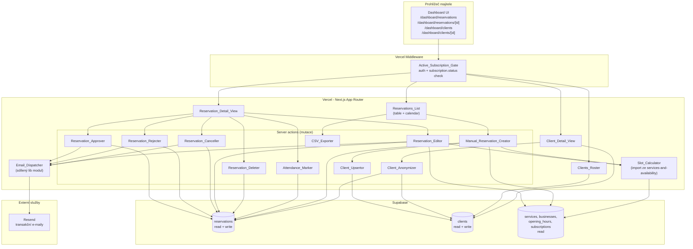
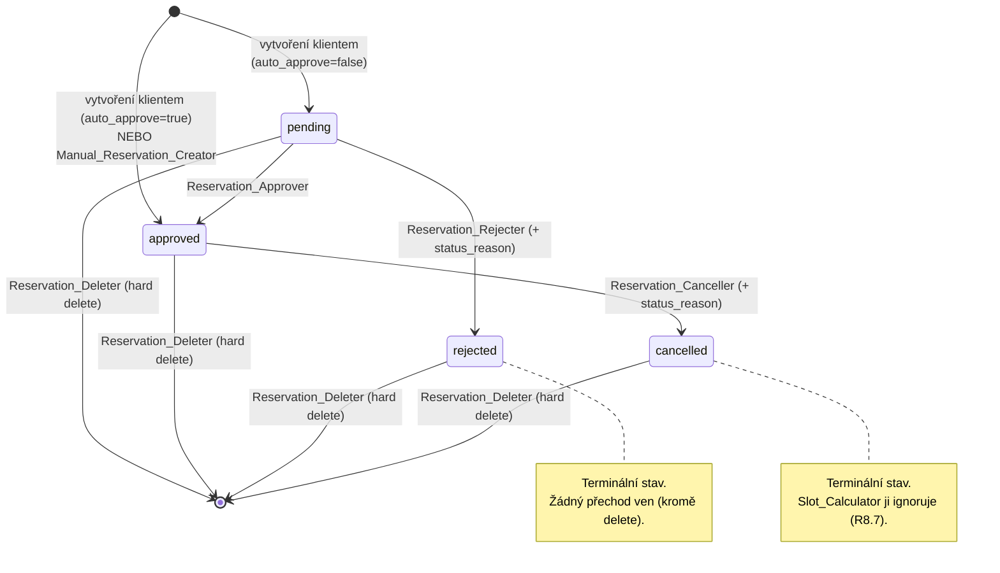
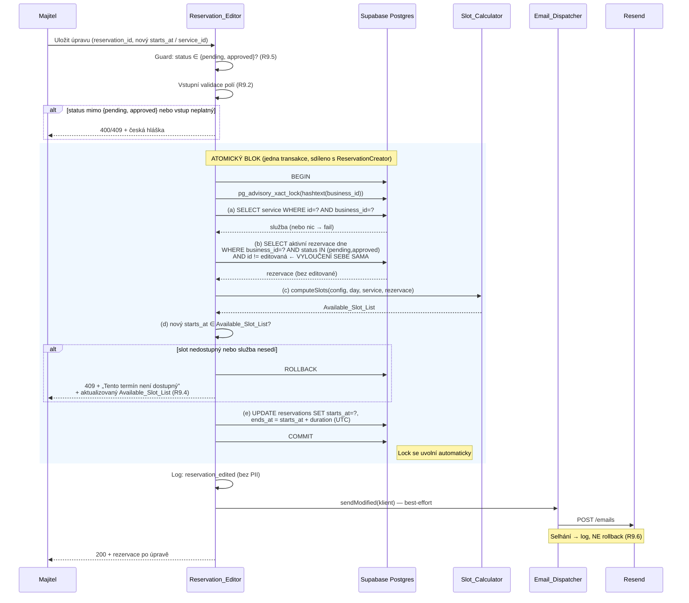
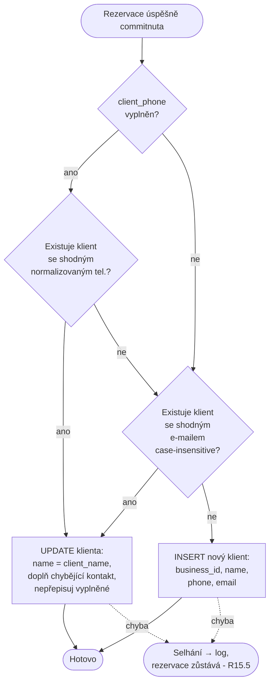
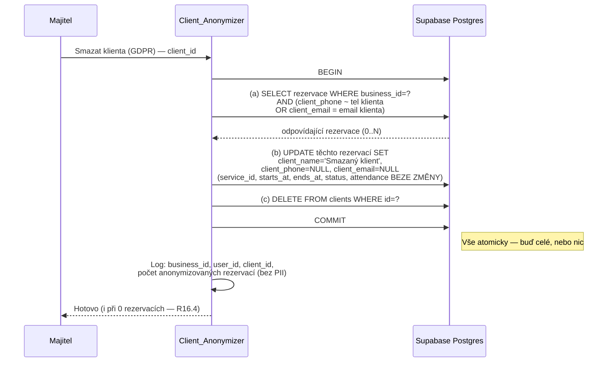

# Design: Správa rezervací (dashboard majitele)

> Tento dokument navazuje na master architekturu v [`../architecture/design.md`](../architecture/design.md), na sdílený `Slot_Calculator` ze specu [`../services-and-availability/design.md`](../services-and-availability/design.md), na vzor advisory locku a `ReservationCreator` ze specu [`../public-business-page/design.md`](../public-business-page/design.md) a na požadavky v [`./requirements.md`](./requirements.md). Sdílenou infrastrukturu (Next.js App Router na Vercelu, Supabase Postgres + RLS, Cloudflare, multi-tenancy přes `business_id`, principy error handlingu, vrstvy testování, GDPR) zde **neopisujeme** — pouze odkazujeme. Detail je v ADR-1 až ADR-7 a v sekcích *Reservation Logic*, *Security*, *Error Handling*, *Testing Strategy* master dokumentu.

---

## Overview

Feature `reservation-management` pokrývá **dashboard majitele podniku pro správu rezervací a klientely**. Je to protějšek veřejné stránky (`public-business-page`): zatímco veřejná stránka rezervace **vytváří** jménem anonymního klienta, tato feature je **spravuje** — prohlíží, filtruje, schvaluje, odmítá, ruší, upravuje, maže, sleduje docházku, ručně zakládá telefonní objednávky, eviduje klienty a exportuje data do CSV.

Feature žije plně uvnitř monolitické Next.js aplikace na Vercelu (ADR-6). Nepřináší žádný nový externí systém, žádný nový cron ani webhook. Přidává čtyři chráněné dashboard routy, sadu server actions (jedna na každou mutaci) a několik server-side komponent z glosáře requirements. Přístup hlídá `Active_Subscription_Gate` na úrovni middleware.

**Co tato feature vědomě znovu používá (a neopakuje):**

- **`Slot_Calculator`** ze specu `services-and-availability` — čistá funkce, jediný zdroj pravdy o dostupnosti slotů. `Reservation_Editor` i `Manual_Reservation_Creator` ji volají při revalidaci slotu. Vlastní logiku výpočtu slotů tato feature **nezavádí**.
- **Vzor advisory locku per `business_id`** zavedený v `public-business-page` (`ReservationCreator`). Zápisy měnící obsazenost slotu (úprava času/služby, ruční tvorba) procházejí **identickým** atomickým blokem: `pg_advisory_xact_lock(hashtext(business_id))` → re-fetch aktivních rezervací → `Slot_Calculator` → verifikace slotu → zápis → commit.
- **Email infrastruktura přes Resend** (R13 architektury). Tato feature ale potřebuje **čtyři** šablony (schválení, odmítnutí, zrušení, úprava), zatímco `public-business-page` má dvě (potvrzení klientovi, notifikace majiteli). Viz sekce *Konsolidace sdílených komponent* — navrhujeme extrakci `Email_Dispatcher` a atomického rezervačního zápisu do sdíleného `lib` modulu, aby se logika neduplikovala.
- **Multi-tenancy přes RLS** podle `business_id` (ADR-5) a aplikační guard nad RLS (defense-in-depth).

**Co tato feature naopak přidává:**

- App Router routy `/dashboard/reservations`, `/dashboard/reservations/[id]`, `/dashboard/clients`, `/dashboard/clients/[id]` (chráněné, server-side klíč v server kontextu).
- Server actions pro každou mutaci rezervace a klienta (`Reservation_Approver`, `Reservation_Rejecter`, `Reservation_Canceller`, `Reservation_Editor`, `Reservation_Deleter`, `Attendance_Marker`, `Manual_Reservation_Creator`, `Client_Upsertor`, `Client_Anonymizer`, `CSV_Exporter`).
- **Dvě nová pole na `reservations`**: `status_reason` (text důvodu pro odmítnutí/zrušení) a `attendance` (enum `null`/`attended`/`no_show`). Vyžaduje migraci — viz *Data Models*.
- **Konečný automat Reservation_Status** vynucovaný serverově (přechody `pending → approved/rejected`, `approved → cancelled`, libovolný stav → hard delete).
- **Evidenci klientů** (`clients`) odvozenou z rezervací — `Client_Upsertor` po commitu, `Client_Anonymizer` pro GDPR výmaz.
- **CSV export** aktuálně vyfiltrovaného seznamu (RFC 4180, UTF-8 s BOM).

Feature **nepokrývá**: klientské vytvoření rezervace (spec `public-business-page`), algoritmus výpočtu slotů (spec `services-and-availability`), CRUD služeb a otevírací doby (spec `services-and-availability`), statistiky a reporting (v2), synchronizaci s externími kalendáři (v2), stavový automat předplatného a fakturaci (spec `subscription-payments`).

---

## Architecture

### Umístění feature v platformě



### App Router routy

Všechny routy jsou pod autentizací (`auth-onboarding`) a za `Active_Subscription_Gate`:

| Cesta | Typ | Účel |
|---|---|---|
| `/dashboard/reservations` | Server component + client view switch | `Reservations_List` — tabulkový a kalendářní pohled, filtry, akce „Vytvořit rezervaci" a „Exportovat do CSV". |
| `/dashboard/reservations/[id]` | Server component / modal | `Reservation_Detail_View` — detail jedné rezervace + akce dle aktuálního statusu. |
| `/dashboard/clients` | Server component | `Clients_Roster` — seznam klientů per `business_id`. |
| `/dashboard/clients/[id]` | Server component | `Client_Detail_View` — kontakt klienta + historie rezervací + akce „Smazat klienta (GDPR)". |

Mutace se řeší přes **Next.js server actions** (vestavěná CSRF ochrana, server-side běh, service role klíč nikdy v klientském bundlu — stejný vzor jako `public-business-page`). Není potřeba samostatná REST API vrstva.

### Active_Subscription_Gate jako middleware

Přístupové pravidlo (R1) je vynuceno ve **dvou vrstvách**:

1. **Next.js middleware** běžící před renderem všech `/dashboard/*` rout. Ověří přihlášení (jinak redirect na `/login`, R1.3) a načte `subscription.status`. Pokud status **není** v množině `{active, grace_period}`, přesměruje na stránku se stavem předplatného (R1.2). Middleware je první brána — odfiltruje neoprávněný přístup dřív, než se vůbec spustí načítání dat.
2. **Server-side guard v každé server action** ověřující `business_id` cílového záznamu proti podniku přihlášeného majitele (R1.4, R1.5). RLS je třetí, databázová vrstva (defense-in-depth — stejný princip jako `services-and-availability`).

> **Poznámka k volbě middleware:** Subscription check by šel řešit i v každé route / server action zvlášť, ale to by znamenalo opakovat stejnou kontrolu na mnoha místech (riziko, že se někde zapomene). Middleware je jedno místo, které pokrývá celý `/dashboard/*` prefix — v duchu *Simplicity First* z `CLAUDE.md` (DRY tam, kde na tom záleží — u bezpečnostní brány). Per-action `business_id` guard zůstává, protože middleware nezná konkrétní `id` editovaného záznamu.

### Klíče Supabase a kontexty

- **Čtecí routy** (`Reservations_List`, `Reservation_Detail_View`, `Clients_Roster`, `Client_Detail_View`) čtou pod **uživatelským JWT** majitele — RLS izoluje data na `business_id` přihlášeného uživatele.
- **Server actions provádějící zápis** běží v server kontextu. Pro operace vyžadující advisory lock a vícekrokovou transakci (`Reservation_Editor`, `Manual_Reservation_Creator`) se používá **server-side klíč** — stejně jako `ReservationCreator` v `public-business-page`. Klíč je dostupný pouze v server kontextu a nikdy se neodesílá klientovi.
- **`Email_Dispatcher`** běží server-side s Resend API klíčem ze server-side env.

### Konsolidace sdílených komponent (reuse)

Tato feature a `public-business-page` sdílejí dvě nezanedbatelné oblasti logiky. Navrhujeme je **extrahovat do sdílených `lib` modulů**, aby nevznikla duplikace (v souladu s *Surgical Changes* a DRY z `CLAUDE.md` — DRY tam, kde na tom záleží):

| Sdílená oblast | Dnešní umístění | Návrh |
|---|---|---|
| **Atomický rezervační zápis** — advisory lock per `business_id` → re-fetch aktivních rezervací → `Slot_Calculator` → verifikace slotu → zápis | `ReservationCreator` v `public-business-page` | Extrahovat do `lib/reservations/atomicSlotWrite` jako funkci přijímající „co zapsat" (insert nové rezervace vs. update existující s vyloučením sebe sama). `ReservationCreator`, `Reservation_Editor` i `Manual_Reservation_Creator` ji volají se svým callbackem. |
| **Odesílání transakčních e-mailů přes Resend** | `EmailNotifier` v `public-business-page` (2 šablony) | Konsolidovat do `lib/email` modulu (`Email_Dispatcher`). Společné: Resend klient, best-effort dispatch po commitu, logování bez PII. Šablony zůstávají per-feature (2 z `public-business-page` + 4 z této feature), ale sdílejí render/odeslání. |

> **Pozn. k rozsahu:** Samotná extrakce `ReservationCreator` → `lib/reservations/atomicSlotWrite` se **dotkne** existujícího kódu `public-business-page`. To je vědomá refaktorizace zdůvodněná tím, že tři komponenty potřebují identickou atomicitu — psát ji třikrát by porušilo DRY na bezpečnostně kritické cestě (race condition na slot). Refaktorizace je předmětem tasks.md a musí být **chráněná stávajícími property testy** `ReservationCreator` (Property 2 z `public-business-page`), aby se neporušilo chování veřejné cesty.

---

## Components and Interfaces

### Reservations_List

Server component (`/dashboard/reservations`) renderující seznam rezervací ve dvou pohledech se sdílenou filtrační vrstvou.

**Odpovědnosti:**

- Načte rezervace podniku majitele pod uživatelským JWT, aplikuje filtry z `Reservations_Filter_Bar` (status, časový rozsah, služba — konjunktivně, R3.5).
- Výchozí stav bez filtru: `starts_at >= now()` vzestupně podle `starts_at` (R2.1). Volba časového rozsahu přepíše pravidlo „pouze budoucí" (R3.3).
- Stránkuje po max. 100 řádcích na request (R2.7, R13.4) a poskytuje přechod na další stránku.
- Zvýrazní rezervace ve stavu `pending` (R2.4) a vizuálně odliší `rejected`/`cancelled` v kalendáři (R4.5).
- Spouští akce „Vytvořit rezervaci" (→ `Manual_Reservation_Creator`) a „Exportovat do CSV" (→ `CSV_Exporter` se shodnou sadou filtrů, R17.1).

`Reservations_Table_View` a `Reservations_Calendar_View` jsou prezentační varianty nad stejnými daty; přepnutí pohledu zachová aktivní filtry statusu a služby (R4.6). Mapování statusů a docházky do češtiny (R2.3, R11.7) je prezentační utilita.

### Reservation_Detail_View

Server component / modal (`/dashboard/reservations/[id]`) zobrazující jednu rezervaci a kontextové akce.

**Odpovědnosti:**

- Zobrazí službu, čas v Europe/Prague, Reservation_Status a Attendance_Status v češtině, kontakt klienta a poznámku (R5.1).
- Zpřístupní akce podle aktuálního statusu (R5.2): `pending` → Schválit, Odmítnout, Upravit, Smazat; `approved` → Zrušit, Upravit, Smazat; `rejected`/`cancelled` → Smazat.
- Zpřístupní akce docházky **pouze**, když `now() > starts_at` (R5.3, R11.3, R11.4).
- Pro neexistující `id` nebo `id` cizího podniku vrátí stav „nenalezeno" s hláškou „Rezervace nebyla nalezena" (R5.4).

### Reservation_Approver / Reservation_Rejecter / Reservation_Canceller

Tři server actions vynucující přechody konečného automatu Reservation_Status. Sdílejí stejný vzor: **guard na aktuální status → UPDATE → best-effort e-mail**.

| Komponenta | Povolený výchozí stav | Cílový stav | Ukládá důvod | E-mail |
|---|---|---|---|---|
| `Reservation_Approver` | `pending` | `approved` | — | `Reservation_Approved_Email` |
| `Reservation_Rejecter` | `pending` | `rejected` | ano (volitelný, ≤ 500 znaků) | `Reservation_Rejected_Email` |
| `Reservation_Canceller` | `approved` | `cancelled` | ano (volitelný, ≤ 500 znaků) | `Reservation_Cancelled_Email` |

**Společné chování:**

- **Status guard pod podmínkou.** UPDATE se provede pouze tehdy, je-li záznam v okamžiku zpracování ve správném výchozím stavu. Implementačně jako podmíněný UPDATE (`WHERE id = ? AND status = ?`) — pokud neovlivní žádný řádek, status mezitím nebyl správný a action vrátí příslušnou českou hlášku bez změny stavu (R6.2, R7.4, R8.4). Tím je guard atomický vůči souběžné změně.
- **Důvod** (`status_reason`) u rejecteru/canceleru: validace délky ≤ 500 znaků jako první krok (R7.2, R8.2). Při překročení action operaci neprovede a vrátí „Důvod smí mít nejvýše 500 znaků".
- **E-mail až po commitu**, best-effort přes `Email_Dispatcher` (R6.3/6.4, R7.5/7.6, R8.5/8.6). Selhání e-mailu je pouze logováno, změna statusu zůstává.
- **Logování** akce s `business_id`, `user_id`, `reservation_id`, `action_type`, bez PII klienta (R20).

### Reservation_Editor

Server action zpracovávající úpravu času (`starts_at`) a/nebo služby (`service_id`). **Nejcitlivější komponenta této feature** — sdílí atomický blok s `ReservationCreator` (viz *Konsolidace*), ale s jedním klíčovým rozdílem: **vylučuje upravovanou rezervaci z konfliktní kontroly**.

**Odpovědnosti (R9):**

1. Povolí úpravu jen ve stavech `pending` a `approved` (R9.5).
2. Serverově validuje vstupní pole stejnými pravidly jako klientský formulář v `public-business-page` (R9.2).
3. V jediné DB transakci s advisory lockem klíčovaným `business_id` provede v pořadí (R9.3):
   - (a) ověří existenci a příslušnost služby k podniku,
   - (b) re-fetch aktivních rezervací (`status IN (pending, approved)`) téhož podniku pro daný den **s vyloučením upravované rezervace** (`id != editovaná`),
   - (c) zavolá `Slot_Calculator` → `Available_Slot_List`,
   - (d) ověří, že nový `starts_at` leží v `Available_Slot_List`,
   - (e) UPDATE s novým `starts_at` a dopočteným `ends_at = starts_at + service.duration_minutes` (v UTC, R9.7).
4. Při selhání kteréhokoli kroku (a)–(e) rollback transakce + hláška „Tento termín není dostupný" + aktualizovaný `Available_Slot_List` pro UI (R9.4).
5. Po úspěšném commitu best-effort `Reservation_Modified_Email` s hodnotami po úpravě (R9.6).

> **Proč vyloučení sebe sama:** Kdyby `Reservation_Editor` neignoroval samotnou upravovanou rezervaci, kolidovala by sama se sebou (její vlastní stávající slot je v seznamu aktivních rezervací) a každá úprava ponechávající čas nebo jen měnící službu by selhala. Vyloučení `id` je jediný rozdíl oproti `ReservationCreator`, který vždy vytváří nový záznam. Sdílený `atomicSlotWrite` proto přijímá volitelný `excludeReservationId`.

### Reservation_Deleter

Server action provádějící **nevratný hard delete** řádku v `reservations` (R10).

**Odpovědnosti:**

- Hard delete bez ohledu na Reservation_Status — žádný stav nepodmiňuje smazatelnost (R10.3).
- **Žádný e-mail** klientovi (R10.4).
- Logování s `business_id`, `user_id`, `reservation_id`, bez PII klienta (R10.5).

### Attendance_Marker

Server action nastavující Attendance_Status (`attended`/`no_show`/zpět na `null`) nezávisle na Reservation_Status (R11).

**Odpovědnosti:**

- Povolí nastavení jen tehdy, když `now() > starts_at` (R11.3, R11.4) — kontrola na serveru, ne jen skrytí tlačítka v UI.
- Umožní přepínání mezi `attended`, `no_show` i zpět na `null` (R11.5).
- **Nemění Reservation_Status a neodesílá e-mail** (R11.6).
- Logování akce bez PII.

### Manual_Reservation_Creator

Server action vytvářející rezervaci jménem majitele (telefonní objednávky). Sdílí atomický blok s `ReservationCreator` (insert varianta), ale s pevným statusem a bez e-mailu klientovi.

**Odpovědnosti (R12):**

1. Serverová validace polí stejnými pravidly jako klientský formulář — jméno povinné, alespoň jeden kontakt (telefon nebo e-mail) povinný (R12.2, R19.2).
2. Atomický blok s advisory lockem `business_id` (R12.3): ověření služby → re-fetch aktivních rezervací pro den → `Slot_Calculator` → verifikace slotu → INSERT.
3. **`status = 'approved'` nezávisle na `business.auto_approve_reservations`** (R12.4) — majitel zakládá rezervaci, kterou sám potvrzuje.
4. **Žádný potvrzovací e-mail klientovi** (R12.5).
5. Při nedostupném slotu rollback + „Tento termín není dostupný" + aktualizovaný `Available_Slot_List` (R12.6).
6. `starts_at`, `ends_at` v UTC (R12.7).
7. Po commitu spustí `Client_Upsertor` (sdíleno s veřejnou cestou — R15.1).

### Client_Upsertor

Server-side komponenta párující kontakt klienta z nově vytvořené rezervace proti `clients` v rámci `business_id`. Volá se **po commitu** transakce rezervace (z veřejné cesty i z `Manual_Reservation_Creator`), best-effort (R15).

**Párovací pravidlo (deterministické pořadí, R15.2):**

1. Je-li `client_phone` vyplněn → hledá klienta podle **normalizovaného telefonu** (odstranění mezer, pomlček, závorek a volitelného úvodního `+`).
2. Není-li nalezen podle telefonu NEBO telefon není vyplněn → hledá podle **e-mailu** (case-insensitive).
3. Není-li nalezen ani podle jednoho → **INSERT** nového klienta (`business_id`, `name`, `phone`, `email` z rezervace, R15.4).

**Při nalezení (R15.3):** aktualizuje `name` na hodnotu z rezervace, doplní chybějící kontakt (`phone`/`email`) tam, kde byl prázdný; již vyplněné kontakty **nepřepisuje**; pokud rezervace nepřináší nic nového, řádek ponechá beze změny.

**Best-effort (R15.5):** selhání upsertu se zaloguje, ale **nezpůsobí rollback** původní rezervace. Operuje výhradně v rámci `business_id` rezervace (R15.6).

### Client_Anonymizer

Server-side komponenta provádějící GDPR výmaz klienta při zachování slotů pro historii obsazenosti. Vše v **jediné DB transakci** (R16).

**Odpovědnosti (R16.2):**

- (a) identifikuje rezervace podniku, jejichž `client_phone` se shoduje s telefonem klienta NEBO `client_email` s e-mailem klienta (párovací pravidlo z R15.2),
- (b) u každé takové rezervace nahradí `client_name` hodnotou „Smazaný klient" a `client_phone` i `client_email` hodnotou `null`,
- (c) hard delete řádku klienta v `clients`.

**Zachová beze změny** `service_id`, `starts_at`, `ends_at`, `status`, `attendance` anonymizovaných rezervací (R16.3) — anonymizace se týká **pouze** kontaktních údajů. Akci povolí i tehdy, když klient nemá žádnou odpovídající rezervaci (smaže se jen řádek klienta, R16.4). Logování s `business_id`, `user_id`, `client_id` a počtem anonymizovaných rezervací, bez jména/telefonu/e-mailu (R16.5).

### CSV_Exporter

Server action vracející CSV se shodnou sadou filtrů jako aktuálně vykreslený seznam (R17).

**Odpovědnosti:**

- Exportuje **všechny** vyfiltrované řádky bez ohledu na stránkování UI (R17.5), pouze `business_id` majitele (R17.4).
- Výstup UTF-8 **s BOM**, oddělovač čárka, RFC 4180 escaping (hodnoty s čárkou, uvozovkou nebo novým řádkem do dvojitých uvozovek se zdvojením vnitřních uvozovek, R17.2).
- Hlavička se sloupci min. `id`, `starts_at`, `ends_at`, `service_name`, `client_name`, `client_phone`, `client_email`, `note`, `status`, `attendance`, `created_at`; časová pole v ISO 8601 v Europe/Prague s offsetem (R17.3).
- **Streaming** pro velké sady — výstup se generuje jako stream (řádek po řádku), aby se velký export nemusel celý držet v paměti Vercel funkce.
- Logování s `business_id`, `user_id` a počtem exportovaných řádků (R17.6).

### Email_Dispatcher

Sdílená komponenta (`lib/email`) odesílající transakční e-maily přes Resend, best-effort, **až po commitu** DB transakce (R18). Tato feature přidává čtyři šablony (schválení, odmítnutí, zrušení, úprava); `public-business-page` přidává dvě (potvrzení, notifikace). Společné: Resend klient, dispatch po commitu, logování bez PII.

**Odpovědnosti:**

- Odeslat příslušný e-mail po úspěšné mutaci statusu / úpravě.
- Žádný e-mail pro operaci, která se rollbackla (R18.6) — proto se volá výhradně po commitu.
- Při selhání zalogovat `reservation_id`, typ e-mailu a Resend error code (bez adresy příjemce, R18.7) a operaci ukončit — **nikdy ne rollback**.

---

## Data Models

Feature **přidává dva sloupce** do existující tabulky `reservations` a **aktivně používá** tabulku `clients` z master *Data Models*. Nezavádí žádnou jinou novou tabulku.

### Změny tabulky `reservations` (vyžadují migraci)

| Sloupec | Význam | Poznámka |
|---|---|---|
| `status_reason` | Volitelný text důvodu pro `rejected` a `cancelled` (≤ 500 znaků). | **Jeden sdílený sloupec** místo dvou (`rejection_reason` + `cancellation_reason`). Důvod: rezervace je buď odmítnutá, nebo zrušená — nikdy obojí (přechody jsou disjunktní: `rejected` jde jen z `pending`, `cancelled` jen z `approved`). Dva sloupce by znamenaly, že jeden je vždy `null` — zbytečná redundance v rozporu se *Simplicity First*. Sémantiku určuje `status`. |
| `attendance` | Enum `null` / `attended` / `no_show`, default `null`. | Nezávislé na `status` (R11.1, R11.2). Samostatné pole, ne součást Reservation_Status. |

> **Rozhodnutí — jeden `status_reason` vs. dva sloupce:** Zadání nabízí obě varianty (`rejection_reason`/`cancellation_reason` *nebo* jeden `status_reason`). Volíme **jeden `status_reason`**, protože stav rezervace je v každém okamžiku právě jeden a důvod patří k tomu stavu. Pokud by budoucí požadavek chtěl rozlišovat historii (rezervace nejdřív odmítnutá, pak…) — to nenastane, protože z `rejected` ani `cancelled` neexistuje přechod zpět. Rozhodnutí je v souladu s *Simplicity First* z `CLAUDE.md`.

> **Migrace:** Přidání `status_reason` (nullable text) a `attendance` (nullable enum, default `null`) je aditivní, nerozbíjí existující řádky. Existující rezervace dostanou `status_reason = null` a `attendance = null`. Konkrétní DDL a enum definice patří do tasks.md, ne do designu.

### Tabulka `clients`

| Sloupec | Použití |
|---|---|
| `id`, `business_id`, `name`, `phone`, `email` | Evidence klienta per podnik (master *Data Models*). `Client_Upsertor` zapisuje/aktualizuje, `Clients_Roster` a `Client_Detail_View` čtou, `Client_Anonymizer` maže. |

`clients` je **odvozená evidence** — žádný cizí klíč z `reservations` na `clients`. Vazba mezi rezervací a klientem je **logická**, přes shodu normalizovaného telefonu nebo e-mailu (párovací pravidlo R15.2). To je vědomé zjednodušení: klient je anonymní (R19, ADR-7), kontaktní údaje žijí denormalizovaně přímo v rezervaci, `clients` je jen agregát pro pohodlí majitele. Počet rezervací a datum poslední rezervace v `Clients_Roster` (R13.2) se počítají dotazem nad `reservations` přes párovací pravidlo.

### Tabulky pouze pro čtení

| Tabulka | Použití |
|---|---|
| `services` | Read — `Reservation_Editor` a `Manual_Reservation_Creator` ověřují existenci/příslušnost služby a čtou `duration_minutes` pro výpočet `ends_at`; název služby do CSV a e-mailů. |
| `businesses` | Read — `auto_approve_reservations` (ignorováno v `Manual_Reservation_Creator`, R12.4), `slug` pro odkaz na profil v e-mailech, `name` do e-mailů. |
| `opening_hours` | Read — vstup pro `Slot_Calculator` při revalidaci slotu. |
| `subscriptions` | Read — `status` pro `Active_Subscription_Gate` (R1). |

### Reservation_Status — konečný automat



**Pravidla automatu:**

- **Jediné povolené přechody** mění status: `pending → approved`, `pending → rejected`, `approved → cancelled`. Vše ostatní je nelegální a server ho odmítne bez změny stavu (R6.2, R7.4, R8.4).
- **Hard delete** je možný z libovolného stavu a vyřazuje záznam úplně (R10.3) — není to stavový přechod, ale odstranění entity.
- **`rejected` a `cancelled` jsou terminální** — žádná akce je nevrací do hry. Obě jsou ignorovány `Slot_Calculator` při výpočtu konfliktů (jen `pending` a `approved` jsou aktivní, R8.7).
- **Attendance je ortogonální** — `attendance` se mění nezávisle (`Attendance_Marker`) a nijak neovlivňuje `status` (R11.6). Proto není v tomto diagramu; je to samostatná osa.

### Tok úpravy rezervace (advisory lock + vyloučení sebe sama)



### Tok upsertu klienta (po commitu, best-effort)



Pořadí párování je **striktní a deterministické**: telefon má prioritu před e-mailem (R15.2). Normalizace telefonu (odstranění mezer, pomlček, závorek, volitelného `+`) zajišťuje, že `+420 777 888 999`, `420777888999` a `(420) 777-888-999` se napárují na téhož klienta.

### Tok anonymizace klienta (GDPR, jediná transakce)



Klíčové: anonymizace a smazání klienta jsou v **jedné transakci** (R16.2) — nikdy nenastane stav, kdy je klient smazaný, ale rezervace stále nesou jeho údaje (nebo naopak). Sloty (`service_id`, `starts_at`, `ends_at`, `status`, `attendance`) zůstávají nedotčené pro historii obsazenosti (R16.3).

---

## E-mailové šablony

Čtyři šablony, všechny v češtině, odesílané přes `Email_Dispatcher` (Resend) **až po commitu** příslušné mutace, best-effort (R18). Všechny mají v patičce odkaz na veřejný profil podniku a disclaimer „E-mail byl odeslán automaticky platformou mojerezervace.cz" (R18.5).

### Reservation_Approved_Email (R18.1)

- **Subject:** „Vaše rezervace byla potvrzena — {název podniku}"
- **Tělo:** pozdrav, věta „**Vaše rezervace byla potvrzena**", shrnutí (název podniku, název služby, datum a počáteční čas v Europe/Prague), patička.
- **Proměnné:** `client_name`, `business_name`, `service_name`, `reservation_date`, `reservation_time`, `business_url`.

### Reservation_Rejected_Email (R18.2)

- **Subject:** „Vaše rezervace byla odmítnuta — {název podniku}"
- **Tělo:** pozdrav, věta „**Vaše rezervace byla bohužel odmítnuta**", shrnutí (podnik, služba, datum, čas), a **pokud byl důvod zadán** — text důvodu vizuálně odlišený od těla (např. citace / oddělený blok), patička.
- **Proměnné:** `client_name`, `business_name`, `service_name`, `reservation_date`, `reservation_time`, `status_reason?`, `business_url`.

### Reservation_Cancelled_Email (R18.3)

- **Subject:** „Vaše rezervace byla zrušena — {název podniku}"
- **Tělo:** pozdrav, věta „**Vaše rezervace byla zrušena podnikem**", shrnutí s **původním** datem a časem, a **pokud byl důvod zadán** — odlišený text důvodu, patička.
- **Proměnné:** `client_name`, `business_name`, `service_name`, `reservation_date`, `reservation_time`, `status_reason?`, `business_url`.

### Reservation_Modified_Email (R18.4)

- **Subject:** „Vaše rezervace byla upravena — {název podniku}"
- **Tělo:** pozdrav, věta „**Vaše rezervace byla upravena**", shrnutí s hodnotami **po úpravě** (název služby po úpravě, datum a počáteční čas po úpravě), patička.
- **Proměnné:** `client_name`, `business_name`, `service_name`, `reservation_date`, `reservation_time`, `business_url`.

### Generování a sdílení

Šablony žijí **v kódu** (TSX/`react-email` nebo template literals — implementační detail), ne v DB. Render a odeslání jsou sdílené přes `Email_Dispatcher` (`lib/email`); společné s `public-business-page` jsou Resend klient, best-effort dispatch a logování bez PII. Tato feature přidává jen čtyři nové šablony, nikoli vlastní e-mailovou infrastrukturu.

---

## Correctness Properties

*Property je vlastnost nebo chování, které musí platit pro všechna validní spuštění systému — formální tvrzení o tom, co má systém dělat. Property slouží jako most mezi člověkem čitelnou specifikací a strojově ověřitelnými zárukami správnosti.*

Tato sekce formuluje vlastnosti, které musí platit pro **libovolné validní vstupy** napříč klíčovými komponentami této feature. Implementovány budou property-based testy s **`fast-check`** (TypeScript ekosystém — viz master *Testing Strategy* a soulad se specy `services-and-availability` a `public-business-page`). Komponenty čistě prezentační (tabulka, kalendář, detail, e-mailové šablony) a infrastrukturní wiring (RLS, middleware, DB filtrace) se ověřují příkladovými / integračními testy — viz *Testing Strategy* níže.

> **Poznámka k duplikaci s `public-business-page` a `services-and-availability`:**
> - Logika výpočtu slotů je formalizována jako Property 1–7 nad `Slot_Calculator` ve specu `services-and-availability`. Tato feature ji **neopakuje** — jen ji konzumuje.
> - Atomicita **vytvoření nové** rezervace (insert) je formalizována jako Property 2 ve specu `public-business-page` (`ReservationCreator`). Po extrakci do sdíleného `lib/reservations/atomicSlotWrite` (viz *Konsolidace*) tato property pokrývá i insert cestu `Manual_Reservation_Creator`. Property 2 níže se zaměřuje na **rozdíl specifický pro úpravu** — vyloučení upravované rezervace z konfliktní kontroly.

### Reflexe a konsolidace property

Při tvorbě property jsme provedli reflexi a sloučili následující:

- **R6.1/6.2, R7.3/7.4, R8.3/8.4** byly sjednoceny do **Property 1 (Status transition validity)**. Tři komponenty (`Reservation_Approver`, `Reservation_Rejecter`, `Reservation_Canceller`) vynucují tentýž invariant konečného automatu — testovat je třemi property by znamenalo testovat tutéž vlastnost (legální přechod uspěje, nelegální se odmítne bez změny) třikrát. Do Property 1 je zahrnuta i **ortogonalita docházky** (R11.6) — `Attendance_Marker` nesmí změnit `status`, což je tatáž osa „co smí/nesmí měnit status".
- **R15.2/15.3/15.4** byly sjednoceny do **Property 4 (Client upsert determinism)** — jednotlivá pravidla popisují kroky jednoho deterministického párovacího algoritmu.
- **R16.2/16.3** byly sjednoceny do **Property 5 (Anonymization completeness)** — „PII zmizí" a „sloty zůstanou" jsou dvě strany téhož atomického výmazu.
- **R18.6/18.7** byly sjednoceny do **Property 7 (Email best-effort)** napříč všemi čtyřmi e-maily a všemi kombinacemi selhání.
- **R10.3 (delete z libovolného stavu)** byl zvážen jako property, ale je triviální (delete uspěje vždy nezávisle na stavu) — ponechán jako příklad v *Testing Strategy*, PBT zde nepřináší hodnotu.
- **R8.7 (cancelled ignorována Slot_Calculatorem)** je vlastnost `Slot_Calculator` — formalizována ve specu `services-and-availability`, zde neopisujeme.

### Property 1: Status transition validity

*For any* rezervaci v libovolném výchozím Reservation_Status (`pending`, `approved`, `rejected`, `cancelled`) a *for any* akci ze sady {schválit, odmítnout, zrušit}, mutace změní `status` **právě tehdy**, když je výchozí status povoleným zdrojem dané akce — jinak `status` zůstane beze změny a komponenta vrátí příslušnou českou hlášku:

- `Reservation_Approver` nastaví `approved` iff výchozí status == `pending`,
- `Reservation_Rejecter` nastaví `rejected` iff výchozí status == `pending`,
- `Reservation_Canceller` nastaví `cancelled` iff výchozí status == `approved`.

Pro libovolný jiný výchozí status daná akce **neprovede žádnou změnu** (žádný částečný zápis, žádný přechod do nelegálního stavu).

Dále — ortogonalita docházky: *for any* rezervaci a *for any* hodnotu Attendance_Status (`null`, `attended`, `no_show`), kterou nastaví `Attendance_Marker`, výsledný Reservation_Status je **identický** s Reservation_Status před nastavením docházky. Nastavení docházky nikdy nemění `status`.

**Validates: Requirements 6.1, 6.2, 7.3, 7.4, 8.3, 8.4, 11.6**

### Property 2: Edit atomicity (s vyloučením upravované rezervace)

*For any* rezervaci ve stavu `pending` nebo `approved`, *for any* požadovanou úpravu (`starts_at` a/nebo `service_id`) a *for any* stav ostatních aktivních rezervací téhož podniku v daný den (včetně race scénáře, kdy se stav změní mezi výběrem a zápisem):

- Pokud je nový slot dostupný v `Available_Slot_List` vypočteném pod advisory lockem **z aktivních rezervací s vyloučením samotné upravované rezervace** (`id != editovaná`), `Reservation_Editor` zapíše právě jeden UPDATE s novým `starts_at` a `ends_at = starts_at + service.duration_minutes` (v UTC).
- Pokud nový slot **není** dostupný (nebo služba neexistuje / nepatří podniku), `Reservation_Editor` **neprovede žádnou změnu**, transakci rollbackne a vrátí 409 s českou hláškou + aktuální `Available_Slot_List`.

Klíčová specifická vlastnost (rozdíl oproti `ReservationCreator`): úprava, která ponechá `starts_at` beze změny nebo mění jen `service_id`, **nesmí** selhat kvůli konfliktu sebe sama se sebou — upravovaná rezervace je z konfliktní kontroly vyloučena. Nikdy nenastane stav, kdy by úprava zapsala slot, který nebyl pod lockem dostupný.

**Validates: Requirements 9.1, 9.2, 9.3, 9.4, 9.7**

### Property 3: Manual creation status

*For any* hodnotu `business.auto_approve_reservations` (`true` i `false`) a *for any* jinak validní vstup vedoucí k úspěšnému ručnímu vytvoření rezervace, výsledný `reservations.status` je **vždy** `'approved'`:

```
Manual_Reservation_Creator ⇒ status == 'approved'   (nezávisle na auto_approve_reservations)
```

Toto je **opačná** vlastnost než u `ReservationCreator` veřejné cesty (kde `status = 'approved' iff auto_approve = true`). Ruční tvorba majitelem je vždy autoschválená — hodnota `auto_approve_reservations` na výsledek nemá žádný vliv.

**Validates: Requirements 12.4**

### Property 4: Client upsert determinism

*For any* kontaktní údaje z rezervace (`client_name`, `client_phone`, `client_email`) a *for any* množinu existujících klientů téhož `business_id`, výsledek `Client_Upsertor` je **deterministický** a dán striktním pořadím párování:

1. Je-li `client_phone` vyplněn a existuje klient se shodným **normalizovaným** telefonem (odstranění mezer, pomlček, závorek, volitelného úvodního `+`) → aktualizuje se tento klient.
2. Jinak, existuje-li klient se shodným e-mailem (case-insensitive) → aktualizuje se tento klient.
3. Jinak → vloží se nový klient s `business_id`, `name`, `phone`, `email` z rezervace.

Při aktualizaci se `name` nastaví na hodnotu z rezervace a chybějící kontakt (`phone`/`email`) se doplní tam, kde byl prázdný; **již vyplněné kontakty se nepřepisují**. Telefonní shoda má vždy přednost před e-mailovou. Operace se týká výhradně klientů daného `business_id`.

**Validates: Requirements 15.2, 15.3, 15.4, 15.6**

### Property 5: Anonymization completeness

*For any* klienta a *for any* množinu rezervací téhož podniku (některé odpovídající kontaktu klienta, některé ne), po dokončení `Client_Anonymizer`:

- **Žádná** rezervace v daném podniku neobsahuje původní `client_name`, `client_phone` ani `client_email` smazaného klienta. Všechny odpovídající rezervace (shoda telefonu NEBO e-mailu dle párovacího pravidla R15.2) mají `client_name = "Smazaný klient"` a `client_phone = client_email = null`.
- Sloty odpovídajících rezervací — `service_id`, `starts_at`, `ends_at`, `status`, `attendance` — zůstávají **beze změny**.
- Rezervace, které kontaktu klienta **neodpovídaly**, zůstávají zcela beze změny (včetně svých kontaktních údajů).
- Řádek klienta v `clients` je smazán.

Vše platí atomicky (jedna transakce) a i pro klienta bez jediné odpovídající rezervace (smaže se jen řádek klienta).

**Validates: Requirements 16.2, 16.3, 16.4**

### Property 6: CSV escaping round-trip

*For any* hodnotu pole rezervace (libovolný řetězec včetně čárek, dvojitých uvozovek, znaků nového řádku a jejich kombinací), platí, že zápis hodnoty `CSV_Exporter`em a její následné parsování standardním RFC 4180 parserem vrátí **identickou** původní hodnotu:

```
parseCSV(CSV_Exporter.encodeField(value)) === value
```

Pole obsahující čárku, uvozovku nebo nový řádek je uzavřeno do dvojitých uvozovek se zdvojením vnitřních uvozovek (RFC 4180). Round-trip zaručuje, že žádný obsah kontaktních údajů ani poznámky CSV export nerozbije ani neztratí.

**Validates: Requirements 17.2**

### Property 7: Email best-effort

*For any* úspěšně provedenou mutaci (schválení, odmítnutí, zrušení, úprava) a *for any* výsledek odeslání odpovídajícího transakčního e-mailu (úspěch i libovolný typ selhání — síťová chyba, rate limit, neznámá doména), DB změna provedená mutací **přetrvá** ve stavu po commitu. Žádné selhání `Email_Dispatcher`u nezpůsobí rollback ani jinou změnu Reservation_Status nebo dat rezervace.

Důsledek: e-mailový kanál je čistě best-effort vrstva nad commit. Selhání je pouze zalogováno (s `reservation_id` a Resend error code, bez adresy příjemce).

**Validates: Requirements 6.4, 7.6, 8.6, 9.6, 18.6, 18.7**

### Property 8: Sensitive data not in logs

*For any* mutaci v Reservations_Dashboard (schválení, odmítnutí, zrušení, úprava, smazání, ruční tvorba, nastavení docházky, upsert klienta, anonymizace, CSV export) a *for any* kontaktní údaje klienta (`client_name`, `client_phone`, `client_email`, `client_note`), žádná zachycená log zpráva neobsahuje hodnoty `client_name`, `client_phone`, `client_email` ani `client_note` jako podřetězec.

Logy obsahují pouze identifikátory entit (`business_id`, `user_id`, `reservation_id`, `client_id`), `action_type` a (kde relevantní) počty (např. počet anonymizovaných rezervací, počet exportovaných řádků) — viz R20.2 architektury.

**Validates: Requirements 10.5, 16.5, 17.6, 20.1, 20.2**

---

## Error Handling

Tato sekce popisuje **specifické chování chyb v rámci této feature**. Obecné principy (klasifikace chyb, čitelné hlášky v češtině, transakce na hranici business operace, žádný stack trace klientovi) jsou v sekci *Error Handling* master dokumentu — neopakujeme je.

### Nelegální přechody konečného automatu

Pokus o akci z nepovoleného výchozího stavu (R6.2, R7.4, R8.4) se odmítne **bez změny stavu** a vrátí konkrétní českou hlášku. Guard je implementován jako podmíněný UPDATE (`WHERE id = ? AND status = ?`) — atomický vůči souběžné změně, takže ani race (dvě záložky majitele) nevede k dvojímu přechodu.

| Akce | Výchozí stav ≠ povolený | HTTP | Hláška |
|---|---|---|---|
| Schválit | status ≠ `pending` | 409 | „Rezervaci nelze schválit, není ve stavu Čeká na schválení" |
| Odmítnout | status ≠ `pending` | 409 | „Rezervaci nelze odmítnout, není ve stavu Čeká na schválení" |
| Zrušit | status ≠ `approved` | 409 | „Zrušit lze pouze schválenou rezervaci" |

### Validační chyby

| Pravidlo | HTTP | Hláška |
|---|---|---|
| Důvod odmítnutí/zrušení > 500 znaků | 400 | „Důvod smí mít nejvýše 500 znaků" (R7.2, R8.2) |
| Úprava / ruční tvorba — neplatné pole (jméno, kontakt, formát) | 400 | Konkrétní hláška shodná s klientským formulářem `public-business-page` (R9.2, R12.2) |
| Ruční tvorba — chybí jméno nebo oba kontakty | 400 | „Vyplňte jméno a alespoň jeden kontakt" (R12.2, R19.2) |

Validace je **vždy serverová** — klientská validace v UI je pouze pro UX. Server vrací hlášku i v případě, že klientská validace byla obejita přímým voláním server action.

### Konflikt dostupnosti slotu (úprava / ruční tvorba)

Pokud nový slot není v `Available_Slot_List` (po vyloučení sebe sama u úpravy), `Reservation_Editor` / `Manual_Reservation_Creator` rollbackne transakci a vrátí **HTTP 409** s hláškou **„Tento termín není dostupný"** + aktualizovaný `Available_Slot_List` v body (R9.4, R12.6). UI nabídne nové termíny bez nutnosti znovu otevírat výběr.

### Detail rezervace nenalezen

Otevření `Reservation_Detail_View` s `id`, které neexistuje nebo nepatří podniku majitele, vrátí stav „nenalezeno" s hláškou **„Rezervace nebyla nalezena"** (R5.4). Selhání otevření detailu ze seznamu (síťová chyba, mezitím smazaná rezervace) zobrazí českou chybovou hlášku a ponechá majitele v seznamu (R2.6).

### Best-effort kanály neblokují core

- **Selhání e-mailu** (`Email_Dispatcher`) nikdy nezpůsobí rollback mutace. Chyba se zaloguje s `reservation_id` a Resend error code (bez adresy příjemce). Mutace zůstává platná (R6.4, R7.6, R8.6, R9.6, R18.7).
- **Selhání upsertu klienta** (`Client_Upsertor`) nikdy nezpůsobí rollback rezervace — upsert běží až po commitu rezervace a jeho selhání je jen logováno (R15.5).
- **Selhání logu** neblokuje primární operaci (R20.3) — logger swallowne výjimku.

### Autorizační chyby

Pokus o čtení/zápis záznamu s cizím `business_id` se odmítne **HTTP 403** s hláškou „Nemáte oprávnění k této operaci" (R1.5). RLS je druhá vrstva (defense-in-depth). Přístup bez aktivního předplatného řeší `Active_Subscription_Gate` v middleware redirectem (R1.2), nepřihlášený uživatel je přesměrován na `/login` (R1.3).

### Selhání DB transakce

Selhání transakce s advisory lockem (deadlock, connection lost) u úpravy / ruční tvorby / anonymizace vrátí **HTTP 500** s hláškou „Operaci se nepodařilo dokončit, zkuste to prosím znovu" + log s request ID. Transakce je atomická — žádné polovičaté stavy (např. klient smazaný, ale rezervace stále s jeho PII).

---

## Testing Strategy

Strategie testování této feature navazuje na obecnou strategii v master *Testing Strategy* — neopakujeme ji. Specifika této feature:

### Property-based testy (`fast-check`)

Property-based testy pokrývají osm property z předchozí sekce. Každý test má minimálně **100 iterací** a je otagovaný komentářem ve formátu `Feature: reservation-management, Property N: <text>` referencujícím odpovídající Property z této specifikace.

| Property | Předmět testu | Závislosti |
|---|---|---|
| 1: Status transition validity | `Reservation_Approver` / `Rejecter` / `Canceller` + `Attendance_Marker` | Mock DB (podmíněný UPDATE) |
| 2: Edit atomicity (vyloučení self) | `Reservation_Editor` atomický blok | Mock DB s podporou simulace race + `Slot_Calculator` |
| 3: Manual creation status | `Manual_Reservation_Creator` insert path | Mock DB, generátor `auto_approve_reservations` |
| 4: Client upsert determinism | `Client_Upsertor` párovací logika | Mock DB s generovanou sadou klientů |
| 5: Anonymization completeness | `Client_Anonymizer` transakce | Mock DB s generovanou sadou rezervací |
| 6: CSV escaping round-trip | `CSV_Exporter` encode + nezávislý RFC 4180 parser | Žádné — čistá funkce |
| 7: Email best-effort | mutace + post-commit dispatch | Mock `Email_Dispatcher` (random failures) + ověření DB stavu |
| 8: Sensitive data not in logs | všechny mutace | Mock logger zachycující všechny zprávy |

**Klíčové generátory:**

- **Property 1:** rezervace v každém ze 4 statusů × každá ze 3 akcí; hodnota docházky `{null, attended, no_show}`.
- **Property 2:** stav aktivních rezervací dne, upravovaná rezervace (její vlastní slot je v seznamu — test ověří, že vyloučení self funguje), požadovaná úprava (ponechaný čas / jen změna služby / nový čas), race scénář (mock DB mezi verify a UPDATE deterministicky přidá/odebere rezervaci).
- **Property 4:** kontakt rezervace (vč. variant normalizace telefonu — `+420 777…`, `420777…`, `(420) 777-…`), e-mail v různém casingu, sady existujících klientů (shoda telefonem, shoda e-mailem, žádná shoda, klient s prázdným/vyplněným kontaktem pro test doplnění bez přepisu).
- **Property 5:** klient + rezervace (matchující telefonem, matchující e-mailem, nematchující); ověření, že po anonymizaci žádná nenese původní PII a sloty matchujících jsou nezměněné.
- **Property 6:** libovolné řetězce s důrazem na čárky, uvozovky (vč. uvozovek uvnitř hodnoty), `\n`, `\r\n` a jejich kombinace.
- **Property 8:** generuje kontaktní údaje (vč. hodnot, které by mohly „prosáknout" — jméno jako podřetězec ID apod.) a ověřuje, že je log neobsahuje.

### Unit / příkladové testy

Pokrývají prezentační a deterministicky-malé oblasti, kde PBT nepřináší hodnotu:

- **Reservation_Detail_View** — mapování status → množina dostupných akcí (4 případy: `pending`, `approved`, `rejected`, `cancelled`, R5.2); zobrazení polí; not-found hláška (R5.4).
- **Reservations_Table_View / Calendar_View** — české mapování statusů (R2.3) a docházky (R11.7), zvýraznění `pending` (R2.4), odlišení `rejected`/`cancelled` v kalendáři (R4.5), denní/týdenní render, zachování filtrů při přepnutí pohledu (R4.6). Snapshot testy.
- **Reservation_Deleter** — hard delete z každého ze 4 stavů uspěje (R10.3); žádný e-mail (R10.4).
- **Attendance_Marker** — časová brána: `now() <= starts_at` → akce nedostupná, `now() > starts_at` → dostupná (R11.3, R11.4); přepínání mezi `attended`/`no_show`/`null` (R11.5).
- **CSV_Exporter** — hlavička se správnými sloupci, časová pole v ISO 8601 Europe/Prague s offsetem, UTF-8 BOM přítomen (R17.3).
- **E-mailové šablony** — snapshot testy čtyř šablon (schválení, odmítnutí s/bez důvodu, zrušení s/bez důvodu, úprava); ověření přítomnosti povinných vět, patičky a odkazu na profil (R18.1–18.5).
- **Lokalizace** — formát času 24h Europe/Prague, Kč (R19.2, R19.3).
- **Client_Detail_View** — prázdný stav „Klient zatím nemá žádné rezervace" (R14.5).

### Integrační testy

Spouštěny proti **lokálnímu Supabase** (Docker) — viz master *Testing Strategy*:

- **Active_Subscription_Gate** — `subscription.status` mimo `{active, grace_period}` → redirect; nepřihlášený → `/login`; aktivní → přístup (R1.1–1.3).
- **RLS izolace** — uživatel A nevidí ani neupraví rezervace/klienty uživatele B; cizí `business_id` → 403 (R1.4, R1.5).
- **Reservation_Editor advisory lock** — dva souběžné requesty na úpravu vedoucí na stejný slot stejného podniku; lock serializuje, jeden uspěje, druhý 409. Doplnění PBT Property 2 — PBT testuje logiku, integrační test ověří, že advisory lock skutečně funguje proti reálnému Postgresu.
- **Manual_Reservation_Creator** — vytvoření přes reálnou transakci, ověření `status = 'approved'` a `ends_at` v UTC; návazný `Client_Upsertor` po commitu.
- **Client_Upsertor časování** — upsert proběhne **po commitu** rezervace (R15.1); selhání upsertu nezruší rezervaci (R15.5).
- **Client_Anonymizer transakce** — atomicita (klient + anonymizace rezervací v jedné transakci); zachování slotů; povolení při 0 rezervacích (R16.4).
- **Filtry** — konjunktivní kombinace statusu, časového rozsahu a služby vrací průnik; časový rozsah přepíše „pouze budoucí" (R3.3, R3.5).
- **Clients_Roster** — seznam jen pro `business_id` majitele, počet rezervací a datum poslední rezervace (R13.2, R13.3); stránkování max 100 (R13.4).
- **Client_Detail_View historie** — historie přes párovací pravidlo (shoda telefonem NEBO e-mailem, R14.4).
- **CSV_Exporter scope** — export jen `business_id` majitele (R17.4), všechny vyfiltrované řádky bez ohledu na stránkování (R17.5).
- **Stránkování seznamu** — jeden request max 100 řádků, přechod na další stránku (R2.7).

### End-to-end testy (Playwright)

Pouze **happy paths** kritických flow:

- **Schválení rezervace**: otevření `/dashboard/reservations` → zvýrazněná `pending` rezervace → otevření detailu → Schválit → status „Schváleno" + e-mail v inboxu (Resend test mode). Toto je kritický flow zmíněný v master *Testing Strategy*.
- **Úprava rezervace**: otevření detailu → změna času na dostupný slot → uložení → `Reservation_Modified_Email` v inboxu.
- **Ruční tvorba**: „Vytvořit rezervaci" → vyplnění → uložení → rezervace `approved` v seznamu, bez e-mailu klientovi.

Žádné pokrytí všech edge cases v E2E — to je práce unit / integračních / property testů.

### Smoke testy

- Migrace přidávající `status_reason` a `attendance` proběhne čistě a existující rezervace dostanou `attendance = null`.
- Klientský bundle dashboardu neobsahuje service role key string.

### Co se NEtestuje v této feature

- **Výpočet slotů** (`Slot_Calculator`) — testováno ve specu `services-and-availability` (Property 1–7). Zde se pouze konzumuje.
- **Atomicita insertu nové rezervace** — sdílený `lib/reservations/atomicSlotWrite` je chráněn Property 2 ze specu `public-business-page`. Refaktorizace extrahující tuto logiku musí projít stávajícími property testy `ReservationCreator` beze změny chování veřejné cesty.
- **Doručitelnost e-mailů** — Resend interní monitoring + manuální spot check (master *Testing Strategy*).
