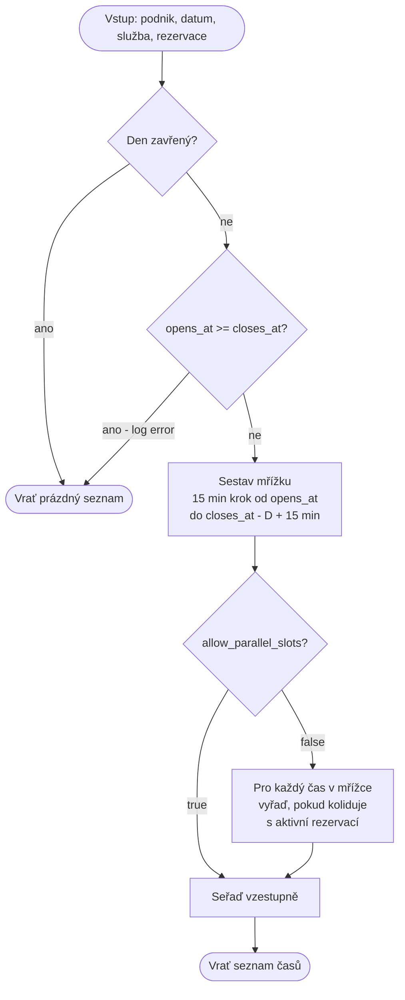
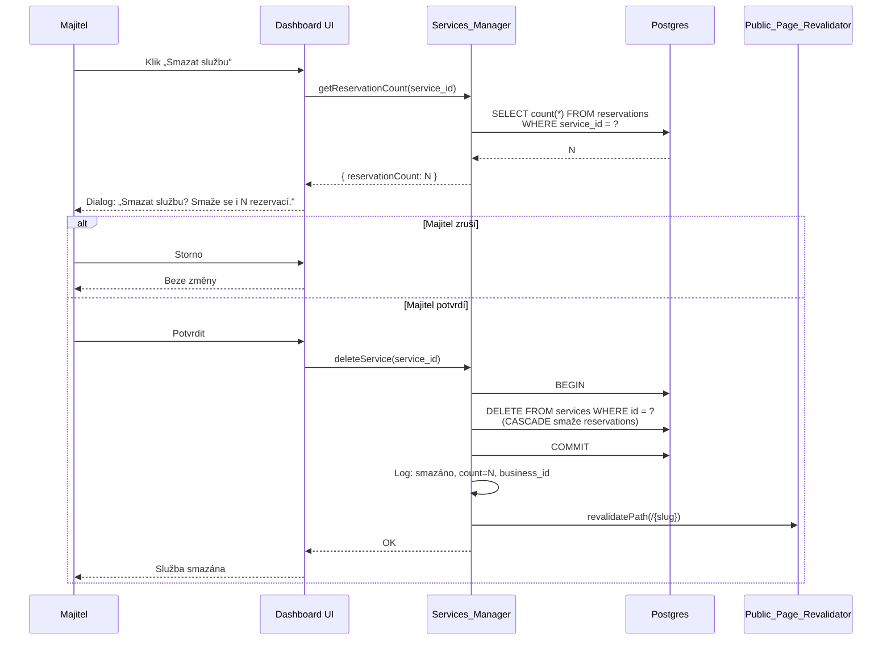

# Design: Služby a dostupnost

> Tento dokument navazuje na master architekturu v [`../architecture/design.md`](../architecture/design.md) a na požadavky v [`./requirements.md`](./requirements.md). Sdílenou infrastrukturu (Next.js App Router na Vercelu, Supabase Postgres + RLS, Cloudflare, ISR, multi-tenancy přes `business_id`, principy error handlingu, vrstvy testování) zde **neopisujeme** — pouze odkazujeme. Detailní rozhodnutí jsou v ADR-1, ADR-2, ADR-5, ADR-6 a v sekcích *Reservation Logic*, *Error Handling*, *Testing Strategy*, *Data Models* master dokumentu.

---

## Overview

Feature `services-and-availability` pokrývá **správu služeb, otevírací doby a parametrů dostupnosti** v dashboardu majitele podniku **po dokončení onboardingu**. Onboarding wizard (spec `auth-onboarding`) zakládá první službu a první otevírací dobu jako součást atomického commitu kroku 6 — tato feature řeší veškerou následnou údržbu.

Kromě CRUD úloh feature obsahuje **`Slot_Calculator`** — čistou (referenčně transparentní) funkci, která pro daný den a službu vrací seznam dostupných počátečních časů. `Slot_Calculator` je **nejdůležitější komponenta této feature**, protože je sdílena dvěma kontexty:

1. **Dashboard preview** — majitel vidí, jak budou sloty vypadat klientům.
2. **Veřejná rezervační stránka** (spec `public-business-page`) — klient vybírá slot.

Sdílení čisté funkce mezi dashboardem a veřejnou stránkou je **vědomé zjednodušení**: jediný zdroj pravdy pro algoritmus, žádné riziko, že obě strany budou počítat sloty rozdílně. Přesné chování `Slot_Calculator` je popsané prózou níže (sekce *Slot calculation algorithm*) a formalizované v *Correctness Properties*.

Feature nepokrývá CRUD rezervací (spec `reservation-management`), veřejné UI pro výběr slotu (spec `public-business-page`), speciální dny / svátky jako samostatnou entitu (architektura v2) ani numerickou kapacitu paralelních slotů (architektura v2).

---

## Architecture

### Umístění feature v platformě

Feature žije plně uvnitř monolitické Next.js aplikace na Vercelu (viz ADR-6 master dokumentu). Nepřináší žádnou novou komponentu na úrovni infrastruktury — žádný nový externí systém, žádné nové cron joby, žádné nové webhooky. Pouze nové **App Router routy** v dashboardu, **server actions / route handlery** pro CRUD operace, **sdílený utility modul** pro `Slot_Calculator` a **revalidační volání** směřující na ISR cache veřejné stránky.

```mermaid
flowchart TB
    subgraph Browser["Prohlížeč majitele"]
        UI[Dashboard UI<br/>/dashboard/services<br/>/dashboard/opening-hours<br/>/dashboard/settings]
    end

    subgraph Vercel["Next.js (Vercel)"]
        SM[Services_Manager<br/>server actions]
        OHM[OpeningHours_Manager<br/>server actions]
        SET[Settings_Manager<br/>server actions]
        SC[Slot_Calculator<br/>čistá utility funkce]
        REV[Public_Page_Revalidator<br/>revalidatePath]
        PUB[Veřejná stránka<br/>/{slug} - ISR]
    end

    subgraph Supabase["Supabase"]
        T1[(services)]
        T2[(opening_hours)]
        T3[(businesses)]
        T4[(reservations<br/>read-only z této feature)]
    end

    UI -->|formuláře| SM
    UI -->|formuláře| OHM
    UI -->|toggly| SET
    UI -->|preview| SC

    SM --> T1
    SM --> T4
    OHM --> T2
    SET --> T3

    SC -.read.-> T1
    SC -.read.-> T2
    SC -.read.-> T3
    SC -.read.-> T4

    SM --> REV
    OHM --> REV
    SET --> REV
    REV -.invaliduje cache.-> PUB

    PUB -->|používá pro výpočet slotů| SC
```

### App Router routy

Dashboard routy (chráněné autentizací podle `auth-onboarding`):

| Cesta | Účel |
|---|---|
| `/dashboard/services` | Seznam služeb, formuláře pro CRUD, potvrzovací dialog mazání. |
| `/dashboard/opening-hours` | Editor otevírací doby pro 7 dní v týdnu. |
| `/dashboard/settings` | Toggly `allow_parallel_slots` a `auto_approve_reservations`. |

Veřejné routy zde **nezavádíme** — `/{slug}` je řešen ve specu `public-business-page`. Tato feature pouze vystavuje `Slot_Calculator` jako sdílený modul, který si veřejná stránka importuje.

CRUD operace se řeší přes **Next.js server actions** vázané na konkrétní komponenty formulářů. Není potřeba samostatná REST API vrstva — server action běží serverově, má přístup k Supabase service role pouze v server kontextu (viz *Security* v master dokumentu) a po úspěchu volá `Public_Page_Revalidator`.

### Závislosti na sdílené infrastruktuře

- **Multi-tenancy přes RLS** — viz ADR-5. Tabulky `services`, `opening_hours`, `businesses` mají RLS policy podle `business_id`. Aplikační vrstva (manažery) navíc kontroluje `business_id` před zápisem (viz Requirement 11 — defense-in-depth).
- **ISR pro veřejnou stránku** — viz *Reservation Logic* a *Components and Interfaces* master dokumentu. Veřejná stránka `/{slug}` je generována se statickou cache; tato feature ji invaliduje přes Next.js `revalidatePath`.
- **Error handling** — viz sekce *Error Handling* master dokumentu (klasifikace chyb, čitelné hlášky v češtině, transakce na hranici business operace).
- **Testovací strategie** — viz sekce *Testing Strategy* master dokumentu (unit + integrační + property-based testy pro doménovou logiku).

---

## Components and Interfaces

### Services_Manager

Komponenta zodpovědná za CRUD operací nad tabulkou `services`. Pracuje výhradně se záznamy podniku přihlášeného majitele.

**Odpovědnosti:**

- Načtení seznamu služeb pro aktuální podnik (řazeno podle data vytvoření vzestupně).
- Vytvoření nové služby s validací polí (název 1–100 znaků, trvání 5–480 min jako násobek 5, cena 0–100 000 Kč, popis 0–500 znaků).
- Úprava existující služby (stejná validace).
- Smazání služby s **kaskádou** na rezervace (viz *Cascade delete* níže).
- Před každým zápisem ověřit, že cílový `business_id` odpovídá podniku přihlášeného uživatele (defenzivní kontrola nad RLS).
- Po úspěšném zápisu zavolat `Public_Page_Revalidator`.
- Zalogovat operaci (typ + `business_id` + `service_id`); selhání logu nesmí blokovat operaci.

**Validační pravidla** jsou kompletně specifikovaná v Requirementu 2 a tato komponenta je **vynucuje serverově** — klientská validace je pouze UX.

### OpeningHours_Manager

Komponenta zodpovědná za správu tabulky `opening_hours`. Reprezentace je **per den v týdnu** (1–7, ISO 8601 Pondělí–Neděle): pro každý den buď dvojice `opens_at` < `closes_at`, nebo příznak „zavřeno".

**Odpovědnosti:**

- Načtení nastavení pro všech sedm dní v týdnu.
- Uložení změny pro konkrétní den — buď nová dvojice časů, nebo přechod do stavu „zavřeno".
- Validace: `opens_at < closes_at` pro každý otevřený den; alespoň jeden den v týdnu otevřený (jinak by veřejná stránka nikdy nenabídla slot).
- Před zápisem ověřit `business_id` (defenzivní kontrola).
- Po úspěšném zápisu zavolat `Public_Page_Revalidator`.
- Zalogovat operaci (`business_id` + `Day_Of_Week`); selhání logu nesmí blokovat operaci.

Hodnoty `opens_at` a `closes_at` jsou ukládány jako Postgres `time` (bez data) v lokálním čase podniku (Europe/Prague). Konverze do UTC se neprovádí — každý den v týdnu se opakuje ve stejném lokálním čase nezávisle na DST.

### Settings_Manager

Komponenta pro správu dvou boolean přepínačů na řádku `businesses`: `allow_parallel_slots` a `auto_approve_reservations`. Žádná nová tabulka, **nastavení žije přímo na businesses řádku** (viz *Data Models* master dokumentu).

**Odpovědnosti:**

- Načtení aktuálních hodnot obou přepínačů pro podnik přihlášeného uživatele.
- Uložení nové hodnoty kteréhokoli z přepínačů.
- Před zápisem ověřit `business_id`.
- Po úspěšném zápisu zavolat `Public_Page_Revalidator`.
- Zalogovat (`business_id` + jméno přepínače + nová hodnota).

UI varování pro `allow_parallel_slots` (Requirement 5.4–5.7) je věc dashboardu, ne této komponenty — `Settings_Manager` pouze ukládá hodnotu.

### Slot_Calculator

**Nejdůležitější komponenta této feature.** Čistá (pure) funkce — žádný stav, žádné I/O uvnitř. Vstupy a výstupy jsou popsány níže; přesné chování je v sekci *Slot calculation algorithm* a formalizované v *Correctness Properties*.

**Vstupy (immutable):**

- Konfigurace podniku — `allow_parallel_slots`, časová zóna (Europe/Prague).
- Otevírací doba pro daný den v týdnu — buď dvojice (`opens_at`, `closes_at`), nebo příznak „zavřeno".
- Služba — pouze `duration_minutes`.
- Datum (lokální datum podniku, ne UTC timestamp).
- Seznam aktivních rezervací (`status IN (pending, approved)`) pro daný podnik a daný den, jako seznam intervalů `[start, end)`.

**Výstup:**

- Seznam počátečních časů `t` jako lokální časy podniku, vzestupně seřazené.

**Klíčové vlastnosti:**

- **Čistá funkce** — stejný vstup → stejný výstup. Snadno testovatelná unit testy a property-based testy bez mocků.
- **Sdílená mezi dashboardem a veřejnou stránkou** — jeden algoritmus, jeden zdroj pravdy.
- **Žádný přístup do databáze uvnitř** — volající (server action nebo veřejná stránka) si data o rezervacích a otevírací době natáhne sám a předá je jako parametr. Tím se izoluje doménová logika od I/O.

### Public_Page_Revalidator

Tenký wrapper kolem Next.js `revalidatePath`. Volá se po každé úspěšné CRUD operaci v `Services_Manager`, `OpeningHours_Manager` a `Settings_Manager`.

**Odpovědnosti:**

- Zavolat `revalidatePath('/' + slug)` pro slug aktuálního podniku, čímž označí ISR cache veřejné stránky jako neplatnou. Při dalším requestu se stránka přerenderuje s aktuálními daty (služby, otevírací doba, nastavení).
- V případě selhání revalidace zalogovat chybu, ale **nepropagovat ji do volajícího** — DB operace už proběhla a uživatel ji vidí jako úspěšnou. Případná zastaralá veřejná stránka se sama opraví při příštím revalidačním cyklu nebo dalším volání.

Tato komponenta záměrně neřeší cache tagování (`revalidateTag`) — granularita per-slug je dostatečná, vzhledem k objemu změn (jednotky denně per podnik) a velikosti stránky (jeden podnik = jeden HTML).

---

## Data Models

Feature **nepřidává žádnou novou tabulku**. Pracuje s existujícími tabulkami z master *Data Models*:

| Tabulka | Sloupce relevantní pro feature |
|---|---|
| `businesses` | `id`, `slug`, `allow_parallel_slots` (bool, default `false`), `auto_approve_reservations` (bool, default `false`) |
| `services` | `id`, `business_id`, `name`, `duration_minutes`, `price_czk`, `description` (nullable), `created_at` |
| `opening_hours` | `id`, `business_id`, `day_of_week` (1–7), `opens_at` (time), `closes_at` (time). Den označený jako zavřený = absence řádku pro daný `day_of_week` (nebo explicitní `is_closed` příznak — TBD při migraci, ale logicky ekvivalentní). |
| `reservations` | Pouze **read** z této feature — `Slot_Calculator` čte `starts_at`, `ends_at`, `status`. Cascade smazání na `reservations.service_id` (viz níže) je definováno na úrovni schématu (`ON DELETE CASCADE`). |

**Settings na businesses řádku:** Vědomé rozhodnutí — dvě boolean nastavení nepotřebují vlastní tabulku. Atomicita aktualizace je triviální (jeden UPDATE), žádná join-overhead při čtení veřejné stránky.

**Cizí klíč `reservations.service_id` má `ON DELETE CASCADE`** — Postgres automaticky smaže rezervace odkazující na smazanou službu. To zjednodušuje aplikační kód (viz *Cascade delete* níže).

---

## Correctness Properties

*Property je vlastnost nebo chování, které musí platit pro všechna validní spuštění systému — formální tvrzení o tom, co má systém dělat. Property slouží jako most mezi člověkem čitelnou specifikací a strojově ověřitelnými zárukami správnosti.*

Tato sekce formuluje vlastnosti `Slot_Calculator`, které musí platit pro **libovolné validní vstupy**. Všechny property se vztahují na čistou funkci `Slot_Calculator` a jsou implementovatelné property-based testy s `fast-check` (TypeScript). Jiné komponenty této feature (CRUD manažery, revalidátor) se ověřují unit / integračními / příkladovými testy — viz sekce *Testing Strategy*. Důvod: CRUD operace nemají zajímavou input-output algoritmickou logiku, kde by 100 iterací našlo víc než 2–3 příklady.

### Reflexe a konsolidace property

Při tvorbě property jsme provedli reflexi a sloučili následující:

- **R9.2 (15min mřížka od `opens_at`) a R7.1 (tolerance přesahu)** byly sloučeny do **Property 3**. Pokud výstup `Slot_Calculator` je definován jako mřížka 15 min počítaná od `opens_at`, omezená podmínkou `t + D <= closes_at + 15 min`, pak grid alignment je důsledkem konstrukce a tolerance je horní mez. Dvě samostatné property by testovaly stejnou věc dvěma způsoby.
- **R9.6 (zavřený den) a R9.7 (defenzivní `opens_at >= closes_at`)** byly sloučeny do **Property 6**. V obou případech je výsledek stejný (prázdný seznam) a obě podmínky vyjadřují totéž: „den nemá platnou otevírací dobu". Test pokrývá obě větve.
- **Adjacency (Property 1) a Overlap symmetry (Property 2)** zůstávají oddělené, protože každá testuje jiný režim překryvu: Property 1 testuje hraniční bod (nulový průnik = OK), Property 2 testuje nenulový průnik (= konflikt) a jeho komutativitu.

### Property 1: Adjacency — dotykové sloty nejsou v konfliktu

*For any* otevřený den s otevírací dobou (`opens_at`, `closes_at`), libovolnou službu o trvání `D` minut a libovolnou aktivní rezervaci R = `[a, b)`, kde `b` leží na 15min mřížce od `opens_at` a `b + D <= closes_at + 15 min`, `Slot_Calculator` zařadí čas `b` do výsledku (za podmínky, že žádná jiná rezervace s ním není v překryvu a `allow_parallel_slots = false`).

Jinými slovy: rezervace končící v čase `b` neblokuje slot začínající v čase `b` — sdílejí pouze hraniční bod, který do žádného polootevřeného intervalu `[start, end)` nepatří.

**Validates: Requirements 8.1**

### Property 2: Overlap symmetry — konflikt je symetrický

*For any* dvě dvojice intervalů A = `[a₁, a₂)` a B = `[b₁, b₂)` s neprázdným polootevřeným průnikem (tedy `a₁ < b₂ AND b₁ < a₂`), `Slot_Calculator` zachází s A jako s konfliktem pro B právě tehdy, když zachází s B jako s konfliktem pro A. Konflikt je tedy komutativní — pokud rezervace existuje v intervalu A a kandidátní slot v intervalu B mají neprázdný průnik, slot B není ve výsledku; symetricky pokud bychom prohodili role, výsledek je analogický.

V praktickém testu generujeme aktivní rezervaci R a kandidátní slot S, ověřujeme, že přítomnost R blokuje S právě tehdy, kdy by přítomnost S blokovala R (při `allow_parallel_slots = false`).

**Validates: Requirements 8.2**

### Property 3: Tolerance and grid alignment — mřížka splňuje toleranční podmínku

*For any* otevřený den s otevírací dobou (`opens_at`, `closes_at`), kde `opens_at < closes_at`, a libovolnou službu o trvání `D` minut (násobek 5 v rozsahu 5–480), a prázdný seznam aktivních rezervací s `allow_parallel_slots = false`, výstup `Slot_Calculator` je **přesně** množina časů `t`, pro které platí současně:

1. `t = opens_at + 15·k` pro nějaké celé `k >= 0` (15min mřížka od `opens_at`)
2. `t + D <= closes_at + 15 min` (tolerance přesahu)

Tato property tedy ověřuje **dvě věci najednou** — grid alignment a toleranční horní mez. Testuje, že (a) každý vrácený čas leží na mřížce a splňuje toleranci, a zároveň (b) žádný čas splňující obě podmínky nechybí ve výstupu.

**Validates: Requirements 7.1, 9.2, 9.3**

### Property 4: Parallel slots invariant — `allow_parallel_slots = true` ignoruje rezervace

*For any* podnik s konfigurací `allow_parallel_slots = true`, libovolný den, libovolnou službu a libovolný seznam aktivních rezervací `R`, výstup `Slot_Calculator` je **identický** s výstupem pro stejné parametry, ale s prázdným seznamem rezervací:

```
Slot_Calculator(config_with_parallel_true, day, service, R)
  ===
Slot_Calculator(config_with_parallel_true, day, service, [])
```

Zapnutá paralela tedy znamená, že rezervace nemají na výsledek žádný vliv — výsledek je čistě mřížka splňující otevírací dobu a toleranci.

**Validates: Requirements 9.5**

### Property 5: Determinism — referenční transparentnost

*For any* validní vstupní tuple (config, day, service, reservations), opakované volání `Slot_Calculator` se stejnými argumenty vrátí stejný výsledek:

```
Slot_Calculator(args) === Slot_Calculator(args)
```

Tato property je důsledkem implementace `Slot_Calculator` jako čisté funkce bez vnitřního stavu a bez I/O. Property test ji explicitně ověří voláním funkce dvakrát se stejnými vstupy a porovnáním výstupů. Tím se zachytí případná regrese (např. neúmyslné použití `Date.now()`, `Math.random()`, `new Map()` jako modulové cache apod.).

**Validates: Requirements 9.1**

> Pozn.: Determinismus není v Requirementu 9 explicitně zmíněn jako samostatná klauzule, ale je implicitní vlastností kontraktu „pro daný vstup vrať seznam časů splňujících podmínky" (R9.1) — pokud by funkce vracela různé výsledky pro stejný vstup, kontrakt by byl porušen.

### Property 6: No valid opening — prázdný výsledek

*For any* podnik, libovolnou službu, libovolný seznam aktivních rezervací a libovolnou konfiguraci `allow_parallel_slots`, pokud daný den **nemá platnou otevírací dobu** — tedy buď je den označen jako zavřený, nebo je `opens_at >= closes_at` (poškozená data) — výstup `Slot_Calculator` je **prázdný seznam**.

Tato property pokrývá obě varianty „neotevřeno":

- Den je explicitně označen jako zavřený (žádný řádek v `opening_hours` pro daný `day_of_week`, nebo flag `is_closed`).
- Konfigurace dne je poškozená (`opens_at >= closes_at`).

V obou případech `Slot_Calculator` vrátí `[]` bez ohledu na rezervace, službu ani přepínač paralelních slotů.

**Validates: Requirements 9.6, 9.7**

### Property 7: Ascending order — výsledek je seřazený

*For any* validní vstupní tuple, výstupní seznam časů od `Slot_Calculator` je seřazený **vzestupně**:

```
For all i: result[i] < result[i+1]
```

Žádné duplicity, žádné neuspořádané prvky. Tato property je důležitá pro UI prezentaci (klient čte sloty shora dolů) a zaručuje deterministické pořadí pro snapshot testy.

**Validates: Requirements 9.8**

---

## Slot calculation algorithm

Algoritmus `Slot_Calculator` je popsaný **prózou v češtině** níže. Pseudokód není potřeba — pravidla jsou jednoduchá a formalizovaná v *Correctness Properties*.

### Vstupní situace

- Máme podnik s konfigurací `allow_parallel_slots`.
- Pro daný den v týdnu existuje buď otevírací doba (`opens_at`, `closes_at`), nebo je den **zavřený**.
- Máme službu s trváním `D` minut (násobek 5, mezi 5 a 480).
- Máme seznam **aktivních rezervací** (status `pending` nebo `approved`) pro daný podnik a daný den, každá jako interval `[start, end)`.

### Pravidla v krocích

**Krok 1 — Den zavřený.** Pokud je daný den v `opening_hours` označen jako zavřený, `Slot_Calculator` vrátí prázdný seznam. Žádné další kontroly se neprovádějí.

**Krok 2 — Defenzivní kontrola otevírací doby.** Pokud je den otevřený, ale konfigurace má `opens_at >= closes_at` (poškozená data), `Slot_Calculator` vrátí prázdný seznam a chybu zaloguje. Tato větev by za normálních okolností neměla nastat, protože `OpeningHours_Manager` validuje `opens_at < closes_at` při zápisu.

**Krok 3 — Sestavení mřížky.** `Slot_Calculator` vygeneruje **mřížku počátečních časů** krokovanou po **15 minutách** od `opens_at`. Mřížka pokračuje, dokud je počáteční čas takový, že **konec slotu (`t + D`) ≤ `closes_at` + 15 min** (tolerance přesahu z Requirementu 7). Tedy: poslední možný počáteční čas je `closes_at - D + 15 min`.

> Příklad: `opens_at = 09:00`, `closes_at = 17:00`, služba 60 min. Mřížka začíná v 09:00 a poslední počáteční čas je `17:00 - 60 min + 15 min = 16:15`. Slot 16:15–17:15 je povolen (přesah 15 min). Slot 16:30–17:30 by byl zamítnut (přesah 30 min).

**Krok 4a — `allow_parallel_slots = false`.** Pro každý kandidátní počáteční čas `t` z mřížky `Slot_Calculator` zkontroluje **překryv** slotu `[t, t + D)` s každou aktivní rezervací. Slot prochází právě tehdy, když nemá s žádnou aktivní rezervací neprázdný průnik polootevřených intervalů.

> Klíčové: dotykové sloty **nejsou v konfliktu**. Slot 10:00–11:00 a slot 11:00–12:00 sdílejí pouze hraniční bod 11:00, který do žádného z polootevřených intervalů nepatří. Oba sloty zůstávají dostupné. To je důsledek polootevřeného intervalu `[start, end)` — viz Requirement 8.

**Krok 4b — `allow_parallel_slots = true`.** Kontrola překryvu se **vůbec neprovádí**. Výsledný seznam = mřížka po aplikaci kroku 3 (otevírací doba + tolerance). Existující rezervace jsou ignorovány.

> Důsledek: zapnutá paralela znamená, že podnik je sám zodpovědný za fyzickou kapacitu. Slot_Calculator pouze nabídne mřížku; podnik si v dashboardu sám hlídá, kolik rezervací ve stejný čas zvládne.

**Krok 5 — Návrat.** Výsledný seznam časů je vrácen ve **vzestupném pořadí**, v lokálním čase podniku (Europe/Prague).

### Diagram průchodu



---

## Cascade delete

Smazání služby spustí **kaskádové smazání rezervací**, které na ni odkazují. Implementačně je kaskáda definována na úrovni schématu (`reservations.service_id` má `ON DELETE CASCADE`) — Postgres se postará o atomicitu na úrovni transakce.

### Tok potvrzovacího dialogu



**Klíčové vlastnosti:**

- Počet rezervací k smazání se zobrazí v dialogu **před potvrzením** (Requirement 3.2). Hodnota se načte zvlášť těsně před otevřením dialogu, aby byla aktuální.
- Cascade smazání je **jedna DB transakce** — buď zmizí služba i všechny její rezervace, nebo nic (Requirement 3.4–3.5).
- Po úspěšném smazání se zaloguje operace včetně počtu smazaných rezervací (Requirement 3.6).
- Cascade je **hard delete**, ne soft delete — záznamy z DB úplně zmizí. To je vědomé zjednodušení v souladu s GDPR (manuální mazání) a *Simplicity First*.

---

## Race conditions

Při souběžných editacích od jednoho majitele (např. dvě otevřené záložky) může dojít k závodu. Pro MVP volíme **last-write-wins** — žádná optimistic concurrency, žádná verzovaná pole.

### Scénáře

| Scénář | Chování | Zdůvodnění |
|---|---|---|
| Majitel ve dvou záložkách upraví **různá pole stejné služby** | Vyhraje pozdější UPDATE; první změna může být přepsaná. | V praxi se to děje extrémně zřídka — jeden majitel, dvě záložky. Cena vs. složitost optimistic concurrency je v MVP nepřiměřená. |
| Majitel upraví otevírací dobu, zatímco klient v paralelní rezervaci čte mřížku | Klient může vidět starší mřížku, ale validace na rezervačním endpointu (spec `reservation-management`) provede finální kontrolu. | Veřejná stránka je ISR; krátké okno zastaralé cache je akceptovatelné. ISR revalidace tuto cache invaliduje. |
| Majitel smaže službu, zatímco klient ji vybírá | Pokus o vytvoření rezervace selže s 409 (cizí klíč na neexistující službu). Klient dostane čitelnou hlášku. | Akceptovaný edge case — frekvence mazání služeb je nízká, hláška o neexistující službě je srozumitelná. |
| Majitel přepne `allow_parallel_slots` mezi `false` a `true` během toho, co klient potvrzuje slot | Validace na rezervačním endpointu používá hodnotu **v okamžiku zápisu**, ne v okamžiku načtení mřížky. Hodnota přepínače se uloží konzistentně, ale klient může vidět krátké okno, kdy mřížka neodpovídá nastavení. | ISR revalidace minimalizuje okno. Konečnou autoritu má serverová validace při vytvoření rezervace. |
| Souběžné rezervace na stejný slot (od dvou klientů) | **Není v scope této feature** — řeší spec `reservation-management` (advisory lock per business nebo unique constraint na slot). | `Slot_Calculator` jen vrací stav v okamžiku volání; finální atomicita patří do rezervační vrstvy. |

### Proč ne optimistic concurrency v MVP

- Pravděpodobnost konfliktu mezi dvěma souběžnými edicemi téhož majitele je zanedbatelná (jediný uživatel, řídké změny).
- Implementační náklady (verzované sloupce, retry logika v UI, hlášky pro uživatele) převyšují přínos.
- Pokud se ukáže, že je problém, lze přidat verzování přírůstkově bez přepisu jádra.

> Toto rozhodnutí je v souladu s *Simplicity First* z `CLAUDE.md` — neimplementujeme řešení pro problém, který v praxi nevidíme.

---

## ISR revalidation

Veřejná stránka podniku `/{slug}` je generována s **ISR cache** (Next.js — viz master *Reservation Logic* a master *Tech Stack*). Statická cache zaručuje, že 200 podniků zvládne free tier Vercelu i při běžném organickém provozu.

Tato feature po každé úspěšné CRUD operaci v `Services_Manager`, `OpeningHours_Manager` nebo `Settings_Manager` zavolá `Public_Page_Revalidator`, který spustí `revalidatePath('/' + slug)`. Při dalším HTTP requestu na veřejnou stránku Next.js vygeneruje nový HTML s aktuálními daty.

**Důležité:**

- Revalidace **neblokuje** odpověď na CRUD operaci (Requirement 10.4). DB operace už proběhla; revalidace je best-effort.
- Selhání revalidace se loguje, ale nepropaguje uživateli. Pokud revalidace selže, zastaralá cache se sama opraví při příštím přístupu (po vypršení statické TTL) nebo při další úspěšné CRUD operaci.
- Granularita je **per slug** — `revalidatePath('/' + slug)`. Cache tagování (`revalidateTag`) by bylo přepálené pro velikost stránky a frekvenci změn.

---

## Error Handling

Tato sekce popisuje **specifické chování chyb v rámci této feature**. Obecné principy (klasifikace, čitelné hlášky, transakce, žádný stack trace klientovi) jsou v sekci *Error Handling* master dokumentu — neopakujeme je.

### Validační chyby

Všechna validační pravidla z Requirementu 2 (služby), Requirementu 4 (otevírací doba) a Requirementu 5–6 (přepínače) vrací **HTTP 400 s českou hláškou**. Klient dostane konkrétní text odpovídající porušenému pravidlu (např. „Trvání musí být kladné celé číslo minut").

Validace je **vždy serverová** — viz Requirement 2.10. Klientská validace v UI je pouze pro UX a nenahrazuje serverovou kontrolu. Server vrací hlášku i v případě, že klientská validace selhala (nebo byla obejita přímým API voláním).

### Transakční CRUD

Operace, která zahrnuje více než jeden zápis (zejména **cascade smazání** služby), je obalená do **jedné DB transakce**. Pokud kterákoli část selže (Postgres connection lost, deadlock, RLS odmítnutí), transakce se rollbackuje a uživatel dostane chybu „Operaci se nepodařilo dokončit, zkuste to prosím znovu" + log s request ID.

### Chyby revalidace a logování

Selhání `Public_Page_Revalidator` ani selhání zápisu do logu **nesmí blokovat CRUD operaci** (Requirement 10.4, 12.2–12.4). DB zápis už proběhl, uživatel má vidět úspěch. Chyba revalidace / logování se zapíše do interního logu pro pozdější analýzu.

### Autorizační chyby

Pokud aplikační kontrola `business_id` selže (manažer dostane request s ID cizího podniku), vrací **HTTP 403** s hláškou „Nemáte oprávnění k této operaci" (Requirement 11.6). RLS by toto odchytila jako druhá vrstva — defense-in-depth.

---

## Testing Strategy

Strategie testování této feature navazuje na obecnou strategii v master *Testing Strategy* — neopakujeme ji. Specifika této feature:

### Unit testy pro `Slot_Calculator`

`Slot_Calculator` je **čistá funkce**, takže je triviálně testovatelná unit testy bez mocků. Pokrýváme:

- Otevírací dobu s různými časy (`opens_at`, `closes_at`).
- Různá trvání služby (5, 15, 30, 60, 120, 480 min).
- Tolerance přesahu (slot končící v `closes_at + 15 min` je povolen, `closes_at + 16 min` ne).
- Dotykové sloty (10:00–11:00 a 11:00–12:00 obě prochází).
- Překryvy s aktivními rezervacemi.
- Den označený jako zavřený → prázdný seznam.
- Defenzivní kontrola `opens_at >= closes_at` → prázdný seznam + log.
- `allow_parallel_slots = true` → mřížka bez ohledu na rezervace.

Unit testy demonstrují konkrétní očekávané chování pro reprezentativní scénáře. Property-based testy doplňují obecnou pokrytost.

### Property-based testy s `fast-check`

Tato feature **má nejsilnější PBT potenciál v celém projektu** — `Slot_Calculator` je čistá funkce s netriviální algoritmickou logikou (mřížka, tolerance, polootevřené intervaly). To je přesně oblast, kde property-based testing odhaluje edge cases, které by člověk při psaní example testů přehlédl.

Pro PBT používáme **`fast-check`** (TypeScript ekosystém — viz master *Testing Strategy*). Každý property test má minimálně **100 iterací** a je otagovaný komentářem ve formátu `Feature: services-and-availability, Property N: <text>` referencujícím odpovídající Property z této specifikace.

### Integrační testy

Pro CRUD manažery (`Services_Manager`, `OpeningHours_Manager`, `Settings_Manager`) píšeme integrační testy proti **lokálnímu Supabase** (Docker), které ověří:

- RLS izolaci (uživatel A nevidí service uživatele B).
- Cascade smazání (smazání služby smaže rezervace).
- Revalidační volání (mock `revalidatePath`, ověř že byl volán s očekávaným slugem).
- Aplikační validaci nad RLS (defense-in-depth).

### Co netestujeme automaticky

- UI vrstvu (formuláře, dialogy) — manuální vizuální kontrola v Vercel preview deploy.
- Vlastní revalidační chování Next.js — Next.js sám je testovaný frameworkem, my jen ověříme, že náš kód volá API správně (mock).

---

