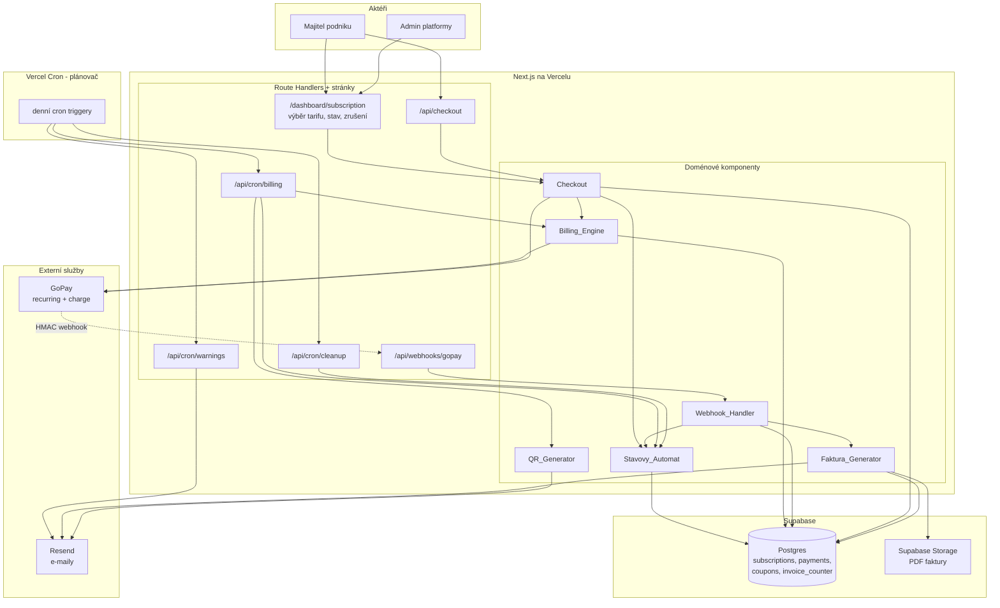
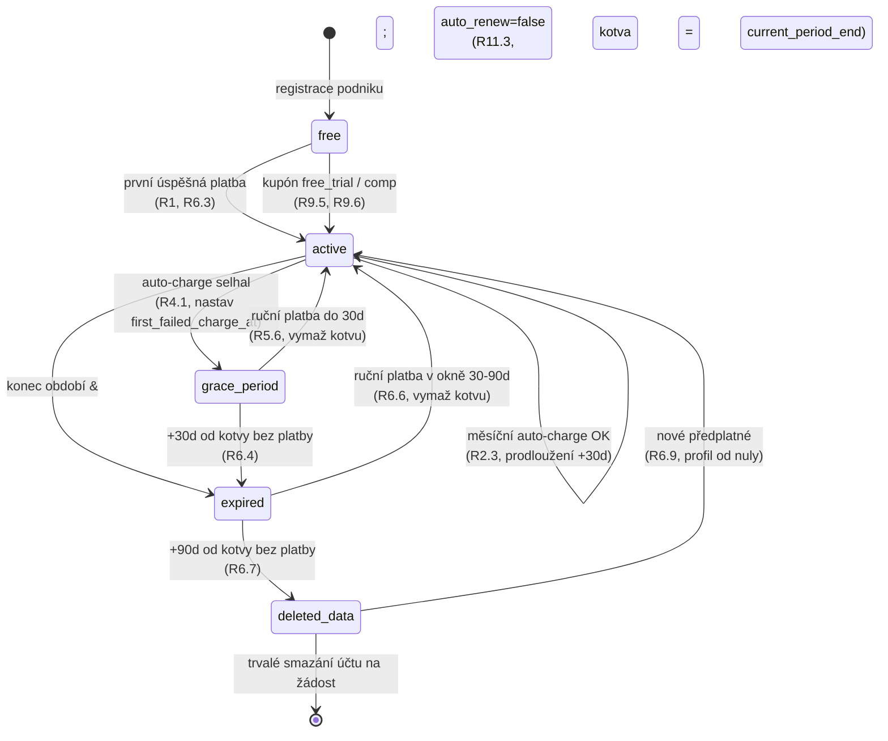
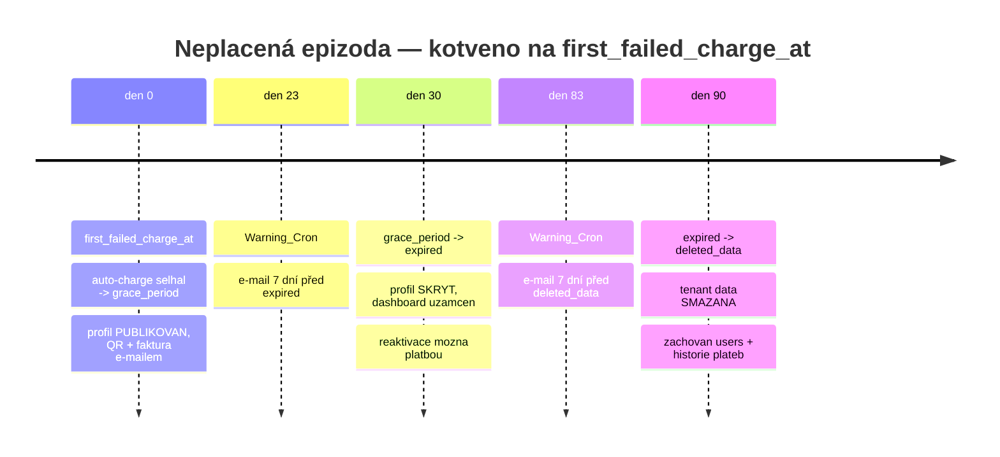
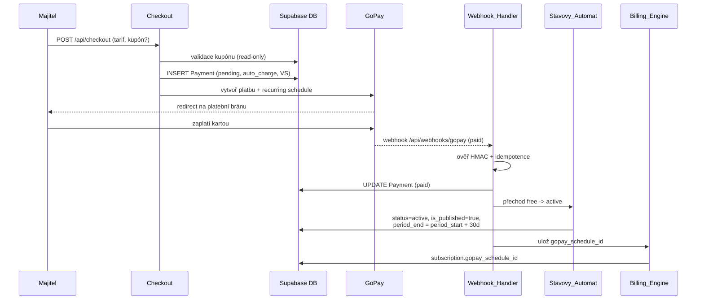
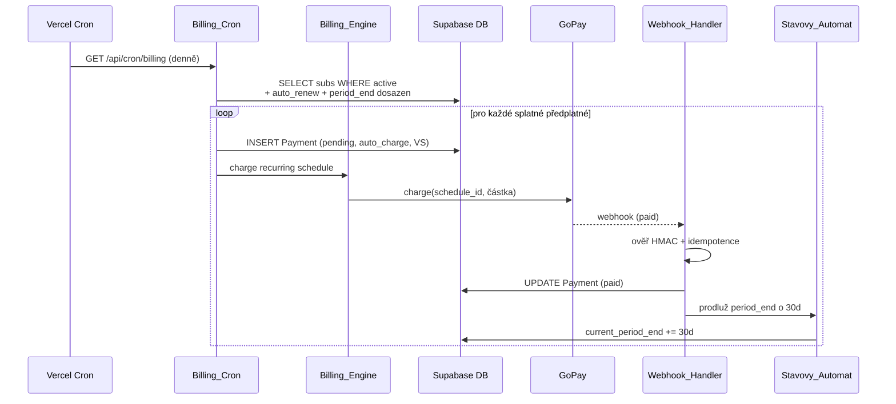
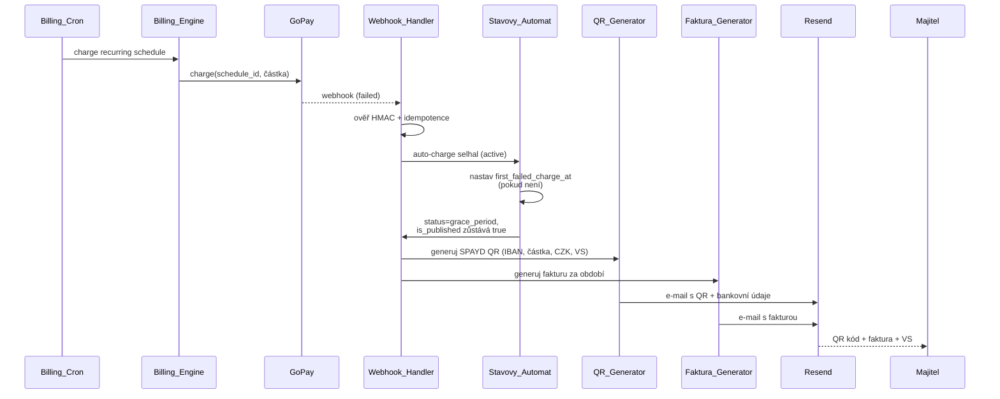

# Design Document — subscription-payments

> Návrh feature **subscription-payments** — kompletní platební a předplatitelský životní cyklus podniku na platformě Horea.
>
> Tento dokument navazuje na `architecture/design.md` (sekce *Payments*, *Security*, *Error Handling*, *Data Models*) a na `subscription-payments/requirements.md`. Drží se principu **Simplicity First** z `CLAUDE.md` — žádné spekulativní vrstvy, minimum kódu na vyřešení problému, žádná konfigurabilita, která nebyla vyžádána.
>
> Dokument obsahuje pouze **high-level design** — žádný kód, pseudokód, SQL DDL ani signatury funkcí. Vše je popsáno prózou a Mermaid diagramy.

## Overview

Tato feature pokrývá celý peněžní tok mezi podnikem a platformou: od výběru tarifu a první platby přes recurring strhávání, zpracování webhooků, fallback na ruční QR platbu, generování faktur až po deterministický stavový automat předplatného s mazáním dat dle GDPR.

Platforma je **plátce příjemce** — jediný účet, na který přicházejí platby od podniků. Z toho plynou dvě architektonická zjednodušení: číselná řada faktur je sekvenční napříč celou platformou (jeden vystavovatel faktur), a IBAN v QR platbě je vždy účet provozovatele.

Životní cyklus předplatného má pět stavů: `free`, `active`, `grace_period`, `expired`, `deleted_data`. Hlavní výzva návrhu je **determinismus časových přechodů**. Klíčové rozhodnutí: všechny lhůty (grace, reaktivace, mazání) jsou kotveny na **jedinou časovou značku `first_failed_charge_at`** (v glosáři *Prvni_Selhani*). Díky tomu je stav předplatného vždy spočitatelný jako čistá funkce dvou hodnot — kotvy a aktuálního času — bez závislosti na historii mezistavů. Tento přístup je testovatelný property-based testem a odolný vůči výpadku cronu (zmeškaný běh nezmění výsledný stav, jen okamžik jeho zápisu).

Platební kanály jsou dva:

- **Primární — GoPay recurring.** Při prvním checkoutu se založí recurring schedule, GoPay pak každý měsíc automaticky strhává.
- **Fallback — ruční QR platba (SPAYD).** Při selhání auto-charge platforma vygeneruje QR kód s variabilním symbolem a fakturou a pošle ho e-mailem. Podnikatel zaplatí převodem, admin platbu ručně spáruje (UI párování řeší spec `admin-dashboard`).

Celý cyklus pohánějí tři denní Vercel Cron úlohy: **Billing_Cron** (strhávání splatných předplatných), **Warning_Cron** (varovné e-maily před přechody) a **Cleanup_Cron** (mazání dat po vypršení lhůty).

### Návaznost na požadavky

Návrh adresuje všech 11 požadavků z `requirements.md`. Mapování hlavních designových bloků na požadavky:

| Designový blok | Požadavky |
|---|---|
| Checkout a první platba | R1, R9 |
| Recurring schedule a auto-charge | R2, R10 |
| Webhook handler (HMAC, idempotence) | R3 |
| Grace period, QR, SPAYD | R4 |
| Ruční platba a spárování | R5 |
| Stavový automat a lifecycle dat | R6, R11 |
| Faktury a číselná řada | R7 |
| Změna tarifu | R8 |
| Cron úlohy | R10 |

## Architecture

### Komponentový diagram

### Routes

Feature vystavuje následující cesty. Doménová logika je v komponentách (viz *Components and Interfaces*), route handlery jsou tenké adaptéry mezi HTTP a doménou.

| Route | Metoda | Účel | Přístup |
|---|---|---|---|
| `/dashboard/subscription` | stránka (SSR) | Výběr tarifu, zobrazení aktuálního stavu a období, zrušení/obnova automatické obnovy, žádost o změnu tarifu, aplikace kupónu. | Přihlášený majitel podniku |
| `/api/checkout` | POST | Iniciace první platby pro zvolený tarif s volitelným kupónem; vytvoří Payment `pending` a přesměruje na GoPay. | Přihlášený majitel podniku |
| `/api/webhooks/gopay` | POST | Příjem platebních notifikací od GoPay, HMAC ověření, idempotentní aktualizace Payment a Subscription. | GoPay (ověřeno HMAC) |
| `/api/cron/billing` | GET/POST | Denně: strhávání splatných předplatných, přechody do grace_period při selhání. | Vercel Cron (service role) |
| `/api/cron/warnings` | GET/POST | Denně: varovné e-maily 7 dní před přechody `grace_period`→`expired` a `expired`→`deleted_data`. | Vercel Cron (service role) |
| `/api/cron/cleanup` | GET/POST | Denně: přechod do `deleted_data` a mazání tenant dat po 90 dnech od Prvni_Selhani. | Vercel Cron (service role) |

Cron endpointy jsou chráněny tajemstvím (Vercel Cron secret / `Authorization` hlavička) a běží výhradně se service role klíčem Supabase — nikdy s uživatelským kontextem.

### Princip bezstavovosti a transakcí

V souladu s architekturou žádná komponenta nedrží stav v paměti procesu — vše stateful je v Postgresu. Každá business operace, která mění více řádků (aktivace předplatného po platbě, prodloužení období + vznik Payment + přidělení čísla faktury), probíhá v jedné DB transakci, aby nevznikaly polovičaté stavy.

## Components and Interfaces

Tato sekce popisuje doménové komponenty z glosáře requirements, jejich odpovědnost a integrační body. Žádné signatury — pouze role a vstup/výstup.

### Checkout

**Odpovědnost:** Zpracování výběru tarifu, validace a aplikace kupónu, iniciace první platby.

- **Vstup:** zvolený tarif (`start`/`pokrocily`/`max`), volitelný kód kupónu, kontext přihlášeného podniku.
- **Výstup:** záznam Payment ve stavu `pending` (metoda `auto_charge`), přesměrování na GoPay platební bránu, nebo (u kupónů free trial / comp účet) přímá aktivace předplatného bez platby.
- **Spolupracuje s:** Billing_Engine (založení recurring schedule po úspěchu), Stavovy_Automat (přechod `free`→`active`), GoPay (redirect), DB (Payment, coupons read-only).
- **Klíčové pravidlo:** Kupón se pouze *aplikuje* (čte se a inkrementuje počet použití) — CRUD kupónů je mimo rozsah (spec `admin-dashboard`).

### Billing_Engine

**Odpovědnost:** Zakládání recurring schedule v GoPay a iniciace měsíčních strhávání.

- **Vstup:** úspěšná první platba (založení schedule), splatná předplatná z Billing_Cron (měsíční charge).
- **Výstup:** `gopay_schedule_id` uložené do subscription, Payment `pending` před každým charge voláním, volání GoPay charge API.
- **Spolupracuje s:** GoPay (schedule + charge), DB (subscription, payments), Stavovy_Automat (nepřímo přes webhook po výsledku charge).
- **Klíčové pravidlo:** Před každým voláním GoPay vznikne Payment `pending`; výsledek (paid/failed) doručí asynchronně webhook. Při selhání samotného *iniciování* charge (GoPay nedostupné) se chyba zaloguje, upozorní admin a stav zůstává `active` pro opakování v dalším běhu.

### Webhook_Handler

**Odpovědnost:** Bezpečné a idempotentní zpracování platebních notifikací z GoPay na `/api/webhooks/gopay`.

- **Vstup:** HTTP POST od GoPay s podepsaným payloadem (`gopay_payment_id`, stav platby).
- **Výstup:** aktualizovaný Payment.status, vyvolání odpovídajícího přechodu Stavoveho_Automatu, HTTP odpověď.
- **Spolupracuje s:** DB (Payment lookup podle `gopay_payment_id`), Stavovy_Automat, Faktura_Generator (při přechodu na `paid`).
- **Klíčová pravidla:**
  - **HMAC ověření** podpisu proti sdílenému tajemství; při neshodě HTTP 401 a žádná změna.
  - **Idempotence** — viz sekce *Webhook idempotence* níže.
  - Neznámé `gopay_payment_id` → ignorovat, vrátit úspěch (200), nic neměnit.

### Stavovy_Automat

**Odpovědnost:** Řízení přechodů mezi stavy `subscription.status` a výpočet stavu z časové kotvy.

- **Vstup:** událost (platba úspěšná/selhala, dosažen konec období, uplynutí lhůty), aktuální stav, `first_failed_charge_at`, aktuální čas.
- **Výstup:** nový `subscription.status`, doprovodné efekty (`business.is_published`, zámek dashboardu, nastavení/vymazání kotvy).
- **Spolupracuje s:** DB (subscriptions, businesses), Cleanup_Cron (mazání dat při `deleted_data`).
- **Klíčové pravidlo:** Cílový stav v neplacené epizodě je **čistá funkce** `(first_failed_charge_at, now)` — viz *Stavový automat* a Property 1. Cron pouze zhmotňuje (perzistuje) tento výpočet, nezavádí vlastní logiku časování.

### Faktura_Generator

**Odpovědnost:** Generování PDF faktur a přidělování gap-free pořadových čísel.

- **Vstup:** Payment přecházející do `paid` (úspěšný auto-charge, spárovaná ruční platba), nebo vznik faktury při přechodu do grace_period.
- **Výstup:** PDF v Supabase Storage, `payment.invoice_url`, e-mail s fakturou přes Resend, přidělené pořadové číslo.
- **Spolupracuje s:** DB (invoice_counter se zámkem, payments), Supabase Storage, Resend.
- **Klíčové pravidlo:** Pořadové číslo se přiděluje atomicky v transakci se zámkem nad counter řádkem — viz *Číslování faktur*.

### QR_Generator

**Odpovědnost:** Generování platebního QR kódu ve formátu SPAYD 1.0.

- **Vstup:** částka v CZK dle tarifu, Variabilni_Symbol platebního pokusu, IBAN provozovatele.
- **Výstup:** SPAYD řetězec (a z něj QR obrázek) vložený do fallback e-mailu.
- **Spolupracuje s:** Resend (e-mail s QR), DB (čtení payment/variabilní symbol).
- **Klíčové pravidlo:** SPAYD řetězec je round-trip bezpečný — dekódování konformní čtečkou vrátí stejný IBAN, částku, měnu a VS (Property 4).

### Billing_Cron

**Odpovědnost:** Denní strhávání splatných předplatných (`/api/cron/billing`).

- **Vstup:** cron trigger (denně).
- **Chování:** iteruje předplatná se stavem `active`, `auto_renew=true` a dosaženým `current_period_end`; pro každé iniciuje charge přes Billing_Engine. Při selhání spustí přechod do grace_period. **Continue-on-error** — selhání jednoho podniku se zaloguje a notifikuje adminovi, zpracování ostatních pokračuje.

### Cleanup_Cron

**Odpovědnost:** Denní mazání tenant dat (`/api/cron/cleanup`).

- **Vstup:** cron trigger (denně).
- **Chování:** iteruje podniky, u kterých od `first_failed_charge_at` uplynulo ≥ 90 dní bez úspěšné platby; nastaví `subscription.status` na `deleted_data` a smaže tenant data (profil, služby, otvírací doby, rezervace, klienty). Zachová `users` (email + hash) a historii `subscriptions`/`payments`. **Continue-on-error.**

### Warning_Cron

**Odpovědnost:** Denní odesílání varovných e-mailů (`/api/cron/warnings`).

- **Vstup:** cron trigger (denně).
- **Chování:** odešle e-mail 7 dní před přechodem `grace_period`→`expired` (tj. den 23 od kotvy) a 7 dní před `expired`→`deleted_data` (tj. den 83 od kotvy). **Continue-on-error.**

## Data Models

Tato sekce popisuje **logické** rozšíření datového modelu z `architecture/design.md`. Konkrétní DDL, typy a indexy patří do `tasks.md`/implementace — zde je koncepční přehled.

### subscriptions (rozšíření)

K existujícím atributům (`plan`, `status`, `current_period_start`, `current_period_end`, `gopay_schedule_id`) přibývají:

- **`auto_renew`** (bool) — zda Platforma na konci období iniciuje automatické strhnutí (Auto_Obnova). Default `true`.
- **`first_failed_charge_at`** (timestamp, nullable) — kotva neplacené epizody (Prvni_Selhani). `null`, dokud je předplatné v pořádku; nastaví se při prvním selhání nebo při dosažení konce období s `auto_renew=false`; vymaže se při úspěšné platbě / reaktivaci.
- **`pending_plan_change`** (nullable) — požadovaný cílový tarif evidovaný jako nevyřízená změna; aplikuje se až na konci období. `null`, pokud žádná změna nečeká.

### payments

Existující záznam dle architektury (`amount_czk`, `variable_symbol`, `gopay_payment_id`, `status`, `method`, `invoice_url`). Pro tuto feature jsou relevantní:

- **`status`**: `pending` / `paid` / `failed`.
- **`method`**: `auto_charge` / `qr_manual` / `admin_manual`.
- **`variable_symbol`**: číselný, 1–10 číslic, unikátní napříč celou tabulkou.
- **`invoice_number`**: pořadové číslo faktury (viz níže), přidělené při přechodu na `paid`.

### coupons (read-only aplikace)

Čtená entita (CRUD jinde). Pro checkout relevantní: `code`, typ slevy (procento / fixní CZK / free trial dnů / comp účet), platnost, zbývající počet použití. Checkout při aplikaci ověří platnost a inkrementuje počet použití.

### invoice_counter (číselná řada faktur)

Dedikovaná tabulka/řada (counter) držící poslední přidělené pořadové číslo faktury **per kalendářní rok**. Přidělení dalšího čísla probíhá v transakci se zámkem nad příslušným řádkem (per rok), aby ani při souběhu nevznikla mezera ani duplicita. Pro české účetnictví musí být řada **gap-free a striktně rostoucí** v rámci kalendářního roku.

### Číslování faktur

České účetnictví vyžaduje souvislou (gap-free) vzestupnou číselnou řadu daňových dokladů. Návrh:

- Counter je **per kalendářní rok** (řada se na začátku roku restartuje, prefix obsahuje rok).
- Přidělení čísla = transakce, která uzamkne řádek counteru pro daný rok (`SELECT ... FOR UPDATE` ekvivalent přes Supabase), přečte poslední hodnotu, inkrementuje o 1, zapíše a uvolní zámek.
- Číslo faktury se přiděluje **až ve chvíli přechodu Payment na `paid`** (ne při `pending`), takže neúspěšné pokusy nespotřebovávají čísla → žádné mezery.
- Při souběžném dokončení více plateb zámek serializuje přidělení → striktně rostoucí, bez duplicit (Property 5).

### Variabilní symbol

Každý platební pokus dostává Variabilni_Symbol (1–10 číslic), unikátní napříč `payments`. Slouží k jednoznačnému ručnímu spárování příchozí platby. Generuje se tak, aby splňoval formát i unikátnost (např. odvození z monotónní sekvence, ne z náhody, aby byla unikátnost zaručená, ne pravděpodobnostní).

## Stavový automat předplatného

### Detailní stavový diagram

### Jediná kotva: first_failed_charge_at

Klíčové designové rozhodnutí: celá neplacená epizoda se měří od **jediné kotvy** `first_failed_charge_at`. Cílový stav je čistá funkce kotvy a aktuálního času:

| Podmínka (od kotvy) | Cílový stav |
|---|---|
| kotva `null` | `active` (žádná neplacená epizoda) |
| `0 ≤ Δ < 30 dní` | `grace_period` |
| `30 ≤ Δ < 90 dní` | `expired` (reaktivace možná úspěšnou platbou) |
| `Δ ≥ 90 dní` | `deleted_data` |

kde `Δ = now − first_failed_charge_at`. Hranice 30 a 90 dní jsou počítány v sekundách násobky délky Jeden_Mesic (30 dní = 2 592 000 s) pro deterministický výpočet.

Tento přístup zaručuje:

- **Determinismus** — stav nezávisí na tom, kdy přesně cron proběhl; zmeškaný běh cronu (Vercel výpadek) nezmění výsledný stav, jen okamžik jeho zápisu. Cron je „zhmotňovač" výpočtu, ne zdroj pravdy o čase.
- **Idempotenci přechodů** — opakovaný výpočet pro stejnou kotvu a čas dá stejný stav.
- **Testovatelnost** — viz Property 1.

Kotva se **nastaví** při prvním selhání auto-charge (`active`→`grace_period`, R4.3) nebo při dosažení konce období s `auto_renew=false` (R11.3, kotva = `current_period_end`). Kotva se **vymaže** při každé úspěšné platbě / reaktivaci (R5.6), čímž epizoda končí a předplatné se vrací do `active`.

### Časová osa

**Reaktivační okno (dny 30–90):** Ve stavu `expired` má podnikatel stále možnost reaktivovat předplatné úspěšnou platbou — data podniku ještě existují, jen je profil skrytý a dashboard uzamčený. Úspěšná platba vymaže kotvu, nastaví `active`, znovu publikuje profil. Po dni 90 už data nejsou (přechod do `deleted_data`), takže reaktivace znamená start s prázdným profilem (R6.9).

## GoPay integrace

### Sekvence 1: První platba (checkout → aktivace)

### Sekvence 2: Měsíční recurring auto-charge

### Sekvence 3: Selhání charge → grace → QR e-mail

## SPAYD QR platba

SPAYD (Short Payment Descriptor) verze 1.0 je český standard pro QR platby. Řetězec má tvar `SPD*1.0*` následovaný klíč-hodnota poli oddělenými `*`. Pro tuto feature jsou relevantní pole:

| Pole | Význam | Zdroj |
|---|---|---|
| `ACC` | účet příjemce ve formátu IBAN (volitelně + BIC) | IBAN provozovatele platformy |
| `AM` | částka | částka dle tarifu v CZK |
| `CC` | měna (ISO 4217) | vždy `CZK` |
| `X-VS` | variabilní symbol | Variabilni_Symbol platebního pokusu |

Příklad struktury (ilustrační, ne hodnoty): `SPD*1.0*ACC:CZ...*AM:199.00*CC:CZK*X-VS:12345`.

**Vložení variabilního symbolu:** VS se vkládá do nestandardního pole `X-VS` (prefix `X-` značí rozšiřující pole dle SPAYD specifikace). Banka při skenování QR předvyplní variabilní symbol z `X-VS`, což umožní jednoznačné ruční spárování příchozí platby.

**Round-trip bezpečnost:** Kódování musí být navrženo tak, aby dekódování konformní SPAYD čtečkou vrátilo přesně stejný IBAN, částku, měnu a VS, jaké byly vloženy (R4.7, Property 4). To klade požadavky na formátování částky (desetinná místa) a escapování hodnot, aby nedošlo ke ztrátě informace při round-tripu.

## Webhook idempotence

GoPay garantuje at-least-once doručení — stejný webhook může dorazit vícekrát. Handler musí být idempotentní, aby opakované doručení nezpůsobilo duplicitní stavovou změnu (R3.5, Property 2).

Postup zpracování:

1. **Ověř HMAC** podpis. Neshoda → HTTP 401, žádná změna (R3.2).
2. **Dohledej Payment** podle `gopay_payment_id`. Neexistuje → ignoruj, vrať 200, žádná změna (R3.4).
3. **Zkontroluj aktuální stav Payment** před aplikací. Pokud už Payment odpovídá hlášenému stavu (např. už je `paid` a webhook hlásí `paid`), vrať 200 bez další změny — žádný duplicitní záznam, žádný opakovaný přechod Subscription (R3.5).
4. **Jinak aplikuj** novou hodnotu a vyvolej odpovídající přechod Stavoveho_Automatu (R3.3, R3.6).

Idempotence je tedy postavena na **kontrole cílového stavu před aplikací** — ne na frontě zpracovaných ID. Jelikož přechod Stavoveho_Automatu je sám čistou funkcí kotvy a času, opakovaná aplikace stejného webhooku vede ke stejnému výslednému stavu.

## Cron úlohy

Vercel Cron spouští tři denní úlohy přes interní endpointy. Konfigurace je deklarována ve `vercel.json` (cron expressions, denní frekvence).

| Úloha | Endpoint | Frekvence | Náplň |
|---|---|---|---|
| Billing_Cron | `/api/cron/billing` | denně | Strhávání splatných předplatných, přechod do grace_period při selhání. |
| Warning_Cron | `/api/cron/warnings` | denně | Varovné e-maily den 23 a den 83 od kotvy. |
| Cleanup_Cron | `/api/cron/cleanup` | denně | Přechod do `deleted_data` a mazání tenant dat (den 90+). |

**Společné principy:**

- **Iterace přes podniky** — každá úloha načte relevantní podmnožinu předplatných a zpracuje je sekvenčně.
- **Continue-on-error** — selhání zpracování jednoho podniku se zaloguje, notifikuje adminovi e-mailem, a úloha pokračuje dalším podnikem (R10.3, R10.6). Žádný podnik nesmí zablokovat zbytek dávky.
- **Service role** — cron běží se service role klíčem (mimo RLS), protože operuje napříč tenanty.
- **Idempotence dávky** — jelikož cílové stavy jsou čisté funkce kotvy a času, opakovaný běh cronu ve stejný den nezpůsobí dvojí přechod (přechod, který už nastal, se znovu nevyhodnotí jako nový).
- **Ochrana endpointu** — cron secret v hlavičce; veřejné volání bez tajemství je odmítnuto.

## Aplikace kupónu

Kupón se při checkoutu pouze *aplikuje* (čtení + inkrement počtu použití). Typy a jejich efekt na účtovanou částku / aktivaci:

| Typ kupónu | Efekt |
|---|---|
| **Procentuální sleva** | Sníží částku první platby o dané procento. Výsledná částka = `částka × (1 − procento/100)`, zaokrouhleno dle účetních pravidel. |
| **Fixní sleva** | Sníží částku o fixní CZK, **floor na 0 Kč** (nikdy záporná částka). Výsledná částka = `max(0, částka − sleva)`. |
| **Free trial** | Nastaví `status=active`, `is_published=true`, `current_period_end = now + počet dní triala`, **bez okamžitého stržení**. Po skončení triala nastupuje běžný billing cyklus. |
| **Comp účet** | Nastaví `status=active`, `is_published=true`, **bez stržení a bez založení recurring schedule** — účet je trvale aktivní bez plateb. |

**Výpočet slevy (Property 7):** Účtovaná částka po aplikaci jakéhokoli kupónu nesmí být nikdy záporná — floor je 0 Kč. To platí jak pro fixní, tak pro procentuální slevu (procento je omezeno 0–100).

**Validace (R9.1, R9.2):** Před aplikací Checkout ověří, že kupón existuje, je v platnosti (datum) a má dostupný počet použití. Při nesplnění platbu nezahájí a zobrazí českou chybovou hlášku.

## Correctness Properties

*Property (vlastnost) je charakteristika nebo chování, které má platit napříč všemi validními běhy systému — v podstatě formální tvrzení o tom, co má systém dělat. Vlastnosti tvoří most mezi lidsky čitelnou specifikací a strojově ověřitelnými zárukami správnosti.*

Následující vlastnosti vznikly z prework analýzy akceptačních kritérií a po reflexi byly konsolidovány tak, aby každá poskytovala unikátní validační hodnotu (odstranění logicky redundantních a sloučitelných kritérií). Jsou určeny pro property-based testování knihovnou **fast-check** (TypeScript). Kritéria klasifikovaná jako EXAMPLE / EDGE_CASE / INTEGRATION / SMOKE jsou pokryta v sekci *Testing Strategy*, ne zde.

### Property 1: Validita stavového automatu a deterministické anchored timeouty

*Pro libovolnou* časovou kotvu `first_failed_charge_at` a libovolný aktuální čas `now` platí, že výpočet stavu předplatného je deterministická čistá funkce `(first_failed_charge_at, now)`: kotva `null` ⇒ `active`; `0 ≤ Δ < 30 dní` ⇒ `grace_period`; `30 ≤ Δ < 90 dní` ⇒ `expired`; `Δ ≥ 90 dní` ⇒ `deleted_data` (kde `Δ = now − first_failed_charge_at`). Současně *pro libovolnou* legitimní posloupnost událostí jsou všechny přechody validní (žádný neočekávaný přechod) a doprovodné invarianty stavů platí: v `active` a `grace_period` je `business.is_published = true`, v `expired` a `deleted_data` je `business.is_published = false`; úspěšná platba v `grace_period`/`expired` vede do `active` a vymaže kotvu; první selhání nepřepíše již nastavenou kotvu.

**Validates: Requirements 1.3, 1.6, 3.6, 4.1, 4.2, 4.3, 5.6, 6.3, 6.4, 6.5, 6.6, 6.7, 11.3**

### Property 2: Idempotence webhooku

*Pro libovolný* validní GoPay webhook platí, že jeho aplikace dvakrát po sobě vede ke stejnému výslednému stavu Payment i Subscription jako jeho jediná aplikace — bez vytvoření duplicitního záznamu a bez opakovaného přechodu Stavoveho_Automatu. Webhook odkazující na neexistující `gopay_payment_id` nezpůsobí žádnou změnu.

**Validates: Requirements 3.4, 3.5**

### Property 3: Formát a unikátnost variabilního symbolu

*Pro libovolnou* posloupnost vygenerovaných platebních pokusů platí, že každý přidělený Variabilni_Symbol je tvořen pouze číslicemi o délce 1 až 10 znaků a žádné dva platební pokusy nesdílejí stejný Variabilni_Symbol.

**Validates: Requirements 5.1, 5.2**

### Property 4: SPAYD round-trip

*Pro libovolnou* validní kombinaci IBAN, částky v CZK, měny `CZK` a Variabilního_Symbolu platí, že zakódování do SPAYD 1.0 řetězce a jeho následné dekódování konformní čtečkou vrátí přesně stejný IBAN, částku, měnu a Variabilni_Symbol.

**Validates: Requirements 4.4, 4.7**

### Property 5: Monotonie a bezmezerovost číslování faktur

*Pro libovolnou* posloupnost přidělení čísel faktur — včetně souběžného přidělení — platí, že přidělená čísla jsou v rámci kalendářního roku striktně rostoucí, unikátní (žádné duplicity) a bezmezerová (každé další číslo je přesně o 1 vyšší než předchozí).

**Validates: Requirements 7.2, 7.3, 7.4**

### Property 6: Prodloužení období o přesně jeden měsíc

*Pro libovolný* počáteční čas a libovolnou úspěšnou platbu (první, recurring i ručně spárovanou) platí, že `current_period_end` se prodlouží přesně o Jeden_Mesic (2 592 000 sekund) oproti výchozí hodnotě.

**Validates: Requirements 1.5, 2.3, 5.5**

### Property 7: Korektnost slevy kupónu

*Pro libovolný* tarif a libovolný platný kupón (procentuální sleva 0–100 %, nebo fixní sleva v CZK) platí, že výsledná účtovaná částka první platby není nikdy záporná — je vždy ≥ 0 Kč (floor na 0).

**Validates: Requirements 9.3, 9.4**

### Property 8: Úplnost mazání dat

*Pro libovolný* dataset podniku platí, že po přechodu do stavu `deleted_data` neexistují žádná tenant data podniku (profil, služby, otvírací doby, rezervace, klienti), zatímco záznam uživatele v `users` (pouze e-mail a password hash) a kompletní historie v `subscriptions` a `payments` zůstávají zachovány.

**Validates: Requirements 6.7, 6.8**

## Error Handling

Návrh přebírá obecné principy z `architecture/design.md` (sekce *Error Handling*) a doplňuje specifika platební vrstvy. Všechny uživatelské hlášky jsou **v češtině**.

### Klasifikace chyb v platební vrstvě

| Situace | Reakce | Hláška / efekt |
|---|---|---|
| Neplatný HMAC podpis webhooku | HTTP 401, žádná změna Payment/Subscription | Bez hlášky uživateli (server-to-server); zaloguje se pokus o podvržení |
| Webhook s neznámým `gopay_payment_id` | HTTP 200, žádná změna | Idempotentní ignorace |
| Selhání iniciace auto-charge (GoPay nedostupné) | Log + admin notifikace, stav zůstává `active` | Opakování v dalším běhu Billing_Cron |
| Selhání auto-charge (GoPay vrátí failed) | Přechod do `grace_period`, QR + faktura e-mailem | „Platbu se nepodařilo strhnout. Zaplaťte prosím převodem dle přiloženého QR kódu." |
| Neplatný / vyčerpaný / expirovaný kupón | Platba nezahájena | „Kupón není platný nebo byl již vyčerpán." |
| Selhání generování/odeslání faktury (Resend) | Best-effort retry, log, admin notifikace | Neblokuje aktivaci předplatného (platba je dokončená) |
| Selhání zpracování podniku v cronu | Continue-on-error: log + admin notifikace, pokračuj | Žádný podnik nezablokuje dávku |
| Timeout externího volání (>~10 s) | Ukončení s chybou | „Platební brána neodpovídá, zkuste to prosím znovu." |

### Zásady

- **Platba je zdroj pravdy přes webhook, ne přes redirect.** Aktivace předplatného nastává až potvrzeným webhookem `paid`, ne návratem uživatele z brány — návrat z brány je pouze UX.
- **Transakční hranice.** Aktivace po platbě (status + is_published + period_end + přidělení čísla faktury) je jedna DB transakce — žádné polovičaté stavy.
- **Best-effort kanály neblokují core.** Selhání Resend (faktura, QR e-mail, warning) se zaloguje a notifikuje, ale nezvrátí dokončenou platbu ani přechod stavu.
- **Continue-on-error v cronu.** Selhání jednoho podniku se zaloguje, pošle adminovi a dávka pokračuje (R10.3, R10.6).
- **Idempotence webhooků.** Kontrola cílového stavu před aplikací (viz *Webhook idempotence*).

## Testing Strategy

Strategie je v souladu s `architecture/design.md` — přiměřená kapacitě jednoho vývojáře, s důrazem na to, co nejvíc bolí při selhání (platby a stavový automat). PBT je pro tuto feature **vhodné**, protože jádro tvoří čisté funkce a doménová logika s velkým vstupním prostorem (stavový automat, SPAYD serializace, číslování, výpočet slev).

### Property-based testy (fast-check)

Každá z 8 vlastností z sekce *Correctness Properties* je implementována **jediným** property-based testem knihovnou **fast-check**. Pravidla:

- **Knihovna se nepíše od nuly** — použije se `fast-check` z TypeScript ekosystému.
- **Minimálně 100 iterací** na každý property test.
- Každý test je **otagován** odkazem na vlastnost z tohoto dokumentu ve formátu:
  `Feature: subscription-payments, Property {číslo}: {text vlastnosti}`
- Generátory pokrývají edge-cases identifikované v prework: neznámá `gopay_payment_id` (Property 2), hraniční Δ kolem 30/90 dní (Property 1), VS na hranici délky 1 a 10 číslic (Property 3), částky a procenta na hranicích 0/100 (Property 7), prázdné i bohaté datasety podniku (Property 8), souběžné přidělení čísel (Property 5).

Mapování property → test:

| Property | Co generátor varíruje | Co se ověřuje |
|---|---|---|
| 1 — stavový automat | kotva (vč. null), now, posloupnost událostí | správný stav + invarianty is_published + kotva |
| 2 — webhook idempotence | payload webhooku, opakování | stejný stav po 1× i 2× aplikaci |
| 3 — variabilní symbol | posloupnost pokusů | formát 1-10 číslic + unikátnost |
| 4 — SPAYD round-trip | IBAN, částka, VS | encode→decode zachová hodnoty |
| 5 — číslování faktur | posloupnost (i souběžná) přidělení | rostoucí, unikátní, gap-free |
| 6 — prodloužení období | počáteční čas | +30 dní přesně |
| 7 — sleva kupónu | tarif, typ a velikost slevy | částka ≥ 0 |
| 8 — mazání dat | dataset podniku | zbývá jen email+hash + historie plateb |

### Unit testy (příklady a edge-cases)

Pro kritéria klasifikovaná jako EXAMPLE / EDGE_CASE — konkrétní scénáře, ne univerzální vlastnosti:

- Mapování tarif → částka (199/299/599) a vytvoření Payment (R1.1).
- Pořadí: Payment `pending` před voláním GoPay (R2.4).
- HMAC ověření: validní podpis akceptován, neplatný → 401 (R3.1, R3.2).
- Selhání iniciace charge ponechá `active` + notifikace (R2.5).
- Warning predikáty: e-mail jen v den 23 a den 83 od kotvy (R6.10, R6.11).
- Změna tarifu: záznam pending, aplikace na konci období, žádná prorace, zrušení (R8.1–8.4).
- Validace kupónu a české chybové hlášky (R9.1, R9.2); free trial a comp aktivace bez platby (R9.5, R9.6).
- Zrušení a opětovné zapnutí auto-obnovy (R11.1, R11.2, R11.4).
- Continue-on-error v cronu (R10.3, R10.6).

> Pozn.: Unit testů držíme minimum — univerzální chování pokrývají property testy. Unit testy cílí jen na konkrétní příklady, hranice a integrační body.

### Integrační testy

Proti lokálnímu Supabase (Docker) / GoPay sandboxu:

- **Webhook handler** end-to-end: HMAC, mapování stavu, idempotence při opakovaném doručení, aktivace předplatného (R3.3, R1.3–1.4).
- **Stavové přechody** přes cron: billing → grace_period, cleanup → deleted_data (R10.1, R10.2, R10.4).
- **Číslování faktur** proti reálné DB se skutečným zámkem řádku (ověření Property 5 i na úrovni DB, ne jen logiky).
- **Faktura**: generování PDF, uložení do Supabase Storage, nastavení `invoice_url` (R7.1, R7.5, R7.6).
- **Reaktivace** z `deleted_data` → `active` s prázdným profilem (R6.9).

### End-to-end testy (Playwright)

Pouze **happy path** kritických flow:

- Registrace → výběr tarifu → checkout → (GoPay sandbox) → aktivace → publikovaný profil → doručená faktura.

### Manuální / sandbox ověření

- **GoPay sandbox** pro recurring schedule a charge — produkční flow se ověřuje manuálně po deployi.
- Doručitelnost e-mailů (Resend) — manuální spot check.
