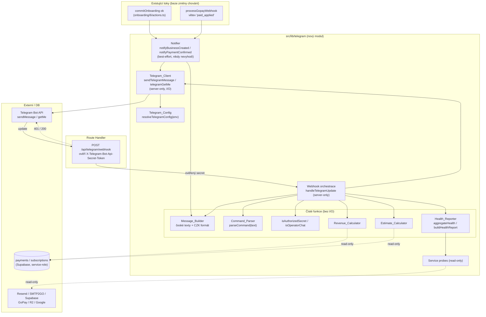

# Návrhový dokument — telegram-operator-notifications

## Overview

Funkce **telegram-operator-notifications** zavádí do platformy Horea **první** integraci
s Telegramem. V codebase zatím **žádná Telegram integrace neexistuje** — žádný adresář
`src/lib/telegram`, žádné `TELEGRAM_*` proměnné, žádný kód. Tento návrh ji zakládá kompletně
od nuly. Integrace je čistě **operátorská** (provozovatel platformy), nedotýká se vlastníků
podniků ani koncových zákazníků.

Návrh řeší dva kanály z requirements:

1. **PUSH notifikace** — best-effort vedlejší efekt navázaný na dva existující body v kódu:
   - dokončení onboardingu (`commitOnboarding` → server action `src/app/onboarding/6/actions.ts`),
   - potvrzená platba (větev `paid_applied` v `processGopayWebhook`, `src/lib/webhooks/handler.ts`).
2. **ON-DEMAND příkazy** — příchozí Telegram webhook (Route Handler) ověří secret token,
   autorizuje pouze chat operátora a obslouží příkazy `/trzby`, `/odhad`, `/stav`, `/start`, `/help`.

Návrh stojí na čtyřech principech vycházejících z requirements a steering pravidel projektu:

1. **Server-only izolace tajemství (R1.4, R2.2, R2.3).** `TELEGRAM_BOT_TOKEN`,
   `TELEGRAM_OPERATOR_CHAT_ID` a `TELEGRAM_WEBHOOK_SECRET` čte výhradně server-only kód
   (každý modul s I/O začíná `import 'server-only'`, stejně jako `handler.ts` a `log-server.ts`).
   Tajemství ani těla požadavků se nikdy nelogují — logují se jen kategorie/identifikátory přes
   existující `serverLog`.
2. **Fail-safe a no-op bez konfigurace (R1, R5).** Chybějící konfigurace ⇒ modul je no-op,
   nikdy nevyhodí výjimku a nikdy nezablokuje registraci ani platbu. Veškeré odesílání notifikací
   je best-effort, obalené tak, že chyba nikdy nepropadne do volajícího toku.
3. **Čisté, testovatelné jádro (R9, R10, R11, R13, R14).** Výpočet tržeb, odhadu, agregace
   zdraví služeb, parsování příkazů, autorizace a sestavení českých textů jsou **čisté funkce**
   bez I/O v `src/lib/telegram/`. Tím jsou přímo pokryté property-based testy; I/O vrstva
   (volání Telegram Bot API, čtení DB) se testuje příklady s mocky.
4. **Znovupoužitelnost pro `admin-system-tools` (R15).** Odesílací helper `sendTelegramMessage`
   a read-only health-probe `telegramGetMe` jsou navržené jako samostatné server-only funkce,
   na které později naváže admin „Správa systému" (Telegram health probe + tlačítko „Odeslat
   testovací zprávu"). Datový model stavu služeb je sladěn s návrhem `admin-system-tools`
   (`ServiceStatus`, precedence `down > degraded > ok`), aby šly probe v budoucnu sjednotit.

### Vztah k `admin-system-tools` (cross-reference)

`admin-system-tools` (samostatný spec, zatím neimplementovaný — `src/lib/system/` neexistuje)
počítá s `runHealthChecks()`/`aggregateStatus()` nad šesti službami a se stejným typem
`ServiceStatus = 'ok' | 'degraded' | 'down'`. Tato funkce:

- **poskytuje** `sendTelegramMessage` (force-send podklad) a `telegramGetMe` (health-probe podklad),
  které admin UI zkonzumuje beze změny;
- **přebírá** stejný status-model a precedenci agregace, aby `/stav` a budoucí admin health panel
  hlásily konzistentně.

Protože `admin-system-tools` ještě neexistuje, tato funkce si pro `/stav` nese **vlastní
minimální sadu probe** sledovaných služeb. Typy jsou ale záměrně kompatibilní; až
`admin-system-tools` dodá `runHealthChecks()`, lze probe sjednotit bez změny `Health_Reporter`
(čistá funkce nad výsledky probe). Toto je vědomý kompromis (Simplicity First) — nezavádíme
sdílený modul dopředu pro spec, který se teprve bude stavět.

### Mapování sekcí návrhu na requirements

| Sekce návrhu | Requirements |
|---|---|
| Telegram_Config (resolve env, Feature_Enabled) | R1 |
| Telegram_Client (`sendTelegramMessage`, `telegramGetMe`) | R2, R15 |
| Notifier (business created, payment confirmed) + integrační hooky | R3, R4, R5, R6 |
| Route Handler `/api/telegram/webhook` + ověření secretu | R7 |
| Webhook orchestrace + autorizace chatu | R7, R8 |
| Command_Parser + dispatch | R8, R12 |
| Revenue_Calculator (čistá) | R9, R13 |
| Estimate_Calculator (čistá) | R10, R13 |
| Health_Reporter (čistá agregace) + service probes | R11 |
| Message_Builder (české texty, CZK formát) | R3, R4, R9–R12, R14 |
| Error Handling | R1, R2, R5, R7 |
| Testing Strategy | R9–R14 |

## Architecture

Integrace má dvě nezávislé cesty: **odchozí** (PUSH notifikace jako vedlejší efekt existujících
toků) a **příchozí** (webhook s příkazy). Obě sdílejí `Telegram_Config` a `Telegram_Client`.



### Datový tok PUSH notifikace (R3, R4, R5, R6)

1. Existující tok dosáhne bodu úspěchu (`commitOnboarding` vrátí `{ ok: true }`, resp.
   `processGopayWebhook` vrátí `paid_applied`).
2. Tok zavolá `notifyBusinessCreated(...)` / `notifyPaymentConfirmed(...)`. Volání je
   **awaitované, ale obalené** tak, že jeho selhání ani výjimka neovlivní výsledek toku (R5).
3. Notifier sestaví český text přes `Message_Builder` a zavolá `sendTelegramMessage`.
4. `Telegram_Client` ověří `Feature_Enabled`; není-li, vrátí `skipped` (R1.2, R1.3). Jinak
   odešle `sendMessage` na `Operator_Chat_Id` (R2.1). Chyba API → `failed` (R2.3).
5. **Dedup (R6)** je zajištěn místem napojení, ne novým úložištěm — viz *Dedup notifikací* níže.

### Datový tok příchozího příkazu (R7, R8, R9–R12)

1. Telegram pošle `POST /api/telegram/webhook` s hlavičkou `X-Telegram-Bot-Api-Secret-Token`.
2. Route Handler ověří hlavičku proti `Webhook_Secret` čistou funkcí `isAuthorizedSecret`
   (R7.1–R7.3). Neshoda/chybějící secret → HTTP 401, žádná business logika. Nenastavený
   `TELEGRAM_WEBHOOK_SECRET` → odmítnout vše (R7.3).
3. Route Handler naparsuje tělo. Syntakticky neplatné tělo → HTTP 200 bez příkazu (R7.4).
4. `handleTelegramUpdate` autorizuje odesílatele přes `isOperatorChat(chatId, operatorChatId)`
   (R8). Cizí chat → ignorovat, žádná odpověď.
5. `parseCommand` rozpozná příkaz; dispatcher načte data (service-role čtení pro `/trzby`,
   `/odhad`; probe pro `/stav`), zavolá čistý kalkulátor/reporter a sestaví českou odpověď.
6. Odpověď se odešle **výhradně** na `Operator_Chat_Id` přes `sendTelegramMessage` (R8.3).

### Dedup notifikací (R6) — bez nového úložiště

V duchu *Simplicity First* nezavádíme tabulku pro deduplikaci, protože oba body napojení už mají
přirozenou „nejvýše jednou" sémantiku:

- **Platba (R6.1):** notifikace se posílá **pouze** z větve, kde `processGopayWebhook` vrátí
  `paid_applied`. Tento výsledek vzniká jen u doručení, které guarded flipem skutečně překlopilo
  `payments.status` na `paid` (`UPDATE ... WHERE status <> 'paid'`). Opakovaná i souběžná doručení
  téhož webhooku dostanou `noop` a notifikaci neposílají. Tím je „nejvýše jedna notifikace na
  platbu" odvozena z existující idempotence webhooku, bez ohledu na počet doručení.
- **Nový podnik (R6.2):** `commit_onboarding` vytvoří podnik jednou; opakované volání selže na
  unikátnosti slugu (`23505` → `slug_taken`) a nevrátí `{ ok: true }`. Notifikace se posílá jen po
  `{ ok: true }`, tedy nejvýše jednou na podnik.

**Hranice / kompromis:** kdyby se sémantika kterékoli cesty změnila na „alespoň jednou" se
skutečným opakováním úspěšné větve, bylo by potřeba doplnit dedup klíč (např. tabulka
`telegram_notifications(event_type, dedup_key UNIQUE)` s `INSERT ... ON CONFLICT DO NOTHING`,
kde se notifikace pošle jen když insert ovlivnil řádek). Tato funkce to nezavádí, jen označuje
jako budoucí rozšíření.

## Components and Interfaces

Veškerý nový kód žije v `src/lib/telegram/` (čisté jádro + server-only I/O) a v jednom Route
Handleru. Moduly s I/O začínají `import 'server-only'`.

### 1. Telegram_Config — `src/lib/telegram/config.ts` (R1)

```typescript
import 'server-only';

/** Vyřešená konfigurace, když je Feature_Enabled aktivní. */
export interface TelegramConfig {
  botToken: string;
  operatorChatId: string;
}

/**
 * Čistá funkce: z mapy proměnných odvodí konfiguraci. Vrací TelegramConfig jen
 * když jsou botToken i operatorChatId neprázdné (R1.1); jinak null (R1.2).
 * NIKDY nevrací hodnoty do logů — jen je předává volajícímu server-only kódu.
 */
export function resolveTelegramConfig(
  env: Record<string, string | undefined>,
): TelegramConfig | null;

/** Čistá funkce: webhook secret nebo null, když TELEGRAM_WEBHOOK_SECRET není nastaven (R7.3). */
export function resolveWebhookSecret(env: Record<string, string | undefined>): string | null;

/** I/O wrapper: předá process.env do resolveTelegramConfig. Jediné místo čtení tokenu/chatu. */
export function getTelegramConfig(): TelegramConfig | null;
```

`Feature_Enabled` = `resolveTelegramConfig(process.env) !== null`. Webhook secret je nezávislý
(příchozí cesta může být ověřitelná i bez chat id, ale odpovědi vyžadují plnou konfiguraci).

### 2. Telegram_Client — `src/lib/telegram/client.ts` (R2, R15)

```typescript
import 'server-only';

/** Kategorizovaný výsledek odeslání — bez Secret_Value, vhodný k logování. */
export type SendResult =
  | { status: 'sent' }
  | { status: 'skipped'; reason: 'feature_disabled' }   // R1.2, R1.3
  | { status: 'failed'; errorKind: 'http_error' | 'network_error' | 'unexpected' }; // R2.3

/**
 * Reusable server-only helper (R15.1). Odešle text na Operator_Chat_Id přes Telegram Bot API
 * `sendMessage` (R2.1). Když Feature_Enabled není aktivní → 'skipped' bez výjimky (R1.2, R1.3).
 * Při chybě/nedostupnosti API → 'failed' s kategorií, NIKDY nevyhodí (R2.3). Bot_Token ani text
 * se nelogují (R2.2). parse_mode 'HTML' s escapovaným uživatelským obsahem.
 */
export async function sendTelegramMessage(text: string): Promise<SendResult>;

/** Read-only health probe (R15.2, R15.3). */
export type GetMeResult =
  | { status: 'ok' }
  | { status: 'skipped'; reason: 'feature_disabled' }
  | { status: 'error'; errorKind: 'http_error' | 'network_error' | 'unexpected' };

/**
 * Ověří dostupnost Telegram Bot API metodou `getMe` BEZ odeslání jakékoli zprávy (R15.2).
 * Vrací jen stav a kategorii chyby, nikdy Bot_Token ani odpověď API (R15.3).
 * Podklad pro budoucí admin-system-tools Telegram health probe.
 */
export async function telegramGetMe(): Promise<GetMeResult>;
```

Implementace volá `https://api.telegram.org/bot<token>/sendMessage` resp. `/getMe` přes `fetch`.
Token je v URL pouze za běhu; do `serverLog` jde výhradně `status`/`errorKind`.

### 3. Notifier — `src/lib/telegram/notifications.ts` (R3, R4, R5)

```typescript
import 'server-only';

/** Vstup notifikace o novém podniku — jen název (R3.2, R3.3). */
export interface BusinessCreatedInput {
  businessName: string;
  createdAt: Date; // okamžik vzniku; formátuje se v Europe/Prague
}

/** Vstup notifikace o platbě — název, tarif, částka (R4.2, R4.3). */
export interface PaymentConfirmedInput {
  businessName: string;
  plan: SubscriptionPlan;     // z src/lib/checkout/pricing.ts
  amountCzk: number;
}

/**
 * Best-effort notifikace. Sestaví český text a odešle přes sendTelegramMessage.
 * Veškeré chyby zachytí (R5.3) — vrací SendResult pro logování/test, ale NIKDY nevyhodí
 * výjimku do volajícího toku (R5.1, R5.2).
 */
export async function notifyBusinessCreated(input: BusinessCreatedInput): Promise<SendResult>;
export async function notifyPaymentConfirmed(input: PaymentConfirmedInput): Promise<SendResult>;
```

**Integrační hooky (minimální, surgical změny):**

- `src/app/onboarding/6/actions.ts` — po `result.ok`, **před** `redirect('/dashboard')`:
  načíst název nově vzniklého podniku (server-side) a zavolat `await notifyBusinessCreated(...)`
  v `try/catch` bez vlivu na redirect (R3.1, R5.1). Pozn.: `redirect()` v Next.js vyhazuje
  interní `NEXT_REDIRECT` — notifikace proto musí proběhnout a být dokončena před `redirect`.
- `src/lib/webhooks/handler.ts` — ve `applyPaid` v místě úspěšného `return { ok: true,
  outcome: 'paid_applied' }`: po dohledání názvu podniku (řádek už načítá `business.name` pro
  fakturu) zavolat `await notifyPaymentConfirmed({ businessName, plan: sub.plan,
  amountCzk: payment.amount_czk })` v `try/catch`; selhání jen zalogovat, výsledek webhooku
  nezměnit (R4.1, R5.2). Tarif a částka jsou v handleru dostupné (`sub.plan`, `payment.amount_czk`).

### 4. Route Handler — `src/app/api/telegram/webhook/route.ts` (R7)

Tenký adaptér mezi HTTP a `handleTelegramUpdate`, vzorovaný podle existující
`app/api/webhooks/gopay/route.ts`:

1. Načte `resolveWebhookSecret(process.env)`; když `null` → HTTP 401, log `telegram_webhook_secret_missing`
   bez Secret_Value (R7.3).
2. Porovná `request.headers.get('x-telegram-bot-api-secret-token')` přes `isAuthorizedSecret`
   v konstantním čase. Neshoda/chybí → HTTP 401, žádná business logika (R7.2).
3. `await request.json()` v `try/catch`; neplatné tělo → HTTP 200 bez příkazu (R7.4).
4. Předá validní update do `handleTelegramUpdate(update)` a vrátí HTTP 200.

### 5. Webhook orchestrace + autorizace — `src/lib/telegram/webhook.ts` (R7, R8, R12)

```typescript
import 'server-only';

/** Čistá funkce: konstantní porovnání secretu (R7.1, R7.2); false když configured je null (R7.3). */
export function isAuthorizedSecret(headerValue: string | null, configured: string | null): boolean;

/** Čistá funkce: true právě když chat odesílatele odpovídá Operator_Chat_Id (R8.1, R8.2). */
export function isOperatorChat(chatId: string | number, operatorChatId: string): boolean;

/**
 * Orchestruje ověřený update: autorizace chatu (R8), parse příkazu, dispatch, odpověď výhradně
 * na Operator_Chat_Id (R8.3). Cizí chat → ignorovat bez odpovědi (R8.2). Best-effort odeslání.
 */
export async function handleTelegramUpdate(update: unknown): Promise<void>;
```

### 6. Command_Parser — `src/lib/telegram/commands.ts` (R8, R12)

```typescript
export type Command = 'trzby' | 'odhad' | 'stav' | 'start' | 'help';

export type ParsedCommand =
  | { kind: 'command'; command: Command }
  | { kind: 'unknown' };   // jakýkoli text, který není známým příkazem (R12.2)

/**
 * Čistá funkce: rozpozná příkaz z textu zprávy. Akceptuje vedoucí '/', volitelný '@botname'
 * suffix (Telegram konvence) a okolní whitespace, case-insensitive. Cokoli jiného → 'unknown'.
 */
export function parseCommand(text: string | undefined | null): ParsedCommand;
```

### 7. Revenue_Calculator — `src/lib/telegram/revenue.ts` (R9, R13)

```typescript
/** Minimální tvar platby pro výpočet (čte se jen amount_czk; filtr period/paid dělá I/O vrstva). */
export interface RevenuePaymentRow {
  amount_czk: number;
}

/**
 * Čistá funkce (R13.1): součet amount_czk vstupních plateb. Volající (I/O vrstva) předá pouze
 * platby se status='paid' v daném kalendářním měsíci (R9.2). Prázdný vstup → 0 (R9.3, R13.3).
 */
export function calculateRevenueCzk(payments: ReadonlyArray<RevenuePaymentRow>): number;
```

I/O wrapper `getCurrentMonthRevenueCzk(supabase, now)` spočítá hranice aktuálního kalendářního
měsíce v Europe/Prague, načte `payments` se `status='paid'` a `created_at` v období (jako
`sumPaidRevenueCzk` v `admin/stats.ts`) a předá je do čisté funkce.

### 8. Estimate_Calculator — `src/lib/telegram/estimate.ts` (R10, R13)

```typescript
import type { SubscriptionPlan } from '@/lib/checkout/pricing';

/** Minimální tvar předplatného pro odhad. */
export interface EstimateSubscriptionRow {
  plan: SubscriptionPlan;
}

/**
 * Čistá funkce (R13.2): odhad = součet planPriceCzk přes vstupní předplatná (R10.2, R10.3).
 * Cenu každého předplatného odvozuje výhradně z jednotného ceníku planPriceCzk. Volající
 * předá jen aktivní předplatná s auto_renew, jejichž current_period_end spadá do příštího
 * kalendářního měsíce. Výsledek je vždy nezáporný (R10.4, R13.4) — ceník je nezáporný.
 */
export function estimateNextMonthRevenueCzk(
  subscriptions: ReadonlyArray<EstimateSubscriptionRow>,
): number;
```

I/O wrapper `getNextMonthEstimateCzk(supabase, now)` spočítá hranice příštího kalendářního měsíce
v Europe/Prague, načte `subscriptions` se `status='active'`, `auto_renew=true` a
`current_period_end` v tom období, a předá je do čisté funkce.

### 9. Health_Reporter — `src/lib/telegram/health.ts` (R11)

Status-model sladěn s `admin-system-tools` (`ServiceStatus`, precedence `down > degraded > ok`).

```typescript
/** Sladěno s admin-system-tools. */
export type ServiceStatus = 'ok' | 'degraded' | 'down';

export type MonitoredService =
  | 'supabase' | 'resend' | 'smtp2go' | 'gopay' | 'r2' | 'google';

/** Per-service výsledek BEZ Secret_Value (R11.6). */
export interface ServiceHealth {
  service: MonitoredService;
  label: string;          // český název pro odpověď
  status: ServiceStatus;
}

/**
 * Čistá funkce: agreguje per-service statusy s precedencí down > degraded > ok (R11.3).
 * Když jsou všechny 'ok' (i prázdný vstup) → 'ok' (R11.4).
 */
export function aggregateHealth(statuses: ReadonlyArray<ServiceStatus>): ServiceStatus;

/**
 * Čistá funkce: z výsledků probe sestaví report (seznam služeb + agregovaný stav). Selhání
 * probe je už reprezentováno jako status 'down' u dané služby (R11.5) — agregace pokračuje
 * přes ostatní. Výstup neobsahuje žádné Secret_Value (R11.6).
 */
export function buildHealthReport(services: ReadonlyArray<ServiceHealth>): {
  services: ReadonlyArray<ServiceHealth>;
  aggregate: ServiceStatus;
};
```

I/O wrapper `runServiceProbes()` spustí read-only probe všech šesti služeb (R11.2) paralelně přes
`Promise.allSettled`; selhání/timeout libovolné probe → `status: 'down'` u té služby a pokračuje
dál (R11.5). Probe jsou read-only (žádný zápis, žádné odeslání e-mailu/platby) a vrací jen
`ServiceStatus` — token/klíč se nikdy nepropaguje do výsledku (R11.6). Typy jsou kompatibilní s
budoucím `admin-system-tools` `runHealthChecks()`; až vznikne, lze probe nahradit jeho výstupem
bez změny `buildHealthReport`.

### 10. Message_Builder — `src/lib/telegram/messages.ts` (R3, R4, R9–R12, R14)

Čisté funkce sestavující **české** texty; částky formátované v CZK pro Europe/Prague.

```typescript
/** Formát CZK: cs-CZ oddělovač tisíců, bez desetinných míst, sufix " Kč" (R14.1, R14.2). */
export function formatCzk(amountCzk: number): string;

/** Formát okamžiku v Europe/Prague (R3.2, R14.1). */
export function formatPragueDateTime(at: Date): string;

export function buildBusinessCreatedMessage(input: BusinessCreatedInput): string; // R3.2, R3.3
export function buildPaymentConfirmedMessage(input: PaymentConfirmedInput): string; // R4.2, R4.3
export function buildRevenueMessage(amountCzk: number): string;     // R9.1, R9.3
export function buildEstimateMessage(amountCzk: number): string;    // R10.1, R10.4
export function buildHealthMessage(report: HealthReport): string;   // R11.1
export function buildHelpMessage(): string;                         // R12.1
export function buildUnknownCommandMessage(): string;               // R12.2 (odkaz na /help)
```

`formatCzk` znovupoužije existující vzor `Intl.NumberFormat('cs-CZ', { maximumFractionDigits: 0 })`
z `src/lib/analytics/analytics.ts`. České labely tarifů (`Start` / `Pokročilý` / `Max`) převezmou
mapování z `handler.ts` (`planDescription`).

## Data Models

Tato funkce **nezavádí žádné nové DB tabulky ani migrace**. Čte existující `payments` a
`subscriptions` přes service-role klienta (read-only) a definuje pouze in-memory typy.

### Nové proměnné prostředí (`.env.example`)

| Proměnná | Účel | Poznámka |
|---|---|---|
| `TELEGRAM_BOT_TOKEN` | Bot_Token pro Telegram Bot API | Server-only, nikdy se neloguje. Bez ní je feature no-op. |
| `TELEGRAM_OPERATOR_CHAT_ID` | Operator_Chat_Id — jediný příjemce a oprávněný odesílatel | Server-only. Bez ní je feature no-op. |
| `TELEGRAM_WEBHOOK_SECRET` | Webhook_Secret pro `X-Telegram-Bot-Api-Secret-Token` | Server-only. Bez ní webhook odmítá vše (R7.3). |

### Čtené existující sloupce (read-only)

| Tabulka | Sloupce | Použití |
|---|---|---|
| `payments` | `amount_czk`, `status`, `created_at` | Revenue_Calculator — `status='paid'` v období (R9.2) |
| `subscriptions` | `plan`, `status`, `auto_renew`, `current_period_end` | Estimate_Calculator — aktivní, auto-renew, obnova příští měsíc (R10.2) |
| `businesses` | `name` | Název podniku do notifikací (R3.2, R4.2) |

### Klíčové in-memory typy

- `TelegramConfig`, `SendResult`, `GetMeResult` (Telegram_Client)
- `BusinessCreatedInput`, `PaymentConfirmedInput` (Notifier)
- `Command`, `ParsedCommand` (Command_Parser)
- `RevenuePaymentRow`, `EstimateSubscriptionRow` (kalkulátory)
- `ServiceStatus`, `MonitoredService`, `ServiceHealth`, `HealthReport` (Health_Reporter)

Datové hranice: kalkulátory dostávají už **filtrovaná** data (filtr period/stav dělá I/O vrstva),
takže čisté funkce zůstávají triviálně testovatelné a nezávislé na čase a DB.

## Correctness Properties

*Vlastnost (property) je charakteristika nebo chování, které má platit napříč všemi platnými
běhy systému — v podstatě formální tvrzení o tom, co má software dělat. Vlastnosti tvoří most
mezi lidsky čitelnou specifikací a strojově ověřitelnými zárukami správnosti.*

Testování vlastnostmi (property-based testing) je pro tuto funkci vhodné: jádro (resoluce
konfigurace, kalkulátory tržeb a odhadu, agregace zdraví, parsování příkazů, autorizační predikáty
a formátování) jsou **čisté
funkce** s velkým vstupním prostorem a univerzálními invarianty. I/O vrstva (volání Telegram Bot
API, čtení DB, hooky v existujících tocích) se testuje příklady a integračními testy s mocky — viz
Testing Strategy. Níže uvedené vlastnosti vznikly z prework analýzy a po reflexi redundance.

### Property 1: Feature_Enabled právě když je konfigurace úplná

*Pro libovolnou* mapu proměnných prostředí vrátí `resolveTelegramConfig` neprázdnou konfiguraci
právě tehdy, když jsou `TELEGRAM_BOT_TOKEN` i `TELEGRAM_OPERATOR_CHAT_ID` neprázdné; jinak vrátí
`null`.

**Validates: Requirements 1.1, 1.2**

### Property 2: No-op a nevyhození bez kompletní konfigurace

*Pro libovolný* text zprávy a libovolnou neúplnou konfiguraci (chybí token nebo chat id) vrátí
`sendTelegramMessage` výsledek `skipped` a nevyhodí výjimku; a *pro libovolný* vstup notifikace a
*libovolné* chování odesílatele (úspěch, `failed`, nebo dokonce vyhozená chyba uvnitř) obě funkce
`notifyBusinessCreated` i `notifyPaymentConfirmed` vždy doběhnou bez vyhození výjimky do volajícího.

**Validates: Requirements 1.2, 1.3, 5.1, 5.2, 5.3**

### Property 3: Výpočet tržeb je součet částek

*Pro libovolný* seznam plateb je `calculateRevenueCzk` roven součtu jejich `amount_czk`, je
aditivní vůči zřetězení seznamů a pro prázdný seznam vrací 0.

**Validates: Requirements 9.2, 9.3, 13.1, 13.3**

### Property 4: Odhad odpovídá ceníku a je nezáporný

*Pro libovolný* seznam předplatných je `estimateNextMonthRevenueCzk` roven součtu
`planPriceCzk(plan)` přes všechna předplatná (cena výhradně z jednotného ceníku), je vždy
nezáporný a pro prázdný seznam vrací 0.

**Validates: Requirements 10.2, 10.3, 10.4, 13.2, 13.4**

### Property 5: Agregace zdraví dodržuje precedenci down > degraded > ok

*Pro libovolný* seznam stavů služeb vrátí `aggregateHealth` hodnotu `down`, pokud je v seznamu
alespoň jeden `down`; jinak `degraded`, pokud je alespoň jeden `degraded`; jinak `ok` (včetně
prázdného seznamu).

**Validates: Requirements 11.3, 11.4**

### Property 6: Report zdraví pokrývá všech šest služeb bez tajemství

*Pro libovolnou* kombinaci stavů probe obsahuje `buildHealthReport` právě šest sledovaných služeb
(Supabase, Resend, SMTP2GO, GoPay, Cloudflare R2, Google), jeho agregovaný stav odpovídá stejné
precedenci `down > degraded > ok` nad těmito stavy, a žádný prvek reportu neobsahuje Secret_Value
(jen `service`, `label`, `status`).

**Validates: Requirements 11.2, 11.5, 11.6**

### Property 7: Autorizace webhook secretu

*Pro libovolnou* hodnotu hlavičky a libovolný nakonfigurovaný secret vrátí `isAuthorizedSecret`
`true` právě tehdy, když je secret nastaven (není `null`) a hlavička se mu přesně rovná; ve všech
ostatních případech (neshoda, chybějící hlavička, nenastavený secret) vrací `false`.

**Validates: Requirements 7.1, 7.2, 7.3**

### Property 8: Autorizace chatu odesílatele

*Pro libovolné* `chatId` vrátí `isOperatorChat` `true` právě tehdy, když odpovídá
`Operator_Chat_Id`; pro jakýkoli jiný chat vrací `false` (a orchestrace pak neodešle žádnou
odpověď).

**Validates: Requirements 8.1, 8.2**

### Property 9: Rozpoznání příkazů a odmítnutí neznámého textu

*Pro libovolný* text je `parseCommand` rozpoznán jako jeden z `/trzby`, `/odhad`, `/stav`,
`/start`, `/help` (s tolerancí na velikost písmen, okolní whitespace a volitelný `@botname` sufix)
právě tehdy, když po normalizaci odpovídá známému příkazu; *pro libovolný* text, který známému
příkazu neodpovídá, vrací `unknown`.

**Validates: Requirements 12.2**

### Property 10: Formátování CZK

*Pro libovolnou* nezápornou celočíselnou částku obsahuje výstup `formatCzk` sufix „Kč" a jeho
číselný obsah (po odstranění oddělovačů tisíců) se rovná vstupní částce.

**Validates: Requirements 14.1, 14.2**

### Property 11: Notifikační zprávy obsahují požadovaná pole

*Pro libovolný* vstup obsahuje `buildBusinessCreatedMessage` název podniku a okamžik vzniku
formátovaný pro Europe/Prague; a *pro libovolný* vstup obsahuje `buildPaymentConfirmedMessage`
název podniku, český label tarifu a částku formátovanou přes `formatCzk`.

**Validates: Requirements 3.2, 3.3, 4.2, 4.3**

## Error Handling

Návrh rozlišuje **odchozí** (notifikace) a **příchozí** (webhook) chyby; obě cesty jsou navržené
tak, aby chyba nikdy neunikla mimo svůj kontext a nikdy nevyzradila Secret_Value.

### Konfigurace a fail-safe (R1, R5)

- Chybějící `TELEGRAM_BOT_TOKEN`/`TELEGRAM_OPERATOR_CHAT_ID`: `resolveTelegramConfig` vrátí `null`,
  `sendTelegramMessage` vrátí `skipped` a zaloguje informativní `telegram_skipped_disabled` bez
  Secret_Value (R1.2). Žádná výjimka (R1.3).
- Notifikace jsou best-effort: `notifyBusinessCreated`/`notifyPaymentConfirmed` obalují celé tělo
  v `try/catch`, vrací `SendResult` pro účely logu/testu, ale **nikdy** nevyhodí (R5.1–R5.3).
  Integrační hooky navíc volání obalí vlastním `try/catch`, aby ani neočekávaná chyba (např. při
  načítání názvu podniku) neovlivnila redirect onboardingu ani výsledek webhooku.

### Telegram Bot API (R2)

- HTTP chyba (4xx/5xx) nebo síťové selhání: `sendTelegramMessage` vrátí
  `{ status: 'failed', errorKind }` a zaloguje pouze kategorii (`http_error` | `network_error` |
  `unexpected`) — nikdy token, text ani tělo odpovědi (R2.2, R2.3).
- `telegramGetMe` mapuje chyby stejně na kategorie a vrací jen `status`/`errorKind` (R15.3).

### Příchozí webhook (R7)

- Nenastavený `TELEGRAM_WEBHOOK_SECRET` → HTTP 401, log `telegram_webhook_secret_missing` bez
  Secret_Value, žádná business logika (R7.3).
- Chybějící/neshodná hlavička `X-Telegram-Bot-Api-Secret-Token` → HTTP 401, žádný dispatch (R7.2).
  Porovnání v konstantním čase, aby se nevyzradila délka shody.
- Syntakticky neplatné tělo (selhání `JSON.parse`) → HTTP 200 bez provedení příkazu (R7.4); Telegram
  tak update neopakuje donekonečna.
- Update z cizího chatu → ignorovat, žádná odpověď ani data odesílateli (R8.2).

### Příkazy a data (R9–R11)

- Selhání čtení DB pro `/trzby`/`/odhad` → operátorovi se pošle krátká česká chybová hláška
  („Údaje se teď nepodařilo načíst."), bez stack trace a bez Secret_Value.
- Selhání jednotlivé health probe → daná služba `down`, ostatní se vyhodnotí dál; `/stav` vždy
  vrátí kompletní report (R11.5).

## Testing Strategy

Duální přístup: **property-based testy** ověřují univerzální vlastnosti čistého jádra,
**unit/integration testy** ověřují konkrétní příklady, hraniční a chybové stavy a I/O napojení.

### Knihovna a konfigurace PBT

- Knihovna: **fast-check** (`fast-check` ^4, integrace `@fast-check/vitest`) — již v projektu
  (`devDependencies`, `src/__tests__/pbt-smoke.test.ts`). Implementace PBT se nepíše od nuly.
- Každý property test běží minimálně **100 iterací** (výchozí `numRuns` fast-checku; kde je
  potřeba, explicitně `fc.assert(..., { numRuns: 100 })`).
- Každý property test je označen komentářem odkazujícím na vlastnost z tohoto návrhu ve formátu:
  `// Feature: telegram-operator-notifications, Property {číslo}: {text vlastnosti}`.
- Každá vlastnost (Property 1–11) je pokryta **jedním** property testem.
- Soubory: `*.property.test.ts` vedle čistých modulů (vzor projektu — viz
  `src/lib/slots/__tests__/calculator.property.test.ts`).
- Generátory: `fc.record` pro env mapy a vstupy notifikací; `fc.constantFrom` pro tarify
  (`start`/`pokrocily`/`max`) a stavy služeb (`ok`/`degraded`/`down`); `fc.nat`/`fc.integer` pro
  částky; `fc.string` pro texty příkazů (edge cases: prázdný řetězec, whitespace, `@botname`,
  diakritika a non-ASCII pokrývá generátor).

### Unit a integrační testy (příklady, edge a I/O)

- **Telegram_Client (R2, R15):** mock `fetch` — ověř volání `sendMessage`/`getMe` na správnou URL
  a cílový chat, mapování 5xx/network na `failed`/`error`, a že `serverLog` nikdy nedostane token
  ani text (spy). Integrace 2.1, 2.2, 2.3, 15.2, 15.3.
- **Integrační hooky (R3.1, R4.1, R5.1, R5.2, R6.1, R6.2):** mock notifieru; ověř, že
  `notifyBusinessCreated` se volá po `commitOnboarding` ok a `notifyPaymentConfirmed` ve větvi
  `paid_applied`; dvojí doručení webhooku → notify právě jednou (dedup z guarded flip); selhání
  notifikace nezmění výsledek toku.
- **Route Handler (R7.4, R8.3):** neplatné tělo → 200 bez dispatch; ověř, že odpovědi míří jen na
  `Operator_Chat_Id`.
- **Message_Builder (R12.1, R14.3):** `buildHelpMessage` obsahuje všechny příkazy; příklady
  českých textů a CZK formátu pro reprezentativní částky.
- **Health probes (R11.1, R11.6):** mock klientů — read-only volání, selhání jedné probe
  neshodí ostatní, výsledek bez Secret_Value.

### Hranice testů

V duchu *Simplicity First* a balance unit vs. property: čisté kalkulátory/predikáty/buildery →
property testy (širší pokrytí vstupů); externí služby a wiring → 1–3 příklady s mocky. Žádné PBT
proti Telegram Bot API ani DB (vysoká cena, deterministické chování externích služeb).
